# LightProbeGridGPU refactor architecture plan

## Context

This plan covers the current `LightProbeGridGPU` runtime and its proof/diagnostic ecosystem. The goal is behavior-preserving consolidation: reduce duplication, remove middle-man helpers, clarify runtime vs diagnostic boundaries, and keep the runtime path GPU-resident with no CPU readback.

Repository constraints:

- Do not run builds.
- Preserve report/status schemas unless explicitly changing a gate.
- Preserve zero CPU readback in `examples/jsm/lighting/LightProbeGridGPU.js`.
- Keep CPU readback and CPU mirror evaluations isolated to proof/diagnostic harness code.
- Prefer DRY/KISS/YAGNI over a generic framework.

## Current status verified on 2026-05-28

Branch: `codex/runtime-lightprobe`.

Working tree is intentionally mid-refactor and not yet committed. The current slice set has reduced report/proof bloat, centralized CPU readback, and started splitting the runtime facade only where the split deletes duplicated runtime mechanics.

### Completed slices

| Area | Status | Evidence |
| --- | --- | --- |
| Report/proof study extraction | Done | Focused modules now own report metrics and proof oracle study assembly under `test/e2e/lightprobegrid-gpu-*studies.js` plus `lightprobegrid-gpu-report-metrics.js`. |
| Artifact assertion split | Done | `lightprobegrid-gpu-artifact-performance-assertions.js` and `lightprobegrid-gpu-artifact-assertion-helpers.js` moved repeated artifact contract checks out of the 1500+ line artifact writer. |
| Proof readback ownership | Done | `examples/jsm/lighting/lightprobegridgpu/LightProbeGridGPUProofReadback.js` owns raw `readRenderTargetPixelsAsync`, half-float decode, pixel reads, region reads, rendered-region reads, atlas coefficient reads, and visibility moment reads. |
| Consumer readback cleanup | Done | `LightProbeGridGPUTestHarness.js`, `LightProbeGridGPUVisibilityWeightingStudy.js`, and `LightProbeGridGPUReceiverDiagnostics.js` now have zero raw `readRenderTargetPixelsAsync` calls. |
| Receiver readback lifecycle cleanup | Done | `LightProbeGridGPUReceiverDiagnostics.js` uses scoped mesh override and receiver readback snapshot/restore helpers instead of repeated `materialStates`, `visibilityStates`, and renderer state restore blocks. |
| Constants/atlas ownership | Done | `LightProbeGridGPUConstants.js` and `LightProbeGridGPUAtlas.js` now own shared SH counts, packed atlas constants, atlas layer/depth helpers, and probe index/coordinate helpers. |
| CPU SH proof math | Done | `LightProbeGridGPUCpuShMath.js` owns proof-only SH basis, synthetic cube projection, irradiance contract evaluation, and coefficient/color delta helpers. |
| Runtime resource helper consolidation | Done | Single-use fullscreen pass/disposal helpers were inlined back into `LightProbeGridGPU.js`; the thin resources file was removed to avoid split bloat. |
| Runtime projection builders | Done | `LightProbeGridGPUProjection.js` owns fragment and compute projection construction and shares cubemap traversal / SH coefficient accumulation helpers instead of duplicating them in the runtime facade. |
| Runtime atlas/repack ownership | Done | `LightProbeGridGPUAtlas.js` now owns atlas addressing, probe indexing, and coefficient atlas repack material creation so atlas behavior is not split across thin files. |
| Runtime visibility materials | Done | `LightProbeGridGPUVisibility.js` owns visibility distance/repack material creation plus octahedral visibility lookup helpers, removing duplicated oct mapping from the runtime facade. |
| Runtime helper visualization | Done | Helper mesh/material/debug construction was inlined back into `LightProbeGridGPU.js`; the former helper module was a single-use thin split. |
| Runtime bake state/metrics | Done | `LightProbeGridGPUBake.js` owns bake state capture/restore and timing result construction, so `_bake()` focuses on orchestration instead of restore boilerplate and duplicated timing field mapping. |
| Source invariant alignment | Done | `lightprobegrid-gpu-source-invariants.js` now reads the new proof readback and artifact assertion modules, so the invariants track the new ownership boundaries instead of stale monolith locations. |

### Current measured shape

| File | Current size | Status |
| --- | ---: | --- |
| `examples/jsm/lighting/LightProbeGridGPU.js` | 1209 lines | Runtime facade remains GPU-resident; single-use fullscreen/disposal helpers are local again after removing the thin resources file. |
| `examples/jsm/lighting/LightProbeGridGPUTestHarness.js` | 3800 lines | Still monolithic, but raw proof readbacks, local decoders, and local CPU SH math mirrors were removed. |
| `examples/jsm/lighting/LightProbeGridGPUReceiverDiagnostics.js` | 3309 lines | Still monolithic, but readback/state lifecycle duplication is now centralized. |
| `examples/jsm/lighting/LightProbeGridGPUVisibilityWeightingStudy.js` | 1243 lines | Still large, but probe indexing, probe coefficient, and visibility moment readbacks now use shared modules. |
| `examples/jsm/lighting/lightprobegridgpu/LightProbeGridGPUProofReadback.js` | 285 lines | Cohesive proof-only readback operations module. |
| `examples/jsm/lighting/lightprobegridgpu/LightProbeGridGPUConstants.js` | 60 lines | Shared constants only; intentionally thin because the values are cross-cutting and stable. |
| `examples/jsm/lighting/lightprobegridgpu/LightProbeGridGPUAtlas.js` | 118 lines | Shared atlas/probe indexing helpers plus atlas repack material; merged with the former thin repack file to keep atlas ownership cohesive. |
| `examples/jsm/lighting/lightprobegridgpu/LightProbeGridGPUCpuShMath.js` | 263 lines | Proof-only CPU SH math contract. |
| `examples/jsm/lighting/lightprobegridgpu/LightProbeGridGPUProjection.js` | 242 lines | Runtime projection material/node builders with shared cubemap traversal and SH accumulation. |
| `examples/jsm/lighting/lightprobegridgpu/LightProbeGridGPUVisibility.js` | 135 lines | Runtime visibility material builders and octahedral visibility load helpers. |
| `examples/jsm/lighting/lightprobegridgpu/LightProbeGridGPUBake.js` | 132 lines | Bake state capture/restore and bake timing/result metadata owner. |
| `test/e2e/lightprobegrid-gpu-artifacts.js` | 1592 lines | Smaller than before but still a report artifact writer with more extraction potential. |
| `test/e2e/lightprobegrid-gpu-artifact-performance-assertions.js` | 238 lines | New focused performance artifact contract. |

### Verified checks for completed slices

- `node --check` on touched JS files.
- Direct `checkSmokeSourceInvariants( 'webgpu_lightprobes_cornell', ... )`.
- `git diff --check`.
- No build was run.

## What each file does for the light probe

| File | Role | How it helps LightProbeGridGPU |
| --- | --- | --- |
| `examples/jsm/lighting/LightProbeGridGPU.js` | Runtime addon | Owns the GPU-resident probe grid: cube capture, SH projection, coefficient packing, atlas repack, runtime irradiance sampling, helper visualization, and optional guarded visibility proof path. This is the production-shaped core and must not contain CPU readback. |
| `examples/jsm/lighting/LightProbeGridGPUTestHarness.js` | Browser/e2e harness | Exposes controlled smoke/proof endpoints, CPU SH math contracts, synthetic projection baselines, canvas sampling, profile/parity probes, and constructor/API checks. It validates runtime behavior but should not become runtime architecture. |
| `examples/jsm/lighting/LightProbeGridGPUVisibilityWeightingStudy.js` | Proof-only visibility study | Mirrors runtime neighbor weighting on CPU, reads GPU atlas/moment data for proof diagnostics, and explains why leak reduction helps or fails. It is diagnostic scaffolding, not public API. |
| `examples/jsm/lighting/LightProbeGridGPUShDiagnostics.js` | Coefficient attribution diagnostics | Explains per-probe/per-band/per-coefficient contributions and wrong-side color pressure. It helps prove whether the light probe data itself is useful or polluted. |
| `examples/jsm/lighting/LightProbeGridGPUReceiverDiagnostics.js` | Receiver/material/surface diagnostics | Evaluates receiver-facing behavior: visible color, normal convention, quadrature surface sampling, material path, and final visible pressure. It bridges GPU visual output and CPU diagnostic interpretation. |
| `examples/jsm/lighting/LightProbeGridGPUExampleGUI.js` | Example UI | Keeps runtime controls human-accessible without polluting the runtime class. |
| `test/e2e/lightprobegrid-gpu-*.js` | Node-side proof/report assertions | Consume harness endpoints and render proof artifacts. They should report truth, not shape runtime behavior. |

## Verified pressure points

### Runtime monolith pressure

`examples/jsm/lighting/LightProbeGridGPU.js` is about 2057 lines. It currently mixes several responsibilities:

1. Runtime public surface and option validation.
2. Resource lifecycle and disposal.
3. GPU bake orchestration.
4. Fragment SH projection path.
5. Compute SH projection candidate path.
6. Atlas packing/repacking/addressing.
7. Runtime irradiance sampling.
8. Manual weighted/visibility sampling.
9. Helper/debug material generation.
10. Visibility moment capture/repack.
11. Benchmark/proof metadata.

The file is doing real work, not just noise, but the responsibilities are now stacked like floors on a building without enough stairwells. We should split by reason-to-change, not by tiny function count.

### Diagnostic/proof bloat pressure

The diagnostic files are larger than the runtime file in places. Current verified sizes after the first cleanup slices:

- `LightProbeGridGPUTestHarness.js` 2534 lines after compact proof-facts cleanup.
- `LightProbeGridGPUReceiverDiagnostics.js` 818 lines after deleting surface coefficient attribution row fanout.
- `LightProbeGridGPUShDiagnostics.js` 335 lines after deleting unreturned SH band/coefficient row fanout.
- `LightProbeGridGPUVisibilityWeightingStudy.js` 767 lines after deleting unreturned SH band/coefficient helper studies.
- `LightProbeGridGPUOracleDiagnostics.js` removed from the default path; the old current-pipeline, dilation, sampling-bias, and SH-deringing studies were lab reports, not proof-summary inputs.

These files are allowed to be diagnostic-heavy, but they duplicate CPU-side concepts: probe indexing, SH coefficient packing/unpacking, SH evaluation, sample-position math, visibility weights, and metric rounding.

### CPU/GPU divergence pressure

The runtime intentionally stays GPU-resident. Source invariants already forbid `readRenderTargetPixels`, `readPixels`, and `Data3DTexture` inside `LightProbeGridGPU.js`.

The proof harness, however, intentionally uses CPU readbacks and CPU mirrors to explain/debug the GPU output. That is valid, but the boundary is currently too implicit:

- Runtime path: GPU bake -> packed GPU atlas -> GPU material sampling.
- Diagnostic path: GPU atlas/moment readback -> CPU mirror -> report/oracle studies.

The problem is not that CPU diagnostics exist. The problem is that shared math lives in large closures, making it easy for CPU mirror logic to drift from shader/runtime logic without a clear contract.

## Target architecture

```mermaid
flowchart TD
  A["LightProbeGridGPU.js\npublic runtime facade"] --> B["LightProbeGridGPUConstants.js\nSH sizes, atlas padding, visibility defaults"]
  A --> C["LightProbeGridGPUAtlas.js\natlas layer/address helpers"]
  A --> D["LightProbeGridGPUResourceSet.js\ncreate/dispose render targets/material resources"]
  A --> E["LightProbeGridGPUProjection.js\nfragment + compute projection builders"]
  A --> F["LightProbeGridGPUSampling.js\natlas/manual irradiance node builders"]
  A --> G["LightProbeGridGPUVisibility.js\nvisibility moment target/repack helpers"]

  I["TestHarness / Diagnostics"] --> J["LightProbeGridGPUCpuMath.js\nCPU SH eval + packing mirror"]
  I --> K["LightProbeGridGPUProofReadback.js\nreadback adapters only"]
  I --> L["LightProbeGridGPUProofMetrics.js\nrounding/color/channel metrics"]

  A -. "no CPU readback" .-> M["GPU only"]
  K -. "diagnostic readback only" .-> I
```



This is not a plugin framework. It is a small set of cohesive modules with stable seams.

## three.js-aligned folder structure

three.js `examples/jsm` mostly groups by feature area (`lighting`, `postprocessing`, `loaders`, `tsl`, `utils`) and keeps public addon entry files directly under those feature folders. Deep enterprise-style DDD folders such as `domain/application/infrastructure` would look alien here. So the right move is **DDD thinking, three.js packaging**:

- keep the public facade at `examples/jsm/lighting/LightProbeGridGPU.js`;
- create a narrow internal implementation folder only because this feature now has several cohesive runtime/proof modules;
- avoid generic `domain/`, `services/`, `adapters/`, `factories/` names;
- name files by three.js-style rendering responsibility.

Recommended shape:

```text
examples/jsm/lighting/
  LightProbeGridGPU.js                         # public facade / addon export stays here
  LightProbeGridGPUExampleGUI.js               # public example UI seam, can stay flat
  lightprobegridgpu/                           # internal feature implementation, not public docs API
    LightProbeGridGPUConstants.js              # pure constants and labels
    LightProbeGridGPUAtlas.js                  # atlas layout/addressing/index helpers + repack material
    LightProbeGridGPUProjection.js             # fragment + compute projection builders
    LightProbeGridGPUSampling.js               # runtime irradiance sampling node builders
    LightProbeGridGPUVisibility.js             # guarded visibility target/repack helpers
    LightProbeGridGPUCpuShMath.js              # proof-only CPU SH math mirror
    LightProbeGridGPUProofReadback.js          # proof-only readback adapters
    LightProbeGridGPUProofMetrics.js           # diagnostic metrics if shared by browser diagnostics
    LightProbeGridGPUVisibilityStudy.js        # optional renamed/sliced study module if needed
    LightProbeGridGPUReceiverDiagnostics.js    # optional move after source invariants are updated
    LightProbeGridGPUShDiagnostics.js          # optional move after source invariants are updated
    LightProbeGridGPUTestHarness.js            # optional move only if example import churn is acceptable
```

The folder name is lowercase (`lightprobegridgpu`) to match existing `examples/jsm` subfolder style such as `loaders/collada`, `loaders/lwo`, `loaders/usd`, and `lines/webgpu`. File names remain PascalCase because three.js examples modules commonly use PascalCase exported module files.

### Public import compatibility

Do not make users import the internal folder directly. The stable public import remains:

```js
import { LightProbeGridGPU } from './jsm/lighting/LightProbeGridGPU.js';
```

`examples/jsm/Addons.js` should continue exporting:

```js
export * from './lighting/LightProbeGridGPU.js';
```

Internal imports from the facade become:

```js
import { SH_COEFFICIENTS } from './lightprobegridgpu/LightProbeGridGPUConstants.js';
```

### DDD mapping without DDD folder bloat

| DDD-ish concern | three.js-shaped owner | Notes |
| --- | --- | --- |
| Domain model | `LightProbeGridGPU.js`, `LightProbeGridGPUConstants.js`, `LightProbeGridGPUAtlas.js` | The model is a GPU probe grid, atlas layout, probe positions, and SH coefficient contract. |
| Application/use-case orchestration | `LightProbeGridGPU.js` bake facade plus maybe `LightProbeGridGPUBake.js` if `_bake` stays too large | Keep orchestration close to the object; split only when it reduces complexity. |
| Rendering infrastructure | `LightProbeGridGPUProjection.js`, `LightProbeGridGPUSampling.js`, `LightProbeGridGPUVisibility.js` | These own render targets, TSL nodes, materials, and render passes. |
| Diagnostic adapters | `LightProbeGridGPUProofReadback.js`, `LightProbeGridGPUCpuShMath.js`, diagnostics/study files | CPU readback and CPU mirrors are adapters around runtime, not runtime. |
| Reporting | `test/e2e/lightprobegrid-gpu-*` | Keep Node report artifacts in tests, not examples runtime. |

### Move policy

Move in layers:

1. Runtime pure helpers first: constants and atlas helpers.
2. Runtime lifecycle helpers second: resources/dispose helpers.
3. Runtime algorithm helpers third: projection, sampling, visibility, helper.
4. Diagnostic/proof modules last: CPU math/readback and large diagnostic files.

Do not move every file at once. three.js import paths are explicit ESM paths, and source invariants hardcode file reads. Big bang folder moves would create noisy diffs and hide regressions.

## Quality bar: thermo-nuclear + Karpathy + deslop

This refactor is not approved just because the harness still works. The quality bar is: same behavior, fewer concepts, fewer duplicate math paths, fewer fake abstraction layers, and clearer ownership.

### Not a file-moving exercise

Moving a 400-line blob from one file to another is not success. Success means the new structure has **less code and fewer concepts** because the known behavior is now encoded as a simpler model.

The target is prototype-to-hardened:

| Prototype shape | Hardened shape |
| --- | --- |
| Many bespoke helpers that do almost the same thing | One named operation with explicit inputs and one owner. |
| Nested closure captures everywhere | Pure functions plus a thin context adapter. |
| Long boolean assertion chains | Small report contract assertions with readable failure scope. |
| Ad-hoc readback per proof | One proof readback adapter with cache and typed operations. |
| CPU/GPU math copied by hand | Shared constants plus CPU contract and runtime TSL contract parity checks. |
| Status strings scattered through builders/assertions | Section-local status constants or contract objects where reuse exists. |
| Restore logic repeated per endpoint | One snapshot/restore primitive with scoped helpers. |
| “Just make it pass” thresholds | Named gates that explain metric source, promotion eligibility, and tolerance. |

Every extraction must answer:

1. What duplicate behavior disappears?
2. What branches disappear?
3. What old helper becomes deleted?
4. What contract proves behavior stayed the same?

If the answer is only “the file got shorter,” reject the slice.

### Non-negotiables

- No file should remain above ~1000 lines unless it is intentionally a generated-style report artifact or a temporary migration shell with a tracked follow-up.
- No new pass-through files that only import and call one thing.
- No generic `Utils`, `Manager`, `Service`, or `Factory` names unless the pattern is already earned by multiple real callers.
- No speculative configurability. If the known behavior only has one legal path, encode one legal path.
- No hidden CPU/GPU fallback logic. Runtime and proof-only behavior must be named at the boundary.
- No duplicate math formulas with different names. If the same equation exists twice, either share it or document why CPU and TSL versions must be separate.
- No assertion wall growth in artifact code. Assertions must be grouped by report contract section.
- No giant closure capture when a pure function can take a small explicit input object.
- No “temporary” special-case branch without a deletion condition.

### Code-judo targets

Prefer restructuring that deletes whole categories of complexity:

| Current smell | Code-judo move |
| --- | --- |
| Repeated SH basis/evaluation in harness and diagnostics | One CPU SH contract module plus one TSL runtime implementation; tests compare their declared formulas/coefficients. |
| Repeated readback helpers in projection and atlas checks | One proof readback adapter with named read operations. |
| Artifact assertions as a 1000+ line boolean wall | Section contracts: `assertPerformanceEvidence`, `assertVisibilityEvidence`, `assertReceiverEvidence`, `assertReportArtifactShape`. |
| Nested harness closures capturing `_lightProbeContext` everywhere | Thin harness composer that injects context into capability modules. |
| Many status strings scattered in assertions/report builders | Local constants per report section where strings are reused, not global string soup. |
| Multiple restore-state helpers | One harness state snapshot/restore module with scoped restore operations. |

### Required reduction metrics

Each implementation PR/slice must report:

- lines removed from the source file;
- lines added to new/existing helper files;
- net line delta;
- duplicate helpers deleted;
- repeated formulas deleted;
- repeated assertion chains collapsed;
- files still above 1000 lines and why.

Default acceptance target per cleanup slice:

- net neutral or net-negative lines unless preserving behavior requires temporary scaffolding;
- at least one duplicate helper/formula/branch deleted;
- no new file below ~80 lines unless it is a stable shared seam used by multiple callers;
- top-level composer file shrinks and becomes more boring.

### Anti-slop checklist before every slice

- Can this be 50 lines instead of 200?
- Does this abstraction remove concepts, or only rename them?
- Does every changed line trace to the current slice?
- Did the slice remove duplication or merely move it?
- Is a CPU/proof helper accidentally shaping runtime behavior?
- Is a source invariant now enforcing a stale file layout?

## Anti-drift math and proof ownership

The main risk is not that CPU proof math exists. The risk is **drift**: two almost-equal formulas or readback decoders quietly disagreeing and the report turning into a debate instead of evidence.

### Canonical ownership

| Concept | Canonical owner | Allowed mirror |
| --- | --- | --- |
| SH coefficient count / packing count | `LightProbeGridGPUConstants.js` | Imported by CPU proof/report code. |
| SH CPU basis/evaluation/projection | `LightProbeGridGPUCpuShMath.js` | Runtime TSL implementation uses same named constants and has parity tests. |
| TSL runtime SH evaluation | `LightProbeGridGPUSampling.js` | CPU module must describe formula parity, not import TSL nodes. |
| Probe index / atlas layer address | `LightProbeGridGPUAtlas.js` | CPU readback adapter may use CPU-safe wrappers from same module if types allow; otherwise suffix with `Cpu`. |
| GPU atlas and moment readback | `LightProbeGridGPUProofReadback.js` | No runtime mirror. Runtime must never import this. |
| Color/channel/metric rounding | Browser diagnostics: `LightProbeGridGPUProofMetrics.js`; Node reports: `test/e2e/lightprobegrid-gpu-report-metrics.js` | Merge only if path ownership stays clean. |
| Report section invariants | `test/e2e/lightprobegrid-gpu-artifact-assertions/*.js` or cohesive section files | `lightprobegrid-gpu-artifacts.js` only orchestrates. |

### Naming rules to expose divergence

Use names that say which world they belong to:

- `evaluateCpuShIrradiance`
- `projectCpuSyntheticCube`
- `readProofAtlasPixel`
- `readProofVisibilityMoment`
- `createRuntimeIrradianceNode`
- `createRuntimeProjectionMaterial`

Avoid names that hide the boundary:

- `evaluateIrradiance`
- `readPixel`
- `helper`
- `process`
- `utils`

### Formula parity policy

If CPU and TSL implementations must both exist:

1. shared constants live in one module;
2. CPU function has a targeted unit/contract check;
3. integration proof compares CPU expected values to GPU readback/render output;
4. report labels must say whether evidence is CPU mirror, GPU runtime, or CPU/GPU comparison;
5. failing parity keeps gate `OPEN`, not silently massaged by thresholds.

### Hardened pattern replacements

These are the patterns to implement, not just file moves.

#### 1. Operation modules over copied helpers

Replace repeated local helpers such as `readAtlasPixel`, `restoreState`, `roundMetric`, and coefficient readers with small operation modules that expose exactly the operations the proof needs.

Bad:

```js
const readAtlasPixel = async ( grid, args ) => { ... };
// another readAtlasPixel with different parameters 400 lines later
```

Better:

```js
const atlasReadback = createProofAtlasReadback( renderer );
const pixel = await atlasReadback.readPackedCoefficient( grid, address );
```

The object earns its keep because it owns cache/renderer coupling and deletes repeated readback shapes.

#### 2. Report contracts over boolean walls

Replace giant assertions that repeatedly crawl `report.currentEvidence...` with section contracts.

Bad:

```js
assertLightProbeProof( file,
	report.currentEvidence.performanceEvidence.a === ... &&
	report.currentEvidence.performanceEvidence.b === ... &&
	report.currentEvidence.performanceEvidence.c === ...,
	'...'
);
```

Better:

```js
assertPerformanceEvidenceContract( file, report.currentEvidence.performanceEvidence, {
	webglReferenceLabel: lightProbeWebGLReferenceLabel
} );
```

Inside that contract, keep assertions explicit and grouped by behavior. Do not create a generic schema interpreter unless repetition proves it.

#### 3. Single CPU math contract over local mirrors

CPU proof math should become a named contract:

```js
const sh = createCpuShMathContract( {
	coefficientCount: SH_COEFFICIENTS
} );
```

It should expose:

- `basis( direction )`;
- `projectSyntheticCube( fixture, options )`;
- `evaluateIrradiance( coefficients, normal, options )`;
- `maxCoefficientDelta( a, b )`.

The harness should call the contract; diagnostics should call the same contract. No local copies.

#### 4. Snapshot/restore primitive over endpoint-specific cleanup

Replace repeated `restoreState` closures with one primitive:

```js
const snapshot = captureHarnessSnapshot( context, [ 'params', 'fixture', 'visibility', 'materials' ] );
try {
	// endpoint work
} finally {
	await restoreHarnessSnapshot( context, snapshot );
}
```

No speculative generic state manager. Only the known scopes that the harness already mutates.

#### 5. Evidence builders over ad-hoc report blobs

Where report sections are built from known inputs, use pure evidence builders:

```js
const evidence = createProjectionParityEvidence( {
	fragmentRows,
	computeRows,
	tolerances
} );
```

Evidence builders should:

- be pure where possible;
- return one section shape;
- not read browser state;
- not write files;
- not assert.

This separates calculation, assertion, and artifact writing.

## Target end-state shape

`LightProbeGridGPU.js` should become the runtime facade plus the small stateful glue that truly belongs to the object instance. The file should answer: "what is a GPU light probe grid, what public knobs does it expose, and how does it orchestrate its owned GPU pipeline?" It should not answer every low-level question itself.

### What stays in `LightProbeGridGPU.js`

Keep only responsibilities that define the object contract or coordinate instance state:

- public class declaration and export;
- constructor option normalization and public field initialization;
- public API methods:
  - `setOptions`;
  - `dispose`;
  - `getProbePosition`;
  - `updateBoundingBox`;
  - `createLightsNode`;
  - `createIrradianceNode`;
  - `createHelper`;
  - `setHelperDebugMode`;
  - `setHelperDepthMode`;
  - `bake`;
  - metadata getters such as `getPrecisionInfo`, `getMemoryInfo`, `getSamplingInfo`, `getVisibilityDepthInfo`;
- private orchestration glue where the instance sequence matters:
  - coalescing `_bakePromise`;
  - selecting projection backend;
  - calling projection, visibility, repack, and helper modules in order;
  - preserving public texture assignment and disposal semantics.

### What moves out

| Responsibility | Target owner | Why it moves |
| --- | --- | --- |
| constants and backend labels | `LightProbeGridGPUConstants.js` | Pure configuration shared by runtime/proof contracts. |
| atlas layer math and probe indexing | `LightProbeGridGPUAtlas.js` | Repeated addressing contract; high-value DRY seam. |
| render target / material / mesh creation | `LightProbeGridGPU.js` | Current helper set is single-use and local; do not split again unless duplicated lifecycle code reappears. |
| fragment and compute projection material/node builders | `LightProbeGridGPUProjection.js` | Projection algorithm can evolve independently from object API. |
| atlas repack material and repack pass helper | `LightProbeGridGPUAtlas.js` | Repack uses the packed atlas layout contract, so keep it with atlas ownership instead of a separate thin file. |
| runtime irradiance sampling node builders | `LightProbeGridGPUSampling.js` | Sampling algorithm is large and independently testable by source invariants/proof output. |
| helper/debug material internals | `LightProbeGridGPU.js` | Helper visualization is single-use runtime UI/debug behavior; keep local unless duplication reappears. |
| visibility distance material and moment repack | `LightProbeGridGPUVisibility.js` | Guarded verifier path must stay bounded and not blur into public DDGI claims. |
| CPU SH basis/evaluation/projection mirror | `LightProbeGridGPUCpuShMath.js` | CPU mirror is diagnostic-only and should not sit in runtime/harness closures. |
| atlas/moment readback adapters | `LightProbeGridGPUProofReadback.js` | Readback is forbidden in runtime but valid in proof diagnostics. |
| proof/report metrics | `LightProbeGridGPUProofMetrics.js` or existing `test/e2e/lightprobegrid-gpu-report-metrics.js` | Metrics belong to reports, not runtime. |

### Intended facade sketch

This is shape guidance, not final code:

```js
class LightProbeGridGPU extends Object3D {

	constructor( min, max, options = {} ) {
		super();
		initializePublicContract( this, min, max, options );
		initializeRuntimeState( this, options );
		// single-use resource helpers are local to LightProbeGridGPU.js
	}

	setOptions( options = {}, renderer = null ) {
		const update = resolveLightProbeGridGPUOptions( this, options );
		applyLightProbeGridGPUOptions( this, update );
		if ( update.recreateResources ) this._createResources( renderer );
	}

	createIrradianceNode() {
		return createLightProbeGridGPUIrradianceNode( this );
	}

	bake( renderer, scene, options = {} ) {
		if ( this._bakePromise !== null ) return this._bakePromise;
		this._bakePromise = Promise.resolve()
			.then( () => runLightProbeGridGPUBake( this, renderer, scene, options ) )
			.finally( () => {
				this._bakePromise = null;
			} );
		return this._bakePromise;
	}

	dispose() {
		this._disposeResources();
		this.texture = null;
	}

}
```

The important point: `LightProbeGridGPU.js` still owns the instance, but not every algorithm. It becomes a conductor, not the whole orchestra. Fantastic architecture is boring at the top and precise underneath.

### Final shape budget

These are guidelines, not hard dogma:

- `LightProbeGridGPU.js`: target ~500-800 lines after runtime extraction.
- Runtime helper modules: target ~100-350 lines each; merge if below ~80 lines and not a stable seam.
- CPU/proof modules: target ~150-500 lines each; large reports can remain larger only when they are pure artifact assembly.
- No new one-function middle-man files unless they define a stable boundary used by multiple callers.

## Proposed helper boundaries

### 1. Runtime helpers

#### `LightProbeGridGPUConstants.js`

Owns constants and labels:

- `SH_COEFFICIENTS`
- `PACKED_SH_TEXTURES`
- `ATLAS_PADDING`
- visibility defaults
- backend labels

Why: constants are shared by runtime and proof contracts. One source of truth beats copying magic numbers.

Risk: if imported by proof code, keep it side-effect-free.

#### `LightProbeGridGPUAtlas.js`

Owns pure atlas addressing:

- `getPackedAtlasBaseLayer(textureIndex, paddedSlices)`
- `getPackedAtlasLayer(textureIndex, gridZ, paddedSlices)`
- `getPackedAtlasSampleZ(gridZ, textureIndex, paddedSlices, atlasDepth)`
- `getProbeIndex3D(x, y, z, resolution)`

Why: atlas addressing is repeated across sampling, repack, helper, and readback diagnostics. This is high-value DRY.

Risk: TSL node helpers and CPU helpers need different value types. Keep separate helpers if a single generic function becomes clever.

#### Removed `LightProbeGridGPUResources.js`

Owns resource creation/disposal shape:

- render targets
- storage texture
- probe validity texture
- fullscreen scenes/meshes
- helper mesh lifecycle

Why: constructor/dispose/createResources are carrying too much lifecycle state.

Risk: do not hide `this.texture = this.atlasTarget.texture`; source invariant expects public texture behavior.

#### `LightProbeGridGPUProjection.js`

Owns projection material/node builders and backend selection helpers:

- fragment coefficient projection material
- compute projection node
- fallback reason telemetry
- projection backend selection

Why: projection is a reason-to-change independent from runtime sampling.

Risk: compute path is guarded by source invariants. Keep exact fallback semantics and status labels.

#### `LightProbeGridGPUSampling.js`

Owns runtime irradiance node construction:

- hardware-filtered atlas sampling
- manual weighted sampling
- SH evaluation node helpers
- debug mode branch helper, if it does not explode module size

Why: `_createManualIrradianceDebugNode()` is currently the biggest local complexity hotspot.

Risk: this code depends heavily on `this` uniforms/resources. Prefer a small context object over passing 20 parameters.

#### `LightProbeGridGPUVisibility.js`

Owns visibility moment target/repack material helpers:

- distance capture material
- moment repack material
- visibility depth metadata

Why: visibility proof path is verifier-only and should stay clearly bounded.

Risk: do not make DDGI/APV claims stronger than the current proof supports.

### 2. Diagnostic/proof helpers

#### `LightProbeGridGPUCpuShMath.js`

Owns CPU-side math mirrors:

- SH basis
- synthetic cube projection
- irradiance evaluation
- coefficient scale/mix/add helpers
- clamp-order contract helpers

Why: these are currently spread through `LightProbeGridGPUTestHarness.js` and diagnostics. This is the main CPU/GPU divergence control point.

Risk: CPU mirror must remain labeled diagnostic-only. It must not feed runtime options except intentional proof setup data like probe validity/source maps.

#### `LightProbeGridGPUProofReadback.js`

Owns all readback adapters:

- atlas coefficient readback
- visibility moment readback
- render target pixel decode
- readback caching

Why: centralizes the forbidden-in-runtime behavior into one proof-only module.

Risk: never import this module from `LightProbeGridGPU.js`.

#### `LightProbeGridGPUProofMetrics.js`

Owns repeated report/diagnostic metrics:

- `roundMetric`
- `roundColor`
- channel pressure helpers
- wrong/correct side helpers
- histogram/sum helpers used by report artifacts

Why: proof reports repeat metric glue. This is safe consolidation.

Risk: do not turn metrics into a generic analytics framework. Keep functions literal and named by behavior.

## Refactor strategy

### Revised sequence from current state

We already proved the diagnostic readback boundary before extracting runtime helpers. That is acceptable because it removed high-risk CPU/GPU drift without touching runtime behavior. From here, the plan pivots back to foundation-first runtime extraction:

1. **Lock in the completed diagnostic/proof cleanup**: keep source invariants enforcing readback ownership; do not add more readback helpers in consumers.
2. **Extract pure runtime constants and atlas math next**: this is the lowest-risk runtime split because it is side-effect-free and directly attacks duplicated probe/atlas formulas.
3. **Extract CPU SH/probe math after constants**: only after shared constants/indexing names exist, so CPU proof math does not invent another parallel vocabulary.
4. **Split runtime resource lifecycle**: reduce `LightProbeGridGPU.js` by resource ownership and disposal, not by arbitrary file size.
5. **Then consider projection/sampling/visibility runtime modules**: only once pure math and lifecycle seams are stable.

Do **not** continue by making more report files unless a repeated assertion/report contract is blocking the runtime extraction. The proof/report side is healthier now; the remaining value is in runtime constants, atlas math, CPU SH math, and lifecycle seams.

### Phase 0: protect behavior

- Keep existing tests and source invariants as the behavioral fence.
- Do not build.
- Use `node --check` on touched JS files.
- Use `git diff --check`.
- Preserve all public names and exact status strings unless a task explicitly changes them.
- Before each extraction, capture the current assertion/report contract for that section.
- After each extraction, run the narrowest regression that exercises the moved boundary when allowed by the no-build policy.

### Phase 0.5: TDD regression harness

Strict TDD for this refactor means every slice starts by pinning behavior before moving code. Because the repository rule says **do not build**, use targeted syntax, source-invariant, unit-like contract, and e2e commands only when they do not invoke `npm run build`.

#### Red/green/refactor loop per slice

1. **Red / pin contract**
   - Add or tighten a focused assertion around the behavior being moved.
   - Prefer existing smoke/e2e assertion modules over new broad tests.
   - For pure CPU math, add direct contract assertions in the harness/proof assertion path before extraction.
2. **Green / move behavior**
   - Extract one capability only.
   - Keep imports explicit.
   - Do not change report keys, status strings, thresholds, or labels unless the task is explicitly about those values.
3. **Refactor / deslop**
   - Delete duplicated helper after the new owner is wired.
   - Remove pass-through files created during the slice if they do not earn their keep.
   - Run checks below.

#### Regression matrix

| Slice | Contract to pin first | Lightweight verification |
| --- | --- | --- |
| Constants / atlas helpers | source invariant for SH count, packed texture count, atlas padding, layer addressing strings | `node --check` touched files; `git diff --check`; targeted `rg` for duplicate constants |
| CPU SH math extraction | SH math contract: basis signs, constant radiance, axis dominance, clamp order | `node --check`; existing e2e assertion path that calls `inspectSHMathContract` when e2e is intentionally run |
| Proof readback extraction | atlas coefficient readback and visibility moment readback shape/status | `node --check`; targeted source invariant that runtime still has no readback |
| Harness state extraction | restore snapshot leaves fixture/material/probe visibility in ready state | existing smoke assertion around ready demo state restoration |
| Projection proof extraction | fragment vs compute coefficient/atlas parity evidence keeps same status fields | existing compute projection parity assertions |
| Artifact assertion split | report artifact keys and status strings unchanged | `node --check`; run artifact assertion modules through existing e2e only when requested/allowed |

#### Integration tests to preserve

When a test run is explicitly allowed, prefer these in increasing cost order:

```bash
node --check examples/jsm/lighting/LightProbeGridGPU.js
node --check examples/jsm/lighting/LightProbeGridGPUTestHarness.js
node --check test/e2e/lightprobegrid-gpu-artifacts.js
npm run test-e2e-webgpu -- webgpu_lightprobes_cornell
```

Do not run `npm run build` or commands that imply build. If the e2e runner does not support a single-file filter, keep it as a documented manual verification step instead of guessing.

### Phase 1: plan-only cleanup of boundaries

- Status: **done enough for implementation**.
- This architecture plan exists and now includes current-state measurements.
- Existing LightProbeGridGPU-related files are classified as runtime, diagnostic, report, or public doc.
- Forbidden dependency directions are marked:
  - runtime must not import proof/readback/report modules;
  - diagnostics may import CPU math/readback helpers;
  - reports may import metrics/artifact helpers;
  - public docs must not assert unstable private proof behavior as API.

### Phase 2: extract pure constants and atlas math

Status: **next runtime slice**.

Move only side-effect-free helpers first:

- constants
- atlas layer/address functions
- probe index/coordinate helpers where CPU and GPU versions are not mixed too cleverly

Acceptance:

- `LightProbeGridGPU.js` still exposes same constructor/API.
- source invariant for atlas helpers is updated only if helper names move.
- no readback appears in runtime.

### Phase 3: isolate CPU mirror math

Status: **pending**.

Extract CPU-only proof math from `LightProbeGridGPUTestHarness.js` into `LightProbeGridGPUCpuShMath.js`.

Targets:

- `sphericalHarmonics3Basis`
- `projectSyntheticCube`
- `evaluateIrradianceContract`
- coefficient add/scale/mix helpers

Acceptance:

- diagnostics still call the same math contract.
- names make CPU/proof-only status explicit.
- no runtime import from CPU math.

### Phase 4: isolate proof readback

Status: **mostly done**.

The proof readback owner now exists:

- `examples/jsm/lighting/lightprobegridgpu/LightProbeGridGPUProofReadback.js`

It currently owns:

- raw render-target pixel readback;
- full render-target region readback;
- render-then-read region readback;
- half-float decode;
- packed atlas pixel reads;
- decoded packed atlas coefficient reads;
- probe coefficient readback;
- visibility moment readback.

Completed extractions:

- `readVisibilityMoment`
- `readProbeCoefficients`
- atlas pixel readback
- coefficient target readback
- compute projection texture readback
- rendered receiver diagnostic target readback
- readback value decode

Acceptance:

- [x] all raw readback APIs live outside runtime.
- [x] `LightProbeGridGPU.js` remains free of `readRenderTargetPixels`, `readPixels`, and `Data3DTexture`.
- [x] diagnostics are easier to audit for CPU/GPU divergence.
- [ ] decide whether the new module should also own any remaining proof-only render-state helpers after runtime extraction lands.

### Phase 5: simplify runtime resource lifecycle

Status: **done for fullscreen pass/dispose lifecycle**. Remaining render-target field grouping is optional and should only happen if it deletes repetition.

Consolidate lifecycle code:

- group nullable resource fields by role;
- introduce small dispose helpers for materials, targets, geometries;
- keep `dispose()` explicit enough to satisfy three.js style and source invariants.

Acceptance:

- all owned GPU resources are disposed exactly once.
- `this.texture` is cleared on dispose.
- no hidden global resource owner.

### Phase 6: split projection/sampling only after pure helpers land

Status: **projection builders done; sampling/visibility/helper pending**.

Now that phases 2-5 are stable:

- [x] move projection material/node builders into projection module;
- [x] collapse duplicated cubemap traversal and cube-face coordinate mapping into projection-local helpers;
- move visibility material builders into visibility module;
- move helper debug material into helper module if still large;
- consider splitting `_createManualIrradianceDebugNode()` into local named builders before moving file boundaries.

Acceptance:

- no behavior/status/schema changes;
- runtime file shrinks because responsibilities moved, not because logic vanished;
- no generic factory unless repeated patterns prove it.
- projection module keeps compute `textureStore` ownership while runtime keeps backend fallback orchestration.

## Dead-code and duplication candidates

### Safe to investigate first

- Duplicate SH coefficient constants between runtime and CPU proof code.
- Duplicate probe index math in runtime, harness, and visibility study.
- Duplicate color/channel/rounding metrics between diagnostics and reports.
- Thin composition-only proof files that only re-export or sequence calls.
- Explicit source-invariant file lists that reference deleted/moved helper files.

### Not safe to delete without proof

- Guarded visibility proof fields: they feed current reports and source invariants.
- Compute projection fallback telemetry: source invariants expect it once compute markers exist.
- CPU readback in diagnostics: it is intentionally proof-only, not runtime dead code.
- Probe validity/source map scaffolding: it explains divergence and leak behavior.

## Dependency rules

```text
Runtime:
  LightProbeGridGPU.js
    -> runtime constants/helpers only
    -> no proof, no readback, no report

Diagnostics:
  TestHarness / VisibilityWeightingStudy / ShDiagnostics / ReceiverDiagnostics
    -> CPU math helpers
    -> proof readback helpers
    -> runtime public/private proof hooks only when source invariant allows

Reports:
  test/e2e proof/report/artifact modules
    -> report metrics/helpers
    -> harness output only
```

## Acceptance checklist

### Shape acceptance

- [ ] Public addon import remains `examples/jsm/lighting/LightProbeGridGPU.js`.
- [ ] Internal implementation files, if created, live under `examples/jsm/lighting/lightprobegridgpu/`.
- [ ] Folder names follow `examples/jsm` convention: feature/category folders, not enterprise `domain/application/infrastructure` folders.
- [ ] Internal files are named by rendering/proof responsibility, not generic pattern names like `Factory`, `Service`, `Manager`, or `Utils`.
- [ ] `LightProbeGridGPU.js` reads as a runtime facade: public API, instance state, bake orchestration, and metadata only.
- [ ] Low-level shader/material builders are outside the facade unless moving them would create a worse tiny file.
- [ ] Resource creation/disposal has one owner and no duplicated dispose lists.
- [ ] Atlas addressing/indexing has one owner for runtime, with CPU/proof mirrors clearly named if TSL node types make sharing unsafe.
- [ ] Projection backend selection and fallback telemetry keep the same public labels and report fields.
- [ ] Guarded visibility proof code is isolated from the default fast irradiance path.
- [ ] CPU mirror/readback helpers are never imported by `LightProbeGridGPU.js`.
- [ ] Diagnostic modules can explain divergence between CPU mirror and GPU runtime, but cannot feed hidden runtime behavior.
- [ ] Each moved capability deletes or collapses at least one duplicated helper/formula/branch from its old location.
- [ ] No slice is accepted when it only moves the same code into a new file.
- [ ] Top-level harness/artifact/report composer files have lower cyclomatic/branching pressure, not just lower line count.
- [ ] New helper modules expose operations with explicit inputs; they do not reach through giant captured context objects unless they are adapters.

### Regression acceptance

- [ ] `LightProbeGridGPU.js` has zero CPU readback and no `Data3DTexture` upload path.
- [ ] CPU readback modules are named proof/diagnostic-only.
- [ ] Runtime file responsibilities are reduced without changing public constructor/options.
- [ ] CPU mirror math has one owner and is labeled diagnostic-only.
- [ ] Atlas addressing has one runtime/proof contract owner, or clearly separate CPU vs TSL helpers if types differ.
- [ ] Source invariants updated for every moved/deleted file.
- [ ] Existing report artifact keys and status strings are unchanged unless the task explicitly changes a gate.
- [ ] Public example imports still resolve from `examples/webgpu_lightprobes_cornell.html` and `examples/jsm/Addons.js`.
- [ ] `rg "readRenderTargetPixels|readPixels|Data3DTexture" examples/jsm/lighting/LightProbeGridGPU.js` returns no matches.
- [ ] `rg "const readAtlasPixel|const restoreState|const evaluateIrradianceContract" examples/jsm/lighting/LightProbeGridGPUTestHarness.js` trends down after the relevant slices.
- [ ] `rg "report\\.currentEvidence" test/e2e/lightprobegrid-gpu-artifacts.js` trends down as section contracts replace direct crawling.
- [ ] `node --check` passes for touched JS files.
- [ ] `git diff --check` passes.
- [ ] No build is run.

## Recommended next implementation slice

The next slice should move from proof cleanup back to runtime foundation. Do **not** keep polishing reports unless the invariant/report contract is blocking the runtime split.

### Slice A: constants + atlas foundation

1. Pin current constants/atlas behavior with a focused source invariant:
   - SH coefficient count;
   - packed coefficient texture count;
   - atlas padding/slice math;
   - `_getPackedAtlasLayer()` / sample-z expectations;
   - no runtime CPU readback.
2. Extract `examples/jsm/lighting/lightprobegridgpu/LightProbeGridGPUConstants.js`.
3. Extract `examples/jsm/lighting/lightprobegridgpu/LightProbeGridGPUAtlas.js` only for side-effect-free helpers.
4. Replace duplicated formulas in runtime/proof consumers with these helpers where the types are plain JS values.
5. Run:
   - `node --check` on touched JS files;
   - direct source invariant invocation;
   - `git diff --check`.

Acceptance:

- `LightProbeGridGPU.js` still exposes the same constructor/API.
- No proof/readback module is imported by runtime.
- At least one duplicated atlas/probe formula disappears from a consumer.
- New files are not pass-through wrappers.
- Runtime `readRenderTargetPixels|readPixels|Data3DTexture` search stays empty.

### Slice B: CPU SH/probe math contract

After Slice A, extract the CPU-side SH/probe math that still lives in the harness:

- SH basis/evaluation;
- synthetic cube projection;
- coefficient add/scale/mix helpers;
- probe index/coordinate helpers that are pure JS and now share constants/atlas names.

Acceptance:

- CPU math module is explicitly proof/diagnostic-only.
- `LightProbeGridGPU.js` does not import CPU math.
- harness loses local math mirrors instead of only moving code.

### Slice C: resource lifecycle

Only after A and B, attack runtime resource lifecycle:

- render target creation;
- material/geometry ownership;
- dispose order;
- helper/debug resources.

Acceptance:

- disposal remains explicit and three.js-style;
- no hidden global resource owner;
- resource ownership is easier to audit than the current field list.

After Slice C, projection was safe to split because constants, atlas math, CPU proof math, and resource lifecycle seams were already stable. Manual visibility/debug shader work remains load-bearing and should only move when it deletes duplicated formulas or state handling.

### Slice D: projection builders

Status: **done**.

`LightProbeGridGPUProjection.js` now owns:

- fragment coefficient projection material creation;
- compute projection node creation;
- shared cubemap texel traversal;
- shared cube-face coordinate assignment;
- shared SH basis/accumulation helpers.

Acceptance:

- runtime has no local `Loop(` calls for projection cubemap scans.
- runtime has no local `textureStore(` compute projection writes.
- runtime still owns backend selection, fallback recursion, and telemetry fields.
- source invariants verify the new projection ownership boundary.

### Slice E: atlas repack material

Status: **done**.

`LightProbeGridGPUAtlas.js` now owns the former atlas repack slice:

- coefficient atlas repack material creation;
- coefficient texture loads for the active backend source;
- probe validity channel load for packed texture 6 alpha;
- packed SH channel selection from `PACKED_SH_COEFFICIENT_LAYOUT`.

Acceptance:

- runtime has no `_createRepackMaterial()` method.
- runtime has no hard-coded `packed.assign( vec4( c8.x, c8.y, c8.z, validity.x ) )` style channel map.
- atlas repack derives channel ownership from the shared layout constant, reducing drift with proof readback.
- source invariants read `LightProbeGridGPUAtlas.js` and verify the repack ownership boundary.

### Slice F: visibility materials and octahedral lookup

Status: **done**.

`LightProbeGridGPUVisibility.js` now owns:

- visibility distance material creation;
- visibility moment repack material creation;
- octahedral UV-to-direction decode for visibility repack;
- direction-to-visibility-load coordinate encoding for guarded manual sampling diagnostics.

Acceptance:

- runtime has no `_createVisibilityDistanceMaterial()` or `_createVisibilityRepackMaterial()` methods.
- runtime has no local `sampleRadialDistance` visibility repack closure.
- guarded manual sampling uses `getLightProbeGridGPUVisibilityLoadCoord()` rather than re-implementing octahedral texture addressing inline.
- source invariants read `LightProbeGridGPUVisibility.js` and verify the visibility ownership boundary.

### Slice G: helper visualization

Status: **consolidated**.

`LightProbeGridGPUHelper.js` was removed; `LightProbeGridGPU.js` locally owns:

- helper instanced mesh creation;
- helper probe sphere geometry and material;
- helper irradiance/validity debug color node;
- helper instance matrix placement;
- helper depth mode material/render-order application.

Acceptance:

- runtime has no `_createHelper()` method.
- runtime has no local `InstancedMesh`, `SphereGeometry`, `MeshBasicNodeMaterial`, `Matrix4`, or `instanceIndex` helper construction imports.
- public `createHelper()` still returns the helper and preserves depth/debug controls.
- source invariants verify helper construction remains local and not split into another thin single-use file.

### Slice H: bake state and timing result

Status: **done**.

`LightProbeGridGPUBake.js` now owns:

- renderer/scene/grid bake state capture;
- renderer/scene/grid bake state restoration;
- coefficient target viewport/scissor restoration;
- visibility timing field assignment;
- timing bucket and bake result metadata construction.

Acceptance:

- runtime `_bake()` no longer declares `currentRenderTarget`, `currentScissorTest`, `currentAutoClear`, or `currentMatrixWorldAutoUpdate` restore boilerplate.
- runtime `_bake()` delegates final result construction to `createLightProbeGridGPUBakeResult()`.
- `_bake()` stays as orchestration: resolve precision, capture probes, dispatch projection/visibility/repack, handle fallback retry.
- source invariants read `LightProbeGridGPUBake.js` and verify bake state/result ownership.
