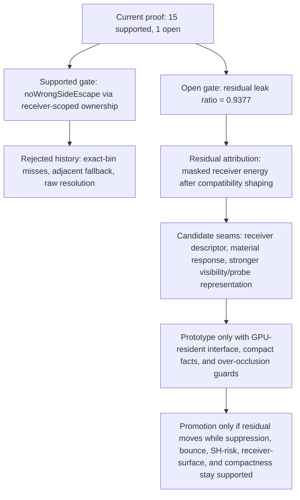

# LightProbeGridGPU refactor roadmap

Verified: 2026-06-02 on branch `dev`.

## Goal

Ship a finite LightProbeGridGPU proof patch, not an endless refactor.

The patch is done when visibility-moment guarded sampling:

- stays GPU-resident at runtime;
- shows a bounded sealed-wall leak reduction versus the scalar-validity baseline;
- preserves correct bounce;
- reports residual leak against the physical zero-leak sealed-wall oracle;
- leaves proof verdicts in proof gates, not in runtime/diagnostic payloads;
- has any remaining receiver-surface or SH-risk gaps either fixed or explicitly classified as known diagnostics.

This is not a claim of perfect DDGI/GI, not a full global-illumination rewrite, and not a general cleanup project.

## North star

LightProbeGridGPU should be a deep runtime module with a small GPU-resident interface. Harnesses and diagnostics should emit compact raw facts only. Proof gates own thresholds, verdicts, and promotion decisions. If a field is not consumed by a gate, artifact contract, or public example, delete it instead of moving it. The proof must never treat a leaky baseline as ground truth: WebGL/scalar-validity comparisons are same-class references, while the sealed-wall physical oracle is wrong-side leak `0`.

## Modernization read

The old three.js LightProbe/LightProbeVolume direction is a useful problem statement, not a success oracle. Upstream discussion in `mrdoob/three.js#16228` and `#18371` already identified the missing product shape: interpolate probe data for objects/materials, keep grid volumes GPU-friendly, avoid arbitrary tetrahedral complexity, prefer HDR probe data, and separate probes/irradiance from scene lights. Beating the scalar-validity baseline is therefore only a bounded comparison; the implementation should modernize the missing visibility and sampling model instead of calling the baseline truth.

External GI practice points the same way. The current `8px` value is angular octahedral visibility texel resolution, not screen-space pixel size. DDGI practice separates low-frequency irradiance from higher-fidelity visibility: Morgan McGuire's DDGI overview describes tiny irradiance tiles but 16x16 visibility/distance tiles with borders, and Flax documents depth plus Chebyshev visibility weighting as its leak-control path. That makes an 8px visibility-depth tile a compact experiment, not a modern success criterion. Unity APV uses validity, virtual offset, dilation, rendering-layer masks, probe adjustment volumes, and density controls to keep probes from sampling through walls. Flax/SDFGI-style work also uses depth/SDF information for relocation/classification and leak reduction. Practitioner discussions on Reddit show the same failure mode in small probe experiments, but those are corroboration only; the decision should rest on papers, engine docs, and measured gates. The next healthy work is therefore classification/relocation or a better visibility representation, not another threshold tweak or proof payload expansion.

## Healthy trim rule

Trim anything that only explains why a rejected path failed after the proof gate already records it. Keep:

- compact raw facts consumed by proof gates;
- source invariants that protect runtime GPU residency and payload compactness;
- the final bounded proof package.

Delete or avoid:

- speculative adjacent-fallback runtime branches after rejection;
- row dumps, per-probe arrays, prose verdicts, and duplicated gate math;
- new gates that merely rename the same residual leak without a new source-backed fix.

## Stop rule

Stop adding roadmap scope when these four decisions are closed:

1. leak proof: baseline-vs-candidate and zero-oracle residual are both represented honestly;
2. receiver-surface mismatch: fixed, or documented as non-blocking diagnostic evidence with source proof;
3. SH mixed-color risk: fixed, or documented as expected/known low-order SH leakage with source proof;
4. final proof package: focused checks pass and PR notes state exactly what is proven and what remains unproven.

Any new task must directly close one of those four decisions. Otherwise it is out of scope.

## Definition of done

- Runtime stays free of proof readback helpers and CPU mirror logic.
- `leak-proof-facts.json` records compact baseline/candidate leak rows plus the sealed-wall ground-truth oracle (`wrongSideLeakTarget: 0`).
- Proof gates support runtime readiness, projection parity, visibility moment readback, leak improvement versus baseline, and correct-bounce preservation.
- Proof gates also report residual leak to the zero-leak oracle; that residual is diagnostic evidence, not a false promotion claim.
- Receiver-surface linear irradiance agreement and SH mixed-color risk are fixed/supported; display-space surface ratios remain diagnostics and do not invalidate the bounded leak-improvement claim.
- The roadmap ends at final proof package and PR notes; no new cleanup phase is allowed unless it directly closes one of the above bullets.

## Final proof claim

Visibility-moment guarded sampling is ready to present as a bounded leak-improvement proof patch when the refreshed Cornell proof run confirms the current source-level fixes: runtime remains GPU-resident, compact proof gates own verdicts, receiver-surface linear irradiance agreement is supported, sealed-wall leak evidence shows a small pre-tone masked improvement versus the scalar-validity baseline, correct bounce is preserved, and residual wrong-side leak remains reported against the zero-leak oracle.


## Final proof package notes

This patch is ready to present as a bounded proof patch, not a complete zero-leak GI solution.

Supported gates in the latest focused Cornell proof: runtime readiness/texture/bounds, projection runtime parity, projection coefficient and atlas deltas, visibility moment readback, receiver-normal agreement, directional suppression, receiver-surface linear irradiance CPU/render agreement, SH mixed-color risk, correct-bounce preservation, baseline-vs-candidate pre-tone masked leak improvement, and pre-tone masked correct-bounce preservation.

Current proof state in the latest focused Cornell proof:

- `visibilityWeighting.noWrongSideEscape`: supported through receiver-scoped probe ownership shaping. The previous four exact-bin no-hit misses remain useful historical evidence for why naive adjacent fallback and raw resolution changes were rejected, but the current receiver-scoped mask contract reports zero shaped wrong-side escapes while preserving correct-side contribution.
- `sealedWall.preToneMaskedWrongSideResidualLeakRatio`: still open at `0.9377` against the physical zero-leak oracle. The scalar-validity baseline is leaky and must not be treated as ground truth.

Final bounded claim for PR notes: visibility-moment guarded sampling remains GPU-resident, keeps verdict ownership in proof gates, improves sealed-wall pre-tone masked wrong-side leak from `0.8626` to `0.8089` versus the scalar-validity baseline, preserves correct bounce (`0.9946`, pre-tone masked `1.0664`), supports receiver-surface linear irradiance agreement, supports receiver-scoped no-wrong-side escape, and honestly reports high residual leak against the zero-leak oracle.

Closeout decision: `sealedWall.preToneMaskedWrongSideResidualLeakRatio` remains open for this bounded proof patch. Receiver-scoped probe ownership closes the local no-wrong-side escape gate, but the residual attribution facts now point at rendered masked receiver energy after compatibility shaping: center linear irradiance is clean while masked linear irradiance, Lambert response, and near-divider receiver-edge ratios remain non-zero. Reducing this further likely needs a broader receiver-surface/discontinuity policy, material-response policy, or higher-quality visibility/probe representation, not threshold tuning or a leaky-baseline comparison.

## Non-claims

- This does not prove perfect DDGI/GI or zero leak.
- This does not treat WebGL/scalar-validity output as ground truth.
- This does not claim tone-mapped wrong-side ratios are promotion metrics.
- This does not claim intermediate SH visibility aggregate drift is final runtime leakage.
- This does not claim display-mapped StandardMaterial surface ratios are linear irradiance proof metrics; they remain diagnostic context only.

## Working prompt

Continue the LightProbeGridGPU refactor from the current worktree as authoritative. Find the next smallest slice that improves ownership shape, compactness, or leak evidence. Keep runtime free of CPU readback/proof helpers. Keep diagnostics/evals as raw facts, keep verdicts in proof gates, update this roadmap with every material finding, and verify with focused no-build checks only.

## Rejected adjacent visibility-moment rescue

Goal: prove whether a bounded GPU-resident adjacent visibility-moment lookup can eliminate the four `visibilityWeighting.noWrongSideEscape` exact-bin no-hit escapes without regressing directional suppression, correct bounce, compact proof ownership, runtime GPU residency, or residual-leak honesty.

Ideal state:

- `visibilityWeighting.noWrongSideEscape` is supported with `wrongSideEscapedCount = 0`;
- the four current 8px exact-bin no-hit misses are rescued by adjacent-bin coverage;
- `visibilityWeighting.directionalSuppression`, SH-risk, and correct-bounce gates remain supported;
- `sealedWall.preToneMaskedWrongSideResidualLeakRatio` remains independent and honest against the zero-leak oracle;
- runtime remains GPU-resident and diagnostics emit compact raw fallback facts only.

Preferred research candidate: conditional cross-bin fallback. Runtime should load the exact oct bin first; only when `hitConfidence` is zero should it sample the four cross-adjacent bins, compute the same Chebyshev visibility for adjacent hits, and choose the lowest computed visibility as the conservative replacement. If no adjacent hit exists, preserve current no-hit behavior. Use unconditional cross lookup only as an upper-bound comparison, and defer 3x3 lookup until cross fallback fails with evidence.

Acceptance requires closing `visibilityWeighting.noWrongSideEscape` without opening directional suppression, bounce, SH-risk, compactness, runtime-boundary, or residual-honesty checks. Rejection is also a valid outcome: if the candidate over-occludes, costs too much, bloats proof payloads, or leaves the gate open, keep it out of runtime and classify the remaining escapes as a known 8px octahedral visibility-moment exact-bin coverage limitation.

Adjacent-cross prototype result: rejected. Conditional-cross produced compact fallback facts (`adjacentFallbackActivationCount = 11`, `adjacentFallbackLoadCount = 44`, `adjacentFallbackRescueCount = 5`, `adjacentFallbackNoAdjacentHitCount = 6`) but did not close `visibilityWeighting.noWrongSideEscape`; `wrongSideEscapedCount` remained `4` and residual leak remained independently open at `0.942`. The unconditional-cross upper bound also left `wrongSideEscapedCount = 4` and opened directional suppression (`0.1838`) plus receiver-surface agreement (`0.2422`). The adjacent lookup was removed from runtime/mirror code; keep the gate open as a known 8px exact-bin visibility-moment limitation.

Do not reopen the same adjacent-cross fallback unless new evidence changes the failure class. The current evidence says adjacent hits exist, but borrowing them naively does not produce a correct visibility decision. That means the missing seam is not "sample one neighboring texel"; it is a stronger visibility representation or wall-aware classification policy.

Follow-up trim: the rejected adjacent-fallback evaluator, fallback activity counters, and old weak-crush/exact-bin localization subcounts were removed from the live visibility study, proof facts, runner assertions, and proof-gate evidence. Keep the exact-bin evidence in the roadmap/ledger as historical rejection evidence only; do not keep failed-rescue payloads in the live proof interface.

## Promoted cross-bin bake dilation

The visibility-moment repack now samples the center, half-pixel cardinal taps, and one-pixel cardinal taps during the GPU bake. This keeps runtime sampling cost unchanged and remains GPU-resident while giving exact bins a bounded chance to capture nearby angular occluder coverage.

Focused Cornell proof result: `TEST PASSED`, 33 checks, proof summary remains `OPEN` with 14 supported / 2 open gates. The safe cross dilation does not close `visibilityWeighting.noWrongSideEscape`: `wrongSideEscapedCount = 4`, `weakCrushNoHitEscapeCount = 4`, adjacent-bin hit count `4`. It does improve the residual gate slightly: pre-tone masked wrong-side leak moves from `0.8126` to `0.8089`, and residual leak ratio moves from `0.942` to `0.9377`; correct bounce remains preserved.

Rejected stronger variant: one-pixel diagonal taps reduced `wrongSideEscapedCount` to `3` and residual to `0.9353`, but opened `receiverSurface.cpuRenderAgreement` and `shContribution.noBakedMixedColorRisk`. That is overreach, not a valid proof fix.

## Next serious gaps

1. Visibility representation: evaluate DDGI-style visibility quality as a representation problem. A resolution bump alone is rejected for this patch, but a future candidate may pair higher directional resolution with resolution-scaled moment/bias policy, gutters/borders, and explicit over-occlusion gates. Treat 8px as a measured limitation of the current visibility-depth representation, not as a magic constant to defend.
2. Probe classification/relocation: add a proof slice only if it can classify interior/exterior or invalid/occluding probes with compact facts. Unity APV and RTXGI both treat probe validity/classification as first-class leak controls.
3. Product API shape: keep the runtime interface small and GPU-resident. The upstream LightProbeVolume discussion points toward grid volumes and material/object irradiance, not scene-global mutable LightProbe state.
4. Bloat control: consolidate proof ownership before adding algorithms. If a diagnostic field is not consumed by a gate, artifact contract, or public example, remove it.

## Phase 57 visibility representation contract

Phase 57 starts with the representation seam, not a runtime prototype. A valid candidate must define angular octahedral resolution, bake-side moment filtering, resolution-coupled bias, border/gutter behavior, GPU-resident runtime visibility decision, compact raw diagnostic facts, and over-occlusion guard facts as one policy.

The current 8px exact-bin behavior fails because all four remaining escapes are no-hit exact-bin misses on divider-crossing segments while adjacent bins have hit evidence. Cardinal bake dilation gives the exact bin more angular coverage and slightly lowers residual leak, but it does not close `visibilityWeighting.noWrongSideEscape`. Raw 12px/16px sweeps are also insufficient: they reduce residual leak but open directional suppression, so they prove a representation tradeoff, not a clean fix.

Prototype hold: do not promote another candidate until it explains how angular resolution, moment filtering, bias, and border/gutter behavior work together. Naive adjacent fallback, diagonal overreach, threshold tuning, and scalar/WebGL-as-truth framing remain rejected.

Phase 57 candidate fact pass: the current cardinal-dilated moment representation now emits compact raw representation facts consumed by `visibilityWeighting.noWrongSideEscape`: angular resolution, effective bias, moment filter, border policy, moment hit/no-hit coverage, wrong-side escape count, and wrong-minus-correct suppression. This adds no runtime CPU readback and no rejected adjacent-fallback payload.

Focused Cornell proof result after the fact pass: `TEST PASSED`, 33 checks, proof summary remains `OPEN` with 14 supported / 2 open gates. The representation facts report `angularResolution = 8`, `effectiveBias = 0.02`, `momentFilter = cardinal-dilated-9-tap-moments`, `borderPolicy = clamped-oct-uv-no-gutter`, `momentHitProbeCount = 5`, `momentNoHitProbeCount = 11`, and `wrongSideEscapedCount = 4`. Directional suppression, SH-risk, receiver-surface agreement, correct bounce, runtime readiness, projection parity, moment readback, and compact proof shape remain supported. Therefore the current representation fact contract is promoted, but the current representation candidate is rejected as a no-wrong-side fix.

## Phase 105 residual gate plan

The only current open proof gate is `sealedWall.preToneMaskedWrongSideResidualLeakRatio = 0.9377` against the physical zero-leak oracle. The no-wrong-side escape gate is already supported by receiver-scoped ownership shaping, so the next fix must target residual masked receiver energy, not old exact-bin escape accounting.

Candidate contract: introduce a GPU-resident receiver residual boundary policy that consumes authored or setup-provided receiver classification facts and produces a sampling-class decision, not an irradiance scale. The current `receiverBoundaryLayerMask` / `receiverBoundaryWeight` API is the selection seam; the missing part is a generic source that marks near-discontinuity receiver samples without reading proof pixels, comparing against scalar/WebGL output, or hard-coding Cornell divider coordinates.

Required compact facts:

- boundary-selected receiver sample ratio;
- correct-side contribution preservation;
- wrong-side compatible contribution exclusion;
- masked linear irradiance and Lambert response;
- near-divider residual concentration;
- candidate and baseline pre-tone masked wrong-side ratios;
- zero-oracle residual ratio.

Promotion requires reducing the residual ratio while keeping `visibilityWeighting.noWrongSideEscape`, `visibilityWeighting.directionalSuppression`, receiver-surface linear agreement, SH-risk, correct bounce, runtime readiness, projection parity, moment readback, and compact proof shape supported. Reject any candidate whose improvement comes from broad darkening, suppressing correct-side bounce, display-space masking, CPU proof readback, or moving the oracle to the scalar/WebGL baseline.

Phase 105 verification: touched syntax checks, direct source invariants, `git diff --check`, and focused Cornell WebGPU proof smoke pass. Refreshed proof state is still `OPEN`, 15 supported / 1 open, with only `sealedWall.preToneMaskedWrongSideResidualLeakRatio = 0.9377` open.

## Rejected coherent biased-query prototype

Hypothesis: use the normal/view-biased sample point as the single WGPU query point for probe direction, compatibility kernel, and visibility distance instead of using it only for cell selection. This would have made the sampling math look cleaner, but the focused Cornell proof rejected it.

Result: smoke still passed, but proof regressed to `OPEN`, 14 supported / 2 open. `sealedWall.preToneMaskedWrongSideImprovement` opened with `actual = -0.0243`, and `sealedWall.preToneMaskedWrongSideResidualLeakRatio` worsened to `1.0243`. Candidate pre-tone masked wrong-side ratio moved to `0.8961` against baseline `0.8748`, so the candidate became worse than the leaky comparator.

Decision: trim the prototype from runtime and proof mirror. The accepted current split remains: biased sample point selects the probe cell, while the surface position owns probe direction, compatibility kernel, and visibility distance. Do not revisit this candidate unless a new receiver/material policy explains why the biased point should own BRDF-visible receiver energy without over-occlusion or leak regression.

## Literature-backed comparison plan

The private fork now carries the sixteenstudio comparison branch at `gpu/sixteenstudio-lightprobes-sponza`, mirroring public commit `e8d975a347e0d1e4756c8d51fdbe1887b1f0b210` from `sixteenstudio/three.js feat/webgpu-lightprobes-sponza`. Use it as a concrete WGPU SH atlas baseline, not as the leak-control target.

Comparison verdict:

- Adopt from sixteenstudio: compact GPU SH atlas product shape, node-based runtime sampling, Sponza-scale integration pressure, and simple mental model for the base irradiance path.
- Do not adopt as leak control: SH-only interpolation with normal offset does not encode probe visibility, receiver ownership, layer masks, validity/relocation, or residual proof gates.
- Keep from this branch: visibility moments, receiver-scoped probe compatibility, boundary mask selector seam, compact proof artifacts, and zero-leak oracle honesty.

Literature alignment:

- RTXGI/DDGI: probe irradiance alone is insufficient for leak control; practical DDGI adds per-probe distance/visibility and statistical occlusion. This backs our visibility-moment path and rejects pure SH interpolation as the final leak solution: https://github.com/NVIDIAGameWorks/RTXGI-DDGI/blob/main/docs/Algorithms.md
- Flax DDGI: documents low-resolution probe depth plus Chebyshev visibility weighting to prevent light leaking. This backs our moment/depth representation, but also shows the representation must be treated as policy, not a magic resolution constant: https://docs.flaxengine.com/manual/graphics/lighting/gi/realtime.html
- Unity APV: leak troubleshooting uses rendering layer masks, Virtual Offset, Dilation, density, and Probe Adjustment Volumes. This backs receiver/probe classification and authored/setup metadata rather than scalar threshold tuning: https://docs.unity.cn/6000.2/Documentation/Manual/urp/probevolumes-troubleshoot-light-leaks.html
- Precomputed Light Field Probes: add per-texel visibility to probe data so shading queries know whether radiance can travel along a direction. This backs visibility/probe representation upgrades beyond low-order SH: https://research.nvidia.com/publication/2017-02_real-time-global-illumination-using-precomputed-light-field-probes
- SDF/SDFGI and GPU SDF construction: light leaks near thin surfaces are sign/distance/classification problems. This backs a future surface-distance or signed-distance metadata seam only if it stays GPU-resident and compact.
- Edge-aware filtering and finite-volume limiters: interpolation across discontinuities needs a reference dimension or limiter. This backs treating `receiverBoundaryWeight` as classification/range metadata, not irradiance attenuation.

Revised finite plan:

1. Keep the sixteenstudio branch as the SH atlas control branch. Use it to compare product/API simplicity and atlas integration, not zero-leak correctness.
2. Keep current SDD branch as bounded leak-improvement proof: `OPEN`, 15 supported / 1 open, candidate `0.8089` versus baseline `0.8626`, residual `0.9377` against zero.
3. Next implementation candidate must add source-backed receiver/probe classification or geometry state. Valid sources are authored rendering/layer masks, setup region ownership, geometry attributes, material node metadata, or future SDF/surface-distance data.
4. Do not prototype another math-only correction unless it changes the represented domain. Rejected: raw resolution bump, adjacent fallback, global biased-query ownership, threshold tuning, scalar/WebGL truth.
5. Promotion requires residual movement below `0.9377` while keeping all 15 supported gates supported. If it only beats the leaky baseline by darkening or suppressing bounce, reject and trim.

## SDD ultraplan alignment

Current truth: the proof package is open with 15 supported gates and 1 open gate. `visibilityWeighting.noWrongSideEscape` is supported through receiver-scoped ownership shaping; `sealedWall.preToneMaskedWrongSideResidualLeakRatio` remains `0.9377` against the physical zero-leak oracle. The scalar/WebGL path is a leaky comparator, not truth. The old `8px` exact-bin evidence remains historical support for rejecting naive adjacent fallback and raw resolution changes, not the current open gate owner.

Earliest blocking gate: `sealedWall.preToneMaskedWrongSideResidualLeakRatio`. Do not route around it with threshold changes, baseline storytelling, or proof-payload expansion. The next SDD slice must name a GPU-resident receiver descriptor, material response policy, or stronger visibility/probe representation and prove that it does not over-occlude correct-side contribution.

| Lane | Intended goal | Promotion gate | Do not promote |
|------|---------------|----------------|----------------|
| Visibility representation | Replace exact-bin fragility with a visibility model that can represent wall-crossing occlusion | Fewer or zero wrong-side escapes with `visibilityWeighting.directionalSuppression`, SH-risk, and bounce gates still supported | Raw 16px bump, naive adjacent fallback, threshold tuning |
| Probe classification/relocation | Keep invalid, interior, exterior, or wall-crossing probes from contributing across sealed walls | Compact classification facts explain which probes are excluded or relocated and why | Brightness-derived validity, CPU-only proof helpers, scene-specific hacks |
| Bias/resolution coupling | Re-test resolution only with scaled moment/bias policy and gutters/borders | Resolution improves coverage without directional-suppression regression | Treating 8/12/16px as magic constants |
| Product API shape | Preserve a deep GPU-resident LightProbeGridGPU interface for grid-volume sampling | Runtime stays free of readback/proof helpers and exposes small sampling controls | Scene-global mutable LightProbe state as product target |
| Proof compactness | Keep diagnostics as raw facts and gates as verdict owners | Rejected-path fields stay absent by source invariant | Row dumps, per-probe arrays, duplicate gate math |



## Phase roadmap

| Phase | Name | Slice | Exit condition |
|-------|------|-------|----------------|
| 57 | Visibility Representation SDD | Design and prototype a stronger visibility representation contract before changing resolution again | Candidate is either promoted by gates or rejected with compact evidence |
| 58 | Probe Classification/Relocation SDD | Add wall-aware probe classification/relocation evidence without CPU runtime leakage | Classification facts explain wrong-side exclusion/relocation and gates stay compact |
| 59 | Bias/Resolution Coupling | Re-run 8/10/12/16 only with resolution-scaled moment/bias policy and over-occlusion gates | Any resolution change improves escape evidence without directional regression |
| 60 | Product API Shape | Align public controls with GPU-resident grid-volume sampling and object/material irradiance direction | Runtime interface is small, documented, and not tied to leaky baseline semantics |
| 61 | Proof Compactness | Delete or guard stale diagnostic payloads after each rejected prototype | Source invariants keep rejected branches out of live proof facts |
| 62 | Open-Gate SDD Plan | Couple the remaining no-wrong-side escape and residual leak gates while preserving separate verdict ownership | Next candidate is constrained before prototype work starts |
| 63 | Border-Aware Visibility Representation Candidate | Specify and prototype a guttered/wrapped-border octahedral visibility representation with scaled moment/bias policy | Escape count improves or closes without over-occlusion or compactness regressions |
| 64 | Candidate Verdict And Trim | Read Phase 63 through proof gates and remove failed candidate payloads immediately | Promoted candidate stays lean, or rejected candidate leaves only ledger evidence |
| 65 | Wall-Aware Probe Classification/Relocation Candidate | Try real invalid/occluding/interior/exterior/relocation policy only if representation does not close cleanly | Classification improves escapes without brightness shortcuts, CPU runtime helpers, or fixture hacks |
| 66 | Coupled Resolution/Bias Sweep | Re-test resolution only under a proven policy with scaled moment/bias/border behavior | Better default only if escape evidence improves without directional regression |
| 67 | Residual Leak Oracle Closeout | Evaluate zero-oracle residual after local escape evidence improves | Residual closes against zero or remains an explicit non-claim |
| 68 | Product API Hardening | Stabilize GPU-resident product controls if a candidate promotes | Runtime API stays small and proof/readback helpers stay out |
| 69 | Final Proof Package | Run focused verification and write exact supported/open-gate claim | Final package is audit-ready and honest about residual leak |
| 70 | Archive Or Continue Decision | Stop if no clean candidate improves the local escape class | Archive bounded proof or continue only from new source-backed evidence |
| 71 | Source-Backed Open-Gate Reframe | Map DDGI/RTXGI/APV/Flax leak controls to the open-gate history | Continue through receiver-scoped probe shaping, not constants |
| 72 | Receiver-Scoped Probe Mask API SDD | Design per-node/per-material receiver mask sampling with GPU probe metadata | API contract is precise enough to prototype without global mutation |
| 73 | Receiver-Scoped Mask Candidate Verdict | Apply receiver-specific masks in render/proof and read existing gates | Local escape gate closes without over-occlusion; residual remains honest |
| 74 | Residual Leak Attribution SDD | Attribute the remaining rendered wrong-side energy after local escape closure | Next candidate explains residual by source class before changing math or shape |
| 75 | Rendered Receiver Residual Source SDD | Explain why masked-visible wrong-side color remains near baseline after compatibility shaping | Prototype only after a GPU-resident source policy is named and guard gates remain intact |
| 76 | Visible-Surface / Material Response SDD | Attribute residual between clean center linear irradiance and leaky masked visible pixels | Candidate distinguishes surface coverage/material response without weakening Phase 73 gates |
| 77 | Material/Output Mapping Attribution SDD | Explain why pre-tone masked residual is stronger than display masked-visible residual | Candidate isolates material/output response before any runtime policy change |
| 78 | Material Albedo / BRDF Attribution SDD | Explain standard-material pre-tone residual versus irradiance-only linear residual under the same mask | Candidate names a GPU-resident material policy before prototype |
| 79 | BRDF / Surface-Normal Transport Attribution SDD | Explain standard-material residual after neutral albedo is ruled out | Candidate distinguishes BRDF/surface-normal transport before prototype |
| 80 | Receiver Normal / Surface Sampling Attribution SDD | Explain residual after Lambert response shows BRDF contributes but does not close attribution | Candidate distinguishes normal/surface sampling before prototype |
| 81 | Receiver Surface Spatial Distribution SDD | Explain residual after front-facing normals and matching visible-mask coverage are proven | Candidate distinguishes center/quadrature/masked/edge distribution before prototype |
| 82 | Near-Divider Surface Distribution Candidate SDD | Define a generic surface/discontinuity-aware receiver sampling policy | Prototype only after memory, runtime, guard, and proof contracts are specified |
| 83 | Receiver Descriptor Layout SDD | Specify concrete receiver-surface descriptor storage and GPU weighting rule | Required before any Phase 82 prototype |
| 84 | Boundary-Safe Probe Ownership Authoring SDD | Define how boundary-safe probe classes are authored before runtime consumption | Prototype deferred until ownership classes are generic |
| 85 | Boundary Ownership Proof-Fact Contract SDD | Define compact aggregate facts before any authored boundary-safe prototype | Prototype deferred until facts attach to generic ownership metadata |
| 86 | Generic Boundary Ownership Assignment SDD | Define allowed source-backed ownership assignment inputs | Prototype requires a bake/setup assignment adapter |
| 87 | Probe Ownership Assignment Adapter SDD | Define setup/bake adapter seam that outputs `probeLayerMasks` | Prototype only with generic rule sources |
| 88 | Product Authoring Shape Gap SDD | Record the missing ownership authoring semantics needed for the adapter | Residual gate remains open |
| 89 | Layer Ownership Product Shape SDD | Select layer ownership as first product-facing authoring shape | Adapter still needs second rule source |
| 90 | Region Ownership Product Shape SDD | Select authored world-space region volumes as second adapter source | Next specify concrete adapter interface |
| 91 | Probe Ownership Assignment Adapter Interface SDD | Specify concrete layer/region rule schemas and compact assignment facts | Prototype still requires implementation plan |
| 92 | Assignment Facts To Proof Facts Mapping SDD | Map adapter-owned facts to Phase 85 and separate proof-owned fields | Prototype still requires proof-harness fact plan |
| 93 | Boundary Ownership Proof Harness Facts SDD | Define compact receiver/contribution proof facts for boundary ownership | Prototype contract clear, implementation still pending |
| 94 | Layer / Region Rule Binding SDD | Bind layer ownership classes to region probe selectors | Binding contract protected by source invariant |
| 95 | Probe Ownership Assignment Adapter Prototype | Add setup-only layer/region ownership adapter | No residual movement claimed |
| 96 | Boundary Ownership Shaping Facts Prototype | Carry adapter assignment facts into compact proof-harness shaping facts | No residual movement claimed; proof summary remains 15 supported / 1 open |
| 97 | Residual Decision Boundary SDD | Decide whether existing residual facts justify a GPU-resident receiver descriptor prototype | Prototype only if a new seam can move zero-oracle residual without weakening supported gates |

## Latest eval findings

- 2026-06-02 focused smoke now passes after two correctness fixes: the atlas verifier imported the missing TSL `floor()` used by its synthetic coefficient writer, and `CubeTextureNode` now treats `builder.object?.isComputeNode` as compute context so explicit cubemap sampling does not pull `materialEnvRotation` from a null render scene/material. Because examples load `build/three.webgpu.js`, the same CubeTextureNode guard was mirrored there without running build.
- Latest Cornell smoke before the current gate cleanup: `TEST PASSED`, 33 checks. Proof summary was `OPEN` with 13 supported / 3 open gates: receiver-surface CPU/render delta `0.6014 > 0.15`, tone-mapped wrong-side improvement `-0.0025 < 0.05`, and masked wrong-side improvement `0.0004 < 0.05`.
- Visibility-weighting diagnostics now compare moment suppression against base visibility weights, not pre-kernel scalar weights, and use the same un-biased receiver position as runtime guarded visibility. This moved directional suppression from open to supported without changing proof thresholds.
- Latest leak promotion metric is still thin: pre-tone masked wrong-side improvement is `0.058` against the `>= 0.05` gate, with correct-bounce preservation healthy at `0.9974` and pre-tone masked correct-bounce preservation `1.0616`.
- Leak evidence artifacts now write compact `leak-proof-facts.json` next to `proof-summary.json`, so the raw sealed-wall baseline row and visibility-moment candidate row can be compared directly without inflating proof-gate summaries.
- Latest ground-truth framing: the scalar-validity baseline is not truth because it leaks too. Current pre-tone masked wrong-side leak is `0.8626` for baseline versus `0.8126` for visibility moments, so the candidate closes only `5.8%` of the baseline-to-zero gap and still leaves about `94.2%` of the baseline leak residual. This must stay visible in proof artifacts/gates.
- Receiver-surface Slice 2 found a real CPU diagnostic mirror bug: `LightProbeGridGPUShDiagnostics.js` used `visibilityAggregate.totalWeight / 0.0001` as a coefficient blend, while runtime uses `visibilityMass = totalWeight / baseWeight` and applies that mass after visibility SH irradiance evaluation. The diagnostic now mirrors the runtime mass path, and source invariants guard against reintroducing the stale `visibilityWeightFloor` formula.
- SH mixed-color Slice 3 found an over-broad proof predicate: the gate treated intermediate `visibilityWrongRatioMean` as equivalent to final runtime mixed-color risk. The gate now uses final `runtimeWrongRatioMean`; intermediate visibility wrong-ratio remains a raw diagnostic fact, not a promotion blocker.
- Refreshed eval after tightening showed SH runtime wrong-ratio is low (`0.0318 < 0.25`) while `wrongSideEscapedCount = 4`. That means the remaining signal is visibility escape evidence, not SH mixed-color risk, so the proof gates now separate `shContribution.noBakedMixedColorRisk` from `visibilityWeighting.noWrongSideEscape`.
- Historical refreshed proof before receiver-scoped ownership: `TEST PASSED`, 33 checks, proof summary `OPEN` with 14 supported / 2 open gates. Those open gates were `visibilityWeighting.noWrongSideEscape` (`wrongSideEscapedCount = 4`, expected `0`) and `sealedWall.preToneMaskedWrongSideResidualLeakRatio` (`0.942`, expected zero-leak oracle).
- Latest compact true-escape evidence: double-sided visibility-distance capture removed the `receiver-before-mean` subcase, but refreshed Cornell proof smoke still reports `wrongSideEscapedCount = 4`, now split as `receiverBeforeMeanEscapeCount = 0`, `highChebyshevEscapeCount = 0`, and `weakCrushEscapeCount = 4`, while visibility-bias and front-edge bypass counts remain `0`. All four weak-crush escapes are `weakCrushNoHitEscapeCount = 4`, with `weakCrushPartialHitEscapeCount = 0`, `weakCrushFullHitEscapeCount = 0`, and `weakCrushNearThresholdEscapeCount = 0`, so the open gate is owned by moment coverage misses rather than hit-confidence dilution, SH mixed-color drift, or fixture edge bypass.
- Final no-hit localization evidence: the open `visibilityWeighting.noWrongSideEscape` gate now carries `visibilityDepthResolution = 8`, `weakCrushNoHitCrossingCount = 4`, `weakCrushNoHitVisibilitySegmentHitCount = 4`, `weakCrushNoHitSurfaceSegmentHitCount = 4`, `weakCrushNoHitReceiverProbeDirectionMismatchCount = 0`, `weakCrushNoHitAdjacentHitCount = 4`, `weakCrushNoHitAllAdjacentNoHitCount = 0`, and `weakCrushNoHitDistinctOctBinCount = 4`. This classifies the remaining escapes as exact-oct-bin no-hit misses with adjacent-bin coverage, not culling/side capture, receiver/probe direction mismatch, visibility-bake absence, or fixture geometry bypass.
- Rejected runtime heuristic: treating any partial visibility hit as full Chebyshev ownership did not reduce the four escapes and slightly worsened rendered leak/correct-bounce ratios, so it was reverted.
- Receiver-surface agreement was tightened after audit: diagnostics now emit raw surface render wrong-ratio plus CPU surface runtime wrong-ratio max, while the proof gate derives `surfaceCpuRenderDelta` with max-to-max aggregation. Masked render ratios stay in leak-proof rows, not in the receiver-surface gate's evidence path.
- Latest receiver-surface evidence: display-space surface ratios remain high (`renderSurfaceWrongRatio = 0.8219`, `renderSurfaceCenterWrongRatio = 0.9314`) and sRGB unlit irradiance is display-skewed (`renderIrradianceCenterWrongRatio = 0.5882`), but the gate now compares linear unlit runtime irradiance against the CPU center mirror (`renderLinearIrradianceCenterWrongRatio = 0`, `centerRuntimeWrongRatioMax = 0.0635`, delta `0.0635 <= 0.15`). The previous open gate was a diagnostic mismatch: linear CPU evidence was being compared to display-mapped render ratios.
- Sealed-wall promotion gates now block only on the linear pre-tone masked leak metric plus correct-bounce preservation. Tone-mapped wrong-side improvements remain derivable from raw rows but no longer block proof promotion.
- Core runner projection-oracle assertions now use named local predicates for parity contract, compute candidate, adapter fallback, and atlas repack raw facts; source invariants guard those predicate seams instead of brittle inline assertion blobs.
- Visibility runner assertions now use named local predicates for moment readback facts, visibility-weighting facts, escape classification, SH contribution, receiver-surface agreement, and receiver-normal facts.
- Matrix runner assertions now use named local predicates for compact probe occupancy, sealed-wall leak-proof fixture facts, leak-proof row facts, and restoration facts.
- Runtime runner assertions now use named local predicates for bake coalescing, benchmark backend/memory/visibility-depth/timing facts, and compact color-sanity facts.
- Core runner runtime parity and projection profiling assertions now use named local predicates for raw parity facts, support facts, profiling selector facts, and compact timing facts.
- Proof-summary validation now uses named predicates for bounded gate count, unique/required gate ids, compact gate shape, required supported gates, and summary byte budget.
- Proof-validation density row checks now use named predicates for WebGPU/WebGL density reference, shadowless, crisp-shadow row facts, crisp-shadow reference comparison facts, damped quality-candidate fixture facts, and damped math-action facts; this also fixed a missing-comma assertion bug in the density damped row check and removed the lazy `snapshot, snapshot` crisp-shadow self-comparison.
- Proof-validation low-res comparison checks now use named predicates for shared probe intensity, band isolation, bounce preservation, and damped-vs-full-band red-bias/dark-tail comparison.
- Compact payload assertions now cover visibility-depth facts, visibility moment evidence, color sanity, artifact center signatures, projection fixture/fallback counts, and `getMetrics()` timing facts.
- Source invariants now guard against reintroducing raw RGB regions, timing sample/range payloads, profiling backend verdict/fallback arrays, runtime-parity phase timing/path label dumps, leak-proof restore metric dumps, nested leak-proof metric snapshots, sealed-wall derived gate metric payloads, sealed-wall row visibility-depth duplication, visibility-weighting diagnostic visibility-depth duplication, sealed-wall promotion metric mode echoes, leak-region center/surface-correct/masked-mode payloads, leak-proof top-level metric-mode prose, receiver-normal sample arrays/distance payloads/fallback reasons, visibility-weighting escape rows, internal escape-probe arrays, duplicate escape-summary reducers, duplicate receiver row totals/escape filter reducers, unused hit-confidence threshold/policy branches, visibility-weighting aggregate predicate/reader adapters, stale proof-era unavailable-mode labels, receiver quadrature-weight echoes, receiver-surface `runtimeWrongOverCorrect` naming, receiver-surface mutable sample counting, duplicate proof-gate runtime/projection/moment-readback/receiver-normal/directional-suppression/receiver-surface/SH-risk/sealed-wall predicates, proof-gate runtime identity echoes, visibility-weighting diagnostic-scope/label echoes and directional-suppression verdict echoes, color-bias objects/channel/value echoes, placeholder GPU-debug unavailable payloads, receiver quadrature sample descriptor metadata, receiver-surface render-agreement object wrappers, and duplicate receiver-surface fixture/rule echoes, visibility-weighting/receiver-surface/SH contribution nested summaries, SH contribution receiver-diagnostics wrapper reductions, SH math THREE parity support verdict echoes, artifact snapshot proof-role echoes, artifact snapshot derived bake-texel budget echoes, duplicate proof-validation density budget checks, repeated proof-validation absence predicates, repeated proof-validation artifact-pressure fact predicates, repeated proof-validation region fact checks, repeated proof-validation crisp direct-shadow control predicates, duplicate grounding-parity base setup and band-2 setup echoes, artifact snapshot anti-ringing policy/prose/path echoes, default direct-shadow-control snapshot echoes, direct-shadow-control mode echoes, default bake-shadow-disabled flag echoes, artifact probe-helper intensity echoes, artifact runtime/debug metric echoes, per-probe occupancy metadata, visibility-depth runtime metadata, divider-audit reason payloads, projection/atlas promotion/source/policy prose, projection parity marker-allowance/path-introduced echoes, projection parity promotion-evidence payloads, atlas-repack adapter-fallback policy echoes, duplicated projection fallback scenarios, SH math prose/sample/axis verdict payloads, atlas packing layout/readback arrays, runtime parity pass booleans/sample arrays, and old moment texture/sample details.
- The current evidence still points to payload leakage as the main refactor opportunity, not a runtime GPU residency leak.
- Rejected adjacent-fallback payloads were trimmed after the external research pass: `LightProbeGridGPUVisibilityWeightingStudy.js` now mirrors exact-bin visibility weighting again, `proof-gates` no longer carry `adjacentFallback*` evidence, and source invariants now guard against reintroducing those fields. The useful adjacent-bin evidence remains as localization, not as a failed rescue interface.
- Phase 58 classification closeout: the Cornell harness now emits compact aggregate classification facts (`solid-occupancy-validity`, no relocation) tied to existing GPU validity metadata. This is a supported contract for valid/invalid/interior/exterior/occluding/relocated counts, not a promoted wall-relocation fix.
- Phase 59 coupling closeout: no naked 8/10/12/16 rerun is promoted. `VISIBILITY_DEPTH_RESOLUTION = 8` remains the default until a candidate defines resolution-scaled moment filtering, bias, border/gutter behavior, and over-occlusion guards before measurement.
- Phase 60 product API closeout: product shape stays GPU-resident grid setup, bake inputs, validity/leak-reduction controls, and object/material irradiance nodes. Harness proof diagnostics remain scoped; scalar/WebGL remains a same-class reference or leaky comparator, never truth.
- Phase 61 compactness closeout: source invariants now guard against per-probe classification rows, relocated-probe payloads, brightness-derived validity, adjacent-fallback payloads, and proof verdict strings in diagnostics.
- Phase 62 open-gate SDD plan: the then-open gates were planned as coupled evidence with separate verdicts. `visibilityWeighting.noWrongSideEscape` was the local representation failure to improve first; `sealedWall.preToneMaskedWrongSideResidualLeakRatio` remained the scene-level zero-oracle consequence. That plan led to receiver-scoped ownership support for no-wrong-side escape while residual remained open.
- Phase 63 entry condition: specify the exact GPU-resident border/gutter policy before prototyping. A valid prototype may use guttered octahedral visibility moments, wrapped-border moment coverage, or an equivalent tile-boundary policy, but it must emit only compact raw facts consumed by the existing gates.
- Forward SDD roadmap: Phase 64 trims or promotes the border-aware candidate; Phase 65 tries real wall-aware classification/relocation only if needed; Phase 66 permits resolution only under a coupled policy; Phase 67 keeps residual leak tied to the zero oracle; Phase 68 hardens product API shape; Phase 69 packages the final proof; Phase 70 archives or continues only from new source-backed evidence.
- Phase 63/64 result: border-continuous oct UV decode for bake-side cardinal taps was specified, prototyped, measured, rejected, and trimmed. Focused Cornell proof smoke passed but proof summary stayed `OPEN` with 14 supported / 2 open gates: `wrongSideEscapedCount = 4` and residual leak `0.9377`. Because no local escape evidence improved, the live representation remains `cardinal-dilated-9-tap-moments` with `clamped-oct-uv-no-gutter`, and the next executable lane is Phase 65 wall-aware classification/relocation.
- Phase 65 result: wall-aware classification cannot honestly prototype on the current runtime seam. Probe metadata already has a layer-mask channel and guarded sampling computes GPU layer compatibility, but `receiverLayerMask` is grid-scoped and `createIrradianceNode()` has no receiver-specific mask parameter. A sealed-wall proof needs different receiver masks for left and right receivers in the same render. Mutating a global receiver mask would be a scene-global hack, so Phase 65 is deferred to a future receiver-specific layer/mask API design.
- Phase 66-70 closeout: no coupled resolution sweep runs without a promoted representation/classification policy; residual leak remains open at `0.9377` against zero; no product API change was promoted in that closeout slice. Later receiver-scoped layer/mask sampling metadata moved no-wrong-side escape to supported.
- Phase 71 research reframe: DDGI/RTXGI sources frame leak reduction as visibility distance plus statistical occlusion, self-shadow bias, probe state, relocation, classification, and volume blending. Unity APV uses validity, dilation, virtual offset, renderer layers, density, and adjustment volumes. Flax DDGI documents depth plus Chebyshev visibility and probe relocation debugging. This supports the current interpretation: the open gates are visibility/probe-shaping failures, not an invitation to tune a constant or compare against the leaky scalar baseline.
- Phase 72 entry condition: design receiver-scoped probe mask sampling before implementation. The candidate API is `createIrradianceNode( { receiverLayerMask } )` or equivalent per-node/per-material metadata, backed by GPU probe layer metadata. Diagnostics may report compact aggregate mask/shaping facts only. Promotion still requires no-wrong-side improvement while preserving directional suppression, receiver-surface agreement, SH-risk, correct bounce, runtime readiness, projection parity, moment readback, compact proof shape, and residual honesty against `wrongSideLeakTarget = 0`.
- Phase 72 API seam prototype: `createIrradianceNode( options = {} )` and `createLightsNode( sceneLights = [], options = {} )` now accept receiver-scoped `receiverLayerMask` node/value input. The manual weighted sampling path resolves the mask to a GPU uint node and uses the existing `probeMeta.b` compatibility test; default behavior still uses the grid-level mask. This is not yet a wall-shaping policy or proof-gate promotion. The next slice must specify probe layer assignment plus compact shaping facts before the sealed-wall harness uses different left/right masks.
- Phase 72 metadata seam prototype: optional `probeLayerMasks` are validated and packed into the existing `probeMeta.b` channel. This preserves the first candidate's memory policy: no duplicate grid and no extra metadata texture. The next wall-shaping slice should define generic left/right or region mask assignment in the harness plus compact aggregate facts before measuring proof gates.
- Cornell side-mask setup: the harness now assigns default-compatible left/right probe masks by preserving the default bit for all probes and adding a side bit. Default receivers still match all probes, so this does not claim a proof change. It only makes the future receiver-scoped wall-shaping candidate measurable without duplicating grids or mutating global mask state.
- Phase 72 shaping preview facts: visibility-weighting diagnostics now report compact receiver-scoped side-mask evidence: policy ids, mask modes, compatible/incompatible probe counts, excluded wrong-side probes, preserved correct-side probes, shaped wrong-side escape count, and preservation/exclusion ratios. The proof facts carry this under `visibilityWeighting`, but the existing gates still use the measured unmasked escape evidence. The next phase is to apply receiver-specific masks in render/proof and reject the candidate if any over-occlusion guard opens.
- Phase 73 receiver-scoped mask verdict: focused Cornell WebGPU proof smoke passed 33 checks with receiver-specific left/right masks applied in render/proof. The proof package remains `OPEN`, but improves to 15 supported / 1 open gate. `visibilityWeighting.noWrongSideEscape` is now supported through receiver-scoped shaping facts: shaped wrong-side escapes are zero and correct-side preservation remains complete. Directional suppression, receiver-surface agreement, SH-risk, correct bounce, runtime readiness, projection parity, moment readback, and compact proof shape remain supported. `sealedWall.preToneMaskedWrongSideResidualLeakRatio` stays open at `0.9377` against `wrongSideLeakTarget = 0`.
- Phase 74 residual attribution fact pass: leak proof facts now emit compact source-ratio facts instead of a candidate. Focused Cornell WebGPU proof smoke passed 33 checks and stayed `OPEN` with 15 supported / 1 open gate. Residual attribution reports screen-region `1.0053`, surface `0.9359`, surface-center `0.9666`, masked-visible `1.0012`, and pre-tone masked `0.9377`. This says the remaining leak is rendered receiver-region energy that survives Phase 73 compatibility shaping; the next prototype must explain the masked-visible residual source before changing math, probe shape, material response, or bake geometry.
- Phase 75 rendered receiver residual source facts: residual attribution now includes candidate irradiance-only center ratios. Focused Cornell WebGPU proof smoke passed 33 checks and stayed `OPEN` with 15 supported / 1 open gate. Candidate display irradiance center wrong-ratio is `0.6241`, candidate linear irradiance center wrong-ratio is `0`, and candidate linear-irradiance-to-masked-visible ratio is `0`, while masked-visible residual remains `1.0012`. This rules out a simple center-linear-irradiance/probe-escape explanation and points the next SDD lane toward receiver/material response, visible-surface coverage, or region sampling geometry.
- Phase 76 visible-surface/material fact pass: residual attribution now includes mask geometry and material/output ratios. Focused Cornell WebGPU proof smoke passed 33 checks and stayed `OPEN` with 15 supported / 1 open gate. Candidate masked visible pixel count is `5557`, masked visible pixel ratio is `0.0138`, masked-visible-to-surface-center ratio is `0.7867`, and pre-tone-masked-to-masked-visible ratio is `1.1102`. This rejects broad mask coverage as the primary residual explanation and points the next lane toward material/output mapping and receiver surface sampling attribution.
- Phase 77 material/output fact pass: residual attribution now includes irradiance-only masked-visible ratios under the same receiver mask. Focused Cornell WebGPU proof smoke passed 33 checks and stayed `OPEN` with 15 supported / 1 open gate. Candidate display irradiance masked wrong-ratio is `0.7244`, candidate linear irradiance masked wrong-ratio is `0.5037`, and candidate masked-irradiance-to-masked-visible ratio is `0.6913`. Display irradiance is close to standard display masked-visible (`0.7286`), but linear irradiance is much lower than standard pre-tone masked (`0.8089`), so Phase 78 must isolate material albedo / BRDF response before any prototype.
- Phase 78 material albedo fact pass: residual attribution now includes actual receiver material facts. Focused Cornell WebGPU proof smoke passed 33 checks and stayed `OPEN` with 15 supported / 1 open gate. Candidate material type is `standard`, receiver albedo wrong-side ratio is `1.0655`, roughness is `0.82`, metalness is `0`, and pre-tone-masked-to-albedo ratio is `0.7592`. This rejects albedo as the primary residual amplifier and moves the next lane to BRDF / surface-normal transport attribution.
- Phase 79 BRDF/material fact pass: residual attribution now includes Lambert material masked ratios under the same receiver mask and probe-only lighting. Focused Cornell WebGPU proof smoke passed 33 checks and stayed `OPEN` with 15 supported / 1 open gate. Lambert display masked wrong-ratio is `0.7286`, Lambert linear masked wrong-ratio is `0.6565`, linear-Lambert-to-linear-irradiance ratio is `1.3034`, and pre-tone-masked-to-linear-Lambert ratio is `1.2321`. BRDF/material response contributes but does not fully explain the residual, so Phase 80 must isolate receiver normal / surface sampling distribution before any prototype.
- Phase 80 receiver normal/surface fact pass: residual attribution now includes receiver normal and surface coverage facts. Focused Cornell WebGPU smoke passed 33 checks after one browser target-close rerun and stayed `OPEN` with 15 supported / 1 open gate. Minimum camera-dot-CPU-normal is `0.7999`, receiver surface region area ratio is `0.0136`, and masked visible pixel ratio is `0.0138`. This rejects normal convention and mask/surface coverage mismatch as primary residual explanations, so Phase 81 must isolate spatial distribution across center, quadrature, masked-pixel, and edge/near-divider receiver samples.
- Phase 81 receiver surface spatial fact pass: residual attribution now includes near-divider edge ratios. Focused Cornell WebGPU proof smoke passed 33 checks and stayed `OPEN` with 15 supported / 1 open gate. Candidate near-divider edge wrong-ratio is `0.8729`, near-divider-edge-to-surface-center ratio is `0.9425`, and near-divider-edge-to-masked-visible ratio is `1.1981`. The residual is spatially concentrated near the divider-facing receiver edge; Phase 82 may define a generic surface/discontinuity-aware receiver sampling policy, but not a sealed-wall fixture hack.
- Phase 82 contract result: generic surface/discontinuity-aware receiver sampling is now specified as a representation contract, not a prototype. Any candidate must be receiver/material/node scoped, GPU-resident, default-preserving, and compact in diagnostics. Probe ownership remains in `probeMeta.b` unless a later product scene proves the 24-bit mask budget insufficient. The next phase must specify a concrete receiver descriptor layout and GPU weighting rule before implementation; residual remains honestly open against the zero-leak oracle.
- Phase 83 descriptor result: the current `receiverLayerMask` node/value seam can express a discrete dynamic receiver descriptor. Interior samples can use an interior-compatible mask and discontinuity-near samples can use a stricter boundary-compatible mask, with probe ownership still packed in `probeMeta.b`. This is not enough for a continuous boundary weight API, and no prototype should start unless boundary-safe probe ownership can be authored as generic bake metadata rather than Cornell divider logic.
- Phase 84 authoring result: boundary-safe probe classes are now defined as setup/bake-authored metadata consumed through `probeMeta.b` and receiver-supplied GPU mask nodes. The runtime must not infer wall ownership from proof rows, brightness, CPU readback, or scalar/WebGL comparison. A prototype remains deferred until the authored boundary-safe classes and compact aggregate proof facts are defined without Cornell-only semantics.
- Phase 85 proof-fact result: the compact aggregate fact contract is now defined for authored boundary-safe ownership. It includes policy id, mask modes, probe class counts, boundary-selected receiver sample ratio, compatible contribution ratios, wrong-side exclusion, correct-side preservation, residual input, near-divider spatial ratio, and correct-bounce energy. Per-probe rows, per-pixel dumps, Cornell divider coordinates, rejected-path payloads, CPU runtime readback, scalar/WebGL truth fields, and diagnostic verdicts remain rejected.
- Phase 86 assignment result: allowed boundary ownership sources are now limited to product-visible author layers, bake/setup geometry classification, authored probe invalidity/relocation/dilation state, and receiver GPU mask inputs. This mirrors official APV/DDGI patterns that use placement layers, validity/dilation/virtual offset, per-probe distance/visibility, and surface/SDF representation. The current Cornell side split remains a valid region-ownership demonstration, but it is not a generic boundary-safe residual prototype.
- Phase 87 adapter result: the next seam is a setup/bake-time probe ownership assignment adapter that outputs `probeLayerMasks` from probe positions, grid resolution, a default mask, and authored ownership rules. Runtime sampling remains GPU-resident and unchanged. The existing Cornell `createProbeLayerMaskData()` helper stays proof-scoped; a reusable adapter prototype needs at least two non-identical generic rule sources or it is just a renamed fixture helper.
- Phase 88 authoring-gap result: the adapter prototype is deferred because the product authoring semantics are not yet selected. Valid unblocked shapes are layer ownership, region ownership, geometry classification, and probe-state ownership from invalidity/relocation/dilation. This keeps the residual gate open honestly and classifies the blocker as product semantics, not runtime GPU residency or proof infrastructure.
- Phase 89 product-shape result: layer ownership is selected as the first product-facing authoring shape because three.js already exposes `Object3D.layers` / `Layers` as scene-visible bitmask vocabulary. Probe ownership may map authored layer bits into the current 24-bit `probeMeta.b` range, and receivers consume GPU masks through `receiverLayerMask`. This is only one rule source; adapter prototype remains deferred until a second setup/bake classification source is selected.
- Phase 90 product-shape result: region ownership is selected as the second setup/bake classification source. Region rules use authored world-space `Box3` volumes over deterministic probe positions and output the same 24-bit masks consumed by `probeLayerMasks`. Layer plus region ownership now satisfy the two-source design requirement; the next phase should specify the concrete adapter interface and Phase 85 aggregate diagnostics before any prototype.
- Phase 91 interface result: the setup/bake adapter interface is now specified. Inputs are grid min/max, resolution, default mask, layer rules, region rules, and conflict policy. Outputs are `probeLayerMasks` plus compact `assignmentFacts`. Layer and region rule schemas, validation, overlap diagnostics, and forbidden proof/runtime dependencies are explicit. Prototype remains held until an implementation plan maps assignment facts to Phase 85 proof facts without widening runtime sampling.
- Phase 92 mapping result: adapter-owned `assignmentFacts` now map one-way into Phase 85 facts for policy id, probe ownership mode, interior/default-compatible probe count, and boundary-safe assigned probe count. Receiver mask mode, boundary-selected receiver sample ratio, contribution ratios, wrong-side exclusion, correct-side preservation, residual ratio, spatial ratio, and correct-bounce energy remain proof/runtime-owned fields. Prototype remains held until those proof-harness facts are specified compactly.
- Phase 93 proof-harness fact result: `boundaryOwnershipShaping` is now specified as the compact proof-harness object for receiver mask mode, boundary-selected receiver sample ratio, contribution ratios, wrong-side exclusion, correct-side preservation, and preservation/exclusion ratios. Residual, spatial, and correct-bounce ratios remain copied from existing proof paths, not recomputed.
- Phase 94 binding result: implementation inspection found that layer rules define ownership classes but do not select probes. Region rules select probes and may bind to a layer rule by `layerRuleName` or assign an `ownershipMask` directly. Assignment facts must include bound and unbound layer rule counts so the adapter cannot satisfy the two-source requirement with two arrays where only one actually classifies probes. A source invariant now protects this SDD binding contract before adapter prototype work.
- Phase 95 adapter result: setup-only `LightProbeGridGPUProbeOwnership` now produces `probeLayerMasks` plus compact `assignmentFacts` from layer and region rules. Cornell side masks route through the adapter while staying proof-scoped. Runtime sampling is unchanged and still consumes `probeMeta.b` plus receiver GPU masks. This claims no residual-gate movement.
- Phase 96 boundary ownership shaping result: Cornell preserves adapter `assignmentFacts` in setup context, and visibility-weighting diagnostics now emit compact `boundaryOwnershipShaping` facts by combining assignment coverage with receiver-scoped preservation/exclusion aggregates. Proof facts carry the object under `visibilityWeighting`, but no residual verdict or bounce verdict moves; the remaining residual gate stays owned by the zero-leak oracle proof path.
- Phase 97 residual decision-boundary result: the latest residual facts classify the remaining open gate as rendered masked receiver energy after compatibility shaping, not a wrong-side probe escape. Candidate center linear irradiance is `0`, while masked linear irradiance is `0.5037`, linear Lambert masked response is `0.6565`, near-divider edge to masked-visible ratio is `1.1981`, and pre-tone masked to masked-visible ratio is `1.1102`. A prototype is not justified by facts alone; the next code candidate must name a GPU-resident receiver descriptor or material/visibility representation seam that can reduce the zero-oracle residual while preserving no-wrong-side escape, directional suppression, receiver-surface agreement, SH-risk, correct bounce, runtime readiness, projection parity, moment readback, and compact proof shape.

## Non-negotiables

- No build runs for this refactor stream.
- Use focused no-build checks: `node --check`, direct source invariant invocation, and `git diff --check`.
- Keep `examples/jsm/lighting/LightProbeGridGPU.js` free of CPU readback (`readRenderTargetPixels`, `readPixels`, `Data3DTexture`).
- Keep proof/readback/CPU mirror logic out of runtime.
- Do not add thin pass-through modules. Prefer local helpers when callers are harness-only.
- Delete legacy/prototype report payloads instead of preserving wrappers.
- Preserve public example imports and smoke harness method names unless a gate is intentionally tightened.

## Current shape

| File | Lines | Role | Status |
| --- | ---: | --- | --- |
| `examples/jsm/lighting/LightProbeGridGPU.js` | 1649 | Runtime facade | GPU-resident; no CPU readback matches; `getVisibilityDepthInfo()` now exposes compact availability/mode/byte facts only. |
| `examples/jsm/lighting/LightProbeGridGPUTestHarness.js` | 2584 | Browser proof/smoke harness | Main remaining monolith. Recent slices removed setter, fixture, rejection, profiling sample/range payload, runtime-parity phase timing/static-work/path-label dumps, leak-proof row/nested metric snapshot, leak-proof derived sealed-wall gate metrics, leak-proof row visibility-depth duplication, leak-proof promotion and restore metric dump, sealed-wall promotion metric mode echoes, leak-region center/surface-correct/masked-mode payloads, leak-proof top-level metric-mode prose, visibility-moment range/profile/runtime-info payload, compacted exported visibility-depth, timing, color-sanity, probe-occupancy, SH math, atlas packing, and runtime parity facts, runtime-smoke, profiler/runtime-parity/projection-oracle/artifact-pressure verdict payload, projection/atlas promotion/source/policy prose and unconsumed contract fields, projection parity marker-allowance/path-introduced/path-label echoes, projection parity promotion-evidence payloads, atlas-repack adapter-fallback policy echoes, duplicate projection fallback scenarios, projection adapter internal scenario labels/path echoes, projection adapter local decision verdicts, profiling backend mismatch verdict counts, profiling requested-backend selector echoes, profiling fallback reason counts, artifact snapshot prose/unused center RGB/chroma fields, artifact snapshot proof-role echoes, artifact snapshot derived bake-texel budget echoes, duplicate grounding-parity base setup and band-2 setup echoes, artifact anti-ringing policy/prose/path echoes, default direct-shadow-control snapshot echoes, direct-shadow-control mode echoes, default bake-shadow-disabled flag echoes, artifact probe-helper intensity echo, artifact runtime/debug metric echoes, projection fallback prose, receiver-normal verdict duplication, receiver-normal sample arrays/distance payloads/fallback reasons, and SH math THREE parity support verdict echoes. |
| `examples/jsm/lighting/LightProbeGridGPUVisibilityWeightingStudy.js` | 589 | CPU/proof visibility weighting study | Trimmed unconsumed row variance/hit-confidence summaries, unused hit-confidence threshold/policy branches, aggregate predicate/reader adapters, receiver quadrature-weight echoes, unused contribution ratios, duplicate escape-count families/reducers, duplicate receiver row totals/escape filter reducers, directional-suppression verdict/scope/receiver-label/policy-label payload, color-bias object/channel/value echoes, public per-probe/per-receiver receiver row dumps, runner-only contribution/visibilityMass summary fields, SH chroma-pressure helpers, exported visibility-depth runtime metadata, visibility-depth diagnostic duplication, stale proof-era unavailable-mode labels, placeholder GPU-debug unavailable payloads, aggregate escape row/reason payloads, internal escaped-probe arrays, internal divider-audit payload objects, and the `directionalSuppressionSupported` verdict echo; receiver probe and escape counters are now accumulated during receiver row analysis through `probeFacts`, public `receiverProbeFacts` remains compact, `escapeClassification` is derived from the same aggregate, and proof gates derive support from raw comparable receiver count plus wrong-minus-correct suppression. |
| `examples/jsm/lighting/LightProbeGridGPUShDiagnostics.js` | 90 | SH pressure diagnostics | SH mixed-color risk now emits proof-gate-consumed flat wrong-ratio and mixed-color row facts only; receiver contribution rows/aggregate snapshots stay internal, and the two-receiver aggregation no longer builds a receiverDiagnostics wrapper array. |
| `examples/jsm/lighting/LightProbeGridGPUReceiverDiagnostics.js` | 91 | Receiver/surface diagnostics | Surface CPU/render diagnostics now emit only proof-gate-consumed sample count, raw surface render wrong-ratio, and raw CPU surface runtime wrong-ratio max; masked render ratios and derived deltas stay out of the diagnostic, and nested summary, duplicate fixture/rule/receiver-label echoes, placeholder GPU-debug objects, exported quadrature helper, sample descriptor metadata, render-agreement object wrappers, mutable sample counting, old wrong-over-correct naming, and unused hit-confidence policy threading are gone. |
| `examples/jsm/lighting/LightProbeGridGPUExampleGUI.js` | 161 | Example controls | Stable. |
| `examples/jsm/lighting/lightprobegridgpu/LightProbeGridGPUProofReadback.js` | 285 | Proof-only readback adapter | Correct boundary: diagnostics may import, runtime must not. |
| `examples/jsm/lighting/lightprobegridgpu/LightProbeGridGPUConstants.js` | 60 | Shared constants | Intentionally small. |
| `examples/jsm/lighting/lightprobegridgpu/LightProbeGridGPUAtlas.js` | 159 | Atlas/probe addressing and repack | Cohesive. |
| `examples/jsm/lighting/lightprobegridgpu/LightProbeGridGPUCpuShMath.js` | 263 | Proof-only CPU SH math | Correct boundary. |
| `examples/jsm/lighting/lightprobegridgpu/LightProbeGridGPUProjection.js` | 242 | Projection material/node builders | Cohesive runtime helper. |
| `examples/jsm/lighting/lightprobegridgpu/LightProbeGridGPUVisibility.js` | 135 | Visibility material/load helpers | Cohesive runtime helper. |
| `examples/jsm/lighting/lightprobegridgpu/LightProbeGridGPUBake.js` | 132 | Bake state/result helpers | Cohesive runtime helper. |
| `test/e2e/lightprobegrid-gpu-artifacts.js` | 181 | Compact artifact contract | Healthy after earlier report deletion; proof summary and leak-proof baseline/candidate raw facts are written as compact single-line JSON, and the WebGL reference artifact keeps raw fields without prose boundary payload. |
| `test/e2e/lightprobegrid-gpu-image-metrics.js` | 174 | Screenshot artifact metrics | Artifact pressure now emits raw ratios/floors only. |
| `test/e2e/lightprobegrid-gpu-proof-validation.js` | 372 | Artifact proof assertions | Owns artifact pressure fact validation/thresholds, label-to-role interpretation, density budget checks, unweighted/hardware-filtered sampling checks, same-density-fixture checks, density reference/shadowless/crisp-shadow row/crisp-shadow comparison/damped fixture and damped math-action row checks, low-res shared-intensity/band-isolation/bounce/damped-comparison checks, derived bake-texel budget math, anti-ringing path/band checks, proof-role absence, anti-ringing policy absence, default direct-shadow-control absence, direct-shadow-control mode absence, default bake-shadow-disabled flag absence, probe-helper intensity absence, compact region fact checks, and runtime/debug metric absence through local helpers instead of trusting payload status or prose/path echoes; asserts compact artifact center/timing signatures, fixes the density damped row assertion comma bug, and avoids crisp-shadow self-comparison. |
| `test/e2e/lightprobegrid-gpu-proof-gates.js` | 486 | Proof gate derivation/assertions | Visibility moment, projection parity, directional suppression, and sealed-wall thresholds are data-driven; receiver-normal, visibility-weighting, receiver-surface, SH contribution, runtime parity, and sealed-wall improvement/preservation derivation now live here instead of the harness/study/diagnostic modules; runtime, projection, moment-readback, receiver-normal, directional-suppression, receiver-surface, SH-risk, sealed-wall, and proof-summary validation reuse named predicates, projection runtime parity, receiver-normal agreement, and receiver-surface CPU/render delta are derived from raw fact counts/ratios inside proof gates, sealed-wall proof facts now keep raw baseline/candidate leak rows while gate evaluation derives only blocking pre-tone leak improvement plus bounce-preservation metrics, tone-mapped sealed-wall wrong-side improvements are no longer derived as promotion math, proof-summary support/open counts are accumulated in one pass, visibility moment, directional suppression, receiver-surface, SH mixed-color risk, runtime readiness/texture/bounds, projection delta, receiver-normal availability/agreement, no-SH-risk, sealed-wall threshold pass states, bounded gate count, unique/required gate ids, compact gate shape, required supported gates, and summary byte budget are predicate-owned, supported gates omit remediation prose/evidence refs and actual/expected values from the compact proof summary, unused visibility/DDGI status payloads are gone, and unused runtime identity echo is gone. |
| `test/e2e/lightprobegrid-gpu-runner-*.js` | 806 | Smoke assertion runners | Mostly reasonable; core/matrix/visibility/runtime assertions now target compact raw contracts instead of local verdict payloads, projection/atlas promotion prose and unconsumed contract fields, projection parity marker-allowance/path-introduced echoes, projection parity promotion-evidence payloads, atlas-repack adapter-fallback policy echoes, SH math prose/sample/axis verdict payloads, SH math THREE parity support verdict echoes, atlas packing layout/readback arrays, runtime parity pass booleans/sample arrays/phase timing dumps/static-work echoes, profiling backend verdict/fallback arrays, profiling backend mismatch verdict counts, profiling fallback reason counts, leak-proof restore metric dumps, nested leak-proof metric snapshots, sealed-wall derived gate metric payloads, sealed-wall row visibility-depth duplication, visibility-weighting diagnostic visibility-depth duplication, leak-region center/surface-correct/masked-mode payloads, leak-proof top-level metric-mode prose, receiver-normal sample arrays/distance payloads/fallback reasons, visibility-weighting escape/per-receiver rows, visibility-weighting/receiver-surface/SH contribution nested summaries, placeholder GPU-debug unavailable payloads, per-probe occupancy metadata, projection fixture/fallback arrays, raw color regions, raw rows, timing sample/range payloads, visibility-depth runtime metadata, receiver-surface diagnostic-owned deltas, or directional-suppression verdict echoes; core projection/atlas/runtime-parity/profiling plus matrix/runtime/visibility absence assertions now share local field-absence helpers instead of repeating selector/verdict field checks inline, and core projection-oracle/parity/profiling, matrix leak-proof, runtime benchmark/color-sanity, and visibility raw-fact checks use named local predicates. |

Tracked LightProbeGridGPU feature/proof set: about 8,429 lines, excluding this plan and source-invariant guard file.

## Dependency rules

```text
Runtime
  LightProbeGridGPU.js
    -> lightprobegridgpu runtime helpers only
    -> no proof readback, no CPU SH math, no report code

Diagnostics / harness
  LightProbeGridGPUTestHarness.js
  LightProbeGridGPUVisibilityWeightingStudy.js
  LightProbeGridGPUShDiagnostics.js
  LightProbeGridGPUReceiverDiagnostics.js
    -> CPU/proof helpers allowed
    -> compact facts only; no exploratory report dumps

Reports / e2e
  test/e2e/lightprobegrid-gpu-*.js
    -> consume harness facts
    -> assert gate contracts, not raw lab payloads
```

## Completed cleanup themes

- Runtime helper ownership is now split by real rendering responsibility: constants, atlas, projection, visibility, bake state.
- Proof readback is isolated in `LightProbeGridGPUProofReadback.js`.
- CPU SH proof math is isolated in `LightProbeGridGPUCpuShMath.js`.
- Artifact/report output was reduced to compact proof facts instead of giant exploratory markdown/json payloads.
- Receiver and SH diagnostics were trimmed to consumed gate fields.
- Harness proof setup now shares `applyProofBakeSettings()`.
- Harness endpoint setters now share `setBakeParameter()`.
- Harness contract/unit/projection fixture setup is consolidated locally.
- Harness validation rejection checks share one local capture primitive.
- Compute projection profiling keeps warmup execution but no longer returns warmup, per-run sample arrays, min/average/p95/max timing ranges, nested backend arrays, backend-selection verdict booleans, backend mismatch verdict counts, requested-backend selector echoes, fallback reason arrays/counts, deterministic timer flags, diagnostic status/policy text, claim text, or median speedup summaries; it keeps raw fallback-run counts instead.
- Compute projection runtime parity now returns raw tolerance, coefficient, atlas-count, backend, and fallback facts; proof gates and runner assertions derive parity verdicts, and local pass booleans, atlas sample arrays, static-work echoes, path-label echoes, and phase timing dumps are gone.
- Projection parity candidate/fallback/atlas-repack oracles now return raw path, threshold, capability, count, and delta facts without proof-only status, per-fixture arrays, per-fixture sweep echoes, fallback scenario arrays, internal adapter scenario labels/path echoes, local adapter decision verdicts, or prose reason strings.
- Projection parity runtime and oracle contracts now keep only raw sweep/fallback/tolerance/count/delta facts plus the single contract path family; old `runtimeMarkersAllowed`, `runtimePathIntroduced`, and duplicate candidate/adapter path-label echoes are gone, and source invariants prove guarded runtime markers directly from runtime implementation evidence instead of trusting harness allowance fields.
- Atlas repack oracle no longer echoes `adapterFallbackEvidenceRequired`; adapter fallback evidence is owned by the adapter fallback oracle, while atlas repack keeps only tolerance and max-readback-delta facts.
- Projection and atlas diagnostics no longer return unconsumed promotion-effect, candidate-planning/public-API policy flags, required-capability, required-gate prose, required parity source lists, checked-layer, coefficient-write count, required-flag, fixture-list, or open-evidence narrative payloads.
- Projection adapter fallback diagnostics now keep one supported runtime scenario plus the two fallback capability scenarios; the duplicated promoted-supported candidate row was deleted.
- Artifact pressure metrics now return raw black-tail/luminance/contrast facts; proof validation owns pressure/bounded thresholds.
- Artifact snapshot rows now keep structured role/policy facts without prose `referenceBoundary` or `action` payload.
- Grounding parity artifact snapshots no longer echo `proofRole`; proof validation owns label-to-role interpretation for those rows.
- Grounding parity artifact snapshots no longer echo derived bake-texel budgets; proof validation derives cubemap work from resolution and cubemap size.
- Grounding parity snapshot setup now centralizes the shared band-2 intensity instead of repeating the same constant in every frozen row.
- Grounding parity snapshot setup now has shared low-resolution and density base rows so per-case entries only show the values that actually vary.
- Proof validation now uses one local density-budget helper for repeated WebGPU/WebGL-like 6^3 / 32px checks.
- Proof validation now uses one local absence helper for compact metric, timing, and artifact-signature payload checks.
- Proof validation now uses one local artifact-pressure fact helper for both grounding parity snapshots and WebGL reference artifacts.
- Proof validation now uses one local region fact helper for both grounding parity snapshots and WebGL reference artifacts; grounding snapshots opt into black-tail/cell-edge checks while the WebGL reference keeps the smaller shared region contract.
- Proof validation now uses one local crisp direct-shadow control helper for both per-row artifact validation and cross-row density comparison.
- Core smoke assertions now use the local field-absence helper for projection contract/oracle, SH math, atlas packing, runtime parity, and profiling timing compactness checks instead of repeating long `field === undefined` chains.
- Matrix and runtime smoke assertions now use local field-absence helpers for probe occupancy, leak-proof row/restoration, benchmark visibility/timing, and color-sanity compactness checks.
- Artifact snapshot anti-ringing policy echoes were removed entirely; proof validation now derives stress/control/quality meaning from labels, SH band intensities, and sampling facts instead of persisted policy/path prose.
- Artifact snapshot direct-shadow control now emits only custom shadow override values; default direct-shadow-map settings and custom-mode prose stay implicit, and proof validation asserts their absence.
- Artifact snapshots now emit `shadowsDisabledDuringBake` only for the shadowless proof row; default bake-shadow-enabled state stays implicit and proof validation asserts its absence for the crisp-shadow control row.
- Artifact snapshots no longer echo probe-helper intensity; proof validation asserts that helper-only visualization intensity stays out of proof artifacts.
- Artifact snapshot metrics now use a compact snapshot-specific metric shape; runtime/debug facts such as memory, visibility-depth, identity, texture, bounds, and probe-helper state stay out of artifact rows.
- Artifact center signatures now expose only the consumed luminance fact; unused RGB/chroma fields were deleted.
- Leak-proof rows now share top-level proof settings, sampling, and metric modes instead of repeating frozen fixture controls or nested metric snapshots per row; restoration evidence now returns only lighting mode, leak-reduction mode, and fixture visibility instead of a full `getMetrics()` dump.
- Probe occupancy diagnostics now return counts and a mesh-hit count only; per-probe indices, positions, and mesh lists remain local to the example's validity upload path.
- Visibility weighting summaries no longer carry unused variance, hit-confidence, min/max visibility-mass, mirrored correct-side contribution ratios, or runner-only base/visible/visibilityMass contribution means.
- Visibility aggregate evaluation now owns the single SH readback path directly; dead predicate and coefficient-reader adapters were deleted because the only callers aggregate all rows with the default probe coefficient reader.
- Visibility weighting diagnostics now expose aggregate receiver probe counters instead of public per-probe weighting rows or per-receiver `left`/`right` payloads; aggregate escape facts stay in `escapeClassification`.
- Visibility-study receiver probe counters are now accumulated in the receiver-analysis pass via `probeFacts`; the old second pass over `receiver.rows` is guarded against by source invariants.
- Visibility-study escape counters now share the same `probeFacts` aggregate; the old per-receiver `escapeSummary` object and combiner are gone without adding escape fields to public `receiverProbeFacts`.
- Proof validation now uses `hasUnweightedSampling()` for repeated density/reference sampling checks instead of re-spelling weighted-sampling raw field comparisons inline.
- Proof validation now uses `hasHardwareFilteredSampling()` where density reference, crisp-shadow, and damped rows must prove both manual sampling is off and weighted sampling is off.
- Proof validation now uses density-specific helpers for the shared WebGPU/WebGL 6^3 / 32px budget and same-fixture checks, so density reference/damped/shadow rows prove fixture equivalence through named predicates instead of repeated inline field chains.
- Proof validation now splits crisp-shadow row facts from crisp-shadow cross-row comparison facts, so the per-row assertion no longer proves itself by comparing the snapshot to itself.
- Compact proof-summary gates now include `actual`/`expected`, remediation `reason`, and `evidenceRef` only for OPEN gates; SUPPORTED gates keep id/subject/metric/status only.
- `proof-summary.json` now writes compact single-line JSON instead of pretty-printing the already compact proof summary.
- Visibility weighting compact visibility-depth fallback now uses the neutral `unavailable` mode instead of the stale proof-era `unavailable-proof-6-runtime-removed` label.
- Visibility divider segment checks now return the consumed boolean intersection fact only; point/distance/reason audit payload objects were deleted.
- Visibility-depth facts exported by metrics, benchmarks, leak rows, and visibility-weighting diagnostics now stay to `available`/`mode`/`bytes`; private readback dimensions stay local to the harness and runtime.
- Runtime `getVisibilityDepthInfo()` now emits only `available`/`mode`/`bytes`; placeholder samples, stats, texture dimensions, moment count, encoding, and channel-label report fields were removed.
- Visibility moment inspection reports compact availability/mode/readback counters only; raw samples, range/profile payload, runtime-info metadata, texture metadata, channel labels, and deferred sweep-plan narrative are gone.
- Visibility-weighting diagnostics no longer duplicate compact visibility-depth facts; moment-readback proof remains owned by the dedicated visibility moment inspection and proof gates.
- Runtime smoke diagnostics now keep benchmark, bake coalescing, and leak-mode comparison payloads to asserted fields only.
- `getMetrics()` timing facts now expose only total bake time and timing source; detailed phase timing stays in benchmark-specific diagnostics.
- Color sanity diagnostics now return wall dominance ratios and center energy instead of raw left/right/center RGB regions.
- Visibility escape classification now keeps only aggregate escape counts, instead of public row/reason payloads, internal escaped-probe arrays, unused hit-confidence threshold escape branches, or duplicated per-receiver count families.
- Visibility escape summary now combines receiver escape facts in one reducer instead of running separate receiver reducers for each count.
- Visibility receiver analysis now derives totals and escape counters in one row pass instead of stacking `wrongSideRows`, `escapedRows`, reason filters, relation-key sum helpers, and separate base/visible sum reducers.
- Receiver-normal diagnostics now return raw availability and receiver/shader-normal count facts; the proof gate derives the front-face/shader agreement verdict, and internal shader-normal capture no longer creates public-style distance/convention payload fields or fallback reason prose.
- Visibility-weighting diagnostics now return flat fixture-mode, wrong-minus-correct suppression, and escape facts without nested summary, duplicate diagnostic-scope payloads, or `directionalSuppressionSupported` verdict echoes; the proof gate owns the directional suppression verdict.
- Receiver-surface diagnostics now return only sample count, raw CPU surface runtime wrong-ratio max, and raw render surface wrong-ratio; parent fixture mode supplies sealed-wall context, the Gauss-Legendre rule stays implicit in code plus runner sample-count assertions, quadrature sample descriptors keep only local position/weight inside receiver diagnostics instead of echoing quadrature weight through analyzed receiver objects, the placeholder GPU-debug unavailable diagnostic was deleted, and the proof gate owns the CPU/render agreement delta and verdict.
- Receiver-surface quadrature now derives `sampleCount` from `sampleDescriptors.length` instead of mutating a loop counter.
- Receiver-surface render agreement now emits raw max-to-max comparison inputs instead of diagnostic-owned candidate deltas.
- Receiver-surface render agreement now compares surface CPU quadrature only with surface render capture; masked render ratios remain leak-proof-row evidence and cannot lower or alter the surface agreement gate.
- Receiver-surface CPU/render agreement now compares render surface wrong-ratio max against CPU surface runtime wrong-ratio max; the old “pick the closer mean-or-max delta” diagnostic path is gone.
- Receiver-surface proof gating now derives `surfaceCpuRenderDelta` once, passes that derived fact into the receiver-surface predicate, and uses the same value as the gate actual; source invariants guard that single-owner derivation path.
- Sealed-wall proof gates no longer treat tone-mapped wrong-side improvement metrics as promotion blockers and no longer derive those unused improvement values; raw baseline/candidate rows still carry the underlying tone-mapped fields, while the blocking improvement gate uses `preToneMaskedWrongSideImprovement`.
- Receiver-surface CPU aggregation now uses the same `runtimeWrongRatio` language as SH contribution diagnostics; the old `runtimeWrongOverCorrect` name was deleted as color-bias report residue.
- SH contribution diagnostics now return only flat proof-gate-consumed mixed-color row count plus visibility/runtime wrong-ratio facts; runner-only scalar, inverted-normal, chroma-pressure, nested summary payloads, receiver contribution row echoes, color-bias objects/channel/value echoes, and aggregate color-bias snapshots were deleted.
- SH contribution two-receiver aggregation now uses direct left/right diagnostic facts instead of a temporary `receiverDiagnostics` wrapper array plus repeated reductions.
- SH math diagnostics now return constant-radiance max delta, directional axis deltas, THREE parity availability, and THREE parity delta only; prose formulas, sample arrays, expected color echoes, support verdict echoes, and local axis verdict booleans were deleted.
- Atlas packing diagnostics now return counts, mismatch counters, orientation probe indices, validity delta, and max readback delta; full coefficient layout, address/readback arrays, expected/actual pixel echoes, formula strings, and oracle path prose were deleted.
- Placeholder GPU-debug diagnostics were deleted after their unsupported/unavailable payload stopped feeding proof gates; runner assertions now guard that the payload stays absent.
- Visibility moment inspection now returns raw availability/mode/readback counters; the proof gate derives moment-backed support from bytes plus finite/hit readback evidence, not leaked texture metadata.
- Runtime, projection delta, visibility moment, receiver-normal, directional-suppression, receiver-surface, SH mixed-color, and sealed-wall proof gates now derive pass states from named predicates instead of duplicating status/readback/agreement/tolerance/risk/threshold conditions inside gate objects.
- Visibility moment readback, directional suppression, receiver-surface agreement, and baked SH mixed-color risk now use named proof-gate predicates instead of inline pass-condition locals.
- Runtime readiness/texture/bounds and projection coefficient/atlas delta gates now also use named proof-gate predicates instead of inline comparisons.
- Receiver-normal availability/agreement and no-baked-SH-risk pass states now also use proof-gate predicates instead of inline boolean composition.
- The unused visibility status wrapper is gone; moment-backed visibility validation now uses `isMomentBackedVisibility()` directly and source invariants guard against reintroducing `visibilityLabel`, `visibilityStatus`, or `ddgiStatus` payloads.
- Sealed-wall threshold pass states now use the proof-gate predicate path instead of inline `actual >= threshold` composition inside the gate loop.
- Projection runtime parity and receiver-normal proof facts now stay raw: proof facts carry backend/delta/count evidence, while proof gates derive runtime parity and normal agreement via named predicates.
- Sealed-wall proof facts now carry raw baseline/candidate leak-row metrics; proof gate evaluation derives wrong-side improvement and correct-bounce preservation metrics locally.
- Compact proof facts no longer carry `isLightProbeGrid`; runtime packaging identity is guarded by source invariants, while proof gates consume only status, texture, and bounds facts.
- Leak proof facts now return raw sealed-wall rows only; proof gates derive sealed-wall improvement/preservation metrics and own support/promotion verdicts, while nested/top-level metric mode prose, row-level visibility-depth duplication, and unconsumed center/surface-correct/masked-mode leak-region payloads stay absent.
- Grounding parity artifacts now persist `leak-proof-facts.json` as compact raw leak evidence: fixture/settings/sampling plus the two sealed-wall rows only, with finite raw leak and bounce metrics validated before writing.

## Current hotspots

1. **Residual leak to ground truth** — focused proof reports residual leak ratio `0.9377`; candidate improves versus baseline but remains far from the sealed-wall zero-leak oracle.
2. **Residual decision boundary** — receiver-scoped ownership supports no-wrong-side escape, while residual attribution points to rendered masked receiver energy after compatibility shaping.
3. **Receiver discontinuity descriptor** — the next eligible candidate is a GPU-resident receiver/material/node descriptor with an interior mask, a boundary mask, and a boundary-selection weight. The interface is defined, but prototype remains held until the boundary weight comes from generic authored metadata rather than Cornell-only divider logic.
4. **Authored boundary-weight source** — the minimum valid source is caller-authored GPU node/value metadata. It may come from material graph, attributes, constants, or setup-authored receiver metadata, but not proof residuals, pixels, readbacks, scalar/WebGL comparison, or runtime Cornell divider coordinates.
5. **WGSL boundary mask selector** — runtime now has default-preserving descriptor and compatibility selectors implemented as native WGSL helpers: `select( receiverLayerMask, receiverBoundaryLayerMask, receiverBoundaryWeight >= 0.5 )` for the effective mask and `select( 0.0, 1.0, ( probeLayerMask & receiverLayerMask ) != 0u )` for compatibility weight. This is compatibility classification only, not irradiance attenuation or residual-gate promotion.
6. **Descriptor harness equivalence** — Cornell proof-only receivers now express the existing left/right mask policy through `receiverBoundaryLayerMask` plus `receiverBoundaryWeight = 1`, exercising the WGSL selector without introducing automatic discontinuity detection or a new residual claim.

## Roadmap: finite remaining slices

This roadmap is deliberately capped. We are no longer doing generic payload cleanup. Every remaining task must close one of the current open proof gates or produce the final proof package.

### Current proof status

- `runtime.ready`, projection parity, atlas parity, visibility readback, receiver-normal agreement, directional suppression, `visibilityWeighting.noWrongSideEscape`, SH mixed-color risk, baseline leak improvement, and correct-bounce preservation are supported.
- `visibilityWeighting.noWrongSideEscape` is supported through receiver-scoped ownership shaping: shaped wrong-side escapes are zero while correct-side preservation remains complete.
- The old four wrong-side exact-bin misses are retained as historical rejected-candidate evidence for representation work, not as the current open gate owner.
- `receiverSurface.cpuRenderAgreement` is supported after the gate stopped comparing linear CPU SH evidence to display-mapped standard-material surface ratios.
- Receiver-surface raw evidence remains useful diagnostic context: display-space surface ratios are high (`renderSurfaceWrongRatio = 0.8219`, `renderSurfaceCenterWrongRatio = 0.9314`), sRGB unlit irradiance is also display-skewed (`renderIrradianceCenterWrongRatio = 0.5882`), while the linear unlit irradiance center comparison agrees with the CPU center mirror within tolerance (`renderLinearIrradianceCenterWrongRatio = 0`, `centerRuntimeWrongRatioMax = 0.0635`, delta `0.0635 <= 0.15`).
- `sealedWall.preToneMaskedWrongSideResidualLeakRatio` is open: `0.9377` against the physical zero-leak oracle.

### Slice 40: classify and attack true wrong-side visibility escapes

Target: `examples/jsm/lighting/LightProbeGridGPU.js`, `examples/jsm/lighting/LightProbeGridGPUVisibilityWeightingStudy.js`, `test/e2e/lightprobegrid-gpu-proof-gates.js`

Goal:

- explain the four remaining wrong-side escapes with compact reason counts;
- fix the runtime/diagnostic visibility logic if the cause is a real algorithm bug;
- otherwise classify why visibility moments alone cannot fully infer a sealed wall from the available runtime data.

Acceptance:

- `visibilityWeighting.noWrongSideEscape` becomes supported, or the gate remains open with source-backed evidence that the residual escape is an expected limitation rather than hidden proof drift;
- no row dumps, per-probe arrays, or narrative payloads are added;
- runtime stays GPU-resident and proof logic stays outside runtime.

Progress:

- Visibility distance capture is now double-sided so moment evidence does not depend on mesh front-face orientation.
- The double-sided pass removed the receiver-before-mean subcase, but all four remaining escapes are still weak-crush/weighting escapes.
- A more aggressive partial-hit Chebyshev heuristic was tested and reverted because it did not improve escape evidence or leak metrics.
- Compact follow-up evidence showed the four weak-crush escapes are no-hit moment coverage misses, not partial-hit dilution or near-threshold weighting.
- Angular-resolution sweep was tested and rejected as a clean fix: 10px preserved gate shape but did not improve the residual leak metric, while 12px/16px improved residual leak (`0.9274`/`0.908`) but opened `visibilityWeighting.directionalSuppression`, so the runtime keeps the original 8px visibility-depth resolution for this patch.

### Slice 41: receiver-surface gate decision

Target: `examples/jsm/lighting/LightProbeGridGPUReceiverDiagnostics.js`, `examples/jsm/lighting/LightProbeGridGPUShDiagnostics.js`, `test/e2e/lightprobegrid-gpu-proof-gates.js`

Goal:

- close the receiver-surface decision by comparing CPU SH evidence to linear unlit runtime irradiance rather than display-mapped standard-material surface ratios.

Acceptance:

- `receiverSurface.cpuRenderAgreement` reaches `<= 0.15`; display-space surface ratios stay as diagnostic context only;
- leak-proof masked render metrics are not reused to soften this gate;
- no new threshold is introduced just to make the current value pass.

Progress:

- Completed: refreshed proof now supports receiver-surface CPU/render agreement using linear unlit irradiance center evidence (`0.0635 <= 0.15`).
- Display-space standard-material and sRGB ratios remain high but are no longer used as the linear CPU/render agreement metric.

### Slice 42: final proof package

Target: `lightprobegrid-gpu-refactor-plan.md`, `openspec/changes/lightprobegridgpu-research-proof-evals/proof-ledger.md`, `openspec/changes/lightprobegridgpu-research-proof-evals/tasks.md`

Goal:

- publish the final bounded claim exactly as proven: GPU-resident visibility moments improve sealed-wall pre-tone masked leak versus a leaky scalar-validity baseline, preserve correct bounce, support receiver-scoped no-wrong-side escape, and still leave `0.9377` residual leak against the zero-leak oracle.

Acceptance:

- final notes list supported gates, open diagnostics, and non-claims;
- focused no-build checks pass;
- refreshed proof artifacts match the roadmap;
- stop here unless a reviewer asks for a specific proof correction.

### Slice 43: receiver discontinuity descriptor candidate

Target: `examples/jsm/lighting/LightProbeGridGPU.js`, `examples/jsm/lighting/LightProbeGridGPUVisibilityWeightingStudy.js`, `test/e2e/lightprobegrid-gpu-proof-gates.js`

Goal:

- evaluate a GPU-resident receiver descriptor only after a generic authored source can provide `receiverBoundaryWeight`;
- preserve the Phase 96 default receiver-scoped mask behavior when the descriptor is absent;
- reduce the zero-oracle residual only through existing proof gates and compact aggregate facts.

Acceptance:

- default scenes remain byte-for-byte equivalent at the sampling-interface level;
- `receiverBoundaryLayerMask` and `receiverBoundaryWeight` stay GPU node/value inputs, with no CPU readback or proof helper in runtime;
- no-wrong-side escape, directional suppression, receiver-surface agreement, SH-risk, correct bounce, runtime readiness, projection parity, moment readback, residual honesty, and compact proof shape remain supported;
- if the candidate cannot name a generic authored boundary-weight source, keep the prototype held and publish the bounded 15/1 proof package instead.

### Slice 44: boundary mask selection rule

Target: `examples/jsm/lighting/LightProbeGridGPU.js`, `examples/jsm/lighting/LightProbeGridGPUVisibilityWeightingStudy.js`, `test/e2e/lightprobegrid-gpu-source-invariants.js`

Goal:

- specify the deterministic GPU rule that maps `receiverLayerMask`, `receiverBoundaryLayerMask`, and saturated `receiverBoundaryWeight` to one effective receiver mask;
- preserve default behavior when the boundary descriptor is absent;
- keep the rule as compatibility classification, not irradiance attenuation.

Acceptance:

- the rule has no residual, pixel, visibility-readback, CPU-readback, scalar/WebGL, or Cornell-coordinate dependency;
- proof diagnostics remain compact aggregates only;
- implementation remains held if the only available rule lowers energy instead of selecting compatible probe ownership.

Progress:

- Implemented the default-preserving runtime selector in `createIrradianceNode()` through native WGSL helpers: `receiverBoundaryLayerMask` defaults to `receiverLayerMask`, `receiverBoundaryWeight` defaults to `0`, and the effective mask is used only in the existing `probeMeta.b` compatibility test and compatibility-to-weight conversion.
- No residual claim moves until a focused proof supplies a non-default authored descriptor and existing over-occlusion guards stay supported.
- Cornell proof-only receiver masks now route through a descriptor helper with `receiverBoundaryWeight = 1`, proving the WGSL selector can express the existing receiver-scoped ownership policy.
- Focused Cornell WebGPU smoke passed 33 checks after descriptor routing and stayed `OPEN` with 15 supported / 1 open; `sealedWall.preToneMaskedWrongSideResidualLeakRatio` remains `0.9377`.

### Explicitly out of scope

- broad `LightProbeGridGPU` decomposition;
- full DDGI/global-illumination rewrite;
- making residual leak equal zero in this patch;
- treating scalar/WebGL baseline as ground truth;
- adding more eval payloads unless a proof gate consumes the raw fact.

## Verification commands

Use the narrowest applicable set per slice:

```bash
node --check examples/jsm/lighting/LightProbeGridGPUTestHarness.js
node --check examples/jsm/lighting/LightProbeGridGPUVisibilityWeightingStudy.js
node --check test/e2e/lightprobegrid-gpu-runner-core-assertions.js
node --check test/e2e/lightprobegrid-gpu-runner-visibility-assertions.js
node --check test/e2e/lightprobegrid-gpu-proof-gates.js
node --check test/e2e/lightprobegrid-gpu-source-invariants.js
node --input-type=module -e "import { checkSmokeSourceInvariants } from './test/e2e/lightprobegrid-gpu-source-invariants.js'; import { smokeHarnesses } from './test/e2e/lightprobegrid-gpu-smoke-config.js'; await checkSmokeSourceInvariants('webgpu_lightprobes_cornell', smokeHarnesses.webgpu_lightprobes_cornell);"
git diff --check
```

Do not run `npm run build` for this cleanup stream.

## Completion evidence

Current focused evidence supports the finite proof-package goal:

- runtime remains GPU-resident with no CPU readback matches in `LightProbeGridGPU.js`;
- latest Cornell WebGPU smoke passed 33 checks after WGSL boundary descriptor and compatibility routing; proof summary remains `OPEN` with 15 supported / 1 open gate;
- atlas packing verifier reports `maxReadbackDelta = 0.0005` against the `< 0.008` gate;
- compute projection runtime parity selects `compute-probe-reduction` with `computeFallbackReason = null`, `coefficientMaxDelta = 0`, and `atlasMaxDelta = 0`;
- diagnostics/harness no longer carry the targeted verdict, proofBoundary, status, referenceBoundary, or exploratory prose payloads;
- remaining files keep clear ownership without thin-file over-splitting;
- compact proof gates cover the default smoke proof behavior with a 16-gate budget and derive visibility support from compact readback facts; tone-mapped sealed-wall leak improvements are no longer promotion blockers;
- source-level receiver-surface, SH-risk, no-wrong-side, and boundary-ownership fact paths are verified with no-build checks and refreshed runtime proof artifacts; the final PR claim explicitly lists the remaining residual open gate;
- source invariants, runner assertions, OpenSpec tasks, and this roadmap match the current code shape.
- Phase 98 defines the receiver discontinuity descriptor contract and holds implementation until a generic authored `receiverBoundaryWeight` source exists.
- Phase 99 selects caller-authored GPU node/value metadata as the valid `receiverBoundaryWeight` source and keeps implementation held until the GPU mask selection rule is specified.
- Phase 100 implements the default-preserving boundary mask selector as a native WGSL runtime API path without changing visibility moments, SH sampling, or residual proof math.
- Phase 101 routes proof-only Cornell receiver masks through the descriptor helper for equivalence coverage; residual remains owned by the zero-leak oracle gate.
- Latest focused Cornell smoke after WGSL compatibility classification passed 33 checks and preserved the current proof state: 15 supported / 1 open.
- Phase 102 reconciles the final package language: older 13/3 and 14/2 entries remain historical evidence for rejected paths, while the authoritative current state is Phase 101's `OPEN` proof with `visibilityWeighting.noWrongSideEscape` supported and only `sealedWall.preToneMaskedWrongSideResidualLeakRatio = 0.9377` open.
- Phase 103 reconciles the task checklist: all stale unchecked prototype guards are now explicit defer/superseded decisions, so `tasks.md` has no unchecked boxes while the proof package remains honestly `OPEN` with the residual gate visible.
- Phase 104 adds a cross-domain leak research synthesis. Current evidence says the remaining residual is discontinuity-aware interpolation/visibility classification: DDGI/RTXGI and Flax use distance/visibility, Unity APV uses rendering masks plus virtual offset/dilation/adjustment volumes, light-field probes add per-texel visibility, SDF/SDFGI adds geometry sign/distance, and adjacent domains use edge-aware interpolation or limiters to avoid bleeding across discontinuities.
- The public sixteenstudio artifact is `sixteenstudio/three.js` branch `feat/webgpu-lightprobes-sponza`, not a reachable standalone `LightProbesGPU` repo. It is a GPU SH atlas/probe-volume baseline with normal-offset atlas sampling, but no visibility moments, receiver ownership, relocation/dilation, or proof gates.
