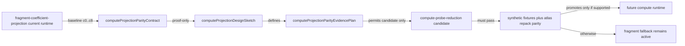
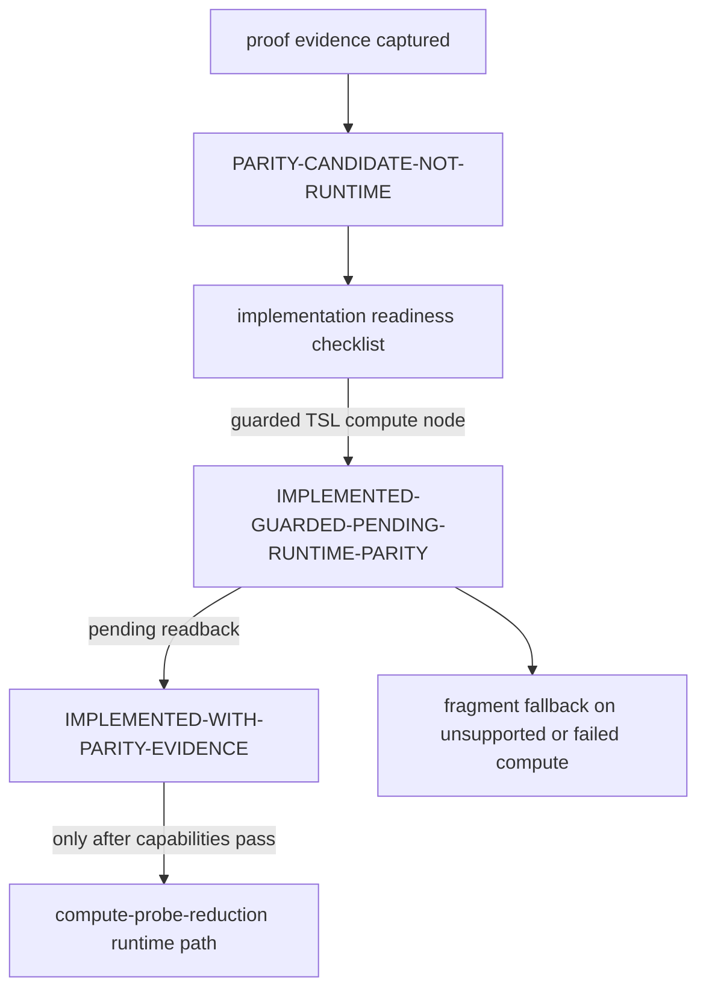

# LightProbeGridGPU Grounding + DDGI-lite Verifier Proof

- Generated: 2026-05-28T10:53:31.573Z
- Claim status: OPEN
- Verifier: test/e2e/puppeteer.js --webgpu webgpu_lightprobes_cornell
- Screenshot policy: Screenshots are secondary and cannot overrule failed metrics.

## Grounding / Parity Snapshots

| Case | Role | Resolution | Cubemap | Bake texels | Band policy | Weighted | Tall red/green | Sphere green/red | Object black-tail | Pressure | Screenshot |
|---|---:|---:|---:|---:|---|---:|---:|---:|---:|---:|---|
| low-res-damped | baseline | 4 | 8 | 24576 | demo default | false | 1.2572 | 1.1585 | 0.0111 | bounded | G:\Antonio Bonet\three.js\.tmp-puppeteer\codex-threejs-lightprobes-parity\low-res-damped.png |
| low-res-unweighted | candidate | 4 | 8 | 24576 | demo default | false | 1.302 | 1.1514 | 0.0091 | bounded | G:\Antonio Bonet\three.js\.tmp-puppeteer\codex-threejs-lightprobes-parity\low-res-unweighted.png |
| low-res-validity-weighted | candidate-weighted | 4 | 8 | 24576 | demo default | true | 1.3016 | 1.1517 | 0.0111 | bounded | G:\Antonio Bonet\three.js\.tmp-puppeteer\codex-threejs-lightprobes-parity\low-res-validity-weighted.png |
| webgpu-webgl-density-reference | same-budget-artifact-pressure | 6 | 32 | 1327104 | L0 preserved, L1=1.0, L2=0.55 | false | 1.3122 | 1.1934 | 0.3835 | PRESSURE | G:\Antonio Bonet\three.js\.tmp-puppeteer\codex-threejs-lightprobes-parity\webgpu-webgl-density-reference.png |
| webgpu-webgl-density-shadowless | same-budget-shadow-control | 6 | 32 | 1327104 | L0 preserved, L1=1.0, L2=0.55 | false | 1.3236 | 1.1935 | 0.3822 | PRESSURE | G:\Antonio Bonet\three.js\.tmp-puppeteer\codex-threejs-lightprobes-parity\webgpu-webgl-density-shadowless.png |
| webgpu-webgl-density-shadow-crisp | same-budget-direct-shadow-control | 6 | 32 | 1327104 | L0 preserved, L1=1.0, L2=0.55 | false | 1.3128 | 1.1934 | 0.3836 | PRESSURE | G:\Antonio Bonet\three.js\.tmp-puppeteer\codex-threejs-lightprobes-parity\webgpu-webgl-density-shadow-crisp.png |
| webgpu-webgl-density-damped | same-budget-quality-candidate | 6 | 32 | 1327104 | L0 preserved, L1=0.6, L2=0.55 | false | 1.2596 | 1.1731 | 0.0178 | bounded | G:\Antonio Bonet\three.js\.tmp-puppeteer\codex-threejs-lightprobes-parity\webgpu-webgl-density-damped.png |

## WebGL Same-Class Reference

| Case | Role | Resolution | Cubemap | Tall red/green | Sphere green/red | Object black-tail | Pressure | Screenshot |
|---|---|---:|---:|---:|---:|---:|---|---|
| webgl-lightprobegrid-reference | same-class-webgl-reference | 6 | 32 | 1.3166 | 1.3954 | 0.0571 | PRESSURE | G:\Antonio Bonet\three.js\.tmp-puppeteer\codex-threejs-lightprobes-parity\webgl-lightprobegrid-reference.png |

## Bake Budget

- Low-res 4³ / 8px: 24576 cubemap texels.
- Same-budget stress 6³ / 32px: 1327104 cubemap texels.
- Work multiplier: 54x.
- Timing policy: reported-not-gated — Static cubemap texel work is the only performance gate. Positive bake timings are reported as diagnostics; under the deterministic e2e timer the harness uses performance._now as a wall-clock fallback for total bake time.
- Projection shape profile: OPEN-FRAGMENT-COEFFICIENT-PROJECTION-REDUNDANCY; 9 cubemap sweeps per probe across 9 coefficient pixels.
- Projection static reduction: 9 sweeps/probe → 1 sweep/probe = 88.8889% fewer cubemap integrations.
- Projection next shape: one WebGPU compute reduction per probe that sweeps the cubemap once and writes c0..c8 together; fallback remains RenderTarget(SH_COEFFICIENTS,totalProbes) coefficient-fragment projection until parity passes.

## Compute Projection Design Sketch

- Status: DESIGN-SKETCH-IMPLEMENTED-AS-GUARDED-RUNTIME
- Non-goal: This design sketch is now implemented as a guarded TSL compute node, but it still does not authorize full parity promotion without runtime readback.
- Storage layout: per-probe compute scratch accumulates nine RGB L2 SH coefficients plus totalWeight during one cubemap sweep; output remains coefficientTarget-compatible c0..c8 RGB rows, preserving the current atlas repack input contract.
- Reduction contract: one cubemap sweep per probe computes c0..c8 together instead of nine coefficient-fragment sweeps; reuse the current SH basis constants, cube-face direction convention, texel solid-angle weight, and 4π / totalWeight normalization.
- Output packing: write nine coefficient slots in the same coefficientTarget row order consumed by _repackAtlas; existing PACKED_SH_TEXTURES atlas packing and padding layers remain unchanged.
- Parity tolerance: max coefficient delta 0.0001 across constant, face-asymmetric, axis-dominance.
- Fallback behavior: fragment-coefficient-projection; compute-probe-reduction is implemented as a guarded runtime path and falls back to fragment projection when compute dispatch is unavailable or fails.

## Compute Projection Parity Evidence Plan

- Status: CAPTURED-RUNTIME-PARITY-EVIDENCE
- Runtime boundary: Compute projection runtime markers are now backed by actual browser readback parity evidence; fragment fallback and public API compatibility remain mandatory.
- Captured evidence: compute-fixture-parity, compute-atlas-repack-parity, compute-adapter-fallback, compute-runtime-readback-parity
- Open evidence: 
- Status transition: PARITY-CANDIDATE-NOT-RUNTIME → IMPLEMENTED-WITH-PARITY-EVIDENCE → IMPLEMENTED-WITH-PARITY-EVIDENCE
- compute-fixture-parity (CAPTURED-PROOF-ONLY-MOCK-PASSING): inspectProjectionParity synthetic fixtures; baseline fragment-coefficient-projection; candidate compute-probe-reduction; pass when max c0..c8 RGB coefficient delta <= 0.0001 for every fixture; actual max delta 0.
- compute-atlas-repack-parity (CAPTURED-PROOF-ONLY-ATLAS-REPACK-PASSING): inspectAtlasPacking; baseline current coefficientTarget row order plus _repackAtlas; candidate compute-written coefficientTarget-compatible rows; pass when packed atlas readback preserves coefficient/component order and padding/validity contracts within existing 0.008 render-path readback tolerance; actual max delta 0.0005.
- compute-adapter-fallback (CAPTURED-RUNTIME-GUARDED-ADAPTER-FALLBACK-PASSING): target adapter capability report; baseline fragment-coefficient-projection; candidate compute-probe-reduction; pass when unsupported adapters keep fragment-coefficient-projection without changing public API or proof output.
- compute-runtime-readback-parity (CAPTURED-RUNTIME-READBACK-PASSING): inspectComputeProjectionRuntimeParity browser/WebGPU readback; baseline fragment-coefficient-projection; candidate compute-probe-reduction; pass when compute coefficient readback and atlas repack readback both stay within tolerance against fragment baseline.

## Compute Projection Status Transition Guard

- Status: RUNTIME-PARITY-EVIDENCE-CAPTURED
- Current contract: IMPLEMENTED-WITH-PARITY-EVIDENCE
- Evidence plan: CAPTURED-RUNTIME-PARITY-EVIDENCE
- Allowed next contract status: IMPLEMENTED-WITH-PARITY-EVIDENCE
- Runtime status required: IMPLEMENTED-WITH-PARITY-EVIDENCE
- Runtime markers allowed: true
- Public API change allowed: false
- Guard rule: The contract has runtime readback evidence for IMPLEMENTED-WITH-PARITY-EVIDENCE; fragment fallback and public API compatibility remain mandatory.
- Promotion boundary: Actual runtime parity readback is captured for coefficients and atlas repack; do not remove fragment fallback.

## Compute Projection Candidate Implementation Design

- Status: CANDIDATE-DESIGN-NOTE-PROOF-ONLY
- Non-goal: This path does not introduce hand-written WGSL, public API, or removal of fragment-coefficient-projection fallback; runtime dispatch is implemented through a guarded TSL compute node.
- Dispatch shape: one logical dispatch group per probe; sweep six cubemap faces once and accumulate c0..c8 RGB plus totalWeight.
- Storage layout: input existing cubeRenderTarget texture sampled with shader-webgpu face/direction convention; scratch per-probe workgroup/private accumulators for nine vec3 coefficients and one totalWeight scalar; output coefficientTarget-compatible c0..c8 rows consumed by existing _repackAtlas.
- Workgroup strategy: parallel texel accumulation per probe face/texel tile; reduce partial SH sums into nine RGB coefficients; normalize by 4π / totalWeight before writing coefficient rows.
- Output contract: same c0..c8 order as fragment-coefficient-projection; must continue through PACKED_SH_TEXTURES and padding/validity atlas contract.
- Fallback branch: select compute when contract status is IMPLEMENTED-GUARDED-PENDING-RUNTIME-PARITY or IMPLEMENTED-WITH-PARITY-EVIDENCE and required adapter capabilities are present; otherwise use fragment fallback.
- Precision behavior: coefficient tolerance 0.0001; atlas readback tolerance 0.008; preserve current half-float/float projection fallback behavior.

## Compute Projection Implementation Readiness Checklist

- Status: RUNTIME-PARITY-READBACK-PASSING
- Verdict: The guarded compute projection runtime path is implemented, readback-validated against fragment coefficients and atlas repack, and still keeps fragment fallback.
- Current contract: IMPLEMENTED-WITH-PARITY-EVIDENCE
- Required runtime status: IMPLEMENTED-WITH-PARITY-EVIDENCE
- Runtime markers allowed: true
- Public API change allowed: false
- Proof-only done: true
- Runtime done: true

| Completed phase | Status | Result |
|---|---|---|
| contract-gate | IMPLEMENTED-GUARDED-PENDING-RUNTIME-PARITY | contract promoted from candidate to guarded runtime implementation while fragment fallback remains active |
| fixture-parity | PROOF-ONLY-MOCK-PARITY-PASSING | proof-only compute candidate oracle matches fragment coefficient projection across synthetic fixtures |
| atlas-repack-parity | PROOF-ONLY-ATLAS-REPACK-PARITY-PASSING | compute-shaped coefficient rows survive the existing _repackAtlas packing/readback contract |
| adapter-fallback | RUNTIME-GUARDED-ADAPTER-FALLBACK-SPEC-PASSING | guarded runtime status selects compute only when capabilities exist; unsupported capabilities keep fragment-coefficient-projection selected |
| runtime-readback-parity | RUNTIME-PARITY-READBACK-PASSING | browser/WebGPU readback compares compute coefficients and atlas repack against fragment baseline |
| candidate-design | CANDIDATE-DESIGN-NOTE-PROOF-ONLY | dispatch/storage/workgroup/output/fallback/precision shape is now backed by guarded runtime code |

| Runtime blocker | Status | Required for | Reason |
|---|---|---|---|
| wgsl-compute-entrypoint | IMPLEMENTED-TSL-COMPUTE-NODE | IMPLEMENTED-WITH-PARITY-EVIDENCE | runtime uses a TSL compute node plus renderer.compute dispatch and keeps fragment fallback for unsupported or failed compute projection |
| actual-runtime-parity-readback | PASSED-BROWSER-E2E | IMPLEMENTED-WITH-PARITY-EVIDENCE | actual compute output was read back in browser e2e against fragment coefficients and atlas packing within tolerance |
| capability-guarded-runtime-branch | IMPLEMENTED-WITH-FRAGMENT-FALLBACK | IMPLEMENTED-WITH-PARITY-EVIDENCE | runtime selects compute only for WebGPU renderer.compute availability and falls back to fragment projection on unsupported or failed compute path |
| public-api-compatibility | LOCKED-NO-CHANGE | IMPLEMENTED-WITH-PARITY-EVIDENCE | compute projection must remain an internal path swap with fragment fallback, not a public API expansion |

- Proof-only completion: done: contract/evidence/readiness are captured and the runtime implementation phase has started from candidate state
- Runtime completion: done: guarded runtime path has coefficient and atlas readback parity evidence while preserving capability fallback
- Next legal state: IMPLEMENTED-WITH-PARITY-EVIDENCE

## Compute Projection Candidate Oracle

- Status: PROOF-ONLY-MOCK-PARITY-PASSING
- Runtime introduced: false
- Baseline: fragment-coefficient-projection (9 sweeps/probe).
- Candidate: compute-probe-reduction (1 sweep/probe).
- Max candidate-to-fragment delta: 0 / tolerance 0.0001.

## Compute Projection Atlas Repack Oracle

- Status: PROOF-ONLY-ATLAS-REPACK-PARITY-PASSING
- Runtime introduced: false
- Source path: compute-written coefficientTarget-compatible rows
- Repack path: _repackAtlas
- Max readback delta: 0.0005 / tolerance 0.008.
- Remaining evidence after pass: compute-adapter-fallback.

## Compute Projection Runtime Readback Parity

- Status: RUNTIME-PARITY-READBACK-PASSING
- Baseline backend: fragment-coefficient-projection
- Compute backend: compute-probe-reduction
- Coefficient max delta: 0 / tolerance 0.035.
- Atlas max delta: 0 / tolerance 0.035.
- Tolerance validation: coefficients=true, atlas=true, overall=true.

## Compute Projection Diagnostic Profiling

- Status: DIAGNOSTIC-PROJECTION-PROFILE-CAPTURED
- Timing policy: DIAGNOSTIC-PROJECTION-PHASE-NON-GATED; GPU timer query: NOT-CAPTURED; gated=false.
- Projection phase timing: CAPTURED-NON-DETERMINISTIC-PERFORMANCE-NOW; sources=non-deterministic-performance-now.
- Static work: 6912 → 768 cubemap texel visits (88.8889% fewer).
- Projection median: fragment 0.5 ms, compute 0.3 ms, diagnostic speedup 1.6667x.
- Total bake median: fragment 13.7 ms, compute 14.2 ms, diagnostic speedup 0.9648x.
- Claim boundary: Static cubemap sweep reduction is evidence; wall-clock medians are diagnostic and must not be presented as guaranteed GPU speedup.

## Compute Projection Adapter Fallback Oracle

- Status: RUNTIME-GUARDED-ADAPTER-FALLBACK-SPEC-PASSING
- Runtime introduced: true
- Public API changed: false
- Default path: fragment-coefficient-projection
- Candidate path: compute-probe-reduction

| Scenario | Contract status | Compute | Storage texture | Selected path | Fallback |
|---|---|---:|---:|---|---:|
| runtime-implemented-adapter-supported | IMPLEMENTED-GUARDED-PENDING-RUNTIME-PARITY | true | true | compute-probe-reduction | false |
| unsupported-compute-capability | IMPLEMENTED-WITH-PARITY-EVIDENCE | false | true | fragment-coefficient-projection | true |
| unsupported-storage-texture-capability | IMPLEMENTED-WITH-PARITY-EVIDENCE | true | false | fragment-coefficient-projection | true |
| promoted-supported-candidate | IMPLEMENTED-WITH-PARITY-EVIDENCE | true | true | compute-probe-reduction | false |

## Math / WebGPU Pipeline Decision

- Root cause hypothesis: The muddy density-reference artifact is dominated by low-order / 9-coefficient SH representation pressure: a 6^3 / 32px bake captures sharper high-contrast lighting, then the low-order SH representation stores it as only 9 coefficients. Full L1 directionality can create negative/dark lobes after evaluation and non-negative clamp.
- Action taken: Use a same-budget band1-damped quality candidate: preserve L0 mean irradiance, keep L2 at 0.55, reduce L1 directional overshoot to 0.6, and keep global probeIntensity unchanged.
- Pipeline flow: GPU bake cubemaps -> GPU SH projection into packed atlas -> hardware texture.sample() for unweighted runtime queries -> sampler-disabled manual loads / shader texture loads only for validity/normal-weighted rows -> SH band evaluation and clamp.
- WebGPU boundary: This pass treats the issue as SH band-policy pressure, not a WebGPU texture-filtering bug: the quality candidate keeps the same half-float atlas path, same 6^3 / 32px bake budget, and the same hardware-filtered unweighted sampler.
- Deferred runtime work: If the same pattern fails on more adapters, next scoped runtime work is private anti-ringing/visibility design: per-probe confidence, visibility/depth moments, probe relocation/classification, or adaptive bricks; no public preset/API change in this pass.

## External Implementation Research

- Status: VERIFIED-SCOPED
- Sixteen Studio finding: Verified GitHub user “sixteenstudio”, fork “sixteenstudio/three.js”, and branch “feat/webgpu-lightprobes-sponza” with examples/jsm/lighting/LightProbeGridGPU.js. No branch literally named “lightprobesgpu” was listed, and the inspected file is not evidence of DDGI visibility/depth moments.

| Source | Transfer lesson | URL |
|---|---|---|
| NVIDIAGameWorks/RTXGI-DDGI | Production DDGI separates irradiance from distance/visibility data, applies normal/view surface bias, wraps normal weighting, Chebyshev variance visibility, weight crushing, and keeps relocation/classification as explicit systems. | https://github.com/NVIDIAGameWorks/RTXGI-DDGI |
| NVIDIA light-field probes | Leak control comes from storing visibility with probe data; irradiance alone is not enough for walls and occluded receivers. | https://research.nvidia.com/publication/2017-02_real-time-global-illumination-using-precomputed-light-field-probes |
| Unity Adaptive Probe Volumes | APV samples probes per pixel, organizes data into adaptive 4x4x4 bricks, and exposes density/streaming/debug controls rather than treating a single uniform grid as production-grade. | https://docs.unity.cn/2023.3/Documentation/Manual/urp/probevolumes-concept.html |
| Unity APV issue-fixing guidance | APV treats invalid probes with virtual offset and dilation, and calls out wall thickness, rendering layers, and probe adjustment volumes as leak controls. | https://github.com/Unity-Technologies/Graphics/blob/master/Packages/com.unity.render-pipelines.high-definition/Documentation~/probevolumes-fixissues.md |
| jure/webgiya | A modern WebGPU GI experiment uses explicit pass decomposition, spatial structures, temporal integration, radial depth moments, and resolve-time spatial/normal/occlusion weighting. | https://github.com/jure/webgiya |
| Shade WebGPU forum notes | The reported DDGI leak strategy combines local cells, per-probe depth maps, normal visibility, parallax correction, and refinement; this is directionally aligned with DDGI-lite visibility scaffolding, not plain SH interpolation. | https://discourse.threejs.org/t/shade-webgpu-graphics/66969/116 |
| sixteenstudio/three.js feat/webgpu-lightprobes-sponza | The public fork/branch does contain a LightProbeGridGPU implementation and Sponza example; inspected evidence shows an SH atlas + hardware sampling implementation, not DDGI visibility/depth moments. | https://github.com/sixteenstudio/three.js/blob/feat/webgpu-lightprobes-sponza/examples/jsm/lighting/LightProbeGridGPU.js |

### Transfer to LightProbeGridGPU
- Keep the current SH-only grid honest as diffuse irradiance, not real DDGI.
- Next runtime-quality step is a private visibility/depth-moment layer, proven first by the existing thin-wall and zero-thickness negative-control fixtures.
- Add virtual-offset/dilation-style verifier rows before claiming APV-grade invalid-probe handling.
- Keep unweighted sampling on hardware filtering; only weighted visibility paths should use manual loads.
- Track bake memory, pass order, and data dependencies as first-class proof artifacts.

## Research / Literature Roadmap Revision

- Status: REVISED-WGPU-FIRST
- Claim boundary: Literature and WebGL/SixteenStudio evidence guide the WebGPU roadmap; they do not prove DDGI/APV parity or sealed-wall leak correctness.

### Literature decisions
- SixteenStudio remains SH-atlas/WebGPU/Sponza packaging precedent, not visibility proof.
- Unity APV/DDGI lessons apply to invalidation, dilation, sample bias, rendering-layer/same-side masks, visibility moments, and adaptive placement.
- Distance-field/Lumen-style ideas are represented only as CPU static-blocker/SDF oracles until aggregate proof justifies a larger runtime design.
- ZH3 remains future compression/reconstruction research because this branch already stores full L2 RGB SH.
- Shadowmask-style direct-light occlusion remains out of scope for probes-only indirect leak proof.

### Next roadmap
- Finish WebGPU leak audit and aggregate source-domain verdict across source+damping, dilation quality, same-side/layer, SDF/static-blocker, aggregate bake-policy, and probe-density oracles.
- Close receiver center-vs-surface sample metric alignment before threshold tuning.
- Use de-ringing/band-policy evidence only if SH negative energy remains the dominant artifact source.
- Only then revisit visibility-moment weighting and Chebyshev constants; Chebyshev remains unchanged while blocker/source/content oracles are open.
- Defer public API/docs promotion until sealed-wall gates are supported.

### Backlog
- Adaptive placement / APV-style bricks.
- Probe relocation/classification beyond source-map dilation.
- Runtime distance-field visibility only if the CPU SDF/static-blocker oracle wins at receiver-aggregate level.
- Sponza/transfer scene after Cornell sealed-wall proof stabilizes.
- Public LightProbeGridGPU documentation after API boundary stabilizes.

## Implementation Parity Matrix

- Status: EVIDENCE-MATRIX
- Comparison mode: git-ref-not-vendored

### Downloaded comparison refs
| Label | Ref | Commit | Paths |
|---|---|---|---|
| ours | HEAD / codex/runtime-lightprobe | local working ref | examples/jsm/lighting/LightProbeGridGPU.js examples/jsm/lighting/LightProbeGrid.js docs/pages/LightProbeGrid.html.md |
| sixteenstudio | refs/remotes/sixteenstudio/feat/webgpu-lightprobes-sponza | e8d975a347e0d1e4756c8d51fdbe1887b1f0b210 (Add moving sphere to demo) | examples/jsm/lighting/LightProbeGridGPU.js src/nodes/lighting/LightProbeGridNode.js examples/webgpu_lightprobes_sponza.html docs/pages/LightProbeGrid.html.md |
| webgl-baseline | HEAD / codex/runtime-lightprobe | local working ref | examples/jsm/lighting/LightProbeGrid.js docs/pages/LightProbeGrid.html.md |

### Sources read
- local examples/jsm/lighting/LightProbeGridGPU.js
- local examples/jsm/lighting/LightProbeGrid.js
- local docs/pages/LightProbeGrid.html.md
- sixteenstudio/three.js feat/webgpu-lightprobes-sponza examples/jsm/lighting/LightProbeGridGPU.js
- sixteenstudio/three.js feat/webgpu-lightprobes-sponza src/nodes/lighting/LightProbeGridNode.js
- sixteenstudio/three.js feat/webgpu-lightprobes-sponza docs/pages/LightProbeGrid.html.md
- sixteenstudio/three.js feat/webgpu-lightprobes-sponza examples/webgpu_lightprobes_sponza.html

| Axis | Ours | SixteenStudio branch | WebGL baseline | Where we stand | Action |
|---|---|---|---|---|---|
| Renderer target | WebGPU-only addon class named LightProbeGridGPU. | WebGPU branch file exports a LightProbeGrid class from LightProbeGridGPU.js. | WebGL-only LightProbeGrid addon. | Ours is clearer at runtime/type boundaries. | Keep explicit GPU naming in source checks; do not backslide to a WebGL-shaped class name. |
| Volume contract | Explicit min/max Box3-style bounds plus cubic resolution option. | Width/height/depth constructor mirrors WebGL. | Width/height/depth constructor centered on object position. | Ours is better for verifier-controlled bounds; Sixteen/WebGL is easier parity ergonomics. | Document why min/max exists and avoid adding a second constructor until API review. |
| Runtime hookup | Object supplies createIrradianceNode() and createLightProbeGridLights(). | Branch includes src/nodes/lighting/LightProbeGridNode.js for renderer-side lookup. | Renderer has established LightProbeGrid path. | Sixteen has a useful integration shape; ours is more self-contained and easier to test. | If upstream wants renderer-native discovery, port the concept deliberately instead of hiding it in this proof pass. |
| Bake residency | GPU-resident RenderTarget3D atlas; source gates reject CPU readback/Data3DTexture upload. | Uses WebGPU RenderTarget3D but keeps WebGL-like Data3DTexture documentation/type traces. | Publishes Data3DTexture as the baked atlas texture in docs/API. | Ours is stricter for WebGPU memory path proof. | Keep no-readback source assertions and memory accounting as first-class proof. |
| Sampling path | Fast unweighted path uses hardware texture.sample(); weighted path uses manual neighbor loads only when needed. | Branch evidence is hardware SH atlas sampling; no weighted/manual visibility path found. | Baseline is SH-grid interpolation without DDGI visibility. | Ours has the better scoped split between fast path and leak-control experiments. | Never replace the unweighted fast path to make verifier rows pass. |
| Leak controls | Normal/view bias, scalar probeValidity, private radial distance moments, and proof-only guarded visibilityMass; explicitly not public DDGI. | No normalBias/viewBias/leakReductionMode/probeValidity evidence found in inspected file. | No visibility/depth leak control contract. | Ours is ahead on leak scaffolding but still not DDGI. | Next work must add moment-backed visibility, not rename validity to visibility. |
| Visibility/depth moments | Private visibilityDepthTarget exists and is moment-backed: RenderTarget3D octa slices store radial-distance mean, squared radial distance, hit confidence, and reserved/backface confidence. | Missing in inspected implementation. | Missing. | Ours has the strongest private proof slice in this comparison, but everyone is still below production DDGI/APV. | Treat moment existence as necessary but not sufficient; promotion still depends on sealed-wall improvement, bounce preservation, and CPU/render agreement. |
| Docs parity | Local LightProbeGrid docs now label the page as the WebGL baseline and keep LightProbeGridGPU proof-scoped. | Fetched docs say the same WebGL-only statement. | Docs accurately describe WebGL baseline but not the GPU branch reality. | Ours is more truthful for this branch; Sixteen docs remain stale for its GPU branch state. | Do not add full public GPU docs until visibility/depth semantics and API are implemented and verified. |
| Demo coverage | Cornell-style controlled proof rows with region/leak/density matrices. | Sponza visual demo with moving object and rebake controls. | Established examples and docs baseline. | Sixteen is better for visual product feel; ours is better for falsifiable regression proof. | Borrow the idea of a larger scene only after the Cornell verifier remains stable. |
| Proof discipline | Rejects production DDGI claims, tracks open uncertainties, and gates source invariants. | No comparable proof ledger found in inspected branch files. | Baseline API docs exist but do not address WebGPU verifier claims. | Ours is stronger for reviewability. | Every new line must map to source evidence, a verifier gap, or an explicit non-goal. |

### Bugs and gaps to address
- Docs gap: a full public LightProbeGridGPU page is still deferred until the API boundary is stable; the existing LightProbeGrid page only labels the WebGPU addon as proof-scoped.
- Implementation gap: current probeValidity is scalar classification metadata; the private log-moment layer is separate proof-only visibility data.
- Verifier gap: zero-thickness wall rows must stay OPEN until moment-backed guarded rows improve leak without killing bounce.
- Integration gap: ours is self-contained via createIrradianceNode(); Sixteen branch shows a separate LightProbeGridNode path that may be worth evaluating later.
- Research gap: SixteenStudio evidence should be cited as WebGPU SH packaging/Sponza precedent only, not DDGI prior art.

### What we do better
- Named LightProbeGridGPU class makes renderer scope harder to confuse.
- GPU-resident no-readback source checks are explicit.
- Fast hardware sampling is preserved for the default path.
- Leak-control rows are falsifiable and keep negative controls OPEN.
- Memory and backend labels are reported instead of hidden.

### What they do better
- Sponza demo pressure-tests product feel in a larger scene.
- Separate LightProbeGridNode source suggests a renderer-integrated architecture worth studying.
- WebGL-shaped constructor ergonomics are familiar to existing LightProbeGrid users.

### Candid comparative rating
- Status: CANDID-EVIDENCE-RATING
- Scale: 0-10, where 10 means upstream-ready for the named axis; this is an engineering review score, not a popularity score.

#### Evidence labels
- OURS-PROOF: local Cornell verifier, proof report, source gates, and regenerated screenshots/metrics.
- OURS-RUNTIME1: local private visibility/depth target reports mode=moments with finite log-moment readback and refuses to call scalar validity visibility.
- SIXTEEN-REF: refs/remotes/sixteenstudio/feat/webgpu-lightprobes-sponza at e8d975a347e0d1e4756c8d51fdbe1887b1f0b210.
- WEBGL-BASELINE: established LightProbeGrid docs/source and captured WebGL reference screenshot row.
- OPEN-DDGI-GAP: no inspected implementation has production relocation, dilation, adaptive APV bricks, transfer-scene proof, or public DDGI parity.

| Axis | Ours | SixteenStudio branch | WebGL baseline |
|---|---|---|---|
| Runtime implementation maturity | 6.8/10 (OURS-RUNTIME1) — GPU-resident atlas, explicit memory/sampling reporting, private log-moment target, guarded visibilityMass, and bake coalescing; still proof-scoped. | 5.5/10 (SIXTEEN-REF) — Solid WebGPU SH-atlas draft with Sponza pressure, but fewer guardrails and no inspected leak/visibility scaffold. | 8/10 (WEBGL-BASELINE) — More established baseline API, but not the WebGPU target and not DDGI. |
| Proof / falsifiability | 8/10 (OURS-PROOF) — Has executable e2e, source gates, metrics, screenshots, leak rows, negative controls, and open uncertainties. | 3/10 (SIXTEEN-REF) — Inspected branch is demo-first; no comparable proof ledger or targeted verifier was found. | 6/10 (WEBGL-BASELINE) — Stable docs/examples exist, but not the branch-specific WebGPU proof harness. |
| Demo/product feel | 5/10 (OURS-PROOF) — Cornell scene is controlled and reviewable, but intentionally not a rich product-feel demo. | 8/10 (SIXTEEN-REF) — Sponza scene, moving sphere, rebake controls, and helper UI are better for first-impression validation. | 7/10 (WEBGL-BASELINE) — Established examples, but not the new WebGPU GI branch experience. |
| Leak / visibility honesty | 6.5/10 (OPEN-DDGI-GAP) — Normal/view bias, scalar validity, private radial moments, and visibilityMass are honest about being a guarded proof slice, not public DDGI. | 3.5/10 (OPEN-DDGI-GAP) — No inspected evidence of validity, depth moments, or leak-specific verifier rows. | 3/10 (OPEN-DDGI-GAP) — Baseline SH grid is useful diffuse GI, not a leak-solving visibility system. |
| Upstream ergonomics | 5.5/10 (OURS-RUNTIME1) — Explicit GPU naming and min/max bounds aid proof, but constructor ergonomics are less familiar. | 7/10 (SIXTEEN-REF) — WebGL-shaped constructor and LightProbeGridNode integration are closer to existing three.js ergonomics. | 8.5/10 (WEBGL-BASELINE) — Known API shape and docs, but only for WebGL. |
| DDGI/APV readiness | 4.5/10 (OPEN-DDGI-GAP) — Best roadmap and private moment proof in this comparison, but no relocation, dilation, adaptive bricks, transfer-scene proof, or production visibility. | 2/10 (OPEN-DDGI-GAP) — No inspected DDGI/APV features beyond SH probe-grid rendering. | 2/10 (OPEN-DDGI-GAP) — Useful baseline but not architected as DDGI/APV. |

#### Overall
- Ours: 6.3/10 — best engineering proof candidate. Best current branch for reviewability and falsifiable next steps; not production DDGI.
- SixteenStudio: 5/10 — best visual/demo candidate. Stronger Sponza demo and integration shape; weaker proof discipline and no verified visibility/depth layer.
- WebGL baseline: 6.4/10 — stable baseline, wrong renderer target. Most mature baseline API, but it is not the WebGPU implementation and not DDGI.
- Candid verdict: If the question is “which WebGPU branch should drive the next engineering pass?”, ours wins on proof and private moment-backed leak-roadmap discipline, SixteenStudio wins on demo/integration feel, and neither wins on production DDGI/APV correctness.

### Line placement rules
- Proof-only comparisons belong in test/e2e/lightprobegrid-gpu-proof-report.js because they are verifier evidence, not runtime behavior.
- The SixteenStudio implementation is downloaded as a Git comparison ref, not copied into examples/jsm, so we can inspect it without pretending it is ours.
- Runtime code must not gain public options solely to satisfy a comparison table.
- Docs changes should wait until the GPU API boundary is no longer proof-scoped.
- Any future implementation line must answer: what invariant does it protect, what source proved the need, and what verifier row fails without it?
- If a line cannot be tied to proof evidence, runtime correctness, or public documentation truth, it does not belong in this change.

## Visibility / Depth Moment Roadmap

- Status: RUNTIME-1-MOMENTS-PRIVATE-PROOF
- Problem: The current leak-reduction path has normal/view bias and optional scalar probe validity, but a scalar validity channel cannot answer whether a receiver is occluded from a probe through a thin wall or zero-thickness separator.
- Design thesis: Add a private DDGI-lite visibility/depth layer beside the SH irradiance atlas. Keep the fast unweighted path on hardware texture.sample(); only opt-in visibility rows take the manual eight-neighbor load path.

### Private data contract
- Keep this.texture as the public SH irradiance atlas; visibility/depth data must live in private targets/textures so the addon API does not imply production DDGI parity.
- Store at least first and second distance moments per probe direction bucket or octahedral texel so runtime can perform Chebyshev/variance-style visibility weighting.
- Keep scalar probe validity as classification metadata only; do not rename it to visibility because it has no receiver-distance test.
- Report visibility texture bytes, bake pass count, and update dependency order from getMemoryInfo() / proof artifacts before enabling new claims.
- Runtime-1 now stores private radial distance moments when the verifier bake runs; if the target is missing, visibilityDepthMode must stay not-baked/open rather than claim visibility.

### Bake plan
- During cubemap bake, produce distance/depth moments from the same probe viewpoints used for SH projection.
- Pack the visibility/depth layer separately from the seven SH coefficient sub-volumes so padding/filtering rules cannot corrupt coefficient sampling.
- Reserve dilation/virtual-offset repair as a verifier-driven post-process, not a default behavior, until invalid-probe rows prove it helps.

### Runtime plan
- Default/unweighted mode remains a single hardware-filtered SH atlas sample.
- Guarded proof mode loads the eight neighboring probes manually, computes base = tri * validity * normalWeight * compatibleKernel, evaluates receiver radial distance against stored moments, and blends Chebyshev visibility continuously by hit confidence.
- The guarded shader normalizes SH by visible weights, then multiplies final irradiance by visibilityMass = visibleSum / baseSum so visibility attenuates energy instead of amplifying one surviving probe.

### Verifier additions
- Keep current finite thin-wall rows as front-edge regression/stress gates and add sealed-wall counterparts that can carry promotion evidence only if moments reduce wrong-side color without erasing correct bounce.
- Keep zero-thickness rows marked OPEN unless moment-backed guarded rows improve leak without erasing correct bounce.
- Add virtual-offset/dilation rows only after the moment layer exists; otherwise the verifier would be testing heuristic occupancy, not visibility.
- Add source checks that reject public API/preset expansion and reject replacing the unweighted hardware-sampling path.

### Acceptance gates
- Wrong-side color ratio improves over scalar-validity baseline on sealed-wall fixtures before any promotion claim.
- Finite thin-wall rows remain labeled as front-edge stress while escaped probes bypass divider geometry.
- Correct-bounce ratio remains positive and center luminance floor stays bounded.
- Zero-thickness row changes status only when the report proves moment-backed visibility participated.
- Memory/pass accounting explicitly includes the visibility/depth layer.
- SixteenStudio branch evidence is cited only as SH-atlas/WebGPU packaging precedent, not visibility/depth prior art.

| Alternative | Tradeoff |
|---|---|
| Keep scalar validity only | Cheapest and already wired, but it cannot model receiver occlusion through walls; useful as a regression baseline, not an endpoint. |
| Full DDGI/APV parity | Most correct but brings relocation, classification, adaptive bricks, streaming, dilation, and API expectations; too much scope for this PR. |
| Private DDGI-lite moments | Adds memory and manual weighted sampling only for leak-control rows, while preserving the public API and the fast SH path; this is the next scoped step. |

## DDGI-lite Visibility / Depth Moment Spec

- Status: IMPLEMENTED-PRIVATE-DDGI-LITE-MOMENTS
- Scope: Private runtime path only; no public API option, no public docs claim, no production DDGI/APV parity claim.

### Data contract
- Target: visibilityDepthTarget
- Layout: RenderTarget3D octahedral visibility slices, one layer per probe
- Resolution: 8x8 per probe
- Format: RGBA half-float
- Channels: R=mean radial receiver distance from probe; G=mean squared radial receiver distance plus minimum variance; B=hit/confidence flag; A=backface/reserved confidence

### Bake
- Existing irradiance cubemap -> SH projection -> packed atlas flow stays intact.
- Each probe then renders a private distance cubemap with overrideMaterial.
- Distance cubemap is repacked into the probe visibility layer using octahedral direction mapping and a five-tap octa/cubemap neighborhood average.
- Bake timings report visibilityCubemapMs, visibilityRepackMs, and visibilityDepthMode.

### Runtime
- leakReductionMode=off remains hardware-filtered SH atlas sampling and never samples visibilityDepthTexture.
- Manual guarded sampling accumulates scalar base weights and moment-visible weights separately.
- Moment visibility uses receiver radial distance, stored radial distance moments, hit confidence, minimum variance, and Chebyshev-style visibility.
- The shader normalizes SH by visible weights and then applies visibilityMass = visibleSum / baseSum to avoid one-probe amplification.

### Non-goals
- No relocation.
- No dilation.
- No adaptive bricks/cascades.
- No streaming.
- No public DDGI preset.

### Acceptance
- Sealed-wall visibility row is measured against scalar-validity baseline; 5% improvement remains the promotion gate, not an excuse to fake success.
- Finite thin-wall visibility row remains a front-edge stress row and must not be used as promotion evidence while escaped probes bypass the divider edge.
- Correct bounce must remain bounded.
- Visibility memory bytes must be non-zero after bake.
- Zero-thickness visibility row remains OPEN unless moments prove improvement without erasing bounce.

## DDGI-lite Research Proof Program

- Status: SUPPORTED-BUT-NOT-PROMOTED
- Claim: Private LightProbeGridGPU DDGI-lite can only be argued as moment-backed visibility if the proof reads baked receiver-distance moments and compares the runtime row against scalar validity; SH-only irradiance and scalar validity are not visibility.
- Proof ledger decision: Continue private verifier-gated DDGI-lite. Do not promote public API/docs. Next pressure goes to moment readback diagnostics first, then weighting math, then transfer scene validation.
- Next pressure: Current comparable-receiver CPU mirror shows wrong-side probes are not suppressed more than correct-side probes; 4/4 wrong-side probes escape (weak-crush-or-weighting, front-edge-bypass); bias sweep best scale is 1, hit-confidence policy sweep best is always-moment, and policy decision is OPEN-NO-PROMOTION-SAFE-POLICY. The finite thin-wall row stays a front-edge stress row; sealed-wall promotion fixture status is OPEN with wrong-side improvement ratio -0.0251 and correct-bounce preservation 0.9755.

### Verifier boundary
- test/e2e/puppeteer.js --webgpu webgpu_lightprobes_cornell is the primary verifier.
- inspectVisibilityDepthMoments() must read probeGrid.visibilityDepthTarget directly; screenshots cannot prove moment data exists.
- Leak rows can support or reject this Cornell fixture only; they do not prove production DDGI, APV parity, relocation, dilation, cascades, or streaming.

### Baseline / candidate family
- Baseline: leak-sealed-wall-validity-weighted
- Candidate: leak-sealed-wall-visibility-moments
- Negative control: leak-zero-thickness-visibility-moments
- Fast path control: leak-thin-wall-unweighted / leakReductionMode=off remains hardware-filtered SH atlas sampling

### Sources and source-derived lessons
| Status | Source | Lesson |
|---|---|---|
| SUPPORTED | [JCGT DDGI 2019](https://jcgt.org/published/0008/02/01/) | DDGI extends irradiance probes with occlusion and moment/variance visibility; it uses octahedral spherical irradiance/depth textures and demonstrates visibility, backface, and normal-bias components separately. |
| SUPPORTED | [NVIDIA production DDGI report 2020](https://research.nvidia.com/publication/2020-09_scaling-probe-based-real-time-dynamic-global-illumination-production-technical) | Production DDGI is an irradiance-field-with-visibility system plus self-shadow bias, probe state, and cascaded-volume extensions; our private moment path is only one narrow slice. |
| SUPPORTED | [RTXGI-DDGI SDK](https://github.com/NVIDIAGameWorks/RTXGI-DDGI) | RTXGI publicly frames its SDK around DDGI from the NVIDIA/McGill/UdeM research lineage, so visibility/depth is the right comparison family, not scalar SH validity. |
| SUPPORTED | [Unity APV docs](https://docs.unity.cn/6000.0/Documentation/Manual/urp/probevolumes-concept.html) | APV is per-pixel probe sampling over adaptive bricks with streaming/bake scenarios; our uniform grid is not APV parity. |
| SUPPORTED | [Unity APV artifact troubleshooting](https://docs.unity.cn/6000.0/Documentation/Manual/urp/probevolumes-troubleshoot-artefacts.html) | Virtual offset and dilation exist because invalid probes and leaks are structural bake/layout issues, not brightness-only problems. |

### Evidence labels
- PROVEN: Executable verifier directly checks the local implementation invariant.
- SUPPORTED: External source plus local verifier makes the claim reasonable in this bounded fixture.
- OPEN: Architecture is plausible but this branch does not yet satisfy the promotion metric.
- REJECTED: The verifier or source contradicts the claim.

### Enemy terms
- visibility-looking validity scalar
- paper-citing without a readback gate
- production DDGI/APV parity language
- zero-thickness victory claims
- manual-load regression in the unweighted path
- SixteenStudio labeled as visibility prior art instead of SH/WebGPU/Sponza precedent

### Rejection gates
- No public DDGI/API/docs option may be added by this private verifier slice.
- visibilityDepthTarget must have non-zero bytes, mode=moments, and direct finite readback samples.
- Sealed-wall moment row remains OPEN for promotion unless it improves wrong-side color by at least 5% over scalar validity while preserving bounce.
- Finite thin-wall moment row is not promotion evidence while geometry audit reports front-edge bypass escapes.
- Zero-thickness row stays OPEN unless moments improve leak without killing bounce.
- leakReductionMode=off must remain hardware-filtered and must not sample visibilityDepthTexture.

### Slices
| Slice | Status | Files | Purpose |
|---|---|---|---|
| slice-a-proof-ledger | THIS-PATCH | test/e2e/lightprobegrid-gpu-proof-report.js | Define claim, verifier boundary, source lessons, enemy terms, and rejection gates. |
| slice-b-moment-readback | THIS-PATCH | examples/jsm/lighting/LightProbeGridGPU.js, examples/jsm/lighting/LightProbeGridGPUTestHarness.js, test/e2e/lightprobegrid-gpu-smoke.js | Read the private visibilityDepthTarget so proof can distinguish missing data from weak weighting. |
| slice-c-runtime-weighting | THIS-PATCH | examples/jsm/lighting/LightProbeGridGPU.js | Private guarded path compares scalar base weights against moment-visible weights and applies visibilityMass without changing the public fast path. |
| slice-d-transfer-scenes | DEFERRED | examples/webgpu_lightprobes_cornell.html | Add Sponza/SixteenStudio-style transfer fixture after Cornell moment data passes. |
| slice-e-public-docs-api | BLOCKED | docs/pages/LightProbeGrid.html.md | Promote docs/API only after runtime metrics pass; not part of this private proof slice. |

### Proof ladder
- Rung 1 [PROVEN]: A private visibilityDepthTarget is allocated and memory-accounted.
- Rung 2 [PROVEN]: Moment target contains finite receiver-distance readback samples with at least one hit/confidence sample.
- Rung 3 [OPEN]: CPU mirror of the current shader weighting suppresses wrong-side probes at least as much as correct-side probes.
- Rung 4 [PROVEN]: Sealed-wall CPU mirror removes the known finite-wall front-edge bypass from the promotion diagnostic.
- Rung 5 [OPEN]: Moment weighting beats scalar validity by the promotion threshold in the sealed-wall fixture.
- Rung 6 [OPEN]: CPU SH mirror agrees with a sealed receiver render metric within 0.15 before promotion.
- Rung 7 [SUPPORTED]: Receiver normal diagnostic aligns CPU +Z, shader normalWorld, and visible front/back face convention.
- Rung 8 [OPEN]: Packed SH contribution mirror identifies the next sealed-wall failure domain: FINAL-VISIBLE-BSDF-LIGHT-NODE.
- Rung 9 [OPEN]: Transfer scenes and non-Cornell layouts retain bounce while reducing leaks.
- Rung 10 [REJECTED]: This branch is production DDGI/APV parity.

### Visibility moment inspection
- Evidence status: SUPPORTED
- Mode: moments
- Bytes: 32768
- Resolution: 8
- Finite samples: 7 / 7
- Hit/confidence samples: 4
- Mean distance range: 0 .. 2.9805
- Variance range: 0.0004 .. 0.5777

### Visibility weighting receiver diagnostic
- Status: OPEN-CORRECT-SIDE-SUPPRESSED
- Comparable receivers: 1
- Correct-side suppression mean: 0.5071
- Wrong-side suppression mean: 0.5919
- Wrong minus correct suppression: 0.0848
- Best visibility bias scale: 1
- Best wrong minus correct suppression: 0.0848
- Best hit-confidence policy: always-moment
- Best policy wrong minus correct suppression: -0.2376
- Hit-confidence policy decision: OPEN-NO-PROMOTION-SAFE-POLICY
- Wrong-side escaped probes: 4 / 4
- Crossing wrong-side escaped probes: 4
- Low-hit-confidence escapes: 0
- Visibility-bias bypass escapes: 0
- Front-edge bypass escapes: 2
- Left receiver correct/wrong suppression: 0.5071 / 0.5919
- Right receiver correct/wrong suppression: 0.5399 / 0

#### Escaped wrong-side probes
| Receiver | Probe | Octa texel | Reason | Hit confidence | Mean distance | Receiver distance | Delta | Visibility | Suppression | Crosses divider | Visibility segment | Surface segment |
|---|---:|---|---|---:|---:|---:|---:|---:|---:|---|---|---|
| leftReceiver | 33 | 2,4 | weak-crush-or-weighting | 0 | 0 | 1.9118 | 1.9118 | 1 | 1 | true | origin-inside-divider | origin-inside-divider |
| leftReceiver | 37 | 2,3 | weak-crush-or-weighting | 0 | 0 | 1.8884 | 1.8884 | 1 | 1 | true | origin-inside-divider | origin-inside-divider |
| leftReceiver | 49 | 1,5 | front-edge-bypass | 0 | 0 | 1.2249 | 1.2249 | 1 | 1 | true | misses-divider-geometry | misses-divider-geometry |
| leftReceiver | 53 | 1,2 | front-edge-bypass | 0 | 0 | 1.188 | 1.188 | 1 | 1 | true | misses-divider-geometry | misses-divider-geometry |

### Sealed-wall visibility weighting interrogation
- Status: OPEN-CORRECT-SIDE-SUPPRESSED
- Finding: WEIGHTING-SUPPRESSES-CORRECT-MORE-THAN-WRONG
- Dominant escape reason: weak-crush-or-weighting (4)
- Comparable receivers: 1
- Correct-side suppression mean: 0.5013
- Wrong-side suppression mean: 0.6044
- Wrong minus correct suppression: 0.1031
- Wrong-side escaped probes: 4 / 4
- Front-edge bypass escapes: 0
- Hit-confidence policy decision: OPEN-NO-PROMOTION-SAFE-POLICY

#### Sealed escaped wrong-side probes
| Receiver | Probe | Octa texel | Reason | Hit confidence | Mean distance | Receiver distance | Delta | Visibility | Suppression | Crosses divider | Visibility segment | Surface segment |
|---|---:|---|---|---:|---:|---:|---:|---:|---:|---|---|---|
| leftReceiver | 33 | 2,4 | weak-crush-or-weighting | 0 | 0 | 1.9118 | 1.9118 | 1 | 1 | true | origin-inside-divider | origin-inside-divider |
| leftReceiver | 37 | 2,3 | weak-crush-or-weighting | 0 | 0 | 1.8884 | 1.8884 | 1 | 1 | true | origin-inside-divider | origin-inside-divider |
| leftReceiver | 49 | 1,5 | weak-crush-or-weighting | 0 | 0 | 1.2249 | 1.2249 | 1 | 1 | true | origin-inside-divider | origin-inside-divider |
| leftReceiver | 53 | 1,2 | weak-crush-or-weighting | 0 | 0 | 1.188 | 1.188 | 1 | 1 | true | origin-inside-divider | origin-inside-divider |

### Sealed-wall receiver normal convention diagnostic
- Status: SUPPORTED-CPU-NORMAL-MATCHES-FRONT-FACE-SHADER
- Conclusion: CPU receiver normal convention matches the visible front face and normalWorld diagnostic sample; prefer investigating render-region contamination or baked SH/color contamination before runtime threshold tuning.
- Front-face agreement: true
- Shader normal agreement: true
- BackSide cull supported: true

| Receiver | Material side | CPU normal | Inverted CPU normal | Expected visible face | Actual rendered side | Camera dot normal |
|---|---|---|---|---|---|---:|
| leftReceiver | FrontSide | -0.3709,0,0.9287 | 0.3709,0,-0.9287 | front-face | front-face | 0.7999 |
| rightReceiver | FrontSide | 0.3709,0,0.9287 | -0.3709,0,-0.9287 | front-face | front-face | 0.9179 |

| Shader sample | Side | Left visible | Left closest | Right visible | Right closest |
|---|---|---|---|---|---|
| front-side-normalWorld | FrontSide | true | cpu-normal | true | cpu-normal |
| back-side-normalWorld | BackSide | false | inverted-cpu-normal | false | inverted-cpu-normal |
| double-side-normalWorld | DoubleSide | true | cpu-normal | true | cpu-normal |

### Sealed-wall packed SH contribution interrogation
- Status: OPEN-CORRECT-PROBE-ROW-MIXED-COLOR-PRESSURE
- Suspected failure domain: RUNTIME-SH-EVAL-OR-RENDER-METRIC
- Scalar wrong/correct mean: 0.0231
- Visibility wrong/correct mean: 0.028
- Runtime final wrong/correct mean: 0.028
- Runtime wrong-ratio improvement mean: -0.2121
- Correct-side mixed-color rows: 5 / 12
- Weighted correct-side wrong/correct mean: 2.4587
- Wrong-side escaped probes at weighting layer: 4
- Directional suppression supported: false
- Baked SH mixed-color suspected: false
- Render metric mismatch status: OPEN-CPU-RENDER-METRIC-MISMATCH
- Render metric bounds wrong-side ratio: 0.7707
- Render metric center wrong-side ratio: 0.9177
- Render metric surface-isolated wrong-side ratio: 0.8172
- Render metric masked visible-pixel wrong-side ratio: 0.747
- CPU SH mirror runtime wrong ratio: 0.028
- CPU receiver-surface quadrature runtime wrong ratio: 0.1259
- CPU receiver-surface quadrature runtime wrong ratio max: 0.1263
- CPU receiver-surface quadrature rule: tensor-product-gauss-legendre-3x3-over-receiver-plane
- CPU SH mirror inverted-normal wrong ratio: 0.4595
- Render/CPU wrong-ratio delta: 0.7427
- Center/CPU wrong-ratio delta: 0.8897
- Surface/CPU wrong-ratio delta: 0.7892
- Surface/quadrature-CPU wrong-ratio delta: 0.6003 (mean 0.6913, max 0.6909, aggregation masked-visible-pixels-receiver-max)
- Masked/quadrature-CPU wrong-ratio delta: mean 0.6007, max 0.6003, mode receiver-id-mask-visible-pixels
- Surface quadrature gate: OPEN (OPEN-SURFACE-CPU-RENDER-MISMATCH)
- GPU debug gate: SUPPORTED-GPU-DEBUG-MATCHES-CPU-SURFACE (best region probeIrradianceScalar-scale-1 scale 1 delta 0.017 aggregation receiver-mean)
- GPU debug tight-point best: probeIrradianceScalar-scale-0.08 scale 0.08 ratio 0.1456 max 0.2912 delta 0.0197 aggregation receiver-mean mode tight-surface-point-samples
- GPU debug weight-term best: probeWeightVisibilityMix-scale-1 term visibilityMix cpu runtimeVisibilityMix scale 1 delta mean 0.1325 delta max 0.2649 gate SUPPORTED mode gpu-term-point-samples
- GPU debug linear irradiance best: probeScalarIrradianceTerm-scale-1 term scalarIrradiance cpu scalar scale 1 linear RGB delta mean 0.0054 delta max 0.0143 clipped samples 0 gate SUPPORTED mode gpu-linear-rgb-point-samples
- Receiver-pixel parity: OPEN-RECEIVER-PIXEL-CPU-GPU-MISMATCH source cpu-vs-gpu-sample-position-mismatch mask depth-preserved-full-scene-mask legacy-mask delta 0.0715
- GPU debug comparable variants: 8
- GPU debug linear-irradiance variants: 12
- GPU debug weight-term variants: 8
- GPU debug white calibration luminance: 227 (visible=true)
- Final visible material gate: OPEN-FINAL-VISIBLE-BSDF-PRESSURE
- Final visible masked ratios: standard 0.7266, raw-debug 0.3645, no-tone 0.8115, linear-output 0.8148, lambert-debug 0.2325
- Final visible deltas: standard-vs-debug masked 0.3621, tone-mapping masked 0.0849, output-color masked 0.0033, exposure masked 0.4592, lambert-vs-standard-linear masked 0.5823, renderer ACESFilmicToneMapping / srgb
- Offscreen scene-linear target: SUPPORTED mode offscreen-half-float-linear-target masked wrong-side 1.4518 correct bounce 0.6888
- Offscreen contribution isolation: SUPPORTED dominant runtime-probe-indirect-scene-linear wrong-side 1.4783
- Offscreen contribution deltas: direct-vs-ambient 0, probes-vs-direct+probes 0
- Neutral receiver contribution gate: OPEN neutral probe wrong 1.4518 chroma pressure 0.162
- CPU/render agreement gate: OPEN (best masked-visible-pixels-receiver-max delta 0.6207, tolerance 0.15)
- Center/inverted-normal wrong-ratio delta: 0.4582
- Normal convention pressure: true
- Normal convention diagnostic: SUPPORTED-CPU-NORMAL-MATCHES-FRONT-FACE-SHADER (cleared=true)
- Region metric mode: object-bounds-rect-with-center-and-surface-isolated-diagnostics

| Receiver | Scalar wrong/correct | Visibility wrong/correct | Runtime final wrong/correct | Inverted-normal final wrong/correct | Correct-only visibility wrong/correct | Wrong visibility weight |
|---|---:|---:|---:|---:|---:|---:|
| leftReceiver | 0 | 0 | 0 | 0.4177 | 14 | 0.011 |
| rightReceiver | 0.0461 | 0.056 | 0.056 | 0.5013 | 0.056 | 0 |

### Probe Content Chroma Study
- Status: OPEN-PROBE-CONTENT-CHROMA-PRESSURE
- Boundary: Readback-only probe-content chroma audit over the same receiver neighbor rows; compares L0 and final SH irradiance chromaticity before any Chebyshev tuning.
- Max correct-side chroma pressure: 0.4046
- Max runtime-final chroma pressure: 0
- Weighted correct-side chroma pressure mean: 0.0817
- Invalid neighbor rows: 8
- Dilated source rows: 8
- Interpretation: Correct-side probe rows already carry wrong-channel chroma pressure in baked SH content; inspect bake contamination, bounced-light chroma, dilation sources, and sample placement before visibility-threshold tuning.

| Receiver | Correct side | Rows | Correct-side rows | Invalid rows | Dilated source rows | Weighted correct chroma | Max correct chroma | Runtime chroma pressure | Dominant probe | Source probe | Source changed | Dominant L0 wrong/correct |
|---|---|---:|---:|---:|---:|---:|---:|---:|---:|---:|---:|---:|
| leftReceiver | left | 8 | 4 | 4 | 4 | 0.0032 | 0.0068 | 0 | 52 | 52 | false | 0.9667 |
| rightReceiver | right | 8 | 8 | 4 | 4 | 0.1601 | 0.4046 | -0.8096 | 50 | 50 | false | 0.3403 |

### Probe Bake Contamination Map
- Status: OPEN-BAKE-CONTENT-DIRECTIONAL-CHROMA-PRESSURE
- Boundary: Readback-only per-probe bake-content map over sealed-wall receiver-neighbor probes; classifies probe side, dilation source side, wall-segment divider visibility, and L0/L1/L2 directional SH chroma before Chebyshev tuning.
- Unique probes: 12
- Invalid probes: 4
- Dilation source changes: 4
- Blocked opposite-wall visibility bypasses: 0
- Receiver directional chroma probes: 1
- Blocked-wall directional chroma probes: 1
- Band responsibility counts: L0 0, L1 1, L2 1
- Max correct-receiver chroma pressure: 0.4046
- Max correct-receiver L0+L1 chroma pressure: 0.4948
- Max correct-receiver L1 chroma delta: 0.4948
- Max correct-receiver L2 chroma delta: 0.2989
- Max blocked-opposite-wall chroma pressure: 0.1606
- Dominant probe: 50 (receiver-direction-wrong-chroma, band l2)
- Interpretation: Receiver-neighbor probes show directional wrong-channel chroma in baked SH content while divider segment audits remain blocked; dominant audited band is l2, so inspect bake contamination, SH ringing, probe placement, and dilation-source quality before Chebyshev tuning.

| Probe | Side | Source | Source side | Validity | Classification | Band | Appearances | Correct appearances | Max receiver chroma | L0+L1 chroma | L1 delta | L2 delta | Blocked-wall chroma | Same-side wall chroma | Blocked wall intersects divider | Blocked wall reason |
|---:|---|---:|---|---:|---|---|---:|---:|---:|---:|---:|---:|---:|---:|---:|---|
| 50 | right | 50 | right | 1 | receiver-direction-wrong-chroma | l2 | 1 | 1 | 0.4046 | 0.1057 | 0.1057 | 0.2989 | 0 | 0 | true | segment-intersects-divider |
| 38 | right | 38 | right | 1 | blocked-wall-directional-chroma | l1 | 1 | 1 | 0 | 0 | 0 | 0 | 0.1606 | 0 | true | segment-intersects-divider |
| 37 | right | 38 | right | 0 | bounded | bounded | 2 | 1 | 0.0385 | 0.0192 | 0.0192 | 0.0193 | 0 | 0 | true | origin-inside-divider |
| 52 | left | 52 | left | 1 | bounded | bounded | 1 | 1 | 0.0068 | 0.0222 | 0.0222 | 0 | 0 | 0 | true | segment-intersects-divider |
| 32 | left | 32 | left | 1 | bounded | bounded | 1 | 1 | 0 | 0.4948 | 0.4948 | 0 | 0 | 0 | true | segment-intersects-divider |
| 33 | right | 34 | right | 0 | bounded | bounded | 2 | 1 | 0 | 0 | 0 | 0 | 0 | 0 | true | origin-inside-divider |
| 36 | left | 36 | left | 1 | bounded | bounded | 1 | 1 | 0 | 0 | 0 | 0 | 0 | 0 | true | segment-intersects-divider |
| 48 | left | 48 | left | 1 | bounded | bounded | 1 | 1 | 0 | 0 | 0 | 0 | 0 | 0 | true | segment-intersects-divider |
| 49 | right | 50 | right | 0 | bounded | bounded | 2 | 1 | 0 | 0 | 0 | 0 | 0 | 0 | true | origin-inside-divider |
| 53 | right | 54 | right | 0 | bounded | bounded | 2 | 1 | 0 | 0 | 0 | 0 | 0 | 0 | true | origin-inside-divider |
| 34 | right | 34 | right | 1 | bounded | bounded | 1 | 1 | 0 | 0 | 0 | 0 | 0 | 0 | true | segment-intersects-divider |
| 54 | right | 54 | right | 1 | bounded | bounded | 1 | 1 | 0 | 0 | 0 | 0 | 0 | 0 | true | segment-intersects-divider |

### Dominant Probe Coefficient / Lobe Study
- Status: OPEN-DOMINANT-SH-COEFFICIENT-LOBE-DRIVERS
- Boundary: Readback-only dominant-probe raw SH coefficient/lobe contribution table for the sealed-wall bake contamination map; identifies which L1/L2 coefficient rows drive wrong-channel pressure before Chebyshev tuning.
- Candidate probes: 2
- Contexts: 4
- Dominant probe/context: 50 / receiver-normal
- Dominant coefficient: L10 (l1, wrong-minus-correct 0.4563)
- Interpretation: Dominant probes now expose raw coefficient rows and directional basis scales; cumulative band responsibility and single-coefficient drivers can differ because later bands, cancellation, and final clamping change chromaticity. Inspect these drivers before changing runtime visibility or Chebyshev thresholds.

| Probe | Classification | Context | Context band | Full chroma | Coeff | Coeff band | Basis | Basis scale | Raw coeff RGB | Contribution RGB | Wrong-minus-correct |
|---:|---|---|---|---:|---|---|---|---:|---|---|---:|
| 50 | receiver-direction-wrong-chroma | receiver-normal | l2 | 0.4073 | L10 | l1 | z | 0.9503 | -0.2142/-0.6943/-0.1782 | -0.2036/-0.6599/-0.1694 | 0.4563 |
| 50 | receiver-direction-wrong-chroma | receiver-normal | l2 | 0.4073 | L21 | l2 | xz | 0.1626 | -0.2466/-0.6987/-0.2068 | -0.0401/-0.1136/-0.0336 | 0.0735 |
| 50 | receiver-direction-wrong-chroma | receiver-normal | l2 | 0.4073 | L1-1 | l1 | y | 0 | -0.1429/-0.1709/-0.1176 | 0/0/0 | 0 |
| 50 | receiver-direction-wrong-chroma | blocked-opposite-wall | l0 | 0 | L11 | l1 | x | -0.7697 | 0.1566/0.4648/0.1312 | -0.1205/-0.3578/-0.101 | 0.2372 |
| 50 | receiver-direction-wrong-chroma | blocked-opposite-wall | l0 | 0 | L21 | l2 | xz | 0.205 | -0.2466/-0.6987/-0.2068 | -0.0505/-0.1432/-0.0424 | 0.0927 |
| 50 | receiver-direction-wrong-chroma | blocked-opposite-wall | l0 | 0 | L2-1 | l2 | yz | -0.0866 | 0.2201/0.3787/0.1803 | -0.019/-0.0328/-0.0156 | 0.0137 |
| 38 | blocked-wall-directional-chroma | receiver-normal | l0 | 0 | L10 | l1 | z | 0.9503 | -0.262/-0.5273/-0.2151 | -0.249/-0.5012/-0.2044 | 0.2522 |
| 38 | blocked-wall-directional-chroma | receiver-normal | l0 | 0 | L21 | l2 | xz | 0.1626 | -0.3989/-0.8506/-0.3303 | -0.0648/-0.1383/-0.0537 | 0.0734 |
| 38 | blocked-wall-directional-chroma | receiver-normal | l0 | 0 | L20 | l2 | 3z2-1 | 0.2163 | 0.208/0.0496/0.17 | 0.045/0.0107/0.0368 | 0.0343 |
| 38 | blocked-wall-directional-chroma | blocked-opposite-wall | l1 | 0.1606 | L11 | l1 | x | -0.991 | 0.1307/0.5801/0.1103 | -0.1296/-0.5749/-0.1093 | 0.4453 |
| 38 | blocked-wall-directional-chroma | blocked-opposite-wall | l1 | 0.1606 | L21 | l2 | xz | 0.1133 | -0.3989/-0.8506/-0.3303 | -0.0452/-0.0963/-0.0374 | 0.0512 |
| 38 | blocked-wall-directional-chroma | blocked-opposite-wall | l1 | 0.1606 | L2-2 | l2 | xy | -0.0126 | -0.2361/0.249/-0.1888 | 0.003/-0.0031/0.0024 | 0.0061 |

### SH Damping Oracle Study
- Status: OPEN-SH-DAMPING-ORACLE-CONTEXT-ONLY
- Boundary: CPU-only SH damping oracle over dominant sealed-wall probe contexts and receiver aggregates; does not change bake data, runtime shader code, public API, or Chebyshev thresholds.
- Context rows: 4
- Receiver rows: 2
- Safe wins: 2 (context 2, receiver 0)
- Best safe variant: zero-l10 (context, probe 50, improvement 0.4091, preservation 734.1111)
- Interpretation: A CPU-only damping variant reduces isolated dominant-probe context chroma, but receiver aggregates do not yet pass; treat damping as a candidate to test with placement/dilation controls before runtime visibility or Chebyshev changes.

| Scope | Probe/receiver | Context | Baseline chroma | Best variant | Improvement | Correct preservation | Energy preservation |
|---|---|---|---:|---|---:|---:|---:|
| context | 50 | receiver-normal | 0.4091 | zero-l10 | 0.4091 | 734.1111 | 47.9455 |
| context | 50 | blocked-opposite-wall | 0 | zero-l10 | 0 | 0 | 0 |
| context | 38 | receiver-normal | 0 | zero-l10 | 0 | 3.7523 | 4.2301 |
| context | 38 | blocked-opposite-wall | 0.1605 | zero-l11 | 0.1605 | 7.2694 | 3.2302 |
| receiver | leftReceiver | left | 0 | zero-l10 | 0 | 2155 | n/a |
| receiver | rightReceiver | right | 0 | zero-l10 | 0 | 11.375 | n/a |

| Oracle variant scope | Label | Mode | Target indices | Full chroma | Improvement | Correct preservation | Negative energy | Clamp energy loss |
|---|---|---|---|---:|---:|---:|---:|---:|
| 50/receiver-normal | baseline | none |  | 0.4091 | 0 | 1 | 0 | 0 |
| 50/receiver-normal | zero-l10 | indices | 2 | 0 | 0.4091 | 734.1111 | 0 | 0 |
| 50/receiver-normal | zero-l11 | indices | 3 | 0 | 0.4091 | 0 | 0.2637 | 0.2637 |
| 50/receiver-normal | damp-l1-50 | band | 1,2,3 | 0 | 0.4091 | 269.5556 | 0 | 0 |
| 50/receiver-normal | damp-l2-50 | band | 4,5,6,7,8 | 0.1766 | 0.2325 | 11.2222 | 0 | 0 |
| 50/receiver-normal | zero-l2 | band | 4,5,6,7,8 | 0.1055 | 0.3036 | 21.5556 | 0 | 0 |
| 50/receiver-normal | damp-dominant-coefficient-50 | dominant-coefficient | 2 | 0 | 0.4091 | 367.5556 | 0 | 0 |
| 50/receiver-normal | zero-dominant-coefficient | dominant-coefficient | 2 | 0 | 0.4091 | 734.1111 | 0 | 0 |
| 50/receiver-normal | damp-dominant-band-50 | dominant-band | 4,5,6,7,8 | 0.1766 | 0.2325 | 11.2222 | 0 | 0 |
| 50/blocked-opposite-wall | baseline | none |  | 0 | 0 | 1 | 0 | 0 |
| 50/blocked-opposite-wall | zero-l10 | indices | 2 | 0 | 0 | 0 | 0.1578 | 0.1578 |
| 50/blocked-opposite-wall | zero-l11 | indices | 3 | 0 | 0 | 2.0508 | 0 | 0 |
| 50/blocked-opposite-wall | damp-l1-50 | band | 1,2,3 | 0 | 0 | 1.0044 | 0 | 0 |
| 50/blocked-opposite-wall | damp-l2-50 | band | 4,5,6,7,8 | 0 | 0 | 1.2338 | 0 | 0 |
| 50/blocked-opposite-wall | zero-l2 | band | 4,5,6,7,8 | 0 | 0 | 1.4678 | 0 | 0 |
| 50/blocked-opposite-wall | damp-dominant-coefficient-50 | dominant-coefficient | 3 | 0 | 0 | 1.5254 | 0 | 0 |
| 50/blocked-opposite-wall | zero-dominant-coefficient | dominant-coefficient | 3 | 0 | 0 | 2.0508 | 0 | 0 |
| 50/blocked-opposite-wall | damp-dominant-band-50 | dominant-band | 0 | 0 | 0 | 0.2617 | 0.0142 | 0.0142 |
| 38/receiver-normal | baseline | none |  | 0 | 0 | 1 | 0 | 0 |
| 38/receiver-normal | zero-l10 | indices | 2 | 0 | 0 | 3.7523 | 0 | 0 |
| 38/receiver-normal | zero-l11 | indices | 3 | 0.504 | -0.504 | 0 | 0.0381 | 0.0381 |
| 38/receiver-normal | damp-l1-50 | band | 1,2,3 | 0 | 0 | 1.7716 | 0 | 0 |
| 38/receiver-normal | damp-l2-50 | band | 4,5,6,7,8 | 0 | 0 | 1.33 | 0 | 0 |
| 38/receiver-normal | zero-l2 | band | 4,5,6,7,8 | 0 | 0 | 1.6601 | 0 | 0 |
| 38/receiver-normal | damp-dominant-coefficient-50 | dominant-coefficient | 2 | 0 | 0 | 2.3762 | 0 | 0 |
| 38/receiver-normal | zero-dominant-coefficient | dominant-coefficient | 2 | 0 | 0 | 3.7523 | 0 | 0 |
| 38/receiver-normal | damp-dominant-band-50 | dominant-band | 0 | 0 | 0 | 0 | 0.2517 | 0.2517 |
| 38/blocked-opposite-wall | baseline | none |  | 0.1605 | 0 | 1 | 0 | 0 |
| 38/blocked-opposite-wall | zero-l10 | indices | 2 | 0.551 | -0.3905 | 0 | 0.042 | 0.042 |
| 38/blocked-opposite-wall | zero-l11 | indices | 3 | 0 | 0.1605 | 7.2694 | 0 | 0 |
| 38/blocked-opposite-wall | damp-l1-50 | band | 1,2,3 | 0 | 0.1605 | 3.3795 | 0 | 0 |
| 38/blocked-opposite-wall | damp-l2-50 | band | 4,5,6,7,8 | 0.1389 | 0.0216 | 1.301 | 0 | 0 |
| 38/blocked-opposite-wall | zero-l2 | band | 4,5,6,7,8 | 0.1241 | 0.0364 | 1.602 | 0 | 0 |
| 38/blocked-opposite-wall | damp-dominant-coefficient-50 | dominant-coefficient | 3 | 0 | 0.1605 | 4.1352 | 0 | 0 |
| 38/blocked-opposite-wall | zero-dominant-coefficient | dominant-coefficient | 3 | 0 | 0.1605 | 7.2694 | 0 | 0 |
| 38/blocked-opposite-wall | damp-dominant-band-50 | dominant-band | 1,2,3 | 0 | 0.1605 | 3.3795 | 0 | 0 |

### Dominant Probe Placement / Source Oracle
- Status: OPEN-PLACEMENT-ORACLE-CONTEXT-ONLY
- Boundary: CPU-only dominant-probe placement/source oracle; compares current probe, dilation source, same-side shifted source, and nearest same-side valid sources without changing runtime sampling, bake data, public API, or Chebyshev thresholds.
- Candidate probes: 2
- Context rows: 4
- Receiver rows: 2
- Safe context wins: 2
- Safe receiver wins: 0
- Best safe candidate: nearest-same-side-valid (context, probe 50, chroma 0.4091, wrong-ratio 11.4203, preservation 72.8889)
- Interpretation: A same-side placement/source replacement improves isolated dominant contexts, but receiver aggregates do not yet pass; combine placement with dilation-source quality and damping oracles before runtime visibility or Chebyshev changes.

| Scope | Probe/receiver | Context | Baseline chroma | Baseline wrong/correct | Best candidate | Source | Chroma improvement | Wrong-ratio improvement | Correct preservation |
|---|---|---|---:|---:|---|---:|---:|---:|---:|
| context | 50 | receiver-normal | 0.4091 | 11.4203 | nearest-same-side-valid | 54 | 0.4091 | 11.4203 | 72.8889 |
| context | 50 | blocked-opposite-wall | 0 | 0.2277 | dilation-source | 50 | 0 | 0 | 1 |
| context | 38 | receiver-normal | 0 | 0.333 | nearest-same-side-valid | 34 | 0 | 0.0781 | 1.0577 |
| context | 38 | blocked-opposite-wall | 0.1605 | 1.6385 | nearest-same-side-valid | 34 | 0.1605 | 0.9059 | 0.928 |
| receiver | leftReceiver | left | 0 | 0 | dilation-source | n/a | 0 | 0 | 0 |
| receiver | rightReceiver | right | 0 | 0.0556 | nearest-same-side-valid | n/a | 0 | 0.0556 | 1.4888 |

| Placement variant scope | Label | Source | Side | Validity | Full chroma | Wrong/correct | Chroma improvement | Wrong-ratio improvement | Correct preservation | Reason |
|---|---|---:|---|---:|---:|---:|---:|---:|---:|---|
| 50/receiver-normal | current-probe | 50 | right | 1 | 0.4091 | 11.4203 | 0 | 0 | 1 | original receiver-neighbor probe |
| 50/receiver-normal | dilation-source | 50 | right | 1 | 0.4091 | 11.4203 | 0 | 0 | 1 | existing dilation/source map entry |
| 50/receiver-normal | same-side-x-shift-away | 51 | right | 1 | 0 | 1 | 0.4091 | 10.4203 | 19 | one grid cell farther from the divider on the same side |
| 50/receiver-normal | nearest-same-side-valid | 54 | right | 1 | 0 | 0 | 0.4091 | 11.4203 | 72.8889 | nearest valid same-side probe excluding the current probe |
| 50/receiver-normal | nearest-same-side-valid-away-from-divider | 51 | right | 1 | 0 | 1 | 0.4091 | 10.4203 | 19 | nearest valid same-side probe farther from the divider |
| 50/blocked-opposite-wall | current-probe | 50 | right | 1 | 0 | 0.2277 | 0 | 0 | 1 | original receiver-neighbor probe |
| 50/blocked-opposite-wall | dilation-source | 50 | right | 1 | 0 | 0.2277 | 0 | 0 | 1 | existing dilation/source map entry |
| 50/blocked-opposite-wall | same-side-x-shift-away | 51 | right | 1 | 0 | 1 | 0 | -0.7723 | 0.0197 | one grid cell farther from the divider on the same side |
| 50/blocked-opposite-wall | nearest-same-side-valid | 54 | right | 1 | 0 | 0.9257 | 0 | -0.698 | 0.7612 | nearest valid same-side probe excluding the current probe |
| 50/blocked-opposite-wall | nearest-same-side-valid-away-from-divider | 51 | right | 1 | 0 | 1 | 0 | -0.7723 | 0.0197 | nearest valid same-side probe farther from the divider |
| 38/receiver-normal | current-probe | 38 | right | 1 | 0 | 0.333 | 0 | 0 | 1 | original receiver-neighbor probe |
| 38/receiver-normal | dilation-source | 38 | right | 1 | 0 | 0.333 | 0 | 0 | 1 | existing dilation/source map entry |
| 38/receiver-normal | same-side-x-shift-away | 39 | right | 1 | 0 | 1 | 0 | -0.667 | 0.0939 | one grid cell farther from the divider on the same side |
| 38/receiver-normal | nearest-same-side-valid | 34 | right | 1 | 0 | 0.2549 | 0 | 0.0781 | 1.0577 | nearest valid same-side probe excluding the current probe |
| 38/receiver-normal | nearest-same-side-valid-away-from-divider | 39 | right | 1 | 0 | 1 | 0 | -0.667 | 0.0939 | nearest valid same-side probe farther from the divider |
| 38/blocked-opposite-wall | current-probe | 38 | right | 1 | 0.1605 | 1.6385 | 0 | 0 | 1 | original receiver-neighbor probe |
| 38/blocked-opposite-wall | dilation-source | 38 | right | 1 | 0.1605 | 1.6385 | 0 | 0 | 1 | existing dilation/source map entry |
| 38/blocked-opposite-wall | same-side-x-shift-away | 39 | right | 1 | 0 | 1 | 0.1605 | 0.6385 | 0.0709 | one grid cell farther from the divider on the same side |
| 38/blocked-opposite-wall | nearest-same-side-valid | 34 | right | 1 | 0 | 0.7326 | 0.1605 | 0.9059 | 0.928 | nearest valid same-side probe excluding the current probe |
| 38/blocked-opposite-wall | nearest-same-side-valid-away-from-divider | 39 | right | 1 | 0 | 1 | 0.1605 | 0.6385 | 0.0709 | nearest valid same-side probe farther from the divider |

### Combined Source + SH Damping Oracle
- Status: OPEN-COMBINED-SOURCE-DAMPING-CONTEXT-ONLY
- Boundary: CPU-only combined source-replacement plus SH damping oracle; composes dilation/placement candidates with coefficient band policies without changing runtime sampling, bake data, public API, or Chebyshev thresholds.
- Candidate probes: 2
- Context rows: 4
- Receiver rows: 2
- Safe context wins: 2
- Safe receiver wins: 0
- Best safe combination: source nearest-same-side-valid + variant zero-l11 (context, probe 38, chroma 0.1605, wrong-ratio 1.511, preservation 4.0763)
- Interpretation: Combined source repair plus coefficient damping improves isolated dominant contexts only; keep this proof-only and continue with dilation-source quality, same-side/layer, and SDF/blocker oracles before runtime work.

| Scope | Probe/receiver | Context | Baseline chroma | Baseline wrong/correct | Best source | Best variant | Chroma improvement | Wrong-ratio improvement | Correct preservation |
|---|---|---|---:|---:|---|---|---:|---:|---:|
| context | 50 | receiver-normal | 0.4091 | 11.4203 | current-probe | zero-l11 | 0.4091 | 11.4203 | 0 |
| context | 50 | blocked-opposite-wall | 0 | 0.2277 | current-probe | zero-l10 | 0 | 0.2277 | 0 |
| context | 38 | receiver-normal | 0 | 0.333 | nearest-same-side-valid | zero-l10 | 0 | 0.2695 | 2.6793 |
| context | 38 | blocked-opposite-wall | 0.1605 | 1.6385 | nearest-same-side-valid | zero-l11 | 0.1605 | 1.511 | 4.0763 |
| receiver | leftReceiver | left | 0 | 0 | current-probe | zero-l10 | 0 | -0.3923 | 2155 |
| receiver | rightReceiver | right | 0 | 0.0556 | current-probe | zero-l11 | 0 | 0.0556 | 0 |

| Combined variant scope | Source | Variant | Source probe | Full chroma | Wrong/correct | Chroma improvement | Wrong-ratio improvement | Correct preservation | Target indices |
|---|---|---|---:|---:|---:|---:|---:|---:|---|
| 50/receiver-normal | current-probe | baseline | 50 | 0.4091 | 11.4203 | 0 | 0 | 1 |  |
| 50/receiver-normal | current-probe | zero-l10 | 50 | 0 | 0.3231 | 0.4091 | 11.0972 | 734.1111 | 2 |
| 50/receiver-normal | current-probe | zero-l11 | 50 | 0 | 0 | 0.4091 | 11.4203 | 0 | 3 |
| 50/receiver-normal | current-probe | damp-l1-50 | 50 | 0 | 0.3377 | 0.4091 | 11.0826 | 269.5556 | 1,2,3 |
| 50/receiver-normal | current-probe | damp-l2-50 | 50 | 0.1766 | 1.8181 | 0.2325 | 9.6022 | 11.2222 | 4,5,6,7,8 |
| 50/receiver-normal | current-probe | zero-l2 | 50 | 0.1055 | 1.3912 | 0.3036 | 10.0291 | 21.5556 | 4,5,6,7,8 |
| 50/receiver-normal | dilation-source | baseline | 50 | 0.4091 | 11.4203 | 0 | 0 | 1 |  |
| 50/receiver-normal | dilation-source | zero-l10 | 50 | 0 | 0.3231 | 0.4091 | 11.0972 | 734.1111 | 2 |
| 50/receiver-normal | dilation-source | zero-l11 | 50 | 0 | 0 | 0.4091 | 11.4203 | 0 | 3 |
| 50/receiver-normal | dilation-source | damp-l1-50 | 50 | 0 | 0.3377 | 0.4091 | 11.0826 | 269.5556 | 1,2,3 |
| 50/receiver-normal | dilation-source | damp-l2-50 | 50 | 0.1766 | 1.8181 | 0.2325 | 9.6022 | 11.2222 | 4,5,6,7,8 |
| 50/receiver-normal | dilation-source | zero-l2 | 50 | 0.1055 | 1.3912 | 0.3036 | 10.0291 | 21.5556 | 4,5,6,7,8 |
| 50/blocked-opposite-wall | current-probe | baseline | 50 | 0 | 0.2277 | 0 | 0 | 1 |  |
| 50/blocked-opposite-wall | current-probe | zero-l10 | 50 | 0 | 0 | 0 | 0.2277 | 0 | 2 |
| 50/blocked-opposite-wall | current-probe | zero-l11 | 50 | 0 | 0.2837 | 0 | -0.056 | 2.0508 | 3 |
| 50/blocked-opposite-wall | current-probe | damp-l1-50 | 50 | 0 | 0.2858 | 0 | -0.0581 | 1.0044 | 1,2,3 |
| 50/blocked-opposite-wall | current-probe | damp-l2-50 | 50 | 0 | 0.2479 | 0 | -0.0202 | 1.2338 | 4,5,6,7,8 |
| 50/blocked-opposite-wall | current-probe | zero-l2 | 50 | 0 | 0.2616 | 0 | -0.0339 | 1.4678 | 4,5,6,7,8 |
| 50/blocked-opposite-wall | dilation-source | baseline | 50 | 0 | 0.2277 | 0 | 0 | 1 |  |
| 50/blocked-opposite-wall | dilation-source | zero-l10 | 50 | 0 | 0 | 0 | 0.2277 | 0 | 2 |
| 50/blocked-opposite-wall | dilation-source | zero-l11 | 50 | 0 | 0.2837 | 0 | -0.056 | 2.0508 | 3 |
| 50/blocked-opposite-wall | dilation-source | damp-l1-50 | 50 | 0 | 0.2858 | 0 | -0.0581 | 1.0044 | 1,2,3 |
| 50/blocked-opposite-wall | dilation-source | damp-l2-50 | 50 | 0 | 0.2479 | 0 | -0.0202 | 1.2338 | 4,5,6,7,8 |
| 50/blocked-opposite-wall | dilation-source | zero-l2 | 50 | 0 | 0.2616 | 0 | -0.0339 | 1.4678 | 4,5,6,7,8 |
| 38/receiver-normal | current-probe | baseline | 38 | 0 | 0.333 | 0 | 0 | 1 |  |
| 38/receiver-normal | current-probe | zero-l10 | 38 | 0 | 0.4531 | 0 | -0.1201 | 3.7523 | 2 |
| 38/receiver-normal | current-probe | zero-l11 | 38 | 0.504 | 110.2508 | -0.504 | -109.9178 | 0 | 3 |
| 38/receiver-normal | current-probe | damp-l1-50 | 38 | 0 | 0.4969 | 0 | -0.1639 | 1.7716 | 1,2,3 |
| 38/receiver-normal | current-probe | damp-l2-50 | 38 | 0 | 0.2903 | 0 | 0.0427 | 1.33 | 4,5,6,7,8 |
| 38/receiver-normal | current-probe | zero-l2 | 38 | 0 | 0.2646 | 0 | 0.0684 | 1.6601 | 4,5,6,7,8 |
| 38/receiver-normal | dilation-source | baseline | 38 | 0 | 0.333 | 0 | 0 | 1 |  |
| 38/receiver-normal | dilation-source | zero-l10 | 38 | 0 | 0.4531 | 0 | -0.1201 | 3.7523 | 2 |
| 38/receiver-normal | dilation-source | zero-l11 | 38 | 0.504 | 110.2508 | -0.504 | -109.9178 | 0 | 3 |
| 38/receiver-normal | dilation-source | damp-l1-50 | 38 | 0 | 0.4969 | 0 | -0.1639 | 1.7716 | 1,2,3 |
| 38/receiver-normal | dilation-source | damp-l2-50 | 38 | 0 | 0.2903 | 0 | 0.0427 | 1.33 | 4,5,6,7,8 |
| 38/receiver-normal | dilation-source | zero-l2 | 38 | 0 | 0.2646 | 0 | 0.0684 | 1.6601 | 4,5,6,7,8 |
| 38/blocked-opposite-wall | current-probe | baseline | 38 | 0.1605 | 1.6385 | 0 | 0 | 1 |  |
| 38/blocked-opposite-wall | current-probe | zero-l10 | 38 | 0.551 | 838.8117 | -0.3905 | -837.1732 | 0 | 2 |
| 38/blocked-opposite-wall | current-probe | zero-l11 | 38 | 0 | 0.4199 | 0.1605 | 1.2186 | 7.2694 | 3 |
| 38/blocked-opposite-wall | current-probe | damp-l1-50 | 38 | 0 | 0.5916 | 0.1605 | 1.0469 | 3.3795 | 1,2,3 |
| 38/blocked-opposite-wall | current-probe | damp-l2-50 | 38 | 0.1389 | 1.5234 | 0.0216 | 0.1151 | 1.301 | 4,5,6,7,8 |
| 38/blocked-opposite-wall | current-probe | zero-l2 | 38 | 0.124 | 1.4515 | 0.0365 | 0.187 | 1.602 | 4,5,6,7,8 |
| 38/blocked-opposite-wall | dilation-source | baseline | 38 | 0.1605 | 1.6385 | 0 | 0 | 1 |  |
| 38/blocked-opposite-wall | dilation-source | zero-l10 | 38 | 0.551 | 838.8117 | -0.3905 | -837.1732 | 0 | 2 |
| 38/blocked-opposite-wall | dilation-source | zero-l11 | 38 | 0 | 0.4199 | 0.1605 | 1.2186 | 7.2694 | 3 |
| 38/blocked-opposite-wall | dilation-source | damp-l1-50 | 38 | 0 | 0.5916 | 0.1605 | 1.0469 | 3.3795 | 1,2,3 |
| 38/blocked-opposite-wall | dilation-source | damp-l2-50 | 38 | 0.1389 | 1.5234 | 0.0216 | 0.1151 | 1.301 | 4,5,6,7,8 |
| 38/blocked-opposite-wall | dilation-source | zero-l2 | 38 | 0.124 | 1.4515 | 0.0365 | 0.187 | 1.602 | 4,5,6,7,8 |

### Dilation Source Quality Study
- Status: SUPPORTED-DILATION-SOURCE-QUALITY-BOUNDED
- Boundary: CPU-only dilation-source quality audit; compares existing dilation-source map against same-side valid source candidates and per-context chroma pressure before any WebGPU repack/runtime change.
- Audited probes: 12
- Changed sources: 4
- Side mismatches: 0
- Invalid dilation sources: 0
- Non-nearest same-side-valid sources: 0
- Metric context probes: 2
- Safe context wins: 0
- Best safe candidate: none (probe null, chroma 0, wrong-ratio 0, preservation 0)
- Interpretation: Existing dilation-source metadata is bounded by the current audit; prioritize same-side/layer, SDF blocker, or bake/probe-density studies next.

| Probe | Side | Current source | Source side | Changed | Same-side | Valid source | Nearest same-side valid | Equals nearest | Best candidate | Chroma improvement | Wrong-ratio improvement | Correct preservation |
|---:|---|---:|---|---|---|---|---:|---|---|---:|---:|---:|
| 50 | right | 50 | right | false | true | true | 54 | false | nearest-same-side-valid | 0.4091 | 11.4203 | 72.8889 |
| 38 | right | 38 | right | false | true | true | 34 | false | nearest-same-side-valid | 0.1605 | 0.9059 | 0.928 |
| 37 | right | 38 | right | true | true | true | 38 | true | none | 0 | 0 | 0 |
| 52 | left | 52 | left | false | true | true | 48 | false | none | 0 | 0 | 0 |
| 32 | left | 32 | left | false | true | true | 36 | false | none | 0 | 0 | 0 |
| 33 | right | 34 | right | true | true | true | 34 | true | none | 0 | 0 | 0 |
| 36 | left | 36 | left | false | true | true | 32 | false | none | 0 | 0 | 0 |
| 48 | left | 48 | left | false | true | true | 52 | false | none | 0 | 0 | 0 |
| 49 | right | 50 | right | true | true | true | 50 | true | none | 0 | 0 | 0 |
| 53 | right | 54 | right | true | true | true | 54 | true | none | 0 | 0 | 0 |
| 34 | right | 34 | right | false | true | true | 38 | false | none | 0 | 0 | 0 |
| 54 | right | 54 | right | false | true | true | 50 | false | none | 0 | 0 | 0 |

### Same-side / Layer Mask Oracle
- Status: OPEN-SAME-SIDE-LAYER-NO-SAFE-WIN
- Boundary: CPU-only same-side/rendering-layer mask oracle; removes cross-divider probe contributions by receiver/probe side classification without changing runtime sampling, bake data, public API, or Chebyshev thresholds.
- Receiver rows: 2
- Safe receiver wins: 0
- Removed wrong-side weight: 0.011
- Best safe candidate: none (none, chroma 0, wrong-ratio 0, preservation 0)
- Interpretation: Same-side/layer masking does not pass the aggregate safe gate; keep runtime unchanged and continue with static blocker/SDF or bake-density studies.

| Receiver | Baseline chroma | Baseline wrong/correct | Correct weight | Removed wrong weight | Best candidate | Chroma improvement | Wrong-ratio improvement | Correct preservation |
|---|---:|---:|---:|---:|---|---:|---:|---:|
| leftReceiver | 0 | 0 | 0.2604 | 0.011 | scalar-same-side-layer | -0.2514 | -10.3694 | 0 |
| rightReceiver | 0 | 0.0556 | 0.2688 | 0 | scalar-same-side-layer | 0 | 0.0086 | 0.972 |

### SDF / Static Blocker Oracle
- Status: OPEN-SDF-STATIC-BLOCKER-NO-AGGREGATE-WIN
- Boundary: CPU-only static divider box-SDF/segment oracle; uses a conservative signed-distance proxy plus segment intersection to test geometry visibility before any WebGPU SDF, runtime sampling, public API, or Chebyshev threshold change.
- Receiver rows: 2
- Probe rows: 16
- Static blocked probes: 8
- Blocker/side mismatches: 4
- Missed wrong-side probes: 0
- Safe receiver wins: 0
- Min signed-distance sample: -0.16
- Best safe candidate: none (none, chroma 0, wrong-ratio 0, preservation 0)
- Interpretation: Static blocker/SDF-like oracle classifies the sealed-wall segments but does not produce an aggregate safe win; keep runtime unchanged and inspect bake content/density.

| Receiver | Baseline chroma | Baseline wrong/correct | Blocked wrong weight | Blocked correct weight | Missed wrong probes | Best candidate | Chroma improvement | Wrong-ratio improvement | Correct preservation |
|---|---:|---:|---:|---:|---:|---|---:|---:|---:|
| leftReceiver | 0 | 0 | 0.011 | 0 | 0 | scalar-static-blocker | -0.2514 | -10.3694 | 0 |
| rightReceiver | 0 | 0.0556 | 0 | 0.0111 | 0 | scalar-static-blocker | 0 | 0.0245 | 0.959 |

| Receiver | Probe | Relation | Static blocked | SDF min | Segment hit | Reason | Weight | Mismatch |
|---|---:|---|---|---:|---|---|---:|---|
| leftReceiver | 32 | correct-side | false | 0.4933 | false | clear-static-divider | 0.0122 | false |
| leftReceiver | 33 | wrong-side | true | -0.16 | true | static-divider-blocked | 0.0006 | false |
| leftReceiver | 36 | correct-side | false | 0.4933 | false | clear-static-divider | 0.0174 | false |
| leftReceiver | 37 | wrong-side | true | -0.16 | true | static-divider-blocked | 0.0006 | false |
| leftReceiver | 48 | correct-side | false | 0.4933 | false | clear-static-divider | 0.1074 | false |
| leftReceiver | 49 | wrong-side | true | -0.16 | true | static-divider-blocked | 0.0046 | false |
| leftReceiver | 52 | correct-side | false | 0.4933 | false | clear-static-divider | 0.1234 | false |
| leftReceiver | 53 | wrong-side | true | -0.16 | true | static-divider-blocked | 0.0052 | false |
| rightReceiver | 33 | correct-side | true | -0.16 | true | static-divider-blocked | 0.0006 | true |
| rightReceiver | 34 | correct-side | false | 0.4867 | false | clear-static-divider | 0.0121 | false |
| rightReceiver | 37 | correct-side | true | -0.16 | true | static-divider-blocked | 0.0006 | true |
| rightReceiver | 38 | correct-side | false | 0.4867 | false | clear-static-divider | 0.0172 | false |
| rightReceiver | 49 | correct-side | true | -0.16 | true | static-divider-blocked | 0.0046 | true |
| rightReceiver | 50 | correct-side | false | 0.4867 | false | clear-static-divider | 0.1063 | false |
| rightReceiver | 53 | correct-side | true | -0.16 | true | static-divider-blocked | 0.0053 | true |
| rightReceiver | 54 | correct-side | false | 0.4867 | false | clear-static-divider | 0.1221 | false |

### Aggregate Bake Policy Oracle
- Status: OPEN-AGGREGATE-BAKE-POLICY-NO-SAFE-WIN
- Boundary: CPU-only aggregate bake/repack policy oracle; crosses source-repair policies with SH band/window policies over all sealed-wall receiver samples without changing runtime sampling, bake data, public API, or Chebyshev thresholds.
- Receiver rows: 2
- Candidate rows: 50
- Source policies: current-probe, dilation-source, same-side-x-shift-away, nearest-same-side-valid, nearest-same-side-valid-away-from-divider
- Band policies: full-l2, l0-only, l0-l1, damp-l2-50, damp-l1l2-50
- Safe receiver wins: 0
- Best safe candidate: none (none, source none, policy none, chroma 0, wrong-ratio 0, preservation 0)
- Interpretation: No aggregate source-repair plus band-window policy passes the safe receiver gate; do not promote runtime changes, Chebyshev tuning, or public API, and inspect bake capture, probe density, and receiver/sample metric alignment next.

| Receiver | Baseline chroma | Baseline wrong/correct | Best source | Best band policy | Best candidate | Chroma improvement | Wrong-ratio improvement | Correct preservation |
|---|---:|---:|---|---|---|---:|---:|---:|
| leftReceiver | 0 | 0 | current-probe | l0-only | current-probe+l0-only | 0 | -0.4217 | 1996 |
| rightReceiver | 0 | 0.0556 | dilation-source | full-l2 | dilation-source+full-l2 | 0 | 0.0225 | 0.9813 |

| Receiver | Candidate | Source | Band policy | Full chroma | Wrong/correct | Correct preservation | Energy preservation | Weight |
|---|---|---|---|---:|---:|---:|---:|---:|
| leftReceiver | current-probe+full-l2 | current-probe | full-l2 | 0 | 0 | 0 | 1 | 0.2714 |
| leftReceiver | current-probe+l0-only | current-probe | l0-only | 0 | 0.4217 | 1996 | 117.6333 | 0.2714 |
| leftReceiver | current-probe+l0-l1 | current-probe | l0-l1 | 0 | 0 | 0 | 0 | 0.2714 |
| leftReceiver | current-probe+damp-l2-50 | current-probe | damp-l2-50 | 0 | 0 | 0 | 0 | 0.2714 |
| leftReceiver | current-probe+damp-l1l2-50 | current-probe | damp-l1l2-50 | 0 | 0.4259 | 978 | 58.5 | 0.2714 |
| leftReceiver | dilation-source+full-l2 | dilation-source | full-l2 | 0 | 0 | 0 | 0.8333 | 0.2714 |
| leftReceiver | dilation-source+l0-only | dilation-source | l0-only | 0 | 0.4406 | 1980 | 117.7667 | 0.2714 |
| leftReceiver | dilation-source+l0-l1 | dilation-source | l0-l1 | 0 | 0 | 0 | 0 | 0.2714 |
| leftReceiver | dilation-source+damp-l2-50 | dilation-source | damp-l2-50 | 0 | 0 | 0 | 0 | 0.2714 |
| leftReceiver | dilation-source+damp-l1l2-50 | dilation-source | damp-l1l2-50 | 0 | 0.4383 | 967 | 58.1 | 0.2714 |
| leftReceiver | same-side-x-shift-away+full-l2 | same-side-x-shift-away | full-l2 | 0 | 0 | 0 | 0.8333 | 0.2714 |
| leftReceiver | same-side-x-shift-away+l0-only | same-side-x-shift-away | l0-only | 0 | 0.4406 | 1980 | 117.7667 | 0.2714 |
| rightReceiver | current-probe+full-l2 | current-probe | full-l2 | 0 | 0.0556 | 1 | 1 | 0.2688 |
| rightReceiver | current-probe+l0-only | current-probe | l0-only | 0 | 0.4344 | 8.9011 | 13.728 | 0.2688 |
| rightReceiver | current-probe+l0-l1 | current-probe | l0-l1 | 0 | 0.0731 | 1.9104 | 1.92 | 0.2688 |
| rightReceiver | current-probe+damp-l2-50 | current-probe | damp-l2-50 | 0 | 0.0671 | 1.4552 | 1.4592 | 0.2688 |
| rightReceiver | current-probe+damp-l1l2-50 | current-probe | damp-l1l2-50 | 0 | 0.3961 | 4.9496 | 7.3632 | 0.2688 |
| rightReceiver | dilation-source+full-l2 | dilation-source | full-l2 | 0 | 0.0331 | 0.9813 | 0.9488 | 0.2688 |
| rightReceiver | dilation-source+l0-only | dilation-source | l0-only | 0 | 0.4283 | 8.9608 | 13.7376 | 0.2688 |
| rightReceiver | dilation-source+l0-l1 | dilation-source | l0-l1 | 0 | 0.0579 | 1.8825 | 1.8496 | 0.2688 |
| rightReceiver | dilation-source+damp-l2-50 | dilation-source | damp-l2-50 | 0 | 0.0494 | 1.4328 | 1.3984 | 0.2688 |
| rightReceiver | dilation-source+damp-l1l2-50 | dilation-source | damp-l1l2-50 | 0 | 0.3893 | 4.9701 | 7.344 | 0.2688 |
| rightReceiver | same-side-x-shift-away+full-l2 | same-side-x-shift-away | full-l2 | 0 | 0.887 | 0.3451 | 0.824 | 0.2688 |
| rightReceiver | same-side-x-shift-away+l0-only | same-side-x-shift-away | l0-only | 0 | 0.6901 | 0.6828 | 1.3728 | 0.2688 |

### Probe Density / Divider Metric Study
- Status: OPEN-PROBE-DENSITY-DIVIDER-STRADDLE-RISK
- Boundary: Readback-only probe-density and receiver/probe geometry audit; measures divider distance, trilinear straddling, neighbor distances, and weighted chroma pressure without changing bake density, runtime sampling, public API, or Chebyshev thresholds.
- Grid: 4^3, spacing 1.7333, divider x=-0.8667
- Risk receivers: 1 / 2
- Worst wrong visibility share: 0.0405 (leftReceiver)
- Interpretation: Receiver samples are within roughly one probe spacing of the divider and their interpolation cells straddle both sides; this supports studying probe density, sample placement, and bake capture before runtime threshold changes.

| Receiver | Divider dist/grid | Correct weight | Wrong weight | Wrong share | Nearest correct | Nearest wrong | Straddles divider | Density risk | Runtime wrong/correct |
|---|---:|---:|---:|---:|---:|---:|---|---|---:|
| leftReceiver | 0.3769 | 0.2604 | 0.011 | 0.0405 | 1.4263 | 1.1379 | true | true | 0 |
| rightReceiver | 0.3731 | 0.2688 | 0 | 0 | 1.1341 |  | false | false | 0.056 |

| Receiver | Probe | Relation | Distance/grid | Divider distance | Visibility weight | Chroma pressure | Weighted chroma |
|---|---:|---|---:|---:|---:|---:|---:|
| leftReceiver | 32 | correct-side | 0.8407 | 1.7333 | 0.0122 | 0 | 0 |
| leftReceiver | 33 | wrong-side | 0.6787 | 0 | 0.0006 | 0 | 0 |
| leftReceiver | 36 | correct-side | 0.8229 | 1.7333 | 0.0174 | 0 | 0 |
| leftReceiver | 37 | wrong-side | 0.6565 | 0 | 0.0006 | 0 | 0 |
| leftReceiver | 48 | correct-side | 0.9583 | 1.7333 | 0.1074 | 0 | 0 |
| leftReceiver | 49 | wrong-side | 0.8198 | 0 | 0.0046 | 0 | 0 |
| leftReceiver | 52 | correct-side | 0.9427 | 1.7333 | 0.1234 | 0.0068 | 0.0008 |
| leftReceiver | 53 | wrong-side | 0.8016 | 0 | 0.0052 | 0 | 0 |
| rightReceiver | 33 | correct-side | 0.6765 | 0 | 0.0006 | 0 | 0 |
| rightReceiver | 34 | correct-side | 0.8435 | 1.7334 | 0.0121 | 0 | 0 |
| rightReceiver | 37 | correct-side | 0.6543 | 0 | 0.0006 | 0.0385 | 0 |
| rightReceiver | 38 | correct-side | 0.8258 | 1.7334 | 0.0172 | 0 | 0 |
| rightReceiver | 49 | correct-side | 0.8181 | 0 | 0.0046 | 0 | 0 |
| rightReceiver | 50 | correct-side | 0.9608 | 1.7334 | 0.1063 | 0.4046 | 0.043 |
| rightReceiver | 53 | correct-side | 0.7998 | 0 | 0.0053 | 0 | 0 |
| rightReceiver | 54 | correct-side | 0.9453 | 1.7334 | 0.1221 | 0 | 0 |

### Receiver-surface quadrature / GPU debug interrogation
- Surface quadrature status: OPEN-SURFACE-CPU-RENDER-MISMATCH
- Quadrature rule: tensor-product-gauss-legendre-3x3-over-receiver-plane
- Samples per receiver: 9
- CPU surface runtime wrong/correct mean: 0.1259
- CPU surface runtime wrong/correct max: 0.1263
- Render surface wrong-side ratio: 0.8172
- Surface CPU/render delta: 0.6003 (mean 0.6913, max 0.6909, aggregation masked-visible-pixels-receiver-max)
- GPU debug status: SUPPORTED-GPU-DEBUG-MATCHES-CPU-SURFACE

| Receiver | Surface scalar wrong/correct | Surface visibility wrong/correct | Surface runtime wrong/correct | Surface inverted-normal wrong/correct | Avg visibility mix |
|---|---:|---:|---:|---:|---:|
| leftReceiver | 0.1551 | 0.1263 | 0.1263 | 0.4781 | 1 |
| rightReceiver | 0.1046 | 0.1255 | 0.1255 | 0.507 | 1 |

### Receiver sample metric alignment
- Status: SUPPORTED-CENTER-SURFACE-SAMPLE-ALIGNED
- Boundary: Report-only receiver sample metric alignment study; compares center receiver CPU SH, surface quadrature CPU SH, and render-region ratios before any runtime sampling, public API, or Chebyshev threshold change.
- Center CPU mean: 0.028
- Surface CPU mean: 0.1259
- Center-vs-surface CPU delta: 0.0979
- Surface CPU/render delta: 0.6003
- CPU/render agreement gate: OPEN
- Interpretation: Center and surface receiver CPU metrics are aligned within tolerance; metric alignment is not the current blocker.

| Receiver | Center runtime wrong/correct | Surface runtime wrong/correct | Center-surface delta |
|---|---:|---:|---:|
| leftReceiver | 0 | 0.1263 | 0.1263 |
| rightReceiver | 0.056 | 0.1255 | 0.0695 |

### Surface anchor / placement study
- Status: OPEN-SURFACE-ANCHOR-BIAS-NO-WIN
- Boundary: Report-only surface anchor/placement study over existing sampling-bias rows; compares center, surface, normal-bias, and view-bias receiver samples without changing runtime uniforms, public API, or Chebyshev thresholds.
- Center CPU wrong/correct: 0.2162
- Surface CPU wrong/correct: 0.2124
- Center-surface delta: 0.0038
- Best surface bias: surface-view-bias (0.0895)
- Best bias CPU improvement: 0.1229
- Best bias render improvement: -0.3054
- Interpretation: Surface bias does not produce a safe win; continue with bake capture/surface-specific content studies before runtime or Chebyshev changes.

| Case | Sample mode | Normal bias | View bias | CPU wrong/correct | Render surface ratio | Center delta | Surface delta | Render delta |
|---|---|---:|---:|---:|---:|---:|---:|---:|
| center-no-bias | center | 0 | 0 | 0.2162 | 0.4908 | 0 | 0.0038 | 0 |
| surface-no-bias | surface-gauss | 0 | 0 | 0.2124 | 0.4908 | 0.0038 | 0 | 0 |
| surface-normal-bias | surface-gauss | 0.5 | 0 | 0.1259 | 0.8172 | 0.0903 | 0.0865 | 0.3264 |
| surface-view-bias | surface-gauss | 0 | 0.5 | 0.0895 | 0.7962 | 0.1267 | 0.1229 | 0.3054 |

### Surface SH content study
- Status: OPEN-SURFACE-SH-CONTENT-PARTIAL-PRESSURE
- Boundary: Report-only surface-specific SH content audit; joins surface quadrature samples to selected probe bake-contamination rows to identify dominant probe/band pressure without changing bake capture, runtime sampling, public API, or Chebyshev thresholds.
- Surface samples: 18
- Leak samples: 6
- Content-pressure samples: 9
- Leak samples with content pressure: 3
- Worst sample: gauss3x3-2-2 wrong/correct 0.5025, probe 52, band bounded, pressure 0.0068
- Interpretation: Visible surface leak samples only partially map to probes flagged with baked SH chroma/band pressure; split the next proof step between mapped bake-content rows and unmapped coefficient attribution instead of promoting a single bake/runtime fix.

| Receiver | Weighted wrong/correct | Samples | Leak samples | Content-pressure samples | Dominant bands |
|---|---:|---:|---:|---:|---|
| leftReceiver | 0.1263 | 9 | 3 | 0 | bounded:9 |
| rightReceiver | 0.1255 | 9 | 3 | 9 | l2:8, l1:1 |

| Receiver | Sample | Wrong/correct | Dominant probe | Classification | Band | Pressure | Leak sample | Content pressure |
|---|---|---:|---:|---|---|---:|---|---|
| leftReceiver | gauss3x3-0-0 | 0 | 52 | bounded | bounded | 0.0068 | false | false |
| leftReceiver | gauss3x3-1-0 | 0 | 52 | bounded | bounded | 0.0068 | false | false |
| leftReceiver | gauss3x3-2-0 | 0 | 52 | bounded | bounded | 0.0068 | false | false |
| leftReceiver | gauss3x3-0-1 | 0.1832 | 52 | bounded | bounded | 0.0068 | false | false |
| leftReceiver | gauss3x3-1-1 | 0 | 52 | bounded | bounded | 0.0068 | false | false |
| leftReceiver | gauss3x3-2-1 | 0 | 52 | bounded | bounded | 0.0068 | false | false |
| leftReceiver | gauss3x3-0-2 | 0.265 | 52 | bounded | bounded | 0.0068 | true | false |
| leftReceiver | gauss3x3-1-2 | 0.36 | 52 | bounded | bounded | 0.0068 | true | false |
| leftReceiver | gauss3x3-2-2 | 0.5025 | 52 | bounded | bounded | 0.0068 | true | false |
| rightReceiver | gauss3x3-0-0 | 0.2889 | 50 | receiver-direction-wrong-chroma | l2 | 0.4046 | true | true |
| rightReceiver | gauss3x3-1-0 | 0.4105 | 50 | receiver-direction-wrong-chroma | l2 | 0.4046 | true | true |
| rightReceiver | gauss3x3-2-0 | 0.3512 | 50 | receiver-direction-wrong-chroma | l2 | 0.4046 | true | true |
| rightReceiver | gauss3x3-0-1 | 0 | 50 | receiver-direction-wrong-chroma | l2 | 0.4046 | false | true |
| rightReceiver | gauss3x3-1-1 | 0.056 | 50 | receiver-direction-wrong-chroma | l2 | 0.4046 | false | true |
| rightReceiver | gauss3x3-2-1 | 0.116 | 50 | receiver-direction-wrong-chroma | l2 | 0.4046 | false | true |
| rightReceiver | gauss3x3-0-2 | 0 | 50 | receiver-direction-wrong-chroma | l2 | 0.4046 | false | true |
| rightReceiver | gauss3x3-1-2 | 0 | 50 | receiver-direction-wrong-chroma | l2 | 0.4046 | false | true |
| rightReceiver | gauss3x3-2-2 | 0 | 38 | blocked-wall-directional-chroma | l1 | 0.1606 | false | true |

### Surface content attribution split
- Status: OPEN-SURFACE-CONTENT-ATTRIBUTION-SPLIT
- Boundary: Report-only split of canonical leaking surface attribution rows into bake-content-mapped and unmapped coefficient-attribution buckets; does not change bake capture, runtime sampling, public API, or Chebyshev thresholds.
- Leak samples: 6
- Attributed leak samples: 6
- Unattributed leak samples: 0
- Mapped leak samples: 3
- Unmapped leak samples: 3
- Mapped coverage ratio: 0.5
- Mapped dominant probes: 50:3
- Unmapped dominant probes: 52:3
- Interpretation: Canonical leaking surface rows split between bake-content-mapped pressure and unmapped coefficient-attribution pressure; do not promote a single bake, density, SDF, or Chebyshev fix without a follow-up that handles both buckets.

| Receiver | Sample | Mapped | Content probe | Content band | Content pressure | Attribution probe | Attribution band | Coeff | Wrong pressure |
|---|---|---:|---:|---|---:|---:|---|---|---:|
| leftReceiver | gauss3x3-0-2 | false | 52 | bounded | 0.0068 | 52 | l1 | L10 | 0.0002 |
| leftReceiver | gauss3x3-1-2 | false | 52 | bounded | 0.0068 | 52 | l1 | L10 | 0.0002 |
| leftReceiver | gauss3x3-2-2 | false | 52 | bounded | 0.0068 | 52 | l1 | L10 | 0.0002 |
| rightReceiver | gauss3x3-0-0 | true | 50 | l2 | 0.4046 | 50 | l1 | L10 | 0.0068 |
| rightReceiver | gauss3x3-1-0 | true | 50 | l2 | 0.4046 | 50 | l1 | L10 | 0.007 |
| rightReceiver | gauss3x3-2-0 | true | 50 | l2 | 0.4046 | 50 | l1 | L10 | 0.0063 |

### Surface content follow-up buckets
- Status: OPEN-SURFACE-CONTENT-DUAL-BUCKET-FOLLOWUP
- Boundary: Report-only follow-up prioritization over surfaceContentAttributionSplitStudy buckets; does not change bake capture, runtime sampling, public API, docs, or Chebyshev thresholds.
- Buckets: 2
- Total bucket samples: 6
- Mapped bucket samples: 3
- Unmapped bucket samples: 3
- No runtime promotion: true
- Next proof-only action: Run a dual proof-only follow-up: a mapped bake-content/source-policy oracle for probe-50 rows and an unmapped coefficient-attribution instrumentation pass for probe-52 L10 rows.

| Bucket | Samples | Receivers | Content probes | Content bands | Attribution probes | Attribution coeffs | Wrong pressure | Max wrong/correct | Follow-up |
|---|---:|---|---|---|---|---|---:|---:|---|
| mapped-bake-content | 3 | rightReceiver:3 | 50:3 | l2:3 | 50:3 | L10:3 | 0.0201 | 0.4105 | Evaluate a proof-only bake-content/source-policy oracle on the mapped rows; keep runtime sampling, public API, and Chebyshev thresholds unchanged. |
| unmapped-coefficient-attribution | 3 | leftReceiver:3 | 52:3 | bounded:3 | 52:3 | L10:3 | 0.0006 | 0.5025 | Expand proof-only coefficient/source instrumentation for the unmapped rows before trying a bake, density, SDF, or Chebyshev runtime fix. |

### Mapped bake-content/source-policy oracle
- Status: OPEN-MAPPED-BAKE-CONTENT-SOURCE-POLICY-ORACLE
- Boundary: CPU/report-only mapped bake-content/source-policy oracle over surfaceContentAttributionSplitStudy mapped rows; does not change bake capture, runtime sampling, public API, docs, or Chebyshev thresholds.
- Samples: 3
- Content probes: 50:3
- Content bands: l2:3
- Attribution coeffs: L10:3
- Attribution source probes: 50:3
- Attribution source relations: correct-side:3
- Content pressure sum: 1.2138
- Attribution wrong pressure sum: 0.0201
- Band mismatch count: 3
- No runtime promotion: true
- Next proof-only action: Evaluate a proof-only CPU/report-only mapped bake-content/source-policy oracle for probe-50 rows while retaining coefficient-level L10 attribution output.
- Interpretation: Mapped rows carry bake-content pressure, but content band and runtime attribution band disagree while the dominant runtime coefficient is L10; a source-policy oracle must report coefficient-level effects instead of assuming a simple bake-L2 fix.

| Receiver | Sample | Content probe | Content band | Content pressure | Attribution probe | Source probe | Source relation | Attribution band | Coeff | Coeff band | Coeff pressure | Wrong pressure | Band mismatch |
|---|---|---:|---|---:|---:|---:|---|---|---|---|---:|---:|---:|
| rightReceiver | gauss3x3-0-0 | 50 | l2 | 0.4046 | 50 | 50 | correct-side | l1 | L10 | l1 | 0.3474 | 0.0068 | true |
| rightReceiver | gauss3x3-1-0 | 50 | l2 | 0.4046 | 50 | 50 | correct-side | l1 | L10 | l1 | 0.3579 | 0.007 | true |
| rightReceiver | gauss3x3-2-0 | 50 | l2 | 0.4046 | 50 | 50 | correct-side | l1 | L10 | l1 | 0.3241 | 0.0063 | true |

### Unmapped coefficient-attribution instrumentation
- Status: OPEN-UNMAPPED-COEFFICIENT-ATTRIBUTION-INSTRUMENTATION
- Boundary: CPU/report-only unmapped coefficient-attribution instrumentation over surfaceContentAttributionSplitStudy unmapped rows; does not change bake capture, runtime sampling, public API, docs, or Chebyshev thresholds.
- Samples: 3
- Content probes: 52:3
- Content bands: bounded:3
- Attribution coeffs: L10:3
- Attribution source probes: 52:3
- Attribution source relations: correct-side:3
- Probe-52 L10 rows: 3
- Source trace complete: true
- Content attribution rows: 0
- Attribution wrong pressure sum: 0.0006
- Needs coefficient/source instrumentation: true
- No runtime promotion: true
- Next proof-only action: Add proof-only CPU/report-only coefficient/source instrumentation for probe-52 L10 rows before bake, density, SDF, Chebyshev, runtime, or public API fixes.
- Interpretation: Unmapped rows leak through L10 coefficient attribution while bake-content pressure attribution remains empty, so they are not explained by the mapped bake-content/source-policy bucket.

| Receiver | Sample | Content probe | Content band | Content pressure | Content rows | Attribution probe | Source probe | Source relation | Attribution band | Coeff | Coeff band | Coeff pressure | Source rows | Verdict | Wrong pressure |
|---|---|---:|---|---:|---:|---:|---:|---|---|---|---|---:|---:|---|---:|
| leftReceiver | gauss3x3-0-2 | 52 | bounded | 0.0068 | 0 | 52 | 52 | correct-side | l1 | L10 | l1 | 0.0008 | 0 | AVAILABLE-COEFFICIENT-SOURCE-TRACE | 0.0002 |
| leftReceiver | gauss3x3-1-2 | 52 | bounded | 0.0068 | 0 | 52 | 52 | correct-side | l1 | L10 | l1 | 0.0009 | 0 | AVAILABLE-COEFFICIENT-SOURCE-TRACE | 0.0002 |
| leftReceiver | gauss3x3-2-2 | 52 | bounded | 0.0068 | 0 | 52 | 52 | correct-side | l1 | L10 | l1 | 0.0009 | 0 | AVAILABLE-COEFFICIENT-SOURCE-TRACE | 0.0002 |

### Surface sample coefficient attribution study
- Status: OPEN-SURFACE-COEFFICIENT-ATTRIBUTION
- Boundary: Report-only receiver-surface attribution over proof quadrature samples; joins selected probe weights, CPU/report-only source-map relation, weighted SH band/coefficient contributions, negative energy, and clamp delta without changing runtime, bake capture, public API, or Chebyshev thresholds.
- Surface samples: 18
- Leak samples: 6
- Attributed leak samples: 6
- Wrong-side dominant leak samples: 0
- Correct-side dominant leak samples: 6
- L2 dominant leak samples: 0
- Dilation-source changed dominant leak samples: 0
- Weighted leak wrong-channel pressure: 0.0019
- Weighted leak correct-channel preservation: 0.0033
- Worst sample: leftReceiver/gauss3x3-2-2 wrong/correct 0.5025, probe 52, source 52, band l1, coeff L10
- Interpretation: Leaking surface samples are dominated by correct-side probe/source rows; run a CPU static-blocker/SDF oracle before runtime visibility changes.

| Receiver | Sample | Leak | Wrong/correct | Probe | Source | Probe relation | Source relation | Weight | Band | Coeff | Weighted wrong-correct | Wrong pressure | Correct preserved | Dilated pressure | Dilated pressure delta | Negative energy | Clamp delta |
|---|---|---:|---:|---:|---:|---|---|---:|---|---|---:|---:|---:|---:|---:|---:|---:|
| leftReceiver | gauss3x3-0-0 | false | 0 |  |  | none | none | n/a | none | none | 0 | 0 | 0 | 0 | 0 | 0 | 0 |
| leftReceiver | gauss3x3-1-0 | false | 0 |  |  | none | none | n/a | none | none | 0 | 0 | 0 | 0 | 0 | 0 | 0 |
| leftReceiver | gauss3x3-2-0 | false | 0 |  |  | none | none | n/a | none | none | 0 | 0 | 0 | 0 | 0 | 0 | 0 |
| leftReceiver | gauss3x3-0-1 | false | 0.1832 | 52 | 52 | correct-side | correct-side | 0.4213 | l1 | L10 | 0.0001 | 0.0001 | 0.0061 | 0.0001 | 0 | 0 | 0 |
| leftReceiver | gauss3x3-1-1 | false | 0 | 52 | 52 | correct-side | correct-side | 0.4547 | l1 | L10 | 0.0001 | 0.0001 | 0.0065 | 0.0001 | 0 | 0 | 0 |
| leftReceiver | gauss3x3-2-1 | false | 0 | 52 | 52 | correct-side | correct-side | 0.4537 | l1 | L10 | 0.0001 | 0.0001 | 0.0065 | 0.0001 | 0 | 0 | 0 |
| leftReceiver | gauss3x3-0-2 | true | 0.265 | 52 | 52 | correct-side | correct-side | 0.7417 | l1 | L10 | 0.0002 | 0.0002 | 0.0107 | 0.0002 | 0 | 0 | 0 |
| leftReceiver | gauss3x3-1-2 | true | 0.36 | 52 | 52 | correct-side | correct-side | 0.7888 | l1 | L10 | 0.0002 | 0.0002 | 0.0114 | 0.0002 | 0 | 0 | 0 |
| leftReceiver | gauss3x3-2-2 | true | 0.5025 | 52 | 52 | correct-side | correct-side | 0.788 | l1 | L10 | 0.0002 | 0.0002 | 0.0113 | 0.0002 | 0 | 0 | 0 |
| rightReceiver | gauss3x3-0-0 | true | 0.2889 | 50 | 50 | correct-side | correct-side | 0.7614 | l1 | L10 | 0.0068 | 0.0068 | 0.0007 | 0.0068 | 0 | 0 | 0 |
| rightReceiver | gauss3x3-1-0 | true | 0.4105 | 50 | 50 | correct-side | correct-side | 0.7844 | l1 | L10 | 0.007 | 0.007 | 0.0007 | 0.007 | 0 | 0 | 0 |
| rightReceiver | gauss3x3-2-0 | true | 0.3512 | 50 | 50 | correct-side | correct-side | 0.7103 | l1 | L10 | 0.0063 | 0.0063 | 0.0006 | 0.0063 | 0 | 0 | 0 |
| rightReceiver | gauss3x3-0-1 | false | 0 | 50 | 50 | correct-side | correct-side | 0.3945 | l1 | L10 | 0.0035 | 0.0035 | 0.0004 | 0.0035 | 0 | 0 | 0 |
| rightReceiver | gauss3x3-1-1 | false | 0.056 | 50 | 50 | correct-side | correct-side | 0.3955 | l1 | L10 | 0.0035 | 0.0035 | 0.0004 | 0.0035 | 0 | 0 | 0 |
| rightReceiver | gauss3x3-2-1 | false | 0.116 | 50 | 50 | correct-side | correct-side | 0.3666 | l1 | L10 | 0.0033 | 0.0033 | 0.0003 | 0.0033 | 0 | 0 | 0 |
| rightReceiver | gauss3x3-0-2 | false | 0 | 50 | 50 | correct-side | correct-side | 0.0558 | l1 | L10 | 0.0005 | 0.0005 | 0.0001 | 0.0005 | 0 | 0 | 0 |
| rightReceiver | gauss3x3-1-2 | false | 0 | 50 | 50 | correct-side | correct-side | 0.055 | l1 | L10 | 0.0005 | 0.0005 | 0 | 0.0005 | 0 | 0 | 0 |
| rightReceiver | gauss3x3-2-2 | false | 0 | 50 | 50 | correct-side | correct-side | 0.0514 | l1 | L10 | 0.0005 | 0.0005 | 0 | 0.0005 | 0 | 0 | 0 |

### Aggregate explanation comparison
- Status: OPEN-AGGREGATE-L10-COEFFICIENT-EXPLANATION
- Boundary: CPU/report-only aggregate explanation comparison across mapped bake-content/source-policy rows and unmapped coefficient/source rows; does not change bake capture, runtime sampling, public API, docs, bake policy, or Chebyshev thresholds.
- Samples: 6
- Mapped/unmapped: 3/3
- Content-pressure coverage: 3/6
- L10/l1 coefficient coverage: 6/6
- Source trace complete: true
- Bake-content covers all: false
- Coefficient hypothesis covers all: true
- Recommended continuation: proof-7b-coefficient-L10-oracle
- No runtime promotion: true
- Next proof-only action: Run a proof-only aggregate L10/l1 coefficient oracle before proof-7a source-policy, Chebyshev, runtime, public API, docs, or bake-policy changes.
- Interpretation: The aggregate common denominator is L10/l1 coefficient attribution across both mapped and unmapped buckets; bake-content/source-policy evidence covers only the mapped subset, so runtime and bake-policy promotion remain blocked.

| Bucket | Samples | Content rows | L10 rows | Content probes | Attribution probes | Source probes | Source relations | Coefficients | Coeff bands | Wrong pressure | Interpretation |
|---|---:|---:|---:|---|---|---|---|---|---|---:|---|
| mapped-bake-content-source-policy | 3 | 3 | 3 | 50:3 | 50:3 | 50:3 | correct-side:3 | L10:3 | l1:3 | 0.0201 | Mapped rows have bake-content pressure, but their shared runtime attribution remains L10/l1; source-policy work must be measured as a coefficient-level oracle, not promoted as a bake-content fix. |
| unmapped-coefficient-source-trace | 3 | 0 | 3 | 52:3 | 52:3 | 52:3 | correct-side:3 | L10:3 | l1:3 | 0.0006 | Unmapped rows have complete source trace but zero content-pressure attribution, so bake-content/source-policy alone cannot explain the aggregate leak. |

### proof-7b L10/l1 coefficient oracle
- Status: IDENTIFIED-PROOF-7B-L10-PROBE50-DOMINANT-RESIDUAL-BOUNDED
- Boundary: CPU/report-only proof-7b L10/l1 coefficient oracle over aggregate mapped and unmapped rows; identifies source-probe pressure only and does not change runtime sampling, bake policy, public API, docs, or Chebyshev thresholds.
- Samples: 6
- L10/l1 rows: 6
- Source trace complete: true
- Dominant source probe: 50
- Dominant receiver: rightReceiver
- Dominant wrong-pressure share: 0.971
- Global coefficient damping safe: false
- Runtime promotion allowed: false
- Identified cause: Probe-50/rightReceiver L10/l1 is the dominant wrong-channel pressure source; probe-52/leftReceiver is a low-pressure residual trace, so global L10 damping is not a safe runtime conclusion.
- Next proof-only action: Run a proof-only probe-50 L10 sign/source-isolation oracle before proof-7a source-policy, Chebyshev, runtime, public API, docs, or bake-policy changes.
- Interpretation: The coefficient oracle identifies L10/l1 as the aggregate family and probe-50/rightReceiver as the pressure-dominant subset, while probe-52 residual preservation blocks a global L10 damping fix.

| Bucket | Samples | Mapped | Unmapped | Wrong pressure | Share | Correct preservation | Content pressure | Max wrong/correct | Max coeff delta | Source relations | Classification |
|---|---:|---:|---:|---:|---:|---:|---:|---:|---:|---|---|
| probe-50-rightReceiver-L10-l1 | 3 | 3 | 0 | 0.0201 | 0.971 | 0.002 | 1.2138 | 0.4105 | 0.3579 | correct-side:3 | PRIMARY-L10-COEFFICIENT-LEAK-DRIVER |
| probe-52-leftReceiver-L10-l1 | 3 | 0 | 3 | 0.0006 | 0.029 | 0.0334 | 0.0204 | 0.5025 | 0.0009 | correct-side:3 | RESIDUAL-L10-COEFFICIENT-TRACE-NOT-A-GLOBAL-DAMPING-WIN |

### Probe-50 L10 sign/source isolation oracle
- Status: IDENTIFIED-PROBE50-L10-POSITIVE-SOURCE-LOCALIZED
- Boundary: CPU/report-only probe-50 L10 sign/source-isolation oracle; classifies dominant coefficient polarity and source locality only and does not change runtime sampling, bake policy, source policy, public API, docs, or Chebyshev thresholds.
- Samples: 3
- Dominant source probe: 50
- Dominant receiver: rightReceiver
- All dominant rows positive L10: true
- All dominant rows correct-side source: true
- All dominant rows mapped content pressure: true
- Wrong-side source pressure rows: 0
- Source-policy blocked: true
- Dominant wrong pressure/share: 0.0201/0.971
- Dominant coefficient delta sum: 1.0294
- Runtime promotion allowed: false
- Global coefficient damping safe: false
- Identified cause: Probe-50 L10/l1 leak is positive wrong-minus-correct, mapped to bake-content pressure, and localized to a correct-side source trace; this identifies a probe-local coefficient/content polarity problem, not a wrong-side source-policy or global L10 damping fix.
- Next proof-only action: Run a proof-only probe-50 L10 content-basis/polarity oracle before proof-7a source-policy, Chebyshev, runtime, public API, docs, or bake-policy changes.
- Interpretation: The dominant leak is localized to positive L10/l1 content from probe-50 on rightReceiver; source-policy is blocked because the source trace is correct-side and wrong-side source pressure is absent.

| Receiver | Sample | Source probe | Source relation | Content rows | Content pressure | Coeff | Sign | Wrong pressure | Correct preservation | Runtime wrong/correct | Source pressure rows | Classification |
|---|---|---:|---|---:|---:|---|---|---:|---:|---:|---:|---|
| rightReceiver | gauss3x3-0-0 | 50 | correct-side | 2 | 0.4046 | L10/l1 | positive-wrong-minus-correct | 0.0068 | 0.0007 | 0.2889 | 0 | POSITIVE-L10-CORRECT-SIDE-SOURCE-LOCALIZED-LEAK |
| rightReceiver | gauss3x3-1-0 | 50 | correct-side | 2 | 0.4046 | L10/l1 | positive-wrong-minus-correct | 0.007 | 0.0007 | 0.4105 | 0 | POSITIVE-L10-CORRECT-SIDE-SOURCE-LOCALIZED-LEAK |
| rightReceiver | gauss3x3-2-0 | 50 | correct-side | 2 | 0.4046 | L10/l1 | positive-wrong-minus-correct | 0.0063 | 0.0006 | 0.3512 | 0 | POSITIVE-L10-CORRECT-SIDE-SOURCE-LOCALIZED-LEAK |

### Probe-50 L10 content-basis/polarity oracle
- Status: IDENTIFIED-PROBE50-L10-Z-BASIS-NEGATIVE-CORRECT-POLARITY
- Boundary: CPU/report-only probe-50 L10 content-basis/polarity oracle over existing coefficient contribution rows; does not change runtime sampling, bake policy, source policy, public API, docs, or Chebyshev thresholds.
- Samples: 3
- Coefficient/basis: L10/l1 z
- All rows z basis: true
- All rows positive basis scale: true
- All rows negative correct-channel dominance: true
- L10 wrong-minus-correct sum: 0.5973
- L10 weighted wrong-minus-correct sum: 0.0276
- L10 negative energy sum: 4.7436
- L00 wrong-minus-correct sum: -0.729
- L11 wrong-minus-correct sum: -0.4188
- Runtime promotion allowed: false
- Source-policy promotion allowed: false
- Bake-policy promotion allowed: false
- Identified cause: Probe-50 L10/l1 is a z-basis polarity leak: the correct green channel is driven more negative than the wrong red channel, making wrong-minus-correct positive while L00 and L11 remain corrective.
- Next proof-only action: Run a proof-only probe-50 coefficient-local correction oracle that isolates L10/z contribution effects while preserving L00/L11 correct-channel bounce; do not promote runtime, bake policy, source policy, Chebyshev, public API, or docs.
- Interpretation: The leak is now narrowed from source policy to coefficient content polarity: L10/z contributes positive wrong-minus-correct by over-negating the correct channel, so a broad source-policy or global damping fix would be the wrong abstraction.

| Receiver | Sample | Basis | Basis scale | Raw wrong | Raw correct | Wrong-minus-correct | Weighted W-C | Negative energy | L00 W-C | L11 W-C | Classification |
|---|---|---|---:|---:|---:|---:|---:|---:|---:|---:|---|
| rightReceiver | gauss3x3-0-0 | z | 0.9504 | -0.5151 | -0.7246 | 0.1991 | 0.0189 | 1.5812 | -0.243 | -0.1396 | POSITIVE-DELTA-FROM-NEGATIVE-CORRECT-CHANNEL-L10-Z-BASIS |
| rightReceiver | gauss3x3-1-0 | z | 0.9504 | -0.5151 | -0.7246 | 0.1991 | 0.0067 | 1.5812 | -0.243 | -0.1396 | POSITIVE-DELTA-FROM-NEGATIVE-CORRECT-CHANNEL-L10-Z-BASIS |
| rightReceiver | gauss3x3-2-0 | z | 0.9504 | -0.5151 | -0.7246 | 0.1991 | 0.002 | 1.5812 | -0.243 | -0.1396 | POSITIVE-DELTA-FROM-NEGATIVE-CORRECT-CHANNEL-L10-Z-BASIS |

### Probe-50 coefficient-local correction oracle
- Status: SUPPORTED-PROBE50-COEFFICIENT-LOCAL-CORRECTION-ORACLE-WIN
- Boundary: CPU/report-only probe-50 coefficient-local correction oracle; estimates L10/z-only correction from existing coefficient contribution rows and does not change runtime sampling, bake policy, source policy, public API, docs, or Chebyshev thresholds.
- Correction scope: probe-50/L10/z-only
- Samples: 3
- All rows correctable: true
- Preserves corrective coefficients: true
- Wrong-pressure before: 0.0201
- Estimated wrong-pressure reduction: 0.0276
- Estimated wrong-pressure after: 0
- Estimated negative-energy reduction: 0.2199
- Local correction wins: true
- Runtime promotion allowed: false
- Source-policy promotion allowed: false
- Bake-policy promotion allowed: false
- Chebyshev tuning allowed: false
- Identified cause: A coefficient-local probe-50/L10/z correction explains the dominant wrong-channel pressure while preserving L00/L11 corrective rows; the remaining work is design-bounding, not runtime promotion.
- Next proof-only action: Run a proof-only aggregate residual guard for the probe-50/L10/z local-correction candidate across mapped and unmapped rows before any runtime, bake policy, source policy, Chebyshev, public API, or docs promotion.
- Interpretation: The proof-only local correction removes the isolated L10/z wrong-minus-correct pressure without touching L00/L11, so broad L1 damping and source-policy remain the wrong abstractions.

| Receiver | Sample | Scope | Current W-C | Corrected W-C | Reduction | Negative-energy reduction | Preserves L00 | Preserves L11 | Classification |
|---|---|---|---:|---:|---:|---:|---|---|---|
| rightReceiver | gauss3x3-0-0 | probe-50/L10/z-only | 0.0189 | 0 | 0.0189 | 0.1504 | true | true | COEFFICIENT-LOCAL-CORRECTION-CANDIDATE |
| rightReceiver | gauss3x3-1-0 | probe-50/L10/z-only | 0.0067 | 0 | 0.0067 | 0.0535 | true | true | COEFFICIENT-LOCAL-CORRECTION-CANDIDATE |
| rightReceiver | gauss3x3-2-0 | probe-50/L10/z-only | 0.002 | 0 | 0.002 | 0.016 | true | true | COEFFICIENT-LOCAL-CORRECTION-CANDIDATE |

### Probe-50 local-correction aggregate residual guard
- Status: SUPPORTED-PROBE50-LOCAL-CORRECTION-AGGREGATE-RESIDUAL-GUARD
- Boundary: CPU/report-only aggregate residual guard for the probe-50/L10/z local-correction candidate; estimates mapped dominant reduction and unmapped residual bounds without changing runtime sampling, bake policy, source policy, public API, docs, or Chebyshev thresholds.
- Samples: 6
- Aggregate wrong-pressure before: 0.0207
- Aggregate estimated wrong-pressure after: 0.0006
- Aggregate reduction: 0.0201
- Aggregate reduction ratio: 0.971
- Mapped dominant after: 0
- Unmapped residual wrong pressure: 0.0006
- Unmapped residual correct preservation: 0.0334
- Residual correct/wrong ratio: 55.6667
- Residual guard passes: true
- Runtime promotion allowed: false
- Source-policy promotion allowed: false
- Bake-policy promotion allowed: false
- Chebyshev tuning allowed: false
- Identified cause: The probe-50/L10/z local-correction candidate removes the aggregate-dominant mapped wrong-channel pressure, leaving only a bounded probe-52 unmapped residual whose correct-channel preservation dominates its wrong pressure.
- Next proof-only action: Run a proof-only design-bound/runtime-shape constraints review for a possible probe-local L10/z correction; do not implement runtime, bake policy, source policy, Chebyshev, public API, or docs changes yet.
- Interpretation: The aggregate guard supports the local-correction abstraction: the mapped probe-50 pressure is reduced by about 96%, while probe-52 remains a small preserved-bounce residual rather than an aggregate blocker.

| Bucket | Samples | Probe | Receiver | Wrong before | Reduction | Wrong after | Correct preservation | Classification |
|---|---:|---:|---|---:|---:|---:|---:|---|
| mapped-dominant | 3 | 50 | rightReceiver | 0.0201 | 0.0276 | 0 | 0.002 | SUPPORTED-MAPPED-DOMINANT-REDUCED |
| unmapped-residual | 3 | 52 | leftReceiver | 0.0006 | 0 | 0.0006 | 0.0334 | SUPPORTED-UNMAPPED-RESIDUAL-BOUNDED |

### Probe-50 L10/z design-bound constraints
- Status: SUPPORTED-PROOF-ONLY-PROBE50-L10Z-DESIGN-BOUND-CONSTRAINTS
- Boundary: CPU/report-only design-bound constraints review for a possible probe-local L10/z correction; records constraints and rejected runtime shapes without changing runtime sampling, bake policy, source policy, public API, docs, or Chebyshev thresholds.
- Constraints satisfied: 6/6
- Target: probe 50 / L10 / z
- Aggregate estimated wrong after: 0.0006
- Aggregate reduction ratio: 0.971
- Global coefficient damping rejected: true
- Source-policy rejected: true
- Bake-policy rejected: true
- Runtime promotion allowed: false
- Public API/docs promotion allowed: false
- Identified cause: The proof-only design bounds identify a narrow probe-50/L10/z correction shape and reject global L1 damping, source-policy changes, bake-policy changes, Chebyshev tuning, and public API/docs promotion for this phase.
- Next proof-only action: Prepare a proof-only implementation-sketch review for the probe-50/L10/z constraint shape, still without runtime, bake policy, source policy, Chebyshev, public API, or docs changes.
- Interpretation: The architecture shape is now constrained, not implemented: the only supported shape is narrow coefficient-local correction, while broad product-facing fixes remain unsupported by this proof.

| Constraint | Category | Satisfied | Requirement | Evidence |
|---|---|---|---|---|
| scope-probe-50-l10-z-only | scope | true | Any future candidate must be probe-local to probe 50, coefficient-local to L10/l1, and basis-local to z. | Probe-50 L10/z explains the dominant mapped wrong-channel pressure. |
| preserve-corrective-coefficients | preservation | true | Any future candidate must preserve L00, L11, and non-target coefficient rows. | Local correction rows preserve L00/L11 and mark other coefficient rows preserved. |
| bound-aggregate-residual | aggregate-guard | true | Any future candidate must keep aggregate estimated wrong-channel pressure within the residual guard bound. | Aggregate estimated wrong pressure is 0.0006 with bound 0.001. |
| do-not-global-damp-l1 | rejection | true | Do not use global L1/L10 damping as the next design shape. | Probe-52 residual has correct-channel preservation that dominates its wrong pressure. |
| do-not-source-or-bake-policy | rejection | true | Do not promote source-policy or bake-policy changes from this evidence. | Dominant rows are correct-side sourced and the local coefficient guard wins without source/bake policy changes. |
| keep-runtime-promotion-blocked | promotion-gate | true | Do not implement runtime, public API, docs, or Chebyshev changes in this phase. | All current studies keep runtime-facing promotion gates false. |

### Surface attribution follow-up spec
- Status: SPECIFIED-CAUSAL-ATTRIBUTION-FOLLOWUP
- Mode: causal-attribution-before-fix
- Boundary: Spec-only execution plan driven by surfaceSampleCoefficientAttributionStudy; no runtime, bake, public API, docs promotion, or Chebyshev changes are authorized by this spec alone.
- Branch decision: OPEN-ATTRIBUTION-BRANCH-SELECTED
- Selected branch: proof-7c (cpu-static-blocker-sdf)
- Confidence: 1
- Reason: correct-side selected/source paths dominate but still leak through the sealed wall
- Branch-routing action: Evaluate proof-7c as CPU-only static-blocker/SDF oracle.
- Next action: Run a dual proof-only follow-up: a mapped bake-content/source-policy oracle for probe-50 rows and an unmapped coefficient-attribution instrumentation pass for probe-52 L10 rows.
- proof-7c selected oracle status: OPEN-PROOF-7C-NO-BLOCKED-DOMINANT-SURFACE-PATHS
- proof-7c disposition: CLOSED-PROOF-7C-DISPOSITION-NO-RUNTIME-PROMOTION
- proof-7c addressed: true
- proof-7c runtime promotion allowed: false
- proof-7c blocked dominant paths: 0/6
- proof-7c receiver aggregate oracle: OPEN-SDF-STATIC-BLOCKER-NO-AGGREGATE-WIN (safe wins 0)
- proof-7c interpretation: proof-7c found no blocked dominant surface paths for the leaking attribution rows; inspect bake content, probe density, or surface placement before runtime blocker work.
- proof-7c disposition reason: proof-7c was evaluated and produced no runtime-promotable blocker evidence; continue with proof-only content/coefficient follow-up.

| Batch | Title | Output | Gate |
|---|---|---|---|
| proof-6 | Regenerate and classify surface attribution evidence | A bounded classification row that selects exactly one next oracle family or marks the model under-instrumented. | Classification must be based on surfaceSampleCoefficientAttributionStudy summary and rows, not center samples or presentation-only screenshots. |
| proof-7a | Bake/repack/source-policy oracle branch | Aggregate wrong-channel reduction and correct-channel preservation for source-policy candidates. | This phase forbids runtime source policy, runtime dilation policy, bake-policy, public API, docs, and Chebyshev changes; the branch may only collect CPU/report-only evidence. |
| proof-7b | Band/de-ringing oracle branch | Per-band aggregate pressure reduction plus preservation of correct channel and luminance floor. | No L1/L2 damping promotion unless it reduces surface leak pressure and preserves correct-side bounce on aggregate. |
| proof-7c | CPU static-blocker/SDF oracle branch | Path-level blocker classification and aggregate leak reduction for blocker-aware weights. | No runtime SDF/blocker machinery unless CPU oracle proves aggregate value over current weights. |
| proof-7d | Under-instrumented fallback | A report row explaining which missing signal prevents causal attribution. | Runtime changes remain blocked while attribution is inconclusive. |

| GPU debug variant | Family | Visibility weighting | Scale | Region wrong-side | Tight-point mean | Tight-point max | Left point luminance | Right point luminance | Region CPU delta | Region agg | Point CPU delta | Point agg |
|---|---|---:|---:|---:|---:|---:|---:|---:|---:|---|---:|---|
| receiverWhiteCalibration | calibration | 1 |  | 1 | 1.0067 | 1.0133 | 166.8602 | 227 |  |  | 0.8808 | receiver-mean |
| normalWorldReceiver | geometry | 1 |  | 1.113 | 1.0854 | 1.095 | 143.5318 | 203.1384 |  |  | 0.9595 | receiver-mean |
| positionWorldGridReceiver | geometry | 1 |  | 1.5174 | 1.368 | 1.8115 | 96.6747 | 145.2364 |  |  | 1.2421 | receiver-mean |
| receiverPixelSamplePositionGrid | receiver-pixel-parity-vector | 1 | 1 | 1.563 | 1.4383 | 1.8378 | 94.115 | 149.1215 |  |  | 1.3124 | receiver-mean |
| receiverPixelProbeCoordGrid | receiver-pixel-parity-vector | 1 | 1 | 1.563 | 1.4383 | 1.8378 | 94.115 | 149.1215 |  |  | 1.3124 | receiver-mean |
| receiverPixelBaseProbeCoordGrid | receiver-pixel-parity-vector | 1 | 1 | 1710000 | 855000.1456 | 1710000 | 13.8743 | 51.5166 |  |  | 855000.0197 | receiver-mean |
| receiverPixelTrilinearBlend | receiver-pixel-parity-vector | 1 | 1 | 1.0394 | 1.0821 | 1.1447 | 138.6647 | 193.1049 |  |  | 0.9562 | receiver-mean |
| probeIrradianceScalar-scale-1 | irradiance | 0 | 1 | 0.2776 | 0.2135 | 0.362 | 6.7955 | 38.6223 | 0.017 | receiver-mean | 0.0876 | receiver-mean |
| probeIrradianceVisibility-scale-1 | irradiance | 1 | 1 | 0.2776 | 0.2135 | 0.362 | 6.7955 | 38.6223 | 0.017 | receiver-mean | 0.0876 | receiver-mean |
| probeIrradianceScalar-scale-0.25 | irradiance | 0 | 0.25 | 0.0018 | 0.1729 | 0.3208 | 3.4198 | 9.1206 | 0.1245 | receiver-max | 0.047 | receiver-mean |
| probeIrradianceVisibility-scale-0.25 | irradiance | 1 | 0.25 | 0.0018 | 0.1729 | 0.3208 | 3.4198 | 9.1206 | 0.1245 | receiver-max | 0.047 | receiver-mean |
| probeIrradianceScalar-scale-0.08 | irradiance | 0 | 0.08 | 0 | 0.1456 | 0.2912 | 2.9439 | 1.4365 | 0.1259 | receiver-mean | 0.0197 | receiver-mean |
| probeIrradianceVisibility-scale-0.08 | irradiance | 1 | 0.08 | 0 | 0.1456 | 0.2912 | 2.9439 | 1.4365 | 0.1259 | receiver-mean | 0.0197 | receiver-mean |
| probeIrradianceScalar-scale-0.02 | irradiance | 0 | 0.02 | 0 | 0.1456 | 0.2912 | 2.9246 | 0 | 0.1259 | receiver-mean | 0.0197 | receiver-mean |
| probeIrradianceVisibility-scale-0.02 | irradiance | 1 | 0.02 | 0 | 0.1456 | 0.2912 | 2.9246 | 0 | 0.1259 | receiver-mean | 0.0197 | receiver-mean |
| probeScalarIrradianceTerm-scale-1 | irradiance-linear-term | 1 | 1 | 0.2776 | 0.2135 | 0.362 | 6.7955 | 38.6223 |  |  | 0.0876 | receiver-mean |
| probeVisibilityIrradianceTerm-scale-1 | irradiance-linear-term | 1 | 1 | 0.2776 | 0.2135 | 0.362 | 6.7955 | 38.6223 |  |  | 0.0876 | receiver-mean |
| probeFinalIrradianceTerm-scale-1 | irradiance-linear-term | 1 | 1 | 0.2776 | 0.2135 | 0.362 | 6.7955 | 38.6223 |  |  | 0.0876 | receiver-mean |
| probeScalarIrradianceTerm-scale-0.25 | irradiance-linear-term | 1 | 0.25 | 0.0018 | 0.1729 | 0.3208 | 3.4198 | 9.1206 |  |  | 0.047 | receiver-mean |
| probeVisibilityIrradianceTerm-scale-0.25 | irradiance-linear-term | 1 | 0.25 | 0.0018 | 0.1729 | 0.3208 | 3.4198 | 9.1206 |  |  | 0.047 | receiver-mean |
| probeFinalIrradianceTerm-scale-0.25 | irradiance-linear-term | 1 | 0.25 | 0.0018 | 0.1729 | 0.3208 | 3.4198 | 9.1206 |  |  | 0.047 | receiver-mean |
| probeScalarIrradianceTerm-scale-0.08 | irradiance-linear-term | 1 | 0.08 | 0 | 0.1456 | 0.2912 | 2.9439 | 1.4365 |  |  | 0.0197 | receiver-mean |
| probeVisibilityIrradianceTerm-scale-0.08 | irradiance-linear-term | 1 | 0.08 | 0 | 0.1456 | 0.2912 | 2.9439 | 1.4365 |  |  | 0.0197 | receiver-mean |
| probeFinalIrradianceTerm-scale-0.08 | irradiance-linear-term | 1 | 0.08 | 0 | 0.1456 | 0.2912 | 2.9439 | 1.4365 |  |  | 0.0197 | receiver-mean |
| probeScalarIrradianceTerm-scale-0.02 | irradiance-linear-term | 1 | 0.02 | 0 | 0.1456 | 0.2912 | 2.9246 | 0 |  |  | 0.0197 | receiver-mean |
| probeVisibilityIrradianceTerm-scale-0.02 | irradiance-linear-term | 1 | 0.02 | 0 | 0.1456 | 0.2912 | 2.9246 | 0 |  |  | 0.0197 | receiver-mean |
| probeFinalIrradianceTerm-scale-0.02 | irradiance-linear-term | 1 | 0.02 | 0 | 0.1456 | 0.2912 | 2.9246 | 0 |  |  | 0.0197 | receiver-mean |
| probeWeightScalarTotal-scale-1 | probe-weight | 1 | 1 | 1 | 1.0067 | 1.0133 | 128.5865 | 181.8737 |  |  | 0.8808 | receiver-mean |
| probeWeightVisibilityTotal-scale-1 | probe-weight | 1 | 1 | 1 | 1.0067 | 1.0133 | 128.5865 | 181.8737 |  |  | 0.8808 | receiver-mean |
| probeWeightVisibilityMix-scale-1 | probe-weight | 1 | 1 | 1 | 1.0067 | 1.0133 | 166.8602 | 227 |  |  | 0.8808 | receiver-mean |
| probeWeightVisibilityOverScalar-scale-1 | probe-weight | 1 | 1 | 1 | 1.0067 | 1.0133 | 166.8602 | 227 |  |  | 0.8808 | receiver-mean |
| probeWeightScalarTotal-scale-0.5 | probe-weight | 1 | 0.5 | 1 | 1.0067 | 1.0133 | 92.5751 | 133.7775 |  |  | 0.8808 | receiver-mean |
| probeWeightVisibilityTotal-scale-0.5 | probe-weight | 1 | 0.5 | 1 | 1.0067 | 1.0133 | 92.5751 | 133.7775 |  |  | 0.8808 | receiver-mean |
| probeWeightVisibilityMix-scale-0.5 | probe-weight | 1 | 0.5 | 1 | 1.0067 | 1.0133 | 145.1947 | 197 |  |  | 0.8808 | receiver-mean |
| probeWeightVisibilityOverScalar-scale-0.5 | probe-weight | 1 | 0.5 | 1 | 1.0067 | 1.0133 | 145.1947 | 197 |  |  | 0.8808 | receiver-mean |
| receiverPixelNeighbor0ProbeIndex | receiver-pixel-parity-scalar | 1 | 1 | 1 | 1.0067 | 1.0133 | 145.9169 | 200 |  |  | 0.8808 | receiver-mean |
| receiverPixelNeighbor0BaseWeight | receiver-pixel-parity-scalar | 1 | 1 | 1 | 0.5067 | 1.0133 | 23.0036 | 0 |  |  | 0.3808 | receiver-mean |
| receiverPixelNeighbor0Visibility | receiver-pixel-parity-scalar | 1 | 1 | 1 | 1.0067 | 1.0133 | 166.8602 | 227 |  |  | 0.8808 | receiver-mean |
| receiverPixelNeighbor0VisibilityWeight | receiver-pixel-parity-scalar | 1 | 1 | 1 | 0.5067 | 1.0133 | 23.0036 | 0 |  |  | 0.3808 | receiver-mean |
| receiverPixelNeighbor1ProbeIndex | receiver-pixel-parity-scalar | 1 | 1 | 1 | 1.0067 | 1.0133 | 147.3612 | 201 |  |  | 0.8808 | receiver-mean |
| receiverPixelNeighbor1BaseWeight | receiver-pixel-parity-scalar | 1 | 1 | 1 | 0.607 | 0.9228 | 2.9246 | 27.8549 |  |  | 0.4811 | receiver-mean |
| receiverPixelNeighbor1Visibility | receiver-pixel-parity-scalar | 1 | 1 | 1 | 1.0067 | 1.0133 | 166.8602 | 227 |  |  | 0.8808 | receiver-mean |
| receiverPixelNeighbor1VisibilityWeight | receiver-pixel-parity-scalar | 1 | 1 | 1 | 0.607 | 0.9228 | 2.9246 | 27.8549 |  |  | 0.4811 | receiver-mean |
| receiverPixelNeighbor2ProbeIndex | receiver-pixel-parity-scalar | 1 | 1 | 1 | 1.0067 | 1.0133 | 150.25 | 206 |  |  | 0.8808 | receiver-mean |
| receiverPixelNeighbor2BaseWeight | receiver-pixel-parity-scalar | 1 | 1 | 1 | 0.5067 | 1.0133 | 25.4326 | 0 |  |  | 0.3808 | receiver-mean |
| receiverPixelNeighbor2Visibility | receiver-pixel-parity-scalar | 1 | 1 | 1 | 1.0067 | 1.0133 | 166.8602 | 227 |  |  | 0.8808 | receiver-mean |
| receiverPixelNeighbor2VisibilityWeight | receiver-pixel-parity-scalar | 1 | 1 | 1 | 0.5067 | 1.0133 | 25.4326 | 0 |  |  | 0.3808 | receiver-mean |
| receiverPixelNeighbor3ProbeIndex | receiver-pixel-parity-scalar | 1 | 1 | 1 | 1.0067 | 1.0133 | 151.6944 | 207 |  |  | 0.8808 | receiver-mean |
| receiverPixelNeighbor3BaseWeight | receiver-pixel-parity-scalar | 1 | 1 | 1 | 0.6456 | 1 | 2.9246 | 31.0178 |  |  | 0.5197 | receiver-mean |
| receiverPixelNeighbor3Visibility | receiver-pixel-parity-scalar | 1 | 1 | 1 | 1.0067 | 1.0133 | 166.8602 | 227 |  |  | 0.8808 | receiver-mean |
| receiverPixelNeighbor3VisibilityWeight | receiver-pixel-parity-scalar | 1 | 1 | 1 | 0.6456 | 1 | 2.9246 | 31.0178 |  |  | 0.5197 | receiver-mean |
| receiverPixelNeighbor4ProbeIndex | receiver-pixel-parity-scalar | 1 | 1 | 1 | 1.0067 | 1.0133 | 159.6384 | 218 |  |  | 0.8808 | receiver-mean |
| receiverPixelNeighbor4BaseWeight | receiver-pixel-parity-scalar | 1 | 1 | 1 | 0.5067 | 1.0133 | 73.4436 | 0 |  |  | 0.3808 | receiver-mean |
| receiverPixelNeighbor4Visibility | receiver-pixel-parity-scalar | 1 | 1 | 1 | 1.0067 | 1.0133 | 166.8602 | 227 |  |  | 0.8808 | receiver-mean |
| receiverPixelNeighbor4VisibilityWeight | receiver-pixel-parity-scalar | 1 | 1 | 1 | 0.5067 | 1.0133 | 73.4436 | 0 |  |  | 0.3808 | receiver-mean |
| receiverPixelNeighbor5ProbeIndex | receiver-pixel-parity-scalar | 1 | 1 | 1 | 1.0067 | 1.0133 | 160.3606 | 219 |  |  | 0.8808 | receiver-mean |
| receiverPixelNeighbor5BaseWeight | receiver-pixel-parity-scalar | 1 | 1 | 1 | 0.6456 | 1 | 2.9246 | 107.8517 |  |  | 0.5197 | receiver-mean |
| receiverPixelNeighbor5Visibility | receiver-pixel-parity-scalar | 1 | 1 | 1 | 1.0067 | 1.0133 | 166.8602 | 227 |  |  | 0.8808 | receiver-mean |
| receiverPixelNeighbor5VisibilityWeight | receiver-pixel-parity-scalar | 1 | 1 | 1 | 0.6456 | 1 | 2.9246 | 107.8517 |  |  | 0.5197 | receiver-mean |
| receiverPixelNeighbor6ProbeIndex | receiver-pixel-parity-scalar | 1 | 1 | 1 | 1.0067 | 1.0133 | 161.8049 | 221 |  |  | 0.8808 | receiver-mean |
| receiverPixelNeighbor6BaseWeight | receiver-pixel-parity-scalar | 1 | 1 | 1 | 0.5067 | 1.0133 | 79.771 | 0 |  |  | 0.3808 | receiver-mean |
| receiverPixelNeighbor6Visibility | receiver-pixel-parity-scalar | 1 | 1 | 1 | 1.0067 | 1.0133 | 166.8602 | 227 |  |  | 0.8808 | receiver-mean |
| receiverPixelNeighbor6VisibilityWeight | receiver-pixel-parity-scalar | 1 | 1 | 1 | 0.5067 | 1.0133 | 79.771 | 0 |  |  | 0.3808 | receiver-mean |
| receiverPixelNeighbor7ProbeIndex | receiver-pixel-parity-scalar | 1 | 1 | 1 | 1.0067 | 1.0133 | 162.5271 | 222 |  |  | 0.8808 | receiver-mean |
| receiverPixelNeighbor7BaseWeight | receiver-pixel-parity-scalar | 1 | 1 | 1 | 0.6456 | 1 | 2.9246 | 117.0025 |  |  | 0.5197 | receiver-mean |
| receiverPixelNeighbor7Visibility | receiver-pixel-parity-scalar | 1 | 1 | 1 | 1.0067 | 1.0133 | 166.8602 | 227 |  |  | 0.8808 | receiver-mean |
| receiverPixelNeighbor7VisibilityWeight | receiver-pixel-parity-scalar | 1 | 1 | 1 | 0.6456 | 1 | 2.9246 | 117.0025 |  |  | 0.5197 | receiver-mean |

### Final visible material / color-space audit
- Status: OPEN-FINAL-VISIBLE-BSDF-PRESSURE
- Conclusion: Final visible Lambert debug does not match the standard material linear-output path closely enough; inspect BSDF/light-node integration before tuning visibility thresholds.

| Variant | Material | Tone mapping | Output color-space | Masked wrong-side | Surface wrong-side | Tight-point mean |
|---|---|---|---|---:|---:|---:|
| standard-material-current-renderer | MeshStandardNodeMaterial lightsNode = directLight + ambientLight + IrradianceNode; current renderer tone mapping | ACESFilmicToneMapping | srgb | 0.7266 | 0.8172 | 0.6923 |
| standard-material-aces-exposure-0.5 | MeshStandardNodeMaterial lightsNode = directLight + ambientLight + IrradianceNode; ACES exposure 0.5 | ACESFilmicToneMapping | srgb | 0.6692 | 0.8237 | 0.6356 |
| standard-material-aces-exposure-2.0 | MeshStandardNodeMaterial lightsNode = directLight + ambientLight + IrradianceNode; ACES exposure 2.0 | ACESFilmicToneMapping | srgb | 0.2674 | 0.8804 | 0.7488 |
| standard-material-no-tone-mapping | MeshStandardNodeMaterial lightsNode = directLight + ambientLight + IrradianceNode; renderer NoToneMapping | NoToneMapping | srgb | 0.8115 | 0.9178 | 0.82 |
| standard-material-linear-output-no-tone-mapping | MeshStandardNodeMaterial lightsNode = directLight + ambientLight + IrradianceNode; renderer NoToneMapping + LinearSRGBColorSpace | NoToneMapping | srgb-linear | 0.8148 | 0.9104 | 0.7149 |
| meshbasic-final-irradiance-linear-debug | MeshBasicNodeMaterial colorNode = private finalIrradiance * 0.25; toneMapped=false | NoToneMapping | srgb | 0.3645 | 0.4276 | 0.6653 |
| meshbasic-final-lambert-debug | MeshBasicNodeMaterial colorNode = private finalIrradiance * receiverLinearDiffuse / PI; toneMapped=false | NoToneMapping | srgb-linear | 0.2325 | 0.024 | 0.2167 |

### Offscreen scene-linear final-visible target
- Status: SUPPORTED
- Mode: offscreen-half-float-linear-target
- Type: HalfFloatType
- Masked wrong-side: 1.4518
- Masked correct bounce: 0.6888
- Luminance wrong/correct: 1.0205
- Energy wrong/correct: 1.0593
- Contribution isolation: SUPPORTED (offscreen-half-float-linear-target-contribution-isolation-original-receiver-albedo)
- Contribution deltas: direct-vs-ambient 0, probes-vs-direct+probes 0
- Contribution conclusion: Non-probe offscreen scene-linear contribution has the highest wrong-side ratio; isolate direct/ambient material contrast before treating this as a probe leak.
- Contribution warnings: direct-only and ambient-only offscreen rows are indistinguishable at current precision; direct scene-light separation still needs a stronger fixture/control. / direct-plus-probes matches probes-only at current precision; visible wrong-side color pressure is probe-dominated in this fixture, but scene-light additivity still needs a stronger control.
- Neutral receiver contribution isolation: SUPPORTED (offscreen-half-float-linear-target-contribution-isolation-neutral-receiver-albedo)
- Contribution gate: OPEN (proof-only-offscreen-scene-linear-contribution-gate)
- Contribution gate thresholds: wrong <= 1.15, correct >= 0.85, chroma <= 0.05
- Neutral-vs-original probe delta: 0
- Contribution gate warnings: neutral receiver albedo row matches the original receiver row at current precision; the sealed-wall receiver material was already effectively neutral, so remaining chroma pressure comes from probe content / bounced-light chroma rather than receiver albedo.

| Contribution | Albedo | Status | Direct | Ambient | Probe | Masked wrong-side | Correct bounce | Chroma pressure | Max-channel wrong/correct | Luminance wrong/correct | Energy wrong/correct |
|---|---|---|---:|---:|---:|---:|---:|---:|---:|---:|---:|
| runtime-probe-indirect-scene-linear | original-receiver-albedo | SUPPORTED | 0 | 0 | 1 | 1.4783 | 0.6764 | 0.1696 | 1.0067 | 1.0219 | 1.0598 |
| probe-indirect-after-albedo | original-receiver-albedo | SUPPORTED | 0 | 0 | 1 | 1.4658 | 0.6822 | 0.1661 | 1.0076 | 1.0212 | 1.0599 |
| probe-indirect-lambert-bsdf | original-receiver-albedo | SUPPORTED | 0 | 0 | 1 | 1.4518 | 0.6888 | 0.162 | 1.0095 | 1.0205 | 1.0593 |
| probes-only | original-receiver-albedo | SUPPORTED | 0 | 0 | 1 | 1.4518 | 0.6888 | 0.162 | 1.0095 | 1.0205 | 1.0593 |
| direct-only | original-receiver-albedo | SUPPORTED | 40 | 0 | 0 | 1.4373 | 0.6957 | 0.1552 | 1.0083 | 1.0253 | 1.069 |
| ambient-only | original-receiver-albedo | SUPPORTED | 0 | 0.05 | 0 | 1.4373 | 0.6957 | 0.1552 | 1.0083 | 1.0253 | 1.069 |
| direct-plus-probes | original-receiver-albedo | SUPPORTED | 40 | 0.05 | 1 | 1.4518 | 0.6888 | 0.162 | 1.0095 | 1.0205 | 1.0593 |
| neutral-runtime-probe-indirect-scene-linear | neutral-receiver-albedo | SUPPORTED | 0 | 0 | 1 | 1.4783 | 0.6764 | 0.1696 | 1.0067 | 1.0219 | 1.0598 |
| neutral-probe-indirect-after-albedo | neutral-receiver-albedo | SUPPORTED | 0 | 0 | 1 | 1.4658 | 0.6822 | 0.1661 | 1.0076 | 1.0212 | 1.0599 |
| neutral-probe-indirect-lambert-bsdf | neutral-receiver-albedo | SUPPORTED | 0 | 0 | 1 | 1.4518 | 0.6888 | 0.162 | 1.0095 | 1.0205 | 1.0593 |
| neutral-probes-only | neutral-receiver-albedo | SUPPORTED | 0 | 0 | 1 | 1.4518 | 0.6888 | 0.162 | 1.0095 | 1.0205 | 1.0593 |
| neutral-direct-only | neutral-receiver-albedo | SUPPORTED | 40 | 0 | 0 | 1.4373 | 0.6957 | 0.1552 | 1.0083 | 1.0253 | 1.069 |
| neutral-ambient-only | neutral-receiver-albedo | SUPPORTED | 0 | 0.05 | 0 | 1.4373 | 0.6957 | 0.1552 | 1.0083 | 1.0253 | 1.069 |
| neutral-direct-plus-probes | neutral-receiver-albedo | SUPPORTED | 40 | 0.05 | 1 | 1.4518 | 0.6888 | 0.162 | 1.0095 | 1.0205 | 1.0593 |

## Revision Task Backlog

- Status: STARTED
- Current phase: surface-coefficient-causal-attribution
- Execution boundary: No build. No external code vendoring. No Chebyshev/runtime/public API change until surface coefficient attribution chooses and proves the next oracle branch.

| Task | Status | Output | Gate |
|---|---|---|---|
| proof-1: Fetch SixteenStudio branch as comparison ref | DONE | refs/remotes/sixteenstudio/feat/webgpu-lightprobes-sponza at e8d975a347e0d1e4756c8d51fdbe1887b1f0b210 | External code remains a Git ref, not copied into runtime source. |
| proof-2: Add three-way parity matrix | DONE | Ours, SixteenStudio branch, and WebGL baseline are compared by renderer target, volume contract, runtime hookup, bake residency, sampling, leak controls, visibility/depth, docs, demos, and proof discipline. | Each matrix row states where we stand and what action follows. |
| proof-3: Separate evidence from implementation ownership | DONE | comparisonMode is git-ref-not-vendored and downloadedRefs lists all comparison inputs. | Report cannot imply SixteenStudio code is owned or copied by this branch. |
| proof-4: Specify private visibility/depth moment roadmap | DONE | Roadmap defines data contract, bake plan, runtime plan, verifier additions, acceptance gates, and alternatives. | Roadmap preserves hardware-sampled unweighted path and blocks public DDGI/API creep. |
| proof-5: Generate repeatable diff artifact only if verifier consumes it | NEXT | Not added yet. | Do not add decorative scripts; any helper must feed source checks or proof markdown. |
| runtime-1: Scaffold private moment-backed visibility layer | STARTED | LightProbeGridGPU exposes private visibility/depth metadata, bakes receiver-distance moments, reports memory/sampling, and keeps the public API/docs closed. | Scalar validity remains classification metadata; runtime promotion stays blocked until receiver-distance moments improve leak metrics. |
| runtime-2: Add receiver-level visibility weighting diagnostic | DONE | The verifier mirrors the current shader weight math at thin-wall receiver centers and reports whether correct-side or wrong-side probes are suppressed more. | Do not tune Chebyshev/bias/resolution until the diagnostic distinguishes bad data from bad weighting. |
| runtime-3: Specify compute projection parity gate | IMPLEMENTED-WITH-PARITY-EVIDENCE | Projection profiling identified the fragment-coefficient path as 9 cubemap sweeps per probe; the guarded TSL compute node now performs one cubemap sweep per probe, writes c0..c8 into a storage texture, and passed browser readback against fragment coefficients plus atlas repack. | Keep fragment fallback and capability guards; full parity promotion is backed by actual browser/runtime readback. |
| runtime-4: Close compute projection candidate readiness checklist | RUNTIME-PARITY-READBACK-PASSING | Candidate readiness now records completed proof-only phases, guarded runtime implementation, fragment fallback, and passing actual runtime parity readback. | Do not remove fragment fallback or public API compatibility; parity evidence authorizes the internal compute-probe-reduction path only behind guards. |
| docs-1: Resolve stale WebGPU documentation statement | STARTED | The LightProbeGrid page now calls itself the WebGLRenderer baseline and points to proof-scoped WebGPU addon work without promising DDGI/APV parity. | Do not publish a full public LightProbeGridGPU docs page until runtime/API boundary is stable. |
| proof-6: Classify surface coefficient attribution | DONE | Branch decision OPEN-ATTRIBUTION-BRANCH-SELECTED: selected proof-7c (cpu-static-blocker-sdf) with confidence 1; leak samples 6, attributed leaks 6, dominant band histogram {"l1":6}. | Use surfaceSampleCoefficientAttributionStudy rows/histograms, not center samples or presentation-only screenshots, to choose the next oracle. |
| proof-7a: Bake/repack/source-policy oracle if source contamination dominates | BLOCKED-BY-PROOF-6 | Pending proof-6 classification. | Only run if wrong-side selected/source probes or dilation-source pressure deltas dominate leak samples; no runtime source policy without aggregate win. |
| proof-7b: Band/de-ringing oracle if SH band pressure dominates | BLOCKED-BY-PROOF-6 | Pending proof-6 classification. | Only run if L2/L1 coefficient pressure or negative/clamp energy dominates; no damping promotion without correct-bounce preservation. |
| proof-7c: CPU static-blocker/SDF oracle if correct-side probes still leak | DONE-NO-PROMOTION | Surface path oracle OPEN-PROOF-7C-NO-BLOCKED-DOMINANT-SURFACE-PATHS; disposition CLOSED-PROOF-7C-DISPOSITION-NO-RUNTIME-PROMOTION; blocked dominant paths 0/6; receiver aggregate OPEN-SDF-STATIC-BLOCKER-NO-AGGREGATE-WIN with safe wins 0. | Only run if dominant rows are correct-side probe/source paths that still see through the sealed wall; no runtime blocker machinery without CPU oracle value. |
| proof-7d: Expand instrumentation if attribution remains inconclusive | BLOCKED-BY-PROOF-6 | Pending proof-6 classification. | If no branch dominates, add proof signals instead of changing runtime. |

### Next actions
- The proof-only design bounds identify a narrow probe-50/L10/z correction shape and reject global L1 damping, source-policy changes, bake-policy changes, Chebyshev tuning, and public API/docs promotion for this phase. Next: Prepare a proof-only implementation-sketch review for the probe-50/L10/z constraint shape, still without runtime, bake policy, source policy, Chebyshev, public API, or docs changes.
- The probe-50/L10/z local-correction candidate removes the aggregate-dominant mapped wrong-channel pressure, leaving only a bounded probe-52 unmapped residual whose correct-channel preservation dominates its wrong pressure. Next: Run a proof-only design-bound/runtime-shape constraints review for a possible probe-local L10/z correction; do not implement runtime, bake policy, source policy, Chebyshev, public API, or docs changes yet.
- A coefficient-local probe-50/L10/z correction explains the dominant wrong-channel pressure while preserving L00/L11 corrective rows; the remaining work is design-bounding, not runtime promotion. Next: Run a proof-only aggregate residual guard for the probe-50/L10/z local-correction candidate across mapped and unmapped rows before any runtime, bake policy, source policy, Chebyshev, public API, or docs promotion.
- Probe-50 L10/l1 is a z-basis polarity leak: the correct green channel is driven more negative than the wrong red channel, making wrong-minus-correct positive while L00 and L11 remain corrective. Next: Run a proof-only probe-50 coefficient-local correction oracle that isolates L10/z contribution effects while preserving L00/L11 correct-channel bounce; do not promote runtime, bake policy, source policy, Chebyshev, public API, or docs.
- Probe-50 L10/l1 leak is positive wrong-minus-correct, mapped to bake-content pressure, and localized to a correct-side source trace; this identifies a probe-local coefficient/content polarity problem, not a wrong-side source-policy or global L10 damping fix. Next: Run a proof-only probe-50 L10 content-basis/polarity oracle before proof-7a source-policy, Chebyshev, runtime, public API, docs, or bake-policy changes.
- Probe-50/rightReceiver L10/l1 is the dominant wrong-channel pressure source; probe-52/leftReceiver is a low-pressure residual trace, so global L10 damping is not a safe runtime conclusion. Next: Run a proof-only probe-50 L10 sign/source-isolation oracle before proof-7a source-policy, Chebyshev, runtime, public API, docs, or bake-policy changes.
- Run a dual proof-only follow-up: a mapped bake-content/source-policy oracle for probe-50 rows and an unmapped coefficient-attribution instrumentation pass for probe-52 L10 rows.
- proof-7c is addressed and closed for runtime promotion in this proof artifact; do not add runtime SDF/blocker machinery.
- If source/dilation pressure dominates, implement proof-7a as CPU/report-only source-policy oracle.
- If L1/L2/negative/clamp pressure dominates, implement proof-7b as CPU/report-only band/de-ringing oracle.
- Dual proof-only follow-up is materialized: 3 mapped bake-content/source-policy rows and 3 unmapped coefficient-attribution rows.
- For projection performance, the guarded runtime implementation phase is in place: contract is IMPLEMENTED-GUARDED-PENDING-RUNTIME-PARITY, compute-probe-reduction can run behind capability/fallback guards, and full IMPLEMENTED-WITH-PARITY-EVIDENCE remains pending actual runtime readback.
- Keep Chebyshev, runtime visibility moments, public API, and docs promotion unchanged until an oracle produces aggregate evidence.

### Stop conditions
- Stop if a task requires build.
- Stop if a task would copy external SixteenStudio code into runtime paths.
- Stop if runtime implementation requires public API expansion before proof gates are updated.
- Stop if a proposed fix is based on center-only metrics while surface attribution remains OPEN.
- Stop if a Chebyshev change is proposed before proof-6 attributes the leak to moment threshold failure.

## Density Artifact Study

| Control | Role | Object black-tail | Black-tail delta | Luminance floor | Luminance delta | Edge delta | Status |
|---|---|---:|---:|---:|---:|---:|---|
| reference | stress | 0.3835 | 0 | 13 | 0 | 0 | PRESSURE |
| shadowless | cause-control | 0.3822 | -0.0013 | 13 | 0 | -0.0109 | PRESSURE |
| shadow-crisp | direct-shadow-control | 0.3836 | 0.0001 | 13 | 0 | 0 | PRESSURE |
| damped | quality-candidate | 0.0178 | -0.3657 | 26.1538 | 13.1538 | -33.1181 | bounded |

### Bounded WebGL Leak Reference

- Status: OPEN-NOT-COMPARABLE
- Boundary: Bounded WebGL audit reference only. Existing WebGL capture is probes-only and does not instantiate the sealed-wall fixture.
- Attempt: existing-webgl-capture-only
- Reason: A fair WebGL sealed-wall comparison would require adding leak fixture/harness machinery to the WebGL path, which is outside the bounded audit scope.

## Metric Taxonomy Study

- Status: DEFINED-PROMOTION-METRIC-SPLIT
- Boundary: Report-only taxonomy for leak-proof metrics. It separates SH irradiance, scene-linear/final-visible approximations, and presentation-space diagnostics before any threshold tuning.
- Failure domain: FINAL-VISIBLE-BSDF-LIGHT-NODE
- Promotion principle: DDGI-lite leak promotion must use linear/probe-only evidence; tone-mapped screenshot ratios are diagnostic-only because exposure and output transforms can reshape wrong/correct contrast without changing SH or visibility math.
- Scene-linear target gate: SUPPORTED
- Contribution gate: OPEN
- Presentation use: DIAGNOSTIC-ONLY
- Chebyshev tuning: UNCHANGED

| Metric | Space | Promotion eligible | Current gate | Notes |
|---|---|---:|---|---|
| cpuGpuLinearIrradiance | SH irradiance / scene-linear | true | SUPPORTED | Validates raw SH/runtime math before material and presentation transforms. |
| weightTermAgreement | probe interpolation / visibility weight | true | SUPPORTED | Validates scalar and visibility blend terms; does not prove final visible contrast. |
| offscreenSceneLinearFinalVisible | scene-linear final-visible render target | true | SUPPORTED | Primary candidate for replacing the provisional linear-output canvas approximation; contribution isolation, neutral receiver albedo rows, chromaticity/RGB decomposition, and conservative contribution thresholds are now report-scoped but still gate promotion. |
| preToneMaskedVisiblePixels | linear-output canvas approximation | provisional | OPEN | Secondary approximation kept for continuity; offscreen scene-linear target now provides the stricter readback path and contribution isolation. |
| finalVisibleMaterialStudy | material response and renderer output | false | OPEN-FINAL-VISIBLE-BSDF-PRESSURE | Identifies presentation pressure; current exposure delta makes it unsafe as a promotion metric. |
| presentationMaskedCanvasRatio | tone-mapped display / screenshot | false | OPEN | Perceptual regression signal only; cannot overrule failed linear gates. |

## WebGPU Leak Audit Study

- Status: OPEN
- Boundary: WebGPU-only sealed-wall leak audit. WebGL remains a bounded reference and is not used as a sealed-wall promotion baseline.
- Suspected leak domain: FINAL-VISIBLE-BSDF-LIGHT-NODE
- Promotion gate: OPEN
- Promotion metric: pre-tone-linear-output-masked-visible-pixels
- Presentation gate: OPEN
- Linear promotion status: OPEN
- Linear promotion wrong-side improvement: 0
- Linear promotion correct-bounce preservation: 1
- CPU/GPU linear gate: SUPPORTED
- Weight-term gate: SUPPORTED
- CPU/render gate: OPEN
- Chebyshev tuning: UNCHANGED

| Variant | Role | Fixture | Weighted | Dilation | Visibility depth | Wrong-side | Surface wrong-side | Masked wrong-side | Pre-tone masked wrong-side | Correct bounce | Pre-tone correct bounce |
|---|---|---|---:|---|---:|---:|---:|---:|---:|---:|---:|
| leak-sealed-wall-unweighted | baseline-unweighted | sealed-wall | false |  | false | 0.809 | 0.7537 | 0.7967 | 0.8266 | 1.2361 | 1.2097 |
| leak-sealed-wall-validity-weighted | validity-only | sealed-wall | true |  | false | 0.7518 | 0.8172 | 0.7266 | 0.8148 | 1.3301 | 1.2273 |
| leak-sealed-wall-visibility-scaffold-disabled | visibility-scaffold-disabled | sealed-wall | true |  | true | 0.7707 | 0.8172 | 0.747 | 0.8148 | 1.2975 | 1.2273 |
| leak-zero-thickness-visibility-scaffold-disabled | zero-thickness-control | zero-thickness | true |  | true | 0.8819 | 0.7792 | 0.9319 | 0.8627 | 1.1339 | 1.1592 |

| Receiver | Render wrong/correct | Masked wrong/correct | CPU runtime wrong/correct | Scalar weight | Visibility weight | GPU linear delta | Weight-term delta |
|---|---:|---:|---:|---:|---:|---:|---:|
| leftReceiver | 0.2 | 0.5843 | 0 | 0.5376 | 0.2714 | 0.0054 | 0.1325 |
| rightReceiver | 0.7707 | 0.747 | 0.056 | 0.5343 | 0.2688 | 0.0054 | 0.1325 |

| Receiver | Probe | Source | Side | Source side | Relation | Source relation | Scalar weight | Visibility weight | Norm visibility weight | CPU wrong/correct | CPU chroma pressure | L0 chroma pressure | Escape reason |
|---|---:|---:|---|---|---|---|---:|---:|---:|---:|---:|---:|---|
| leftReceiver | 32 | 32 | left | left | correct-side | correct-side | 0.0268 | 0.0122 | 0.045 | 0.1657 | -0.6261 | -0.8611 | correct-side |
| leftReceiver | 33 | 34 | right | right | wrong-side | wrong-side | 0.0008 | 0.0006 | 0.0022 | 0.4291 | -0.2521 | 0.0818 | weak-crush-or-weighting |
| leftReceiver | 36 | 36 | left | left | correct-side | correct-side | 0.0296 | 0.0174 | 0.0641 | 0.0824 | -0.7867 | -0.7608 | correct-side |
| leftReceiver | 37 | 38 | right | right | wrong-side | wrong-side | 0.0009 | 0.0006 | 0.0022 | 0.5609 | -0.1831 | 0.0718 | weak-crush-or-weighting |
| leftReceiver | 48 | 48 | left | left | correct-side | correct-side | 0.2195 | 0.1074 | 0.3957 | 0 | 0 | -0.3193 | correct-side |
| leftReceiver | 49 | 50 | right | right | wrong-side | wrong-side | 0.0078 | 0.0046 | 0.0169 | 0 | 0 | 0.1967 | weak-crush-or-weighting |
| leftReceiver | 52 | 52 | left | left | correct-side | correct-side | 0.2435 | 0.1234 | 0.4547 | 1.0208 | 0.0068 | -0.0116 | correct-side |
| leftReceiver | 53 | 54 | right | right | wrong-side | wrong-side | 0.0087 | 0.0052 | 0.0192 | 0 | -0.4915 | 0.5468 | weak-crush-or-weighting |
| rightReceiver | 33 | 34 | right | right | correct-side | correct-side | 0.0008 | 0.0006 | 0.0022 | 0.7735 | -0.0939 | -0.0818 | correct-side |
| rightReceiver | 34 | 34 | right | right | correct-side | correct-side | 0.0267 | 0.0121 | 0.045 | 0.2551 | -0.5031 | -0.7512 | correct-side |
| rightReceiver | 37 | 38 | right | right | correct-side | correct-side | 0.0009 | 0.0006 | 0.0022 | 1.1138 | 0.0385 | -0.0718 | correct-side |
| rightReceiver | 38 | 38 | right | right | correct-side | correct-side | 0.0294 | 0.0172 | 0.064 | 0.3328 | -0.4114 | -0.2778 | correct-side |
| rightReceiver | 49 | 50 | right | right | correct-side | correct-side | 0.0079 | 0.0046 | 0.0171 | 0 | -1 | -0.1967 | correct-side |
| rightReceiver | 50 | 50 | right | right | correct-side | correct-side | 0.218 | 0.1063 | 0.3955 | 10.8889 | 0.4046 | -0.405 | correct-side |
| rightReceiver | 53 | 54 | right | right | correct-side | correct-side | 0.0088 | 0.0053 | 0.0197 | 0.8079 | -0.073 | -0.5468 | correct-side |
| rightReceiver | 54 | 54 | right | right | correct-side | correct-side | 0.2418 | 0.1221 | 0.4542 | 0 | -1 | -0.2335 | correct-side |

## Direct Shadow Control Study

- Status: SUPPORTED-DIRECT-SHADOW-CONTROL-STUDY
- Boundary: Same probe density, cubemap budget, SH band policy, material, lighting mode, and unweighted sampling; only bake-time direct shadow-map settings vary.
- Diagnosis: crisp-shadow-map-does-not-materially-reduce-black-tail-pressure

| Control | Shadow map | Radius | Normal bias | Object black-tail | Luminance floor | Edge contrast |
|---|---:|---:|---:|---:|---:|---:|
| default-soft | 256 | 10 | -0.02 | 0.3835 | 13 | 148.5245 |
| crisp | 1024 | 0 | 0.01 | 0.3836 | 13 | 148.5245 |

## DDGI-lite Leak Verifier Matrix

| Case | Fixture | Weighted | Validity | Wrong-side ratio | Correct-bounce ratio | Dark ratio | Edge contrast | Status |
|---|---:|---:|---:|---:|---:|---:|---:|---|
| leak-thin-wall-unweighted | thin-wall | false | custom | 0.8047 | 1.2427 | 0.7273 | 78.3363 | not-applicable |
| leak-thin-wall-normal-weighted | thin-wall | true | constant | 0.7988 | 1.2518 | 0.7273 | 79.048 | not-applicable |
| leak-thin-wall-validity-weighted | thin-wall | true | custom | 0.7547 | 1.3251 | 0.7285 | 81.4569 | not-applicable |
| leak-thin-wall-visibility-scaffold-disabled | thin-wall | true | custom | 0.7835 | 1.2763 | 0.7285 | 75.786 | not-applicable |
| visibility-disabled-control | thin-wall | true | custom | 0.7547 | 1.3251 | 0.7285 | 81.4569 | not-applicable |
| leak-sealed-wall-unweighted | sealed-wall | false | custom | 0.809 | 1.2361 | 0.7455 | 79.4305 | not-applicable |
| leak-sealed-wall-validity-weighted | sealed-wall | true | custom | 0.7518 | 1.3301 | 0.7467 | 82.5777 | not-applicable |
| leak-sealed-wall-visibility-scaffold-disabled | sealed-wall | true | custom | 0.7707 | 1.2975 | 0.7467 | 80.4042 | not-applicable |
| leak-zero-thickness-unweighted | zero-thickness | false | custom | 0.8309 | 1.2036 | 0.5944 | 87.4373 | OPEN |
| leak-zero-thickness-validity-weighted | zero-thickness | true | custom | 0.8248 | 1.2124 | 0.5916 | 87.5214 | OPEN |
| leak-zero-thickness-visibility-scaffold-disabled | zero-thickness | true | custom | 0.8819 | 1.1339 | 0.5995 | 89.3195 | OPEN |

## Rejection Gates
- PASSED: Tall-box red/green bias must improve over damped baseline.
- PASSED: Sphere and right-side green bounce must remain positive.
- PASSED: Center luminance floor and dark tails must stay bounded.
- PASSED: Low-res candidate must not change global probe intensity.
- PASSED: Unweighted candidate must stay on hardware-filtered sampling.
- PASSED: WebGPU 6^3 / 32px density row must be labelled as an artifact pressure case, not a quality win.
- PASSED: Direct shadow-map noise must be isolated with a same-budget crisp-shadow control before attributing dirt to SH/probe math.
- PASSED: Same-budget quality candidate must reduce object black-tail below 0.08 and recover luminance floor above 24.
- PASSED: Same-budget quality candidate must preserve L0/probe intensity/bake budget and change only the SH band policy.
- PASSED: Bake texel budget must report the 54x cubemap work multiplier for 6^3 / 32px versus 4^3 / 8px.
- PASSED: Weighted finite thin-wall rows must stay bounded, and sealed-wall rows must carry explicit promotion status without erasing correct bounce.
- PASSED: Zero-thickness leak row must remain marked OPEN until moment-backed guarded rows improve leak without killing bounce.
- PASSED: WebGL same-class reference screenshot must be captured as secondary evidence, not substituted for WebGPU e2e gates.
- PASSED: SH projection/evaluation math must satisfy constant-radiance pi scaling and match THREE.SphericalHarmonics3 irradiance constants/order.
- PASSED: External implementation research must be recorded as architecture lessons without expanding current runtime/API scope.
- PASSED: Research-proof program must identify claim, verifier boundary, baseline/candidate family, enemy terms, rejection gates, and implementation slices.
- PASSED: Visibility/depth moment target must be directly read back by the verifier before tuning runtime weights.
- OPEN: CPU SH mirror must agree with at least one sealed receiver render metric within tolerance before DDGI-lite leak promotion.
- OPEN: Receiver-surface quadrature CPU mirror and proof-only GPU debug render must be persisted before tuning DDGI-lite moments.
- PASSED: Parity matrix must separate our implementation, SixteenStudio branch evidence, and the WebGL baseline without copying code or claiming DDGI parity.
- PASSED: Revision task backlog must keep proof, runtime, and docs work separated so future changes do not mix evidence with implementation.

## Uncertainties
- OPEN: Screenshot-space RGB ratios are regression signals, not linear-radiance proof.
- OPEN: Metrics depend on camera, material, tonemapping, and browser/GPU adapter.
- SUPPORTED: The same-budget quality candidate uses first-band anti-ringing damping to reduce the density stress black-tail while preserving the 6^3 / 32px bake budget.
- SUPPORTED-DIRECT-SHADOW-CONTROL-STUDY: Direct shadow-map control: default 256px radius 10 normalBias -0.02; crisp 1024px radius 0 normalBias 0.01; diagnosis crisp-shadow-map-does-not-materially-reduce-black-tail-pressure.
- OPEN: The WebGPU 6^3 / 32px full-band density screenshot remains a stress row; high-frequency bake detail can still produce muddy low-order / 9-coefficient SH representation black-tail/ringing artifacts.
- OPEN: Measured bake timings are diagnostics only; deterministic e2e uses a wall-clock fallback so unavailable/zero timing evidence cannot masquerade as measured proof.
- OPEN: Scalar probe validity remains heuristic occupancy metadata; private visibilityDepthTarget now carries radial distance moments, but that is proof-only data rather than a public DDGI claim.
- OPEN: Zero-thickness walls cannot be claimed solved merely because moments exist; they need a useful visibility structure that improves leak without erasing bounce.
- OPEN: No adaptive density, probe relocation, classification, dilation, or virtual-offset pipeline yet.
- SUPPORTED: Documentation parity note is now truthful: LightProbeGrid docs label the page as the WebGL baseline and keep LightProbeGridGPU proof-scoped until runtime/API boundaries stabilize.
- SUPPORTED: Actual WebGL LightProbeGrid 6^3 / 32px probes-only screenshot and screenshot-space metrics are captured as same-class secondary reference evidence.
- SUPPORTED: Synthetic SH math contract verifies constant radiance maps to pi-scaled irradiance, x/y/z signs are preserved, and runtime constants/order match THREE.SphericalHarmonics3.getIrradianceAt().
- SUPPORTED: GitHub user sixteenstudio and fork branch feat/webgpu-lightprobes-sponza were verified as a LightProbeGridGPU source; inspected evidence is SH-atlas/WebGPU packaging precedent, not DDGI visibility/depth proof.
- SUPPORTED: Sealed-wall CPU mirror front-edge bypass count is 0; finding: WEIGHTING-SUPPRESSES-CORRECT-MORE-THAN-WRONG.
- SUPPORTED-CPU-NORMAL-MATCHES-FRONT-FACE-SHADER: Receiver normal convention diagnostic: CPU receiver normal convention matches the visible front face and normalWorld diagnostic sample; prefer investigating render-region contamination or baked SH/color contamination before runtime threshold tuning.
- OPEN-CORRECT-PROBE-ROW-MIXED-COLOR-PRESSURE: Sealed-wall SH contribution mirror suspects FINAL-VISIBLE-BSDF-LIGHT-NODE; correct-side mixed-color rows 5/12, weighted wrong/correct mean 2.4587.
- OPEN-SURFACE-CPU-RENDER-MISMATCH: Receiver-surface quadrature: CPU surface runtime wrong/correct 0.1259, render surface wrong-side 0.8172, delta 0.6003, rule tensor-product-gauss-legendre-3x3-over-receiver-plane.
- SUPPORTED-GPU-DEBUG-MATCHES-CPU-SURFACE: GPU debug receiver render: best region variant probeIrradianceScalar-scale-1 at scale 1, best tight-point variant probeIrradianceScalar-scale-0.08 at scale 0.08, tight-point delta 0.0197, white calibration luminance 227; variants receiverWhiteCalibration=1/1.0067, normalWorldReceiver=1.113/1.0854, positionWorldGridReceiver=1.5174/1.368, receiverPixelSamplePositionGrid=1.563/1.4383, receiverPixelProbeCoordGrid=1.563/1.4383, receiverPixelBaseProbeCoordGrid=1710000/855000.1456, receiverPixelTrilinearBlend=1.0394/1.0821, probeIrradianceScalar-scale-1=0.2776/0.2135, probeIrradianceVisibility-scale-1=0.2776/0.2135, probeIrradianceScalar-scale-0.25=0.0018/0.1729, probeIrradianceVisibility-scale-0.25=0.0018/0.1729, probeIrradianceScalar-scale-0.08=0/0.1456, probeIrradianceVisibility-scale-0.08=0/0.1456, probeIrradianceScalar-scale-0.02=0/0.1456, probeIrradianceVisibility-scale-0.02=0/0.1456, probeScalarIrradianceTerm-scale-1=0.2776/0.2135, probeVisibilityIrradianceTerm-scale-1=0.2776/0.2135, probeFinalIrradianceTerm-scale-1=0.2776/0.2135, probeScalarIrradianceTerm-scale-0.25=0.0018/0.1729, probeVisibilityIrradianceTerm-scale-0.25=0.0018/0.1729, probeFinalIrradianceTerm-scale-0.25=0.0018/0.1729, probeScalarIrradianceTerm-scale-0.08=0/0.1456, probeVisibilityIrradianceTerm-scale-0.08=0/0.1456, probeFinalIrradianceTerm-scale-0.08=0/0.1456, probeScalarIrradianceTerm-scale-0.02=0/0.1456, probeVisibilityIrradianceTerm-scale-0.02=0/0.1456, probeFinalIrradianceTerm-scale-0.02=0/0.1456, probeWeightScalarTotal-scale-1=1/1.0067, probeWeightVisibilityTotal-scale-1=1/1.0067, probeWeightVisibilityMix-scale-1=1/1.0067, probeWeightVisibilityOverScalar-scale-1=1/1.0067, probeWeightScalarTotal-scale-0.5=1/1.0067, probeWeightVisibilityTotal-scale-0.5=1/1.0067, probeWeightVisibilityMix-scale-0.5=1/1.0067, probeWeightVisibilityOverScalar-scale-0.5=1/1.0067, receiverPixelNeighbor0ProbeIndex=1/1.0067, receiverPixelNeighbor0BaseWeight=1/0.5067, receiverPixelNeighbor0Visibility=1/1.0067, receiverPixelNeighbor0VisibilityWeight=1/0.5067, receiverPixelNeighbor1ProbeIndex=1/1.0067, receiverPixelNeighbor1BaseWeight=1/0.607, receiverPixelNeighbor1Visibility=1/1.0067, receiverPixelNeighbor1VisibilityWeight=1/0.607, receiverPixelNeighbor2ProbeIndex=1/1.0067, receiverPixelNeighbor2BaseWeight=1/0.5067, receiverPixelNeighbor2Visibility=1/1.0067, receiverPixelNeighbor2VisibilityWeight=1/0.5067, receiverPixelNeighbor3ProbeIndex=1/1.0067, receiverPixelNeighbor3BaseWeight=1/0.6456, receiverPixelNeighbor3Visibility=1/1.0067, receiverPixelNeighbor3VisibilityWeight=1/0.6456, receiverPixelNeighbor4ProbeIndex=1/1.0067, receiverPixelNeighbor4BaseWeight=1/0.5067, receiverPixelNeighbor4Visibility=1/1.0067, receiverPixelNeighbor4VisibilityWeight=1/0.5067, receiverPixelNeighbor5ProbeIndex=1/1.0067, receiverPixelNeighbor5BaseWeight=1/0.6456, receiverPixelNeighbor5Visibility=1/1.0067, receiverPixelNeighbor5VisibilityWeight=1/0.6456, receiverPixelNeighbor6ProbeIndex=1/1.0067, receiverPixelNeighbor6BaseWeight=1/0.5067, receiverPixelNeighbor6Visibility=1/1.0067, receiverPixelNeighbor6VisibilityWeight=1/0.5067, receiverPixelNeighbor7ProbeIndex=1/1.0067, receiverPixelNeighbor7BaseWeight=1/0.6456, receiverPixelNeighbor7Visibility=1/1.0067, receiverPixelNeighbor7VisibilityWeight=1/0.6456.
- OPEN-CPU-RENDER-METRIC-MISMATCH: Sealed-wall render metric vs CPU SH mirror: bounds wrong-side ratio 0.7707, center wrong-side ratio 0.9177, surface-isolated wrong-side ratio 0.8172, CPU runtime wrong ratio 0.028, CPU surface runtime wrong ratio 0.1259, best metric masked-visible-pixels-receiver-max delta 0.6207.
- OPEN: Sealed-wall DDGI-lite promotion gate: wrong-side improvement ratio -0.0251, correct-bounce preservation 0.9755.

## Verdict
OPEN for DDGI-lite leak promotion; verifier harness is supported, but sealed-wall moments did not meet both the pre-tone masked 5% improvement gate and the CPU/render agreement gate.
