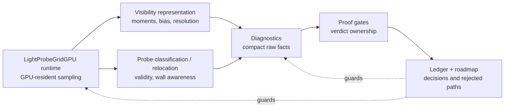

# Design: LightProbeGridGPU Research-Proof Evals

## Technical Approach

Keep the existing smoke harness shape, but sharpen ownership: harness modules capture raw evidence, runner assertions validate evidence shape, proof gates derive verdicts, and artifacts serialize compact summaries.

## Architecture Decisions

| Decision | Choice | Rejected | Rationale |
|----------|--------|----------|-----------|
| Verdict ownership | `test/e2e/lightprobegrid-gpu-proof-gates.js` derives proof verdicts | Status prose scattered in harness diagnostics | Freezes falsifiable gates and prevents narrative proof drift. |
| Evidence capture | Keep proof-only readback in harness/diagnostics modules | Runtime readback or public API hooks | Preserves GPU-resident runtime boundary. |
| Abstraction style | Local helpers only when they delete repeated lifecycle/payload logic | Thin pass-through modules | KISS/YAGNI; ownership matters more than file count. |
| Verification | No-build checks only | `npm run build` | Matches current refactor stream constraints. |
| Baseline framing | Treat scalar/WebGL and old LightProbeVolume work as comparators/problem statements | Treating the baseline as ground truth | Upstream discussion already shows missing per-object/material probe volume support; this patch must be honest about bounded improvement and remaining gaps. |
| Post-rejection direction | Prefer classification/relocation or a stronger visibility representation | Retrying adjacent-cross fallback or threshold tuning | Focused evals show adjacent hits exist, but borrowing neighboring bins does not close the gate without regressions. |

## Data Flow

```text
LightProbeGridGPUTestHarness / diagnostics
  -> raw compact facts
  -> runner assertions validate shape
  -> proof-gates derive SUPPORTED/OPEN
  -> artifacts write compact proof-summary.json
```

## File Changes

| File | Action | Description |
|------|--------|-------------|
| `examples/jsm/lighting/LightProbeGridGPUTestHarness.js` | Modify | Remove unconsumed payload and consolidate repeated proof lifecycle where it truly deletes concepts. |
| `examples/jsm/lighting/LightProbeGridGPUVisibilityWeightingStudy.js` | Modify | Keep only receiver evidence consumed by visibility/SH/surface diagnostics and gates. |
| `test/e2e/lightprobegrid-gpu-proof-gates.js` | Modify | Centralize verdict thresholds and rejection reasons. |
| `test/e2e/lightprobegrid-gpu-runner-*.js` | Modify | Assert compact raw fact contracts. |
| `lightprobegrid-gpu-refactor-plan.md` | Modify | Keep roadmap current and short. |

## Interfaces / Contracts

Raw fact objects SHOULD include measured values and availability flags. Gate objects include `id`, `subject`, `metric`, `actual`, `expected`, `status`, `reason`, and optional `evidenceRef`.

## Visibility Representation SDD

### Goal

Define the next visibility representation seam before changing resolution, bias, or lookup policy again. The current failure is not "8 screen pixels"; it is an angular octahedral visibility-depth classification miss: exact bins report no hit while adjacent bins carry occluder evidence on divider-crossing receiver/probe segments.

### Current Failure

The promoted bake-side cardinal dilation keeps runtime sampling cost unchanged and slightly reduces residual leak, but `visibilityWeighting.noWrongSideEscape` still reports four escapes. The compact gate evidence says all four are exact-bin no-hit misses with adjacent-bin hit coverage, not culling, fixture bypass, receiver/probe direction mismatch, high Chebyshev visibility, SH mixed-color risk, or scalar/WebGL disagreement.

Raw 12px/16px sweeps are not sufficient because they improved residual leak while opening directional suppression. That is the warning sign we care about: more angular samples can find more occluders, but without a coupled moment, bias, and border policy it can also over-classify visibility and suppress correct-side contribution.

### Representation Interface

The visibility representation seam must define these values as one contract:

- `angularResolution`: octahedral visibility-depth texel count per probe face/tile. It is angular resolution, not screen resolution. A candidate may change it only with matching bias and filtering policy.
- `momentFilter`: the bake-side kernel that converts distance samples into mean distance, mean squared distance, variance floor, and hit confidence. The kernel shape must be named by behavior, not by a magic tap count.
- `biasPolicy`: the receiver-distance bias used before Chebyshev visibility. Bias must be expressed relative to probe spacing and angular texel size so resolution changes do not silently change classification semantics.
- `borderPolicy`: how octahedral tile edges, gutters, or duplicated borders behave during bake and runtime lookup. A candidate with borders must state whether borders are stored in the atlas, synthesized during repack, or only used during filtering.
- `visibilityDecision`: the runtime GPU-resident lookup and weighting rule. It must remain a bounded GPU texture operation and must not depend on CPU readback, proof helpers, or scalar/WebGL truth.
- `diagnosticFacts`: compact raw facts only: resolution, filter id, effective bias, border/gutter mode, hit coverage count, exact-bin no-hit escape count, wrong-side escape count, and wrong-minus-correct suppression.

### Bias And Border Policy

Bias cannot be tuned independently of resolution. The candidate must state whether bias is constant in world units, scaled by probe spacing, scaled by angular texel width, or capped by both. A resolution increase without this statement is rejected as a raw sweep.

Borders/gutters are part of representation, not payload decoration. If a candidate uses gutters, the runtime must either sample a stored border-aware atlas layout or the bake must repack gutter-consistent moments into the exact runtime bins. Diagnostics may report only aggregate mode and coverage facts; they must not add per-bin row dumps.

### Over-Occlusion Guard Facts

Promotion depends on existing gates plus compact guard facts:

- `visibilityWeighting.noWrongSideEscape` must improve or close.
- `visibilityWeighting.directionalSuppression` must remain supported.
- Correct-bounce preservation, SH mixed-color risk, receiver-surface linear agreement, runtime readiness, projection parity, moment readback, and compact proof shape must remain supported.
- Residual leak must remain measured against the zero-leak oracle, not softened by scalar/WebGL comparison.
- If wrong-side escape reduction is paired with lower wrong-minus-correct suppression, opened SH-risk, or degraded correct-bounce preservation, reject the candidate as over-occlusion.

### Prototype Hold

No Phase 57 runtime prototype is promoted by this contract alone. The current cardinal-dilated moment representation is now observable through compact representation facts so the existing proof gates can reject or support it without adding a new residual-leak gate. The next new runtime candidate must first name a representation policy that couples angular resolution, moment filtering, bias, and border behavior. Naive adjacent fallback, diagonal overreach, threshold tuning, and raw resolution bumps remain rejected paths.

### Current Candidate Facts

The live candidate facts are intentionally compact:

- `angularResolution`
- `effectiveBias`
- `momentFilter`
- `borderPolicy`
- `momentHitProbeCount`
- `momentNoHitProbeCount`
- `wrongSideEscapedCount`
- `wrongMinusCorrectSuppression`

These facts are consumed by the existing `visibilityWeighting.noWrongSideEscape` evidence path. They do not create a new verdict and they do not preserve rejected adjacent-fallback payloads.

Focused proof after adding these facts keeps the proof honest: the fact contract is supported, while the current cardinal-dilated representation still leaves `wrongSideEscapedCount = 4` and therefore is not promoted as a no-wrong-side fix.

## Testing Strategy

| Layer | What to Test | Approach |
|-------|--------------|----------|
| Syntax | touched JS files parse | `node --check` |
| Boundary | runtime remains GPU-resident | `checkSmokeSourceInvariants(...)` |
| Diff hygiene | no whitespace/errors | `git diff --check` |

## Migration / Rollout

No migration required.

## Open Questions

- [ ] Which remaining harness `status` fields are raw availability evidence versus verdicts that belong in proof gates?

## Adjacent Visibility-Moment Rescue SDD

### Planning Metaprompt

Use this prompt when implementing or reviewing the adjacent visibility-moment rescue:

```text
Plan or evaluate a focused LightProbeGridGPU SDD slice for `visibilityWeighting.noWrongSideEscape`.

Current evidence says the four wrong-side escapes are 8px octahedral exact-bin no-hit misses with adjacent-bin hit coverage, not receiver/probe direction mismatch, culling/side capture, fixture geometry bypass, high Chebyshev visibility, or SH mixed-color risk.

North star: prove whether a bounded GPU-resident adjacent visibility-moment lookup can eliminate those four exact-bin no-hit escapes without regressing directional suppression, correct bounce, compact proof ownership, runtime GPU residency, or residual-leak honesty.

Require explicit goal, ideal state, non-goals, runtime candidate, proof-gate evidence requirements, cost ceilings, over-occlusion rejection criteria, focused verification, and acceptance/rejection outcomes.

Prefer conditional cross-bin fallback: exact bin first; only if hitConfidence is zero, sample cross-adjacent bins; choose the adjacent hit with the lowest computed Chebyshev visibility; preserve no-hit behavior when no adjacent hit exists. Do not tune thresholds, treat scalar/WebGL as truth, add CPU readback to runtime, or soften the residual leak gate.
```

### Goal

Determine whether a bounded GPU-resident adjacent visibility-moment lookup can eliminate the four `visibilityWeighting.noWrongSideEscape` exact-bin no-hit escapes without regressing directional suppression, correct bounce, compact proof ownership, runtime GPU residency, or residual-leak honesty.

### Current Evidence

The current focused Cornell proof classifies the four open wrong-side escapes as:

- `visibilityDepthResolution = 8`
- `wrongSideEscapedCount = 4`
- `weakCrushNoHitEscapeCount = 4`
- `weakCrushNoHitCrossingCount = 4`
- `weakCrushNoHitVisibilitySegmentHitCount = 4`
- `weakCrushNoHitSurfaceSegmentHitCount = 4`
- `weakCrushNoHitReceiverProbeDirectionMismatchCount = 0`
- `weakCrushNoHitAdjacentHitCount = 4`
- `weakCrushNoHitAllAdjacentNoHitCount = 0`
- `weakCrushNoHitDistinctOctBinCount = 4`

That evidence rules out fixture geometry bypass, culling/side capture, receiver/probe direction mismatch, and total visibility-bake absence for this gate. The remaining failure is an exact 8px octahedral bin miss where adjacent bins have hit coverage.

### Ideal State

The ideal state is a supported `visibilityWeighting.noWrongSideEscape` gate with:

- `wrongSideEscapedCount = 0`;
- the four current exact-bin misses rescued by a bounded adjacent lookup;
- `visibilityWeighting.directionalSuppression` still supported;
- SH mixed-color risk and correct-bounce gates still supported;
- residual leak still reported independently against the sealed-wall zero-leak oracle;
- no CPU readback or proof helper added to runtime;
- compact proof facts that explain fallback activity without row dumps or per-probe arrays.

### Non-Goals

- Do not close `sealedWall.preToneMaskedWrongSideResidualLeakRatio` by comparison to the scalar/WebGL baseline.
- Do not tune thresholds to make gates green.
- Do not expand visibility diagnostics with rows, arrays, narrative prose, or broad payloads.
- Do not promote a fix that closes wrong-side escapes by over-suppressing correct-side contribution.
- Do not increase visibility-depth resolution as the first fix; prior 12px/16px sweeps improved residual leak but opened directional suppression.

### Runtime Candidate

Prototype a conditional cross-bin fallback:

1. Load the exact octahedral visibility moment first.
2. If `hitConfidence > 0`, keep exact-bin behavior.
3. If `hitConfidence == 0`, load the four cross-adjacent oct bins.
4. For adjacent bins with `hitConfidence > 0`, compute the same Chebyshev visibility used by runtime.
5. Select the adjacent hit with the lowest computed visibility as the conservative replacement moment.
6. If no adjacent hit exists, preserve the no-hit exact-bin behavior.

This candidate targets the verified failure mode while bounding the extra load cost to no-hit exact-bin cases. An unconditional cross lookup may be used only as an upper-bound comparison; a 3x3 lookup is deferred unless cross lookup fails with evidence.

### Cost Ceiling

The prototype must report compact raw facts that allow the proof to distinguish quality from cost:

- exact visibility lookup count;
- conditional fallback activation count;
- adjacent moment load count;
- rescued no-hit escape count;
- fallback no-adjacent-hit count.

Promotion should require fallback activity to be bounded to the known no-hit class in the focused proof. If fallback activates broadly or materially worsens focused smoke runtime/timing evidence, reject it even if the escape gate closes.

### Proof-Gate Evidence Requirements

The `visibilityWeighting.noWrongSideEscape` gate must own the fallback verdict from compact raw facts, including:

- exact-bin no-hit escape count before and after fallback;
- fallback activation count;
- adjacent-hit rescue count;
- no-adjacent-hit fallback count;
- adjacent visibility load count;
- wrong-side escaped count after fallback;
- directional suppression and correct-bounce preservation evidence from their existing gates.

The residual leak gate remains separate: `sealedWall.preToneMaskedWrongSideResidualLeakRatio` must continue to report against the zero-leak oracle, even if adjacent-bin fallback closes `visibilityWeighting.noWrongSideEscape`.

### Over-Occlusion Safeguards

The proof must reject over-occlusion:

- `visibilityWeighting.directionalSuppression` must remain supported.
- Correct-bounce preservation gates must remain supported.
- SH mixed-color risk must remain supported.
- The residual leak gate must remain independent and must not be softened.
- Any candidate that closes `wrongSideEscapedCount` by suppressing correct-side contribution more than wrong-side contribution is rejected.

### Proof Ownership

Diagnostics may emit compact raw fallback facts only. Proof gates own:

- whether `visibilityWeighting.noWrongSideEscape` is supported;
- whether fallback cost is acceptable;
- whether over-occlusion occurred;
- whether residual leak remains open.

The proof summary may include fallback evidence only in open gate actuals or compact supported-gate evidence; it must not add diagnostic verdict prose.

### Focused Verification

The implementation slice must use focused no-build checks only:

- touched `node --check`;
- direct source invariant invocation;
- `git diff --check`;
- targeted Cornell WebGPU proof smoke.

The smoke proof must be interpreted through proof gates, not through scalar/WebGL baseline comparison. If Puppeteer cannot find its pinned browser, use the local Chrome executable path and record that in the verification note rather than changing the proof contract.

### Acceptance Outcome

Promote the runtime candidate only if focused Cornell proof smoke shows:

- `visibilityWeighting.noWrongSideEscape` becomes `SUPPORTED`;
- all previously supported gates remain supported;
- residual leak remains honestly reported against zero;
- compact source invariants pass;
- no runtime CPU readback/proof helper is introduced;
- no broad diagnostic payload is added.

### Rejection Outcome

If the candidate fails cost, suppression, bounce, SH-risk, residual-honesty, or compactness criteria, revert or keep it out of runtime and record the result as a rejected optimization. In that case, `visibilityWeighting.noWrongSideEscape` remains open as a known 8px octahedral visibility-moment exact-bin coverage limitation.

### Prototype Outcome

The adjacent-cross prototype is rejected. Conditional cross-bin fallback activated on the no-hit class and found adjacent hits, but `wrongSideEscapedCount` remained `4`; the unconditional-cross upper bound also left the escape gate open and regressed directional suppression plus receiver-surface agreement. Keep the rejected result in the ledger, but keep the runtime and proof interface free of adjacent fallback branches and fallback payloads. The adjacent-hit localization count remains because it classifies the failure; the failed-rescue counters do not.

### Modernization Direction

Future work should not try to make the leaky scalar-validity baseline look better. The missing product gaps are:

- visibility representation quality: DDGI-style distance/moment coverage, borders/gutters, and bias policy that scale with angular resolution. The current 8px setting is angular octahedral visibility resolution; external DDGI references commonly allocate more directional detail to visibility/distance than to irradiance, so this should be treated as a representation limitation, not just a constant to tweak;
- probe classification/relocation: interior/exterior separation, invalid-probe handling, and wall-aware sampling controls;
- GPU-resident product shape: grid volume sampling and material/object irradiance, not scene-global mutable probe state;
- proof compactness: raw facts stay compact, gates own verdicts, and failed-path evidence is not promoted into permanent payload bloat.

## Ultraplan Architecture

The architecture target is a deep LightProbeGridGPU runtime module with a small GPU-resident interface. The harness measures the module. Diagnostics emit compact raw facts. Proof gates own promotion verdicts. Research sources and rejected prototypes are ledger evidence, not runtime branches.

| Module | Interface | Implementation behind the seam | Depth / locality goal |
|--------|-----------|--------------------------------|-----------------------|
| `LightProbeGridGPU` runtime | Grid setup, bake, GPU textures, sampling controls, visibility-depth settings | Probe atlas, visibility-distance bake, TSL sampling, probe validity texture, material nodes | Keep runtime deep: callers get GI sampling without knowing proof readback or mirror logic |
| Visibility representation | Directional visibility lookup plus moment/bias policy | Octahedral visibility-distance tiles, gutters/borders candidate, Chebyshev/moment filtering, resolution-scaled bias | Concentrate 8px/12px/16px behavior in one seam so gates can test representation changes |
| Probe classification/relocation | Probe validity/classification facts and GPU sampling compatibility | Interior/exterior/invalid/occluding classification, relocation policy, wall-aware exclusion | Keep leak classification local instead of scattering fixture-specific checks |
| Diagnostics | Raw receiver, visibility, leak, SH, and surface facts | CPU mirror, readback, focused harness helpers | Keep diagnostics shallow but honest: no verdicts, no rejected-path payloads |
| Proof gates | Gate ids, thresholds, expected values, compact actuals | Promotion math and open-gate evidence | Gates own truth; runtime and diagnostics do not say "supported" |
| Ledger/roadmap | Decisions, rejected paths, next SDD phase | Research synthesis, source references, phase tasks | Preserve learning without keeping failed algorithms in live interfaces |



### Alignment Rules

- The first algorithmic SDD slice is visibility representation, not another scalar-baseline comparison.
- Probe classification/relocation is the second algorithmic lane because engine docs treat validity and relocation as first-class leak controls.
- Resolution changes are blocked until the candidate also defines resolution-scaled moment/bias policy and over-occlusion gates.
- Every rejected prototype must end with a trim pass: ledger keeps the decision; source invariants keep rejected payloads out of runtime, diagnostics, and proof facts.
- Promotion requires existing supported gates to stay supported: runtime readiness, projection parity, moment readback, directional suppression, receiver-surface agreement, SH-risk, correct bounce, and compact proof shape.

## Phase 58 Probe Classification/Relocation SDD

### Classification Interface

The current proof slice defines compact aggregate categories without adding a CPU runtime helper:

- `validProbeCount`: probes whose runtime validity weight can contribute to GPU sampling.
- `invalidProbeCount`: probes excluded by GPU-resident validity metadata.
- `interiorProbeCount`: probes whose centers fall inside solid fixture geometry.
- `exteriorProbeCount`: probes outside solid fixture geometry.
- `occludingProbeCount`: interior probes that would otherwise contribute through sealed geometry.
- `relocatedProbeCount`: probes moved to a different sampling position by a relocation policy.

`classificationPolicy = 'solid-occupancy-validity'` means the current prototype classifies solid-occupied probe centers and maps them to existing GPU validity metadata. `relocationPolicy = 'none'` is intentional: no relocation algorithm is promoted by this slice.

### Runtime Versus Proof Facts

Runtime sampling metadata remains `probeValidity` plus the packed probe-validity texture consumed by GPU sampling. Harness diagnostics may emit compact aggregate classification facts (`validProbeCount`, `invalidProbeCount`, `interiorProbeCount`, `exteriorProbeCount`, `occludingProbeCount`, `relocatedProbeCount`) because the matrix runner consumes them as an artifact contract. Diagnostics must not emit per-probe occupancy rows, relocated probe rows, brightness-derived validity, or proof verdict strings.

### Promotion Position

The solid-occupancy classification contract is supported as a compact representation of the current validity path, but it is not promoted as a wrong-side escape fix. It does not change visibility weighting, so the open no-hit angular-bin class remains owned by visibility representation rather than by probe relocation.

## Phase 59 Bias/Resolution Coupling

No 8/10/12/16 rerun is promoted in this closeout. Phase 57 established that the active representation candidate is still `VISIBILITY_DEPTH_RESOLUTION = 8` with `cardinal-dilated-9-tap-moments`, `effectiveBias = 0.02`, and four exact-bin no-hit escapes. Prior raw resolution bumps were rejected because they either failed to close residual leak or opened directional suppression.

A future rerun is allowed only when the candidate defines, before measurement:

- resolution-scaled moment/bias policy;
- border/gutter behavior;
- over-occlusion guard facts;
- preservation expectations for directional suppression, receiver-surface agreement, SH-risk, correct bounce, runtime readiness, projection parity, moment readback, and compact proof shape.

Until that contract exists, `VISIBILITY_DEPTH_RESOLUTION = 8` remains the default.

## Phase 60 Product API Shape

Product-facing controls are GPU-resident grid setup, bake inputs, `probeValidity`, leak-reduction mode, probe intensity/band controls, `createIrradianceNode()`, `createLightsNode()`, and compact sampling/visibility info. Example-facing diagnostics may inspect occupancy, visibility moments, receiver facts, and sealed-wall rows, but those are proof scoped and must not become the runtime contract.

Scalar/WebGL comparisons are same-class references or leaky comparators. They are not ground truth for sealed-wall correctness. The modernization target is grid-volume GPU sampling for object/material irradiance, not scene-global mutable `LightProbe` state.

## Phase 61 Proof Compactness

Rejected-path payloads stay out of live interfaces. The source invariant layer now guards against per-probe classification rows, relocated-probe payloads, brightness-derived validity, adjacent-fallback payloads, and proof verdict strings in diagnostics. Ledger and roadmap retain the rejected decisions; runtime, diagnostics, and runner contracts keep only raw facts consumed by gates, artifact contracts, or public examples.

## Phase 62 Open-Gate SDD Plan

The remaining proof work is not two unrelated bugs. `visibilityWeighting.noWrongSideEscape` owns the local failure class, and `sealedWall.preToneMaskedWrongSideResidualLeakRatio` owns the scene-level consequence against the physical zero-leak oracle. The SDD plan must therefore treat them as coupled evidence with separate verdicts:

- first close or improve the four exact-bin no-hit escapes;
- then measure whether the scene-level residual leak actually moves toward zero;
- never use scalar/WebGL baseline improvement as a substitute for zero-leak residual closure.

### Gate 1: `visibilityWeighting.noWrongSideEscape`

Current facts:

- `wrongSideEscapedCount = 4`;
- all four are `weakCrushNoHitEscapeCount`;
- divider-crossing visibility and surface segment hits are present;
- receiver/probe direction mismatch is zero;
- adjacent oct-bin hit evidence exists;
- naive adjacent fallback is rejected;
- raw 12px/16px resolution bumps are rejected as clean fixes because they open directional suppression.

Next valid candidate shape:

- a named visibility representation policy, not a constant tweak;
- resolution-scaled moment filtering and bias;
- explicit border/gutter behavior for octahedral visibility tiles;
- compact over-occlusion guard facts, including directional suppression, receiver-surface agreement, SH-risk, and correct-bounce preservation;
- GPU-resident runtime lookup with no CPU proof helper.

The first prototype candidate should be a border-aware visibility tile representation: allocate guttered octahedral visibility moments or equivalent wrapped-border moment coverage so exact-bin lookup no longer loses nearby wall hits at tile/bin boundaries. It may pair higher angular resolution with scaled bias only if the policy defines how the increased detail avoids the previous directional-suppression regression.

### Gate 2: `sealedWall.preToneMaskedWrongSideResidualLeakRatio`

Current facts:

- residual leak remains high against `wrongSideLeakTarget = 0`;
- current candidate improves the leaky scalar-validity comparator but still leaves the physical sealed-wall oracle open;
- stronger angular dilation and raw resolution bumps reduce residual slightly but regress other gates.

Next valid candidate shape:

- residual leak is evaluated only after the local visibility/classification candidate is defined;
- proof rows keep baseline/candidate raw leak and bounce values compact;
- residual gate remains independent from baseline-vs-candidate improvement;
- if no local escape improvement occurs, residual leak movement alone cannot promote the candidate.

### Stop Conditions

Reject the candidate if it:

- leaves `wrongSideEscapedCount` unchanged without adding a new source-backed failure classification;
- opens `visibilityWeighting.directionalSuppression`;
- opens receiver-surface agreement, SH-risk, correct bounce, runtime readiness, projection parity, moment readback, or compact proof shape;
- adds rejected-path payloads, per-probe dumps, or diagnostic verdicts;
- lowers residual leak by over-occluding correct-side contribution.

## Roadmap Ahead

The remaining SDD path is finite and ordered. Each phase either earns the next algorithmic move through gate evidence or records a rejection and trims live interfaces.

### Phase 63: Border-Aware Visibility Representation Candidate

Specify before implementation:

- whether the representation is guttered octahedral moments, wrapped-border moment coverage, or another tile-boundary policy;
- how angular resolution and bias scale together;
- which compact facts prove border behavior without per-bin dumps;
- how over-occlusion is detected through existing gates.

Prototype only after the contract is explicit. The candidate can promote only if `visibilityWeighting.noWrongSideEscape` improves or closes while all supported gates remain supported.

Phase 63 candidate A is `border-continuous-oct-uv-cardinal-9-tap-moments`:

- angular resolution stays `8` for the first candidate;
- runtime exact-bin lookup stays unchanged and GPU-resident;
- bake-side moment repack keeps the existing center, half-cardinal, and full-cardinal taps;
- tap directions use border-continuous octahedral decode instead of clamping tap UVs to `[0, 1]`;
- effective runtime bias stays `0.02` for the first candidate so the measured difference is border representation, not bias tuning;
- compact facts must report `borderPolicy = 'border-continuous-oct-uv'` and the named moment filter.

This candidate is not adjacent fallback. It does not sample neighboring runtime bins or keep fallback counters. It changes how bake taps crossing the octahedral tile boundary are represented inside the exact bin's stored moments.

Candidate A result: rejected and trimmed. Focused Cornell proof smoke passed, but the proof summary remained `OPEN` with 14 supported / 2 open gates. `visibilityWeighting.noWrongSideEscape` stayed at `wrongSideEscapedCount = 4`, with the same four weak-crush exact-bin no-hit escapes, and `sealedWall.preToneMaskedWrongSideResidualLeakRatio` stayed `0.9377`. Because there was no local escape improvement, the border-continuous decode change was removed from live runtime/proof interfaces and retained here only as ledger evidence.

### Phase 64: Candidate Verdict And Trim

After Phase 63 measurement, classify the candidate:

- promote if no-wrong-side improves or closes without over-occlusion;
- reject and remove runtime branches/diagnostic fields if it leaves escapes unchanged or regresses supported gates;
- keep only source-backed failure classification facts needed by existing proof gates.

This phase prevents failed representation experiments from becoming permanent payloads.

### Phase 65: Wall-Aware Probe Classification/Relocation Candidate

Run only if Phase 63 does not close the local escape class. The candidate must define a real wall-aware policy, such as invalid/occluding probe exclusion, exterior/interior separation, or bounded relocation. The current `solid-occupancy-validity` contract is not enough by itself.

Promotion requires compact aggregate facts showing what changed and why, plus preserved directional suppression, SH-risk, receiver-surface agreement, and correct bounce. Brightness-derived validity and fixture-only hacks remain rejected.

Phase 65 closeout: no runtime prototype is promoted from the current seam. `LightProbeGridGPU` already packs probe metadata with validity and a probe layer-mask channel, and guarded sampling already computes layer compatibility on GPU. However, the active receiver mask is currently grid-scoped (`receiverLayerMask` uniform) and `createIrradianceNode()` exposes no receiver-specific sampling parameter. A sealed-wall proof needs left and right receivers to use different receiver masks in the same render. Using the current grid-scoped uniform would be a scene-global mutable hack, not wall-aware product sampling.

The next valid classification candidate must therefore add or design receiver-specific sampling metadata, such as `createIrradianceNode( { receiverLayerMask } )` or an equivalent per-material/per-node mask input, plus explicit probe-layer-mask input metadata. Until that seam exists, Phase 65 is deferred/rejected as a runtime prototype and kept as a product API requirement.

### Phase 66: Coupled Resolution/Bias Sweep

Run only after Phase 63 or 65 provides a concrete policy. The sweep may compare angular resolutions, but each resolution must carry the same scaled moment/bias/border contract. A naked 8/10/12/16 table remains rejected.

Promotion requires better representation evidence without reopening directional suppression or the other supported gates.

Phase 66 closeout: no sweep is run because Phase 63 was rejected and Phase 65 produced an API requirement rather than a promotable runtime policy. `VISIBILITY_DEPTH_RESOLUTION = 8` remains the live default.

### Phase 67: Residual Leak Oracle Closeout

Evaluate `sealedWall.preToneMaskedWrongSideResidualLeakRatio` only after a local visibility/classification candidate improves the escape evidence. Residual movement is useful only when it is not caused by over-occlusion.

Close the residual gate only against `wrongSideLeakTarget = 0`. If the residual remains open, publish the exact residual as a non-claim rather than softening the oracle.

Phase 67 closeout: residual leak remains open at `0.9377` against the zero-leak oracle because no Phase 63/65 candidate improved the local escape class. Baseline-vs-candidate improvement remains a leaky-comparator fact only.

### Phase 68: Product API Hardening

If a candidate promotes, harden the public shape:

- expose only stable GPU-resident controls;
- keep proof/readback helpers out of runtime;
- keep diagnostic methods proof scoped;
- document memory and sampling implications compactly.

Phase 68 closeout: no promoted runtime candidate changes product API. The next product API need is explicit but not implemented in this SDD closeout: receiver-specific layer/mask sampling and probe layer-mask metadata must be designed before wall-aware classification can be a product feature.

### Phase 69: Final Proof Package

Run the focused no-build verification set and targeted Cornell smoke. The final package must state:

- supported gates;
- open gates, if any;
- exact residual leak against zero;
- rejected paths and why they are absent from source;
- no scalar/WebGL-as-truth claim.

Phase 69 package state, refreshed after receiver-scoped ownership: focused Cornell smoke remains `OPEN` with 15 supported / 1 open gate. `visibilityWeighting.noWrongSideEscape` is supported, and the remaining open gate is residual leak `0.9377` against zero.

### Phase 70: Archive Or Continue Decision

If no candidate can improve the local escape class without over-occlusion, archive the SDD as a bounded proof patch with known open gates. Continue only if new evidence changes the failure class or introduces a source-backed representation/classification policy.

Phase 70 decision: archive the current SDD as a bounded proof patch unless the next work explicitly designs the receiver-specific layer/mask sampling API required by Phase 65. Continuing without that seam would reopen fixture-specific hacks.

### Phase 71: Source-Backed Open-Gate Reframe

The new research direction is source-backed, not constant-backed. RTXGI/DDGI documentation frames leak reduction as a combination of per-probe irradiance plus distance data and a statistical occlusion test. Production DDGI extensions add self-shadow bias, probe state, and cascaded volumes. RTXGI 1.1 separately promotes probe relocation and probe classification. Unity APV exposes validity, dilation, virtual offset, probe density, renderer layer masks, and adjustment volumes. Flax DDGI documents a low-resolution per-probe depth buffer plus Chebyshev visibility weighting, and calls out probe relocation debugging.

That maps cleanly to the current proof evidence. The open local gate is not saying "8px is too small" in isolation; it is saying the current representation cannot classify four sealed-wall wrong-side samples when the exact angular bin has no hit and adjacent bins have hit evidence. The open residual gate is the scene-level consequence against the physical zero-leak oracle. Adjacent fallback, diagonal dilation, naked resolution sweeps, and threshold tuning have already shown the same pattern: leak can move, but clean promotion fails when the representation overreaches or cannot explain the wall.

The next SDD phase is therefore receiver-scoped probe shaping, not another visibility constant:

- `receiverLayerMask` must be receiver/material/node scoped, not a grid-global mutable uniform, so left and right sealed-wall receivers can sample different compatible probe sets in the same render.
- Probe metadata remains GPU-resident. Reuse the existing validity/layer metadata path where possible before adding a texture. If relocation offsets are needed, they require an explicit memory budget and packing plan before prototype.
- Runtime sampling must remain a bounded GPU node/texture operation. No CPU readback, proof helper, or scalar/WebGL truth path enters runtime.
- Diagnostics emit compact raw facts only: shaping policy, probe-layer-mask mode, receiver-mask mode, compatible/incompatible aggregate counts, excluded wrong-side contribution count, correct-side preservation count, wrong-side escape count, residual leak, and bounce/suppression guard inputs.
- Proof gates own verdicts: no-wrong-side improvement, directional suppression, receiver-surface agreement, SH-risk, correct bounce, runtime readiness, projection parity, moment readback, residual zero-oracle honesty, and compact proof shape.

Over-occlusion is the main adversary. A receiver-scoped mask candidate is rejected if it lowers residual leak by excluding correct-side contribution, opening directional suppression, degrading bounce, increasing SH mixed-color risk, or turning the sealed-wall fixture into a hard-coded runtime special case.

### Phase 72: Receiver-Scoped Probe Mask API SDD

The API seam to design before implementation is `createIrradianceNode( { receiverLayerMask } )` or an equivalent per-material/per-node sampling input. The current grid-scoped `receiverLayerMask` is not enough because the proof requires two receivers with different masks in one render. A global mask mutation would be architecturally wrong even if it made a fixture pass.

Candidate contract:

- `probeLayerMask`: packed per-probe metadata sampled on GPU, with source invariants guarding the packing and compatibility test.
- `receiverLayerMask`: per-node or per-material input that participates in GPU compatibility weighting.
- `shapingPolicy`: named policy such as `receiver-scoped-probe-layer-mask`, with no fixture-only divider checks.
- `memoryPolicy`: explicitly state whether the candidate reuses the existing probe-validity texture channels or allocates a new metadata texture.
- `pipelinePolicy`: no duplicate grids, no CPU switching per object, and no proof-only runtime branches.
- `diagnosticFacts`: aggregate raw counts and ratios only; no per-probe rows, rejected-path payloads, or diagnostic verdict strings.

Prototype only after this interface is precise. The first valid prototype may use the sealed-wall harness to assign left/right probe masks, but the runtime API must remain generic receiver-scoped sampling metadata. Promotion requires `visibilityWeighting.noWrongSideEscape` to improve or close while all supported gates stay supported and the residual leak stays honest against `wrongSideLeakTarget = 0`.

Runtime seam prototype: `createIrradianceNode( options = {} )` and `createLightsNode( sceneLights = [], options = {} )` now accept a `receiverLayerMask` node/value. The manual weighted sampling path resolves that value to a GPU uint node and uses it in the existing `probeMeta.b` compatibility test. The default remains the grid-level `receiverLayerMask` uniform, so existing examples and lights-node callers preserve behavior. This is an API seam only: no harness wall-mask policy, residual claim, or proof-gate promotion is attached until probe layer assignment and compact shaping facts are specified.

Probe metadata prototype: `probeLayerMasks` is now an optional per-probe integer mask array packed into the existing probe metadata texture's `probeMeta.b` channel. This keeps the memory policy at zero additional textures for the first receiver-scoped mask candidate. Values are validated as integer masks in the float-exact 24-bit range, and default behavior remains `DEFAULT_PROBE_LAYER_MASK`. The next wall-shaping slice can now assign generic probe regions without changing the runtime texture layout.

Harness metadata prototype: the Cornell example now assigns default-compatible side masks to probes. Left-side probes carry the default bit plus a left bit; right-side probes carry the default bit plus a right bit. Default receivers using mask `1` therefore keep existing behavior, while a future proof receiver can opt into left/right compatibility without rebuilding the grid or mutating a global mask. This is still not a promoted wall-shaping policy because the diagnostic/proof facts for receiver-specific exclusion and correct-side preservation have not been added.

Shaping preview facts: visibility-weighting diagnostics now emit compact aggregate evidence for the receiver-scoped side-mask policy. The facts report the shaping policy, probe/receiver mask modes, compatible and incompatible probe counts, wrong-side probes that would be excluded, correct-side probes that would be preserved, shaped wrong-side escape count, and correct-side preservation / wrong-side exclusion ratios. These facts are nested under the visibility-weighting proof evidence but do not change the existing gate verdict. The next step is to apply receiver-specific masks in render/proof and measure whether the preview closes the local escape gate without over-occlusion or residual dishonesty.

Receiver-scoped mask candidate verdict: promoted for the local visibility-escape gate only. The Cornell proof now applies left/right receiver masks in render/proof after the shaping preview facts are asserted. Focused WebGPU proof smoke passed 33 checks and the proof summary is `OPEN` with 15 supported / 1 open gate. `visibilityWeighting.noWrongSideEscape` is supported through receiver-scoped shaping evidence: the shaped wrong-side escape count is zero while correct-side base and visibility preservation stay complete. Directional suppression, receiver-surface agreement, SH-risk, correct bounce, runtime readiness, projection parity, moment readback, and compact proof shape remain supported.

The residual leak gate is intentionally not closed by this candidate. `sealedWall.preToneMaskedWrongSideResidualLeakRatio` remains open at `0.9377` against `wrongSideLeakTarget = 0`. That is the right split: receiver-scoped probe shaping fixes the local wrong-side probe compatibility class, but the rendered scene still has residual wrong-side energy and must continue to report it against the physical zero-leak oracle.

### Phase 74: Residual Leak Attribution SDD

The remaining open gate is now solely residual rendered wrong-side energy. Its current formula compares the candidate pre-tone masked wrong-side color ratio (`0.8089`) with the leaky baseline row (`0.8626`) while the physical target remains zero, producing `preToneMaskedWrongSideResidualLeakRatio = 0.9377`. That metric is not another spelling of `wrongSideEscapedCount`; Phase 73 already closed the compatible wrong-side probe class through receiver-scoped shaping.

Phase 74 must therefore start with attribution facts before any prototype. A valid next candidate needs to identify which source class still contributes to the wrong-side render region after receiver compatibility masking: visibility moment energy that is still physically compatible, probe SH content near the divider, receiver/material response, bake geometry coverage, or projection/atlas contribution. The facts must stay compact and raw, and they must be consumed by existing residual or guard gates. No CPU runtime helpers, duplicate grids, rejected-path payloads, scalar/WebGL truth framing, or global receiver-mask mutation are allowed.

The first valid residual prototype must preserve the Phase 73 contract: per-node/per-material receiver masks, GPU-resident probe metadata, supported no-wrong-side escape, supported directional suppression, supported receiver-surface agreement, supported SH-risk, supported correct bounce, runtime readiness, projection parity, moment readback, and compact proof shape. If the prototype reduces residual leak by suppressing correct-side contribution, it is over-occlusion and must be rejected.

Residual attribution fact pass: leak proof facts now carry a compact `residualAttribution` object with raw baseline/candidate ratios across existing render measurements. Focused Cornell WebGPU smoke passed 33 checks and kept the proof package `OPEN` with 15 supported / 1 open gate. The facts report `screenRegionResidualRatio = 1.0053`, `surfaceResidualRatio = 0.9359`, `surfaceCenterResidualRatio = 0.9666`, `maskedVisibleResidualRatio = 1.0012`, and `preToneMaskedResidualRatio = 0.9377`. This confirms the remaining leak is rendered receiver-region residual energy: receiver-scoped probe shaping closes the local compatibility escape, but visible wrong-side color remains near baseline in the masked region.

Do not prototype Phase 74 further from these values alone. The next candidate must explain why masked visible receiver pixels remain essentially unchanged while pre-tone/surface paths improve modestly. A valid policy might be source-backed probe placement/classification, material/receiver sampling shape, or bake geometry coverage, but it must be named as a full GPU-resident policy before code changes.

### Phase 75: Rendered Receiver Residual Source SDD

Phase 75 starts from the masked-visible residual fact, not from a new constant. The source question is precise: after receiver-scoped compatibility shaping closes wrong-side probe escape, why does `maskedVisibleResidualRatio` remain `1.0012` while surface and pre-tone masked ratios improve only modestly? A valid answer must distinguish source classes that can affect rendered visible receiver pixels: probe SH content near the divider, receiver/material response, bake geometry coverage, visibility moment energy that remains compatible, or projection/atlas contribution.

The Phase 73 contract is now a hard dependency, not a candidate to reopen. Any Phase 75 prototype must keep per-node receiver masks, GPU probe metadata, supported no-wrong-side escape, supported directional suppression, supported receiver-surface agreement, supported SH-risk, supported correct bounce, runtime readiness, projection parity, moment readback, and compact proof shape. The first Phase 75 implementation step is allowed only after a source-class fact explains the masked-visible residual path.

Phase 75 source-class fact pass: residual attribution now includes candidate irradiance-only center ratios. Focused Cornell WebGPU smoke passed 33 checks and kept the proof package `OPEN` with 15 supported / 1 open gate. The source split reports candidate display irradiance center wrong-ratio `0.6241`, candidate linear irradiance center wrong-ratio `0`, and candidate linear-irradiance-to-masked-visible ratio `0`, while masked-visible residual remains `1.0012`.

This rejects a simple "the receiver center linear irradiance is still wrong" explanation. The remaining residual is visible in rendered/masked receiver pixels while the center linear irradiance probe sample is clean, so the next source class should focus on receiver/material response, visible-surface coverage, or region sampling geometry before changing visibility math or probe compatibility.

### Phase 76: Visible-Surface / Material Response SDD

Phase 76 owns the gap between clean center linear irradiance and leaky masked visible pixels. The next facts must distinguish receiver surface coverage, material response, tone/output mapping, and visible-pixel mask geometry. This phase must not reopen probe-escape logic: Phase 73's receiver-scoped mask support and Phase 75's clean center linear irradiance fact are prerequisites.

A valid prototype requires a GPU-resident policy that explains how rendered visible pixels receive wrong-side color while center linear irradiance does not. Reducing masked-visible residual by cutting correct-side bounce, changing the zero-leak oracle, using scalar/WebGL as truth, reviving adjacent fallback, or tuning thresholds remains rejected.

Phase 76 fact pass: residual attribution now includes visible-pixel mask geometry plus material/output ratios. Focused Cornell WebGPU smoke passed 33 checks and kept the proof package `OPEN` with 15 supported / 1 open gate. Candidate masked visible pixel count is `5557`, masked visible pixel ratio is `0.0138`, masked-visible-to-surface-center ratio is `0.7867`, and pre-tone-masked-to-masked-visible ratio is `1.1102`.

These facts reject "broad visible-pixel mask coverage" as the primary residual explanation: the selected receiver pixels are a small fraction of the frame. They also show the pre-tone linear path is stronger than the display masked-visible path, while masked-visible remains below the surface-center wrong-ratio. The next policy must therefore isolate material/output mapping and receiver surface sampling before changing probe visibility or compatibility.

### Phase 77: Material/Output Mapping Attribution SDD

Phase 77 owns the material/output side of the remaining residual. The source question is why `candidatePreToneMaskedToMaskedVisibleRatio = 1.1102` while the receiver center linear irradiance is zero and the masked visible ratio remains near baseline. The candidate cannot be a proof presentation tweak: it must separate material response, tone mapping, output color space, and surface sampling as raw facts before any runtime policy change.

The Phase 77 contract preserves all earlier gates. Receiver-scoped masks stay promoted, residual remains measured against `wrongSideLeakTarget = 0`, and material/output facts do not become verdicts. Any prototype must reduce the residual without reducing correct bounce or reclassifying the leaky scalar/WebGL baseline as truth.

Phase 77 fact pass: residual attribution now includes irradiance-only masked-visible ratios under the same receiver mask. Focused Cornell WebGPU smoke passed 33 checks and kept the proof package `OPEN` with 15 supported / 1 open gate. Candidate display irradiance masked wrong-ratio is `0.7244`, candidate linear irradiance masked wrong-ratio is `0.5037`, and candidate masked-irradiance-to-masked-visible ratio is `0.6913`.

These facts separate output/material response from probe escape. Display irradiance over the same mask is close to the standard material display masked-visible ratio (`0.7244` versus `0.7286`), but linear irradiance over the same mask is much lower and standard material pre-tone masked wrong-ratio remains higher (`0.8089`). The next source class is material albedo / BRDF response under the receiver mask, not visibility representation or receiver compatibility.

### Phase 78: Material Albedo / BRDF Attribution SDD

Phase 78 owns the gap between standard-material pre-tone masked wrong-ratio and irradiance-only linear masked wrong-ratio. The source question is why the standard material path reports `0.8089` while irradiance-only linear masked pixels report `0.5037` under the same receiver mask. A valid fact pass must distinguish material albedo, BRDF response, normal/surface sampling, and output mapping without adding runtime CPU readback helpers.

The Phase 78 contract keeps the residual oracle and prior promoted gates intact. Any prototype must be GPU-resident, preserve correct bounce, and avoid treating display/tone-mapped improvement as proof of physical zero leak.

Phase 78 fact pass: residual attribution now includes receiver material facts from the actual sealed-wall candidate receiver materials. Focused Cornell WebGPU smoke passed 33 checks and kept the proof package `OPEN` with 15 supported / 1 open gate. The candidate receiver material type is `standard`, receiver albedo wrong-side ratio is `1.0655`, roughness is `0.82`, metalness is `0`, and pre-tone-masked-to-albedo ratio is `0.7592`.

These facts reject albedo as the primary residual amplifier. The receiver material is neutral and the pre-tone masked wrong-ratio is below the material albedo wrong-side ratio, while the standard material path still exceeds the irradiance-only linear masked wrong-ratio. The next source class is BRDF / surface-normal transport under probe-only lighting, not receiver color.

### Phase 79: BRDF / Surface-Normal Transport Attribution SDD

Phase 79 owns the gap between irradiance-only linear masked response and standard-material pre-tone masked response after albedo is ruled out as the main driver. A valid fact pass must distinguish BRDF response, receiver normal/surface sampling, direct-light exclusion, and probe-only transport under the same masked receiver pixels.

The Phase 79 contract keeps all prior gates and facts intact. Receiver-scoped masks remain promoted, residual remains open against zero, material facts remain raw, and any prototype must be GPU-resident and preserve correct bounce.

Phase 79 fact pass: residual attribution now includes Lambert material masked ratios under the same receiver mask and probe-only lighting. Focused Cornell WebGPU smoke passed 33 checks and kept the proof package `OPEN` with 15 supported / 1 open gate. Lambert display masked wrong-ratio is `0.7286`, Lambert linear masked wrong-ratio is `0.6565`, linear-Lambert-to-linear-irradiance ratio is `1.3034`, and pre-tone-masked-to-linear-Lambert ratio is `1.2321`.

These facts show BRDF/material response contributes to the residual, but does not fully explain it. Lambert display matches the standard display masked-visible ratio, while linear Lambert is higher than linear irradiance and standard pre-tone is still higher than linear Lambert. The next source class is receiver normal / surface sampling distribution under the same visible mask.

### Phase 80: Receiver Normal / Surface Sampling Attribution SDD

Phase 80 owns the remaining gap after BRDF/material response is shown to matter. The source question is why linear Lambert masked response remains higher than irradiance-only linear masked response and why standard pre-tone remains higher than Lambert. A valid fact pass must distinguish receiver normal orientation, surface sample distribution, visible-pixel mask distribution, and probe-only transport under the same masked receiver pixels.

The Phase 80 contract keeps receiver masks, residual honesty, BRDF facts, and all guard gates intact. Any prototype must name a GPU-resident surface/normal policy and prove it does not suppress correct-side bounce.

Phase 80 fact pass: residual attribution now includes compact receiver normal and surface coverage facts. Focused Cornell WebGPU smoke passed 33 checks after one browser target-close rerun and kept the proof package `OPEN` with 15 supported / 1 open gate. The minimum camera-dot-CPU-normal is `0.7999`, receiver surface region area ratio is `0.0136`, and masked visible pixel ratio is `0.0138`.

These facts reject receiver normal convention and mask/surface coverage mismatch as primary residual explanations. The receivers are strongly front-facing, and the selected visible-pixel mask coverage matches the receiver surface area. The next source class is spatial distribution across the receiver surface: center, quadrature, masked-pixel, and edge/near-divider regions may not see the same residual.

### Phase 81: Receiver Surface Spatial Distribution SDD

Phase 81 owns the spatial-distribution question after normals and coverage are ruled out. A valid fact pass must distinguish center, quadrature, masked-pixel, and edge/near-divider receiver-surface distribution under the same probe-only setup.

The Phase 81 contract keeps receiver masks, residual honesty, and all guard gates intact. Any prototype must name a GPU-resident surface distribution policy and show it preserves correct bounce.

Phase 81 fact pass: residual attribution now includes a near-divider receiver-edge split. Focused Cornell WebGPU smoke passed 33 checks and kept the proof package `OPEN` with 15 supported / 1 open gate. Candidate near-divider edge wrong-ratio is `0.8729`, near-divider-edge-to-surface-center ratio is `0.9425`, and near-divider-edge-to-masked-visible ratio is `1.1981`.

These facts identify a concrete source class: residual is spatially concentrated at receiver pixels near the divider-facing edge. This comes after receiver compatibility, material color, BRDF/material response, normal convention, and mask/surface coverage mismatch were separated. The next phase may define a near-divider surface distribution candidate, but only as generic surface/discontinuity metadata, not as a sealed-wall fixture hack.

### Phase 82: Near-Divider Surface Distribution Candidate SDD

Phase 82 may propose a candidate only if it names a GPU-resident policy for surface/discontinuity-aware receiver sampling. The policy must specify memory layout, runtime sampling shape, over-occlusion guards, and compact proof facts before any implementation. Fixture-only divider checks, CPU runtime helpers, scalar/WebGL-as-truth comparisons, threshold tuning, raw resolution bumps, and adjacent fallback revival remain rejected.

Phase 82 contract: represent receiver-side surface discontinuities as receiver/material/node-scoped sampling metadata, not as sealed-wall fixture logic. The metadata describes whether a receiver sample is near a known surface boundary and which compatible probe layer(s) may contribute there. The first valid shape reuses the promoted receiver mask seam: a receiver can pass a GPU uint mask node/value into `createIrradianceNode( { receiverLayerMask } )` or `createLightsNode( ..., { receiverLayerMask } )`, and any future discontinuity input must follow the same per-node/per-material scope. Grid-global mutation is forbidden because one render may contain receivers with different surface ownership.

Memory layout policy:

- Probe ownership remains packed in the existing probe metadata channel (`probeMeta.b`) unless a later phase proves that 24 mask bits are insufficient for product scenes.
- Receiver discontinuity state must be a node/value input or material-side metadata consumed by the GPU sampling node. It must not allocate proof-only CPU tables, read back runtime visibility, or duplicate the probe grid for the sealed-wall case.
- A future packed receiver descriptor may contain a layer mask plus a conservative boundary flag/radius, but Phase 82 does not promote that allocation yet. The prototype precondition is a named descriptor layout with byte/channel ownership and default behavior.

Runtime sampling policy:

- Exact-bin visibility moments still classify the queried direction; Phase 82 does not revive adjacent-bin fallback or raw resolution escalation.
- Receiver boundary metadata may only reduce or reweight probes that are incompatible with the receiver's surface ownership. It must not suppress all boundary samples or hide residual through brightness loss.
- The policy must stay GPU-resident: probe compatibility, boundary weighting, and final irradiance contribution are evaluated in node/GPU code, with CPU diagnostics limited to compact proof captures outside runtime.
- Defaults preserve the current path: receivers without boundary metadata use the promoted receiver-layer mask behavior and existing moment filtering.

Over-occlusion guard facts required before prototype promotion:

- Correct-side probe preservation ratio and incompatible-probe exclusion ratio remain near complete under the same receiver mask.
- Correct bounce, directional suppression, SH-risk, receiver-surface agreement, runtime readiness, projection parity, moment readback, and compact proof shape remain supported.
- Residual leak stays measured against the physical zero-leak oracle; any reduction must report pre-tone masked residual, center irradiance, masked irradiance, Lambert/material response, and near-divider edge ratios.
- A candidate must include a brightness/energy guard proving it did not win by globally darkening the receiver or removing legitimate same-side bounce.

Compact proof facts for the next prototype should be aggregate only: policy id, receiver metadata mode, mask source, boundary descriptor mode, compatible probe count, incompatible probe count, preserved correct-side count, excluded wrong-side count, boundary-weighted contribution ratio, correct-bounce energy ratio, pre-tone residual ratio, and near-divider-to-masked-visible ratio. Per-pixel payloads, rejected-path payloads, and fixture-specific divider verdicts stay out of the live interface.

Prototype status: not yet authorized. Phase 82 clarifies the contract, but implementation still needs a concrete receiver descriptor layout and GPU node weighting rule that can be explained before it is coded. The next phase should either specify that descriptor precisely or record why the current runtime seam cannot express it without a broader receiver-surface metadata API.

### Phase 83: Receiver Descriptor Layout SDD

Phase 83 resolves the descriptor fork. The current `receiverLayerMask` input can be a node/value, so it can express a GPU-resident dynamic mask selected by receiver material or geometry. That is enough for a first descriptor if the descriptor is discrete: interior receiver samples use an interior-compatible layer mask, while discontinuity-near samples use a stricter boundary-compatible layer mask. It is not enough for a continuous contribution policy unless a later API adds an explicit boundary weight input.

Concrete descriptor candidate:

- Probe metadata: keep using `probeMeta.b` as a 24-bit compatibility bitfield. Bits represent bake-authored probe ownership classes such as default, side/interior, and optional boundary-safe classes. The runtime does not infer those classes from brightness or proof rows.
- Receiver metadata: provide a GPU uint mask node named by policy as `receiverLayerMask`. For boundary-aware receivers, the node selects between an interior mask and a boundary-safe mask using receiver-local surface metadata supplied by the material/object. The default remains a constant mask.
- Boundary signal: the runtime contract accepts it only as a user/material node that already lives in GPU expression space. The proof harness may generate that node from fixture geometry, but the runtime API must not know about Cornell divider coordinates.
- Weighting rule: sampling keeps the existing compatibility test, `probeMeta.b & receiverLayerMask != 0`. A stricter boundary mask changes which probes are compatible near the receiver discontinuity; it does not add adjacent-bin visibility fallback, CPU readback, or post-gate thresholding.

Prototype precondition for Phase 83: identify a boundary-safe probe class assignment that is generic enough to document. If the only available assignment is "near this sealed-wall divider," the candidate must be rejected or deferred. If the assignment can be expressed as bake-authored probe ownership classes plus a receiver-supplied dynamic mask node, a minimal prototype may proceed under the existing API seam.

Required proof facts stay compact and aggregate: descriptor policy id, interior mask, boundary mask, boundary-selected sample ratio, compatible and incompatible aggregate counts for interior and boundary samples, correct-side preservation ratio, wrong-side exclusion ratio, candidate pre-tone residual ratio, near-divider-to-masked-visible ratio, and correct-bounce energy ratio. No rejected-path payloads or per-sample descriptor dumps are allowed.

Phase 83 prototype verdict: deferred. The runtime seam can consume a dynamic mask, but the proof has not yet named a generic bake-authored boundary-safe probe class assignment. Coding a receiver boundary band from Cornell divider coordinates would prove only the fixture and would leak a rejected path into the live interface.

### Phase 84: Boundary-Safe Probe Ownership Authoring SDD

Phase 84 defines the missing authoring contract. Boundary-safe probe classes are setup/bake metadata, not runtime inference. The runtime may consume bitfields from `probeMeta.b` and a receiver-supplied mask node, but it must not discover walls by CPU readback, brightness validity, or proof-only scene inspection.

Authoring policy:

- Product API shape remains explicit: callers may provide `probeLayerMasks` or a future bake/setup resolver that writes the same 24-bit probe ownership field.
- Ownership classes should describe scene or material layers, interior/exterior regions, and optional discontinuity-safe subsets. They must be stable metadata, not values derived from the current proof verdict.
- The Cornell harness may demonstrate the policy only by using the same public setup path. Any helper that knows "left wall/right wall/divider" must stay example/proof scoped and cannot become `LightProbeGridGPU` runtime behavior.
- If more than 24 ownership bits are required, a later phase must justify a new metadata texture or descriptor buffer with memory cost and sampling impact. Phase 84 keeps the current bitfield.

Runtime consumption policy:

- Sampling remains the existing GPU compatibility check against `probeMeta.b`.
- Receiver-side dynamic masks are allowed only through GPU node/value inputs.
- No CPU readback helper, scalar/WebGL comparator, threshold gate, or rejected adjacent-bin payload may influence runtime sampling.

Promotion requirement for any future prototype: the proof must show that the authored boundary-safe class reduces the residual gate while preserving receiver-scoped no-wrong-side support, directional suppression, SH-risk, receiver-surface agreement, correct bounce, runtime readiness, projection parity, moment readback, compact proof shape, and residual honesty against zero.

### Phase 85: Boundary Ownership Proof-Fact Contract SDD

Phase 85 defines the proof-fact contract for authored boundary-safe probe ownership. The runtime still only consumes GPU metadata; proof gates own verdicts. The diagnostic surface must be small enough to explain whether boundary ownership helped, without exporting rows, per-pixel payloads, or rejected candidate internals.

Fact ownership:

- Runtime sampling owns only the compatibility decision: probe ownership bits from `probeMeta.b`, receiver mask node/value, and the resulting compatible contribution.
- Diagnostics may emit compact aggregate facts about how the authored ownership behaved in the proof scene.
- Proof gates decide whether those facts support promotion. Runtime and diagnostics must not emit verdict labels such as "leak fixed" or "over-occluded."

Required aggregate facts before prototype:

- `boundaryOwnershipPolicy`: stable policy id for the authored ownership contract.
- `probeOwnershipMaskMode`: source of probe bits, such as `probeMeta.b authored bitfield`.
- `receiverMaskMode`: source of receiver masks, such as constant, material node, or geometry node.
- `interiorProbeCount` and `boundarySafeProbeCount`: aggregate authored probe class counts.
- `boundarySelectedReceiverSampleRatio`: fraction of receiver samples that selected the boundary-safe mask.
- `interiorCompatibleContributionRatio` and `boundaryCompatibleContributionRatio`: relative contribution before final irradiance normalization.
- `boundaryWrongSideExcludedCount` and `boundaryCorrectSidePreservedCount`: aggregate classification counts under the same receiver masks.
- `candidatePreToneMaskedWrongSideResidualLeakRatio`: residual gate input against zero.
- `candidateNearDividerEdgeToMaskedVisibleRatio`: spatial residual input, kept as raw evidence.
- `candidateCorrectBounceEnergyRatio`: over-occlusion guard input.

Non-facts:

- No per-probe row dump, per-pixel receiver dump, Cornell divider coordinate field, rejected-path payload, CPU runtime readback, scalar/WebGL truth field, or threshold verdict.
- No "boundary-safe" value may be derived from the residual gate result. It must come from authored setup/bake metadata.

Prototype status remains blocked by design, not by tooling: the next implementation can start only when these aggregate facts are tied to a generic authored ownership assignment. If the assignment cannot be explained without "left/right of this Cornell divider," the correct action is to keep the residual gate open and record the product API gap.

### Phase 86: Generic Boundary Ownership Assignment SDD

Phase 86 names the allowed sources for authored boundary-safe probe ownership. The assignment must be source-backed and product-shaped, not a proof-scene inference. Unity APV exposes Layer Mask controls for probe placement, invalidity/dilation, and virtual offset settings for leak handling (Unity 6 APV panel reference: https://docs.unity.cn/Manual/urp/probevolumes-lighting-panel-reference.html). Flax DDGI documents low-resolution probe depth plus Chebyshev visibility, global SDF/surface-atlas representation, and content authoring guidance such as splitting large interior meshes (Flax realtime GI docs: https://docs.flaxengine.com/manual/graphics/lighting/gi/realtime.html). RTXGI frames DDGI leak control around per-probe irradiance/distance data and a statistics-based occlusion test (NVIDIA RTXGI-DDGI algorithms: https://github.com/NVIDIAGameWorks/RTXGI-DDGI/blob/main/docs/Algorithms.md).

Allowed assignment sources:

- Author-provided scene/material/renderer layers that map probes and receivers into the same ownership vocabulary.
- Bake/setup geometry classification that writes probe ownership bits before runtime sampling. This may use scene geometry, SDF/distance, or ray-based validity, but the result must be stored as metadata consumed by the GPU.
- Probe invalidity, relocation, or dilation policy only if it is represented as authored probe state or ownership bits before runtime sampling.
- Receiver-side dynamic masks only when supplied as GPU node/value inputs from material/object metadata.

Rejected assignment sources:

- Cornell-only divider coordinates in `LightProbeGridGPU` runtime.
- Brightness-derived validity or proof-gate residual values used to author ownership.
- CPU runtime readback, scalar/WebGL truth comparison, threshold tuning, adjacent-bin fallback, or per-pixel/per-probe proof rows.
- A boundary-safe bit that means only "left of this sealed wall" without a reusable layer/material/region or bake-geometry definition.

Current verdict: the existing Cornell `probeLayerMasks` side split is useful region ownership, but it is not yet a generic boundary-safe ownership assignment. It explains and promotes receiver-scoped side compatibility; it does not justify a new boundary-safe prototype for the residual gate. The next valid implementation step would be a bake/setup assignment adapter that derives stable ownership bits from product-visible layers or geometry classification and then emits the Phase 85 aggregate facts.

### Phase 87: Probe Ownership Assignment Adapter SDD

Phase 87 defines the adapter seam that can eventually produce generic `probeLayerMasks`. This is setup/bake-time ownership assignment, not runtime sampling. The adapter is allowed to be CPU-authored because it runs before GPU resources are finalized; the runtime remains GPU-resident because sampling consumes only the packed probe metadata texture and receiver GPU mask input.

Adapter interface contract:

- Input: probe positions, grid resolution, default ownership mask, and authored ownership rules.
- Authored ownership rules may reference product-visible layers, material/renderer tags, region volumes, or bake-geometry classification outputs.
- Output: a `Uint32Array` whose length is `resolution^3`, with values in the same 24-bit mask range already validated by `LightProbeGridGPU`.
- Default behavior: if no adapter or rule matches, every probe keeps `DEFAULT_PROBE_LAYER_MASK`, preserving current scenes.
- Ownership rule ordering must be deterministic; conflicting rules combine by bitwise OR only when both classes are intentionally compatible.

Adapter non-goals:

- It must not depend on rendered residual measurements, proof-gate failures, scalar/WebGL comparison, or visibility readback.
- It must not know Cornell divider coordinates as an engine concept.
- It must not allocate a second probe grid or change runtime visibility moment sampling.
- It must not emit proof verdicts; it may expose only the aggregate facts named by Phase 85 when used in a proof harness.

Current implementation implication: `examples/webgpu_lightprobes_cornell.html` already has a fixture-local `createProbeLayerMaskData()` helper. That helper demonstrates that `probeLayerMasks` can be authored before runtime upload, but it is not the generic adapter. A future prototype should either introduce a reusable setup adapter with at least two non-identical rule sources, or leave the helper proof-scoped and record the residual gate as blocked on product authoring shape.

Phase 87 verdict: defer the adapter prototype. The deletion test fails today: a reusable adapter with only the Cornell side-split rule would move the same fixture logic behind a new name without adding leverage or locality. The current runtime already has the deep seam it needs for this slice (`probeLayerMasks` upload plus receiver GPU masks). What is missing is product authoring shape, not another helper function.

### Phase 88: Product Authoring Shape Gap SDD

Phase 88 records the gap that blocks a generic boundary-safe residual prototype. The product must name how scene authors or bake tooling express ownership before `LightProbeGridGPU` can consume it generically. Without that, any "boundary-safe" implementation would either infer from proof geometry or hard-code the Cornell divider.

Unblocked authoring shapes:

- Layer ownership: scene/material/renderer layers map directly to probe ownership bits and receiver mask bits.
- Region ownership: authored volumes or grid regions assign probe ownership bits before runtime upload.
- Geometry classification: bake/setup tooling classifies probes from geometry, SDF, distance, or ray validity and writes stable ownership bits.
- Probe-state ownership: invalidity, relocation, or dilation produces explicit probe state that maps to ownership bits or compatible receiver masks.

Minimum adapter promotion criteria:

- At least two non-identical rule sources are implemented or specified enough to test the interface shape.
- The default no-rule path preserves `DEFAULT_PROBE_LAYER_MASK`.
- Conflict behavior is deterministic and documented.
- Phase 85 aggregate facts can be emitted from the adapter output without per-probe rows.
- The residual gate remains open unless the focused proof run shows physical zero-oracle improvement without over-occlusion.

Current status: residual gate remains open, and product authoring shape is the blocker for a generic boundary-safe ownership prototype. This is not a runtime GPU-residency blocker and not a proof infrastructure blocker.

### Phase 89: Layer Ownership Product Shape SDD

Phase 89 selects layer ownership as the first product-facing authoring shape. The current three.js object model already has `Object3D.layers`, backed by the `Layers` bitmask type, and render traversal already treats layers as a stable scene-visible ownership/filtering vocabulary. Reusing that vocabulary gives authors a familiar mental model without making `LightProbeGridGPU` inspect scene objects at runtime.

Layer ownership contract:

- Probe ownership bits may mirror authored scene/rendering layer bits, limited to the 24-bit range that fits the current `probeMeta.b` storage.
- Receiver ownership may be expressed through the existing `receiverLayerMask` node/value input. A material or object adapter can map authored layer membership to a GPU uint mask, but runtime sampling still sees only the mask.
- Layer ownership is an authoring convention, not a renderer-layer side effect. Enabling a three.js render layer does not automatically change probe ownership unless setup/bake tooling maps it into `probeLayerMasks`.
- Bits outside `0xFFFFFF` remain invalid for probe ownership until a later phase justifies a larger metadata representation.

Default and compatibility policy:

- Default scenes keep `DEFAULT_PROBE_LAYER_MASK`.
- Layer-owned probes should OR the default bit only when they are intentionally compatible with default receivers.
- Receivers that do not opt into a layer-specific mask continue sampling default-compatible probes.
- Conflicts between authored layers combine only when the authoring rule declares compatibility; accidental overlap should be reported as setup diagnostics, not hidden by runtime sampling.

Prototype status: still deferred. Layer ownership satisfies the first authoring-shape half of Phase 88. It does not satisfy the second-source requirement for a generic adapter prototype. The next required source is a distinct setup/bake classification shape such as region ownership, geometry classification, or probe-state ownership.

### Phase 90: Region Ownership Product Shape SDD

Phase 90 selects region ownership as the second setup/bake classification source. The current grid already has `min`, `max`, a `boundingBox`, deterministic probe index-to-coordinate math, and world-space probe positions during bake/setup. Region ownership uses authored volumes over those probe positions to assign ownership bits before runtime upload.

Region ownership contract:

- A region rule owns a world-space volume plus an ownership mask.
- The first supported volume shape is an axis-aligned box because three.js already has `Box3` and the grid contract is axis-aligned.
- Probe membership is computed from the probe world position, not from rendered pixels, proof rows, residual values, or visibility readback.
- Region rules output the same 24-bit mask values as layer ownership and `probeLayerMasks`.
- Region rules are setup/bake authoring inputs. Runtime sampling remains unchanged and consumes only `probeMeta.b` plus receiver GPU masks.

Conflict/default policy:

- Probes outside every authored region keep `DEFAULT_PROBE_LAYER_MASK`.
- Overlapping regions combine by bitwise OR only when explicitly marked compatible by the authoring rule.
- Incompatible overlaps should be setup diagnostics and must not be silently resolved by proof gates or runtime sampling.
- Region ownership may represent rooms, zones, probe volumes, or authored discontinuity-safe bands, but the region names must be product concepts, not Cornell-specific divider labels.

Adapter implication: layer ownership plus region ownership now satisfy the two-source design requirement for a generic setup/bake adapter. The next phase may specify a concrete adapter interface and diagnostics, but prototype promotion still requires compact Phase 85 facts and no residual-gate claim without focused proof evidence.

### Phase 91: Probe Ownership Assignment Adapter Interface SDD

Phase 91 specifies the concrete setup/bake adapter interface. The adapter is an authoring helper that produces `probeLayerMasks`; it is not part of runtime sampling and must not change `LightProbeGridGPU`'s GPU path.

Adapter input shape:

- `min`, `max`, and `resolution`: the same grid bounds and cubic resolution used by `LightProbeGridGPU`.
- `defaultMask`: defaults to `DEFAULT_PROBE_LAYER_MASK`.
- `layerRules`: optional array of layer ownership rules.
- `regionRules`: optional array of region ownership rules.
- `conflictPolicy`: default `diagnose-incompatible-overlap`.

Layer rule schema:

- `name`: stable diagnostic label.
- `layerMask`: source layer bitmask in three.js `Layers` vocabulary.
- `ownershipMask`: 24-bit probe ownership mask to assign.
- `defaultCompatible`: whether the rule intentionally ORs `DEFAULT_PROBE_LAYER_MASK`.

Region rule schema:

- `name`: stable diagnostic label.
- `box`: world-space `Box3` or `{ min, max }` pair.
- `ownershipMask`: 24-bit probe ownership mask to assign.
- `defaultCompatible`: whether the rule intentionally ORs `DEFAULT_PROBE_LAYER_MASK`.
- `compatibleOverlapNames`: optional list of rule names whose overlap may combine by OR.

Adapter output shape:

- `probeLayerMasks`: `Uint32Array` of length `resolution^3`.
- `assignmentFacts`: compact aggregate facts only: policy id, layer rule count, region rule count, default probe count, assigned probe count, compatible overlap count, incompatible overlap count, mask range, and per-rule assigned counts.

Validation policy:

- All masks must be integer values in `0..0xFFFFFF`.
- Region boxes must be finite and non-empty.
- Rule names must be stable and unique within one adapter run.
- Incompatible overlaps must be surfaced in `assignmentFacts` and block prototype promotion until a later phase chooses whether to throw, warn, or reject the setup.
- The adapter must not inspect scene pixels, residual facts, proof verdicts, visibility readbacks, or scalar/WebGL output.

Prototype status: still held. Phase 91 defines the interface, but a runtime/proof prototype still needs an implementation plan that proves the adapter can emit Phase 85 facts, remains outside runtime sampling, and does not claim residual improvement without a focused proof run.

### Phase 92: Assignment Facts To Proof Facts Mapping SDD

Phase 92 defines how setup/bake adapter diagnostics map into the Phase 85 proof-fact contract. The mapping is one-way and raw: adapter facts describe authored ownership coverage, proof gates decide whether any later candidate supports promotion.

Mapping plan:

- `boundaryOwnershipPolicy` comes from the adapter policy id, for example `layer-region-probe-ownership`.
- `probeOwnershipMaskMode` comes from the adapter output mode, for example `probeMeta.b authored bitfield`.
- `receiverMaskMode` remains supplied by the receiver/material/node mask path, not by the adapter.
- `interiorProbeCount` maps to probes that kept only the default/interior-compatible ownership class after layer and region rules.
- `boundarySafeProbeCount` maps to probes assigned by at least one boundary-safe region or layer rule.
- `boundarySelectedReceiverSampleRatio` is not produced by the adapter alone; it requires receiver-side sampling facts from a later proof harness step.
- `interiorCompatibleContributionRatio` and `boundaryCompatibleContributionRatio` require runtime/proof sampling contribution facts and cannot be inferred from assignment counts.
- `boundaryWrongSideExcludedCount` and `boundaryCorrectSidePreservedCount` require proof-scoped receiver/probe classification under the same receiver masks.
- `candidatePreToneMaskedWrongSideResidualLeakRatio`, `candidateNearDividerEdgeToMaskedVisibleRatio`, and `candidateCorrectBounceEnergyRatio` remain owned by existing proof render facts and gates.

Implementation plan:

- Add the adapter as setup/bake code only after the mapping above is represented in compact `assignmentFacts`.
- Keep `assignmentFacts` separate from residual attribution until proof gates combine them.
- Do not add rejected-path payloads, per-probe rows, per-pixel dumps, residual-derived assignment, or runtime CPU readback.
- Do not claim a residual gate improvement from assignment coverage alone. A focused Cornell proof smoke or successor proof must measure the residual against the zero-leak oracle.

Prototype readiness: partial. The assignment-side fields are now specified. The runtime/proof-side fields still need a compact proof-harness plan before implementation can honestly claim Phase 85 coverage.

### Phase 93: Boundary Ownership Proof Harness Facts SDD

Phase 93 specifies the compact proof-harness facts for the fields that Phase 92 correctly left outside the adapter. These facts follow the existing `receiverScopedShaping` pattern: aggregate counts and ratios only, no rows, no verdict strings, and no runtime sampling changes.

Proof-harness fact object: `boundaryOwnershipShaping`.

Required compact fields:

- `boundaryOwnershipPolicy`: copied from the adapter policy id.
- `assignmentPolicy`: copied from `assignmentFacts.policyId`.
- `receiverMaskMode`: source of receiver masks, such as `grid-default-or-node-input`.
- `boundarySelectedReceiverSampleRatio`: ratio of proof receiver samples that selected a boundary-safe receiver mask.
- `interiorCompatibleContributionRatio`: aggregate compatible contribution from interior/default-compatible probes.
- `boundaryCompatibleContributionRatio`: aggregate compatible contribution from boundary-safe probes.
- `boundaryWrongSideExcludedCount`: count of wrong-side probes excluded by boundary-aware receiver masks.
- `boundaryCorrectSidePreservedCount`: count of correct-side probes preserved by boundary-aware receiver masks.
- `boundaryCorrectSidePreservationRatio`: preserved correct-side probes divided by correct-side candidates.
- `boundaryWrongSideExclusionRatio`: excluded wrong-side probes divided by wrong-side candidates.
- `candidatePreToneMaskedWrongSideResidualLeakRatio`: copied from the sealed-wall residual gate input.
- `candidateNearDividerEdgeToMaskedVisibleRatio`: copied from residual attribution spatial facts.
- `candidateCorrectBounceEnergyRatio`: copied from correct-bounce proof facts.

Ownership rules:

- The adapter owns assignment coverage facts.
- The proof harness owns receiver-sample selection, contribution split, wrong-side exclusion, and correct-side preservation facts.
- Existing residual and correct-bounce proof paths own residual, spatial, and bounce ratios; `boundaryOwnershipShaping` may reference them but must not recompute or reinterpret them.
- Proof gates own support/open verdicts. Diagnostics emit raw facts only.

Prototype status: contract implemented in Phase 96. `boundaryOwnershipShaping` consumes adapter `assignmentFacts`, emits compact aggregate fields, and preserves the existing residual and bounce fact owners.

### Phase 94: Layer / Region Rule Binding SDD

Phase 94 closes a subtle gap found during implementation inspection. A layer rule names an ownership class, but it does not select probes by itself. A region rule can select probes by world-space position, but it needs a clear way to bind that selected volume to an ownership class. Without that binding, a "layer + region" adapter would be a shallow interface: it would count two rule arrays while only the region rule actually assigns probes.

Binding contract:

- `layerRules` define named ownership classes: `name`, `layerMask`, `ownershipMask`, and `defaultCompatible`.
- `regionRules` select probes and assign ownership either by `ownershipMask` directly or by `layerRuleName`.
- If `regionRules[ i ].layerRuleName` is present, the adapter resolves ownership and default compatibility from the named layer rule.
- If both `ownershipMask` and `layerRuleName` are present on a region rule, they must agree after default compatibility is applied or the setup is invalid.
- A layer rule with no region binding is still useful as a receiver/material mask declaration, but it must not count as an assigned probe source in `assignmentFacts`.

Updated assignment facts:

- `layerRuleCount`: number of ownership class definitions.
- `boundLayerRuleCount`: number of layer rules referenced by at least one region rule.
- `unboundLayerRuleCount`: number of layer rules not referenced by region rules.
- `regionRuleCount`: number of probe-selecting region rules.
- `assignedProbeCount`: probes selected by at least one rule that resolves to an ownership mask.
- `defaultProbeCount`: probes selected by no ownership rule.

Prototype status: still held. The concrete adapter implementation can start after this binding contract is represented in source invariants and docs, because it prevents the two-source design requirement from being satisfied by two arrays where only one performs classification.

### Phase 95: Probe Ownership Assignment Adapter Prototype

Phase 95 prototypes the setup/bake ownership adapter. The new `LightProbeGridGPUProbeOwnership` module produces `probeLayerMasks` plus compact `assignmentFacts` from grid bounds, resolution, layer rules, and region rules. It is setup-only: runtime sampling still consumes the existing `probeMeta.b` metadata and `receiverLayerMask` GPU input, and no visibility, residual, or readback path is introduced.

Prototype behavior:

- Validates `defaultMask`, layer source masks, ownership masks, finite non-empty region boxes, and unique rule names.
- Resolves `regionRules[ i ].layerRuleName` through named layer rules.
- Allows region rules to assign an ownership mask directly or through a layer rule binding.
- Emits `boundLayerRuleCount`, `unboundLayerRuleCount`, `regionRuleCount`, `defaultProbeCount`, `assignedProbeCount`, overlap counts, mask range, and per-rule assigned counts.
- Keeps Cornell side ownership proof-scoped, but routes its `createProbeLayerMaskData()` helper through the generic adapter.

Prototype non-claims:

- This does not change runtime sampling math.
- This does not add `boundaryOwnershipShaping` yet.
- This does not close or improve `sealedWall.preToneMaskedWrongSideResidualLeakRatio`.
- This does not derive ownership from proof residuals, pixel reads, scalar/WebGL output, or visibility readback.

Verification status: touched syntax checks, source invariant checks, direct Cornell mask equivalence, and `git diff --check` are required before promotion.

### Phase 96: Boundary Ownership Shaping Facts Prototype

Phase 96 implements the compact proof-harness bridge that Phase 93 held open. The Cornell setup now preserves the adapter's `assignmentFacts` beside the generated `probeLayerMasks`, and the visibility-weighting diagnostic emits `boundaryOwnershipShaping` from those assignment facts plus the existing receiver-scoped shaping aggregate.

Implemented fact shape:

- Assignment provenance: `boundaryOwnershipPolicy`, `assignmentPolicy`, layer/region rule counts, assigned/default probe counts, and compatible/incompatible overlap counts.
- Receiver mask provenance: `receiverMaskMode` copied from the receiver-scoped mask path.
- Proof-owned shaping facts: `boundarySelectedReceiverSampleRatio`, compatible contribution ratios, wrong-side exclusion count, correct-side preservation count, and preservation/exclusion ratios.

Ownership boundaries:

- The adapter owns assignment coverage and rule-binding facts only.
- The visibility diagnostic owns receiver/probe aggregate preservation and exclusion facts.
- Existing residual attribution, correct-bounce, SH-risk, receiver-surface, and proof-gate paths keep their current ownership.
- `boundaryOwnershipShaping` emits compact raw facts only. It does not add a new verdict, recompute residual leak, or claim residual movement.

Prototype status: implemented as a proof-harness fact bridge. Promotion still requires focused verification and any future residual candidate must move `sealedWall.preToneMaskedWrongSideResidualLeakRatio` against the zero-leak oracle, not merely enrich ownership facts.

### Phase 97: Residual Decision Boundary SDD

Phase 97 decides what the current residual evidence does, and does not, justify. The remaining open gate is `sealedWall.preToneMaskedWrongSideResidualLeakRatio = 0.9377` against the zero-leak oracle. The local wrong-side escape gate is already supported through receiver-scoped ownership shaping, so the residual must not be reframed as an unresolved probe-escape proof gate.

Evidence from the latest focused Cornell proof:

- Center linear irradiance under the candidate receiver mask is clean: `candidateRenderLinearIrradianceCenterWrongRatio = 0`.
- Masked linear irradiance under the same receiver mask is still non-zero: `candidateRenderLinearIrradianceMaskedWrongRatio = 0.5037`.
- Lambert masked linear response is higher than unlit masked linear irradiance: `candidateRenderLinearLambertMaskedWrongRatio = 0.6565`, with `candidateLinearLambertToLinearIrradianceRatio = 1.3034`.
- Standard/material pre-tone response remains higher: `candidatePreToneMaskedWrongSideColorRatio = 0.8089`, with `candidatePreToneMaskedToMaskedVisibleRatio = 1.1102`.
- Near-divider receiver edge is the strongest spatial signal: `candidateNearDividerEdgeToMaskedVisibleRatio = 1.1981`.
- Visible receiver coverage is not broad enough to explain the residual by itself: `candidateMaskedVisiblePixelRatio = 0.0138`, and receiver surface region area ratio is `0.0136`.

Rejected explanations:

- Wrong-side probe escape as the residual owner. `visibilityWeighting.noWrongSideEscape` is supported by receiver-scoped shaping.
- Center linear irradiance contamination. The center linear irradiance wrong ratio is zero.
- Albedo-only amplification. Receiver albedo wrong-side ratio is `1.0655`, while pre-tone masked to albedo is `0.7592`.
- Broad visible-mask coverage mismatch. Masked visible pixel ratio and receiver surface region area ratio agree closely.
- Normal convention mismatch. The receiver normal/front-face gate is supported and `minCameraDotCpuNormal = 0.7999`.

Possible next seams:

- Receiver descriptor seam: a GPU-resident receiver/material/node descriptor that can select a stricter boundary-compatible mask or different material response for discontinuity-near receiver samples.
- Material response seam: a bounded material policy that separates probe irradiance from direct/BRDF response near authored discontinuities without changing probe ownership or visibility readback.
- Visibility representation seam: a stronger visibility/probe representation that moves residual without relying on raw resolution increases, adjacent fallback, or scalar/WebGL truth.

Prototype hold:

- Do not prototype from these facts alone. A candidate must name the runtime interface, memory policy, GPU node behavior, compact proof facts, and over-occlusion guards before code changes.
- Do not add more residual attribution payload unless a gate or invariant will consume it.
- Do not claim residual movement without a focused proof smoke measuring the zero-oracle residual.

### Phase 98: Receiver Discontinuity Descriptor Contract SDD

Phase 98 defines the next eligible runtime contract before any residual prototype. The current `receiverLayerMask` seam is useful but not sufficient on its own: it can select a GPU-resident compatibility mask for a receiver/material/node, but it cannot classify which receiver samples are interior versus discontinuity-near unless a caller supplies that descriptor as GPU-visible data or node logic.

Candidate interface:

- `receiverLayerMask`: the existing default/interior compatibility mask, still consumed as a GPU uint node/value.
- `receiverBoundaryLayerMask`: an optional stricter compatibility mask for authored discontinuity-near receiver samples.
- `receiverBoundaryWeight`: an optional GPU float node/value in `[0, 1]` selecting between the interior and boundary masks per receiver sample.
- Default behavior: when no boundary descriptor is supplied, `receiverBoundaryWeight = 0` and sampling is identical to the current Phase 96 path.

Memory and runtime policy:

- Keep probe ownership in `probeMeta.b`; do not add a second probe ownership texture for this candidate.
- Keep receiver classification GPU-resident. Runtime must not read proof pixels, leak rows, visibility readbacks, scalar/WebGL output, or CPU-side residual facts.
- The descriptor may come from material/node authoring, setup geometry classification, or product-visible layer/region metadata, but the runtime consumes only the resolved GPU mask/weight nodes.
- The mask blend must be classification, not energy scaling: it chooses compatible probe ownership for the receiver sample, while existing visibility moments and SH sampling remain responsible for contribution magnitude.

Proof fact contract:

- Diagnostics may emit only compact aggregate facts: descriptor policy id, receiver mask modes, boundary-selected receiver sample ratio, boundary-compatible contribution ratio, interior-compatible contribution ratio, wrong-side exclusion count, correct-side preservation count, residual gate input, near-divider spatial ratio, and correct-bounce ratio.
- Proof gates own all verdicts. The residual gate remains `sealedWall.preToneMaskedWrongSideResidualLeakRatio` against `wrongSideLeakTarget = 0`.
- No per-pixel descriptors, per-probe rows, rejected-path payloads, fixture divider coordinates, or diagnostic verdict strings are allowed.

Over-occlusion guards:

- `visibilityWeighting.noWrongSideEscape` must remain supported.
- `visibilityWeighting.directionalSuppression`, receiver-surface agreement, SH-risk, correct bounce, runtime readiness, projection parity, moment readback, and compact proof shape must remain supported.
- Any residual improvement that comes with correct-side loss, bounce loss, SH mixed-color risk, receiver-surface regression, or broader proof payloads is rejected as over-occlusion or proof drift.

Prototype status: held. The interface is now clear enough to evaluate, but implementation still needs an authored source for `receiverBoundaryWeight` that is generic product metadata rather than Cornell divider logic. Without that source, coding the descriptor would be a shallow fixture adapter, not a deeper runtime contract.

### Phase 99: Authored Boundary Weight Source SDD

Phase 99 selects the minimum generic source for `receiverBoundaryWeight`: a caller-authored GPU node/value supplied through the receiver/material/node sampling interface. That source is product-shaped because it lets an application express discontinuity proximity from its own material graph, geometry attributes, layer/region metadata, or future distance-field tooling without runtime proof readback or Cornell-specific coordinates.

Accepted source contract:

- `receiverBoundaryWeight` may be a constant, uniform-like node/value, vertex/attribute-derived node, material-node expression, or setup-authored receiver metadata resolved to a GPU float.
- The runtime clamps or saturates the effective weight to `[0, 1]` before selecting the receiver compatibility mask.
- `0` means interior/default receiver mask; `1` means boundary-compatible receiver mask; intermediate values are allowed only if the mask selection rule is defined as deterministic classification.
- The proof harness may use an authored demonstration weight, but the proof claim must describe it as authored receiver metadata, not automatic leak detection.

Rejected sources:

- Proof residual values, masked pixel ratios, visibility readbacks, scalar/WebGL comparison, CPU runtime readback, or proof verdict status.
- Cornell divider coordinates hidden inside runtime code.
- Brightness-derived boundary classification.
- Post-hoc threshold tuning that changes the residual oracle or directional-suppression gate.

Implementation precondition:

- Before code, define the deterministic GPU mask selection rule for interior/boundary weights. A valid rule may choose an interior or boundary mask from a saturated weight, but it must not scale irradiance energy just to lower the residual.
- Before proof promotion, add only the compact aggregate facts from Phase 98 and run focused Cornell smoke if runtime behavior changes.

Prototype status: still held. Phase 99 makes the source generic enough for an API prototype, but the GPU selection rule must be specified first so the implementation is classification, not hidden energy attenuation.

This held status is historical to Phase 99. Phase 100 later supplied the deterministic WGSL selection rule and Phase 101 exercised the descriptor through the proof harness without promoting a residual claim.

### Phase 100: WGSL Boundary Mask Selection API Prototype

Phase 100 prototypes only the default-preserving API path for the Phase 98/99 descriptor. It does not claim residual movement, and it does not add proof payloads. The purpose is to make the receiver descriptor an actual runtime interface while keeping classification explicit.

Implemented rule:

- Resolve `receiverLayerMask` exactly as Phase 73 already does.
- Resolve `receiverBoundaryLayerMask` through the same mask-node helper, defaulting to `receiverLayerMask` when absent.
- Resolve `receiverBoundaryWeight` as a GPU float node/value, defaulting to `0` and clamping to `[0, 1]`.
- Select `effectiveReceiverLayerMask` through a native WGSL helper using WGSL `select( receiverLayerMask, receiverBoundaryLayerMask, receiverBoundaryWeight >= 0.5 )`.
- Convert probe/receiver mask compatibility to a float through a native WGSL helper using WGSL `select( 0.0, 1.0, ( probeLayerMask & receiverLayerMask ) != 0u )`.
- Use `effectiveReceiverLayerMask` only in the existing `probeMeta.b` compatibility test and compatibility-to-weight conversion.

Why native WGSL for this selector:

- Three.js docs describe TSL `select()` as the ternary conditional abstraction, and the WGSL backend lowers conditionals to WGSL `select( else, if, cond )`.
- The broader TSL discussion around WGSL interoperability argues for native WGSL when a small piece of shader logic needs exact backend semantics.
- This selector is a good place for that rule: it is a tiny WebGPU-only uint classification helper, while the rest of the existing node graph remains unchanged.

Non-claims:

- This does not infer boundary proximity.
- This does not scale irradiance energy.
- This does not change visibility moments, angular resolution, bias, border policy, SH sampling, or residual gate math.
- This does not close `sealedWall.preToneMaskedWrongSideResidualLeakRatio`.

Verification requirement: source invariants must prove the WGSL selector exists, defaults to the existing receiver mask, converts compatibility through WGSL rather than TSL `.select()`, and still consumes `probeMeta.b`. A focused Cornell proof smoke is only required when a harness supplies a non-default boundary descriptor.

### Phase 101: Boundary Descriptor Harness Equivalence Prototype

Phase 101 exercises the non-default descriptor through the proof harness without claiming a new residual fix. Cornell receiver-scoped masks now route through `receiverBoundaryLayerMask` plus `receiverBoundaryWeight = 1`, while the default `receiverLayerMask` remains implicit. This proves the WGSL selector can express the already-promoted receiver-scoped ownership behavior.

Implemented harness behavior:

- `createReceiverBoundaryDescriptor( mask )` returns `{ receiverBoundaryLayerMask: mask, receiverBoundaryWeight: 1 }`.
- Unlit irradiance capture, Lambert response capture, and receiver material light-node setup all use the descriptor helper.
- Runtime still consumes only the effective GPU mask in the existing `probeMeta.b` compatibility test.

Non-claims:

- This is descriptor equivalence for the current receiver-scoped mask policy, not automatic discontinuity detection.
- This does not use Cornell divider coordinates in runtime.
- This does not claim residual movement unless the focused proof smoke measures it against the zero-leak oracle.

Verification result: focused Cornell WebGPU smoke passed 33 checks with proof summary still `OPEN`, 15 supported / 1 open. `visibilityWeighting.noWrongSideEscape` remains supported, `visibilityWeighting.directionalSuppression` remains supported, and `sealedWall.preToneMaskedWrongSideResidualLeakRatio` remains open at `0.9377`. A follow-up smoke after converting compatibility-to-weight classification to native WGSL also passed 33 checks with the same proof state.

### Phase 102: Final Package Reconciliation

Phase 102 is a documentation/proof-package reconciliation phase only. It does not change runtime math, proof gates, diagnostics, visibility moments, SH sampling, or receiver descriptors.

Current authoritative proof state:

- `visibilityWeighting.noWrongSideEscape` is supported after receiver-scoped ownership shaping and Phase 101 WGSL descriptor/compatibility equivalence.
- `visibilityWeighting.directionalSuppression`, correct bounce, SH-risk, receiver-surface agreement, runtime readiness, projection parity, moment readback, and compact proof shape remain supported.
- `sealedWall.preToneMaskedWrongSideResidualLeakRatio` remains the single open gate at `0.9377` against the zero-leak oracle.
- Earlier 13/3 and 14/2 proof summaries remain historical evidence for rejected or superseded paths, not the current proof verdict.

Archive rule: the package may be closed as a bounded proof package only if the final claim keeps the residual leak open and names Phase 101 as the latest runtime proof. Any future residual candidate must start from the Phase 98-101 receiver descriptor contract and add new compact guard facts before changing runtime behavior.

### Phase 103: Checklist Guard Reconciliation

Phase 103 reconciles task-list state with the proof state. Several older unchecked boxes were written as guard conditions such as "prototype only after..." while later phases either rejected the evidence as insufficient or supplied the required adapter/descriptor preconditions. Leaving those boxes unchecked makes the roadmap look incomplete in the wrong direction.

Resolution:

- Phase 74-81 prototype boxes are closed as explicit defer decisions: their attribution facts were useful, but did not identify a residual-reducing GPU policy by themselves.
- Phase 82 and Phase 84-88 prototype boxes are closed as superseded preconditions: later phases supplied the receiver descriptor contract, layer/region ownership adapter shape, and compact proof-harness fact bridge.
- This does not close the residual gate. `sealedWall.preToneMaskedWrongSideResidualLeakRatio` remains open at `0.9377` against zero.
- The task checklist may be fully checked while the proof package remains `OPEN`; those are different claims.

### Phase 104: Cross-Domain Leak Research Synthesis

Phase 104 researches why the remaining residual gate exists and which families of solutions are source-backed enough to shape the next SDD lane. Current local proof facts are the anchor:

- Current proof state is `OPEN`, 15 supported / 1 open.
- `visibilityWeighting.noWrongSideEscape` is supported; the remaining gate is not unresolved wrong-side probe escape.
- Baseline row `sealed-wall-validity-weighted` has `preToneMaskedWrongSideColorRatio = 0.8626`.
- Candidate row `sealed-wall-visibility-moments` has `preToneMaskedWrongSideColorRatio = 0.8089`.
- The candidate therefore improves the baseline by about `6.22%` relative to the baseline row, but the zero-oracle residual is still `0.9377`.
- Center linear irradiance is clean (`candidateRenderLinearIrradianceCenterWrongRatio = 0`), while masked linear irradiance is not (`0.5037`), Lambert masked response is stronger (`0.6565`), and near-divider receiver edge is the strongest spatial signal (`candidateNearDividerEdgeToMaskedVisibleRatio = 1.1981`).

Source-backed reading:

- RTXGI/DDGI frames light leaking as missing runtime visibility/occlusion in precomputed probe systems and solves it with per-probe irradiance plus distance data and a statistical visibility test: https://github.com/NVIDIAGameWorks/RTXGI-DDGI/blob/main/docs/Algorithms.md
- Flax's DDGI docs independently describe the same shape: probes gather indirect lighting, a low-resolution depth buffer around each probe supplies Chebyshev visibility weighting, and SDF plus a Global Surface Atlas provide geometry/surface context for software tracing and debugging: https://docs.flaxengine.com/manual/graphics/lighting/gi/realtime.html
- Unity APV leak troubleshooting is not just "increase density": it uses rendering layer masks to stop interior objects from sampling exterior probes, plus Virtual Offset, Dilation, density, and Probe Adjustment Volumes for invalidity/relocation-style correction: https://docs.unity.cn/Components/urp/probevolumes-troubleshoot-light-leaks.html
- Precomputed Light Field Probes add per-texel visibility information, similar to a G-buffer/variance-shadow-map idea, so world-space ray sampling has visibility rather than just irradiance: https://research.nvidia.com/publication/2017-02_real-time-global-illumination-using-precomputed-light-field-probes
- SDFGI work treats light leaking as one of the limits of real-time GI and moves the representation toward a signed-distance approximation of scene geometry: https://arxiv.org/abs/2007.14394
- GPU SDF construction literature is relevant because it treats leak-like failures as wrong sign/classification near surfaces and thin structures, not as a scalar threshold issue: https://developer.nvidia.com/gpugems/gpugems3/part-v-physics-simulation/chapter-34-signed-distance-fields-using-single-pass-gpu

Adjacent-domain reading:

- Edge-aware image processing solves "bleeding across edges" by adding a range/reference dimension to interpolation. The bilateral grid's range weight prevents samples across a strong edge from influencing each other, even when they are spatially near: https://studylib.net/doc/18340787/real-time-edge-aware-image-processing-with-the-bilateral-...
- Finite-volume flux/slope limiters avoid creating oscillations near steep gradients or discontinuities by limiting high-order interpolation near faces; the analogy is that interpolation must know when a face is a discontinuity: https://mooseframework.inl.gov/syntax/Limiters/

Sixteenstudio fork comparison:

- The exact public repo `sixteenstudio/LightProbesGPU` was not reachable via direct GitHub lookup or GitHub repository search.
- The relevant public artifact is `sixteenstudio/three.js`, branch `feat/webgpu-lightprobes-sponza`, commit `e8d975a347e0d1e4756c8d51fdbe1887b1f0b210`: https://github.com/sixteenstudio/three.js/tree/feat/webgpu-lightprobes-sponza
- That branch's `LightProbeGridGPU.js` is a GPU-resident L2 SH atlas implementation: cubemap bake, SH projection, 3D atlas repack with padding slices, and runtime sampling through `LightProbeGridNode`.
- Its runtime node offsets the sample position along the normal by half a probe spacing and linearly samples the SH atlas. It does not include visibility moments, distance/Chebyshev visibility, receiver layer masks, probe ownership metadata, invalidity/relocation/dilation, or residual proof gates.
- Therefore the sixteenstudio branch is best treated as a baseline GPU SH volume implementation. It is useful for comparing atlas packing and runtime integration, but it does not explain or solve sealed-wall leakage.

Interpretation:

The leak remains because the current candidate has separated the compatible-probe escape class from rendered residual energy, but still lacks a boundary-aware surface/visibility representation for the masked receiver pixels near the divider. The math problem is not "find a bigger constant"; it is "interpolate a low-frequency probe field across a discontinuity while preserving same-side energy and rejecting cross-side energy." Game engines and adjacent domains solve that by adding a classifier/reference dimension, a visibility geometry representation, or a limiter at discontinuities.

Next valid SDD lane:

- Treat the receiver boundary descriptor as an edge-aware interpolation dimension: `receiverBoundaryWeight` is the range/reference coordinate that selects a compatibility class, not an attenuation scalar.
- Add or consume source-backed geometry state before claiming residual movement: authored rendering/layer masks, region/volume ownership, invalidity/relocation/dilation facts, SDF/surface-distance facts, or material/receiver metadata.
- If improving visibility representation, couple angular resolution, moment filtering, bias, and border/gutter policy as one policy. Do not run a raw 12/16px sweep as a solution.
- If adding a residual candidate, require compact facts for boundary-selected receiver ratio, same-side preservation, cross-side exclusion, near-divider residual, masked linear irradiance, Lambert/material response, and correct-bounce energy.
- Keep the zero-leak oracle as truth. The current candidate beats the leaky baseline modestly, but the remaining residual is still high and must stay open until a source-backed representation moves it without over-occlusion.

### Phase 105: Residual Boundary Policy SDD and Live-Interface Prune

Phase 105 removes stale live proof payloads before specifying the next residual candidate. The old weak-crush/exact-bin no-hit localization taxonomy explained why adjacent fallback and raw resolution paths were rejected, but it no longer owns the current open proof gate. It must stay in roadmap/ledger history only, not in runtime diagnostics, proof-gate evidence, or runner assertions.

Current compact visibility evidence:

- representation policy facts: angular resolution, effective bias, moment filter, border/gutter policy, and moment hit/no-hit coverage;
- aggregate escape facts: wrong-side escaped count, visibility-bias bypass count, and finite-wall front-edge bypass count;
- receiver-scoped shaping facts: compatible/incompatible probe counts, shaped wrong-side escapes, correct-side preservation, and wrong-side exclusion;
- boundary ownership facts: boundary-selected receiver sample ratio, compatible contribution ratios, boundary correct-side preservation, and boundary wrong-side exclusion.

Remaining open gate:

- `sealedWall.preToneMaskedWrongSideResidualLeakRatio = 0.9377`;
- truth target is the physical zero-leak oracle, not the scalar/WebGL baseline;
- the failure is residual masked receiver energy after receiver-scoped ownership shaping, not unresolved compatible wrong-side probe escape.

Next eligible candidate:

Use a GPU-resident receiver residual boundary policy. It must consume authored or setup-provided receiver classification facts and feed the existing boundary selection seam:

- `receiverBoundaryLayerMask` selects the receiver-side layer/mask to use at a discontinuity;
- `receiverBoundaryWeight` is a GPU node/value clamped to `[0, 1]`;
- WGSL mask selection chooses the effective receiver layer mask;
- the effective mask participates in the existing `probeMeta.b` compatibility test.

This policy is classification, not irradiance energy scaling. It may choose a receiver compatibility class for a sample; it must not multiply irradiance down to make a leak metric smaller.

Allowed sources:

- authored material or geometry attributes;
- setup-authored receiver metadata resolved to GPU values;
- future surface-distance or signed-distance metadata if available to runtime without proof readback;
- stable bake/setup classification facts that are not derived from brightness, residual pixels, or scalar/WebGL comparison.

Rejected sources:

- CPU proof readback;
- Cornell divider coordinates in runtime;
- display-space masked pixels;
- brightness-derived validity;
- scalar/WebGL-as-truth comparison;
- old adjacent-fallback or weak-crush payloads.

Promotion requires reducing `sealedWall.preToneMaskedWrongSideResidualLeakRatio` below the current `0.9377` while keeping no-wrong-side escape, directional suppression, receiver-surface linear agreement, SH-risk, correct bounce, runtime readiness, projection parity, moment readback, residual honesty, and compact proof shape supported. The proof must report compact raw facts for boundary-selected receiver sample ratio, correct-side preservation, wrong-side exclusion, masked linear irradiance, Lambert response, near-divider residual concentration, baseline/candidate pre-tone masked wrong-side ratios, and zero-oracle residual ratio.

Verification result: touched `node --check`, direct source invariants, `git diff --check`, and focused Cornell WebGPU proof smoke pass. The refreshed proof remains `OPEN`, 15 supported / 1 open. `visibilityWeighting.noWrongSideEscape` and `visibilityWeighting.directionalSuppression` remain supported; `sealedWall.preToneMaskedWrongSideResidualLeakRatio` remains open at `0.9377`.

### Phase 106: Coherent Biased-Query Prototype Rejection

Hypothesis: promote the normal/view-biased sample position from "probe-cell selection point" to the single runtime query point for probe direction, compatibility kernel, and visibility distance. This would align the WGPU node math around one point instead of splitting cell selection from surface response.

Measured result: focused Cornell WebGPU smoke passed, but the proof regressed from 15 supported / 1 open to 14 supported / 2 open. `sealedWall.preToneMaskedWrongSideImprovement` opened with `actual = -0.0243`, and `sealedWall.preToneMaskedWrongSideResidualLeakRatio` worsened to `1.0243`. The candidate row became worse than the leaky baseline: candidate pre-tone masked wrong-side ratio `0.8961` versus baseline `0.8748`.

Decision: reject and trim. For the current receiver/material model, the biased point may select the probe cell, but surface position must continue to own probe direction, compatibility kernel, and visibility distance. The regression says the residual is not fixed by making the query point globally biased; the next candidate still needs explicit receiver-boundary/discontinuity classification or geometry state.

Restoration verification: after trimming the prototype, focused Cornell WebGPU smoke returned to `OPEN`, 15 supported / 1 open. `sealedWall.preToneMaskedWrongSideImprovement` is supported again, and the single remaining open gate is `sealedWall.preToneMaskedWrongSideResidualLeakRatio = 0.9377`.

### Phase 107: Literature-Backed Comparative Roadmap

The private fork now includes the sixteenstudio branch as `gpu/sixteenstudio-lightprobes-sponza`, pointing at public commit `e8d975a347e0d1e4756c8d51fdbe1887b1f0b210`. This makes the comparison concrete instead of rhetorical.

Comparison table:

| Branch / family | Representation | Leak-control state | Decision |
| --- | --- | --- | --- |
| three.js traditional / scalar baseline | Low-order SH probe interpolation / validity-weighted comparator | Useful comparison, but leaky and not physical truth | Keep as same-class baseline only. Do not optimize toward it as oracle. |
| sixteenstudio WGPU branch | GPU-resident L2 SH atlas, normal-offset sampling, runtime `LightProbeGridNode` | No visibility moments, receiver masks, ownership metadata, relocation/dilation, or residual proof gates found in the inspected branch | Use as product/API and atlas control, not leak-control target. |
| Current SDD branch | GPU SH atlas plus visibility moments, probe metadata, receiver-scoped masks, WGSL boundary selector, proof gates | `OPEN`, 15 supported / 1 open. Candidate improves baseline `0.8626 -> 0.8089`, residual remains `0.9377` against zero | Keep as bounded proof patch. Continue only with source-backed residual candidate. |
| DDGI / RTXGI / Flax | Per-probe irradiance plus distance/depth visibility and statistical/Chebyshev occlusion | Literature-backed leak-control family | Supports visibility moments and representation-policy work, not raw resolution constants. |
| Unity APV | Probe validity, rendering layer masks, Virtual Offset, Dilation, density, adjustment volumes | Engine-backed leak mitigation workflow | Supports authored/setup classification, receiver/probe masks, and adjustment metadata. |
| Light Field Probes / SDF / edge-aware limiters | Per-texel visibility, signed distance, range/reference dimensions, limiters near discontinuities | Stronger representation/classification near surfaces | Supports future geometry-state seam if GPU-resident and compact. |

Literature-backed decisions:

1. Keep SH interpolation. The issue is not that SH is wrong; it is that SH alone is a smooth low-frequency irradiance representation and does not encode occluding discontinuities.
2. Keep visibility moments. RTXGI/DDGI and Flax both support adding distance/depth visibility to probe systems as a leak-control mechanism.
3. Keep receiver/probe classification. Unity APV rendering layer masks and adjustment volumes support the idea that probes and receivers need class/validity metadata, not just more interpolation.
4. Do not copy sixteenstudio as the final algorithm. Its branch is useful to study WGPU atlas shape and node integration, but it does not address the sealed-wall residual proof problem.
5. Do not promote math-only tidiness. The coherent biased-query prototype was rejected by proof. Future candidates must add represented state: layer ownership, receiver metadata, boundary weights, or surface-distance facts.

Revised next phases:

- Phase 108: sixteenstudio control diff. Extract a short architectural comparison of atlas layout, runtime node interface, bake inputs, and sampling cost. No merge into SDD runtime.
- Phase 109: receiver boundary source adapter SDD. Define at least two generic sources for `receiverBoundaryWeight` or receiver class metadata: authored geometry/material attribute and setup region/layer ownership. One Cornell-only rule does not pass the deletion test.
- Phase 110: GPU metadata layout. Specify whether the next metadata fits in existing probe metadata, receiver node inputs, material attributes, or a new compact texture/buffer. Reject CPU readback and proof-derived data.
- Phase 111: residual candidate prototype. Only after Phases 109-110, prototype classification-before-interpolation and measure residual, correct bounce, directional suppression, receiver surface, SH-risk, runtime readiness, projection parity, moment readback, and compact proof shape.
- Phase 112: promotion or trim. If residual remains `>= 0.9377` or any supported gate opens, record and delete the candidate. If residual moves while all guards remain supported, promote with literature-backed explanation and compact facts.

### Phase 108: Sixteenstudio Control Diff

The inspected sixteenstudio control is a product/API baseline for WGPU SH probe volumes, not a leak-control candidate. Its `LightProbeGridGPU.js` keeps the base irradiance path compact: cubemap bake, GPU SH projection into a 9x1-per-probe batch target, and GPU repack into one RGBA 3D SH atlas. The atlas uses seven packed SH sub-volumes with one copied Z padding slice on each sub-volume boundary so hardware trilinear filtering cannot bleed between packed SH layers.

Current SDD differs in the leak-control layers placed around that base path. It keeps the packed SH atlas idea, but adds visibility-depth moments, probe metadata, receiver-scoped masks, ownership assignment, WGSL boundary selection, compact proof facts, and residual gates. The sixteenstudio atlas gutter is therefore not evidence that our residual is solved by an atlas padding tweak: it protects SH sub-volume packing, while the open gate is rendered masked receiver energy after receiver-scoped compatibility shaping.

Runtime-node comparison:

- sixteenstudio exposes a dedicated `LightProbeGridNode` that samples the packed SH atlas at a normal-offset world position and adds irradiance to the lighting context.
- current SDD keeps sampling in `LightProbeGridGPU.createIrradianceNode()` / `createLightsNode()` because the branch also needs receiver masks, boundary masks, visibility moments, and proof-scoped harness paths.
- product lesson: a future deep module seam may separate "base SH atlas irradiance node" from "leak-control classification policy", but merging the sixteenstudio runtime would delete the proof-relevant state rather than close the residual gate.

Demo/product comparison:

- sixteenstudio's Sponza example is valuable integration pressure: a visible dynamic object, GUI-driven rebake controls, helper display, and a simple story that probes light moving objects.
- current Cornell proof is intentionally adversarial and proof-owned; it should not be shaped into a product demo or use demo simplicity as proof truth.
- adopt the product lesson, not the algorithm: keep a small public base-irradiance mental model, then layer explicit receiver/probe classification only when authored or setup metadata exists.

Phase 108 decision: do not merge sixteenstudio runtime into the SDD branch. Keep it as a private-fork control for atlas/node/demo shape. Use it to justify a cleaner module seam later, not to replace visibility moments, receiver ownership, or residual proof gates.

### Phase 109: Receiver Boundary Source Adapter SDD

The next residual candidate needs a source-backed receiver boundary/class descriptor. It cannot be inferred from proof pixels, residual ratios, brightness, scalar/WebGL comparison, or Cornell divider coordinates. The valid contract is authored or setup-provided classification that can be consumed by GPU node/value inputs before interpolation.

Accepted generic sources:

- Authored geometry/material source: a vertex attribute, material node expression, constant, or uniform-like node resolves to `receiverBoundaryWeight` and optionally `receiverBoundaryLayerMask`. This is appropriate when the asset or material author knows that a receiver surface crosses a discontinuity or belongs to a side class.
- Setup-authored region/layer ownership source: setup/bake code assigns receiver class metadata from layer rules, region ownership, or scene-authored volumes, then resolves that metadata to the existing GPU receiver descriptor. This is appropriate when the app owns spatial regions rather than per-material attributes.

Rejected sources remain explicit: CPU proof readback, masked rendered pixels, visibility readback, brightness-derived validity, scalar/WebGL-as-truth comparison, Cornell-only divider coordinates in runtime, threshold tuning, and old adjacent-fallback payloads.

The adapter may only emit compact raw facts: source type, boundary-selected receiver sample ratio, same-side preservation, cross-side exclusion, masked linear irradiance input ratio, Lambert/material response input ratio, near-boundary residual concentration, correct-bounce preservation, and the existing zero-oracle residual ratio. Proof gates own every verdict.

### Phase 110: GPU Metadata Layout SDD

The next metadata belongs first in receiver node inputs and material/geometry-provided node values, not in a new global readback or proof-derived buffer. Current runtime already has the minimal GPU seam: `receiverLayerMask`, optional `receiverBoundaryLayerMask`, optional `receiverBoundaryWeight`, native WGSL mask selection, and probe compatibility against `probeMeta.b`.

Chosen layout for the next prototype, if it proceeds:

- Probe ownership stays packed in existing probe metadata (`probeMeta.b`) through 24-bit masks. Do not allocate another probe metadata texture for this residual candidate.
- Receiver boundary class stays as GPU node/value inputs so material attributes, constants, or setup-authored metadata can feed it without CPU readback.
- A new compact GPU buffer/texture is deferred until a source needs many receiver classes that cannot be represented as existing node/value inputs.
- Default behavior is unchanged: absent boundary metadata resolves to the current receiver mask and boundary weight `0`.

Memory and cost policy:

- no additional runtime visibility lookups;
- no CPU readback or proof helper in runtime;
- no broad darkening or irradiance-energy scaling;
- classification is applied before probe compatibility/interpolation by selecting the effective receiver mask;
- diagnostics stay compact raw aggregate facts only.

Phase 110 decision: the representation contract is clear enough to design a residual candidate, but not enough to prototype blindly. A prototype is eligible only when it consumes one of the Phase 109 generic sources and can prove that boundary classification changes residual input facts without opening same-side preservation or correct-bounce guards.

### Phase 111: Residual Candidate Prototype Hold

Prototype audit: do not add runtime code yet. The runtime already accepts the receiver-boundary descriptor as GPU node/value inputs, and the Cornell proof harness already exercises the strongest currently available side-class descriptor by passing `receiverBoundaryLayerMask` with `receiverBoundaryWeight = 1` for each receiver. That equivalence path supports no-wrong-side escape and keeps directional suppression supported, but the residual gate remains `sealedWall.preToneMaskedWrongSideResidualLeakRatio = 0.9377`.

That means a Phase 111 prototype that only rewraps `receiverBoundaryLayerMask` / `receiverBoundaryWeight` would be a shallow adapter, not a new residual candidate. By the deletion test, deleting such a wrapper would merely expose the same object literal at the call site and would not add represented state, locality, or proof leverage.

The next promotable prototype must add one of these missing facts before interpolation:

- authored receiver boundary metadata that varies per material, attribute, or receiver region and is not equivalent to the current whole-receiver side mask;
- setup-authored surface/region ownership that can classify boundary receiver samples differently from interior samples;
- geometry-state metadata, such as surface distance or signed/region distance, if it can be consumed GPU-resident without proof readback.

Rejected Phase 111 shortcut: do not promote a constant `receiverBoundaryWeight = 1` helper as a new prototype. That path is already covered by Phase 101 equivalence and did not move the residual gate. Do not add a new compact fact unless it is consumed by a proof gate and distinguishes a new source-backed candidate from the existing whole-receiver mask path.

### Phase 112: Promotion Or Trim Decision

No new candidate is promoted from Phase 111. The current source-backed state remains:

- supported: no-wrong-side escape, directional suppression, receiver-surface linear agreement, SH-risk, correct bounce, runtime readiness, projection parity, moment readback, and compact proof shape;
- open: `sealedWall.preToneMaskedWrongSideResidualLeakRatio = 0.9377`;
- trimmed/rejected: naive adjacent fallback, raw resolution-only sweeps, diagonal overreach, global coherent biased-query ownership, and shallow receiver-boundary wrapper payloads.

Promotion remains blocked until a candidate reduces the zero-oracle residual below `0.9377` while all supported gates stay supported. If the next candidate merely renames existing descriptor inputs, leaves residual flat, or improves residual by broad darkening/over-occlusion, record it in the ledger and keep it out of runtime.
