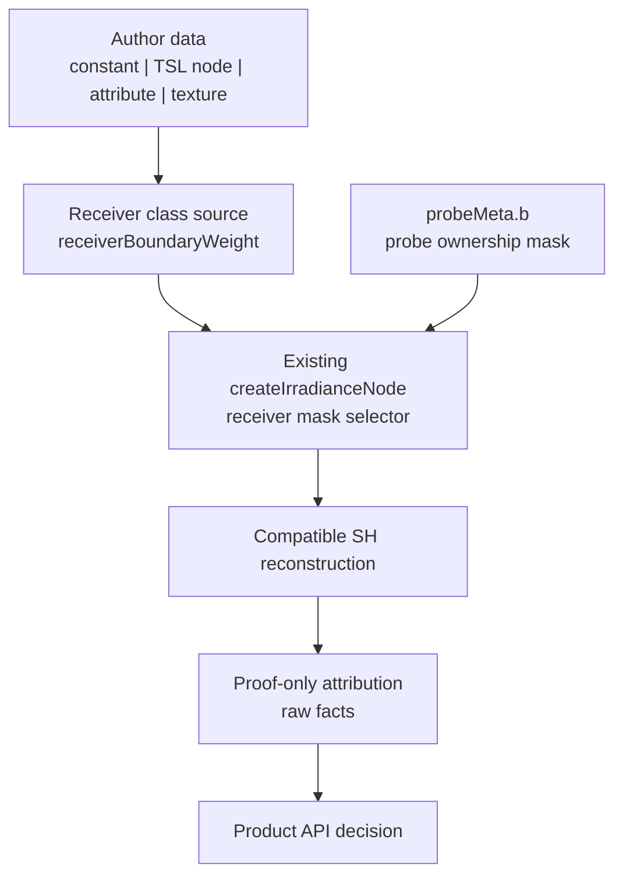

# LightProbeGridGPU Authored Boundary Source SDD

Verified: 2026-06-04.

## Status

Reframed.

The authored receiver-boundary source seam is proven as a GPU-resident input
path, but it is rejected as the residual fix. Support-set attribution now shows
the receiver-side candidates still reuse the same probe identities and collapse
under normalization. The next architecture step is bake/setup-side probe
identity classification, still proof-only.

## Current Truth

- Proof package: `OPEN`, 15 supported gates / 1 open gate.
- Open gate: `sealedWall.preToneMaskedWrongSideResidualLeakRatio = 0.9377`.
- Physical oracle: sealed-wall wrong-side transfer is `0`.
- Current candidate improves the leaky comparator, but does not close the zero
  oracle.
- Authored receiver sources now work technically, but render residual stayed
  unchanged in the tested variants.

The learning is narrow and useful:

```text
receiver source plumbing works
receiver-side compatibility changes either hit zero-base neighbors,
overprune, or scale a coefficient set that normalization cancels
```

## Architecture Decision

Keep the runtime reconstruction path compact. Do not introduce a new solver,
automatic classifier, broad mode system, or public multi-class ownership API.

Split the work into three seams:



Seam ownership:

| Seam | Owns | Does not own |
| --- | --- | --- |
| Receiver class source | GPU-resident authored class signal and default equivalence | leak claims, residual tuning, Cornell geometry |
| Probe ownership metadata | setup-time mask assignment into `probeMeta.b` | runtime buffers, public helper promotion before proof |
| Proof attribution | compact facts explaining support, weights, coefficients, residual | product API, verdict prose, row dumps |

## Runtime Contract

The existing selector remains the contract:

```text
effectiveReceiverLayerMask =
  receiverBoundaryWeight >= 0.5
    ? receiverBoundaryLayerMask
    : receiverLayerMask
```

Inputs:

- `receiverLayerMask`: default receiver ownership mask.
- `receiverBoundaryLayerMask`: mask selected for authored boundary samples.
- `receiverBoundaryWeight`: saturated class selector, not irradiance
  attenuation.

Default behavior:

- absent `receiverBoundaryWeight` means `0`;
- absent `receiverBoundaryLayerMask` means `receiverLayerMask`;
- no authored metadata means current sampling behavior remains equivalent.

Continuous values are classifier inputs only. They must not become a hidden
dimming knob.

## What To Borrow

Borrow the principle, not the machinery.

| Source area | Borrow | Do not implement now |
| --- | --- | --- |
| DDGI / RTXGI | moment visibility and explicit probe state | relocation/classification state machines |
| Unity APV | authored layer semantics | engine-scale adjustment-volume tooling |
| Mask decomposition | compatible-class interpolation | multi-volume decomposition |
| WENO / edge-aware filtering | choose compatible support before reconstruction | shock/image-filter machinery |
| Barrier interpolation | nearby-across-wall can be incompatible | barrier-distance systems |

## Evidence Summary

| Candidate family | Result | Architectural learning |
| --- | --- | --- |
| TSL uniform receiver source | smoke passed, residual unchanged | source seam works, not a fix |
| UV-band receiver source | smoke passed, residual unchanged | proof-band source should not be productized |
| geometry-attribute source | smoke passed, residual unchanged | authored per-surface data is usable |
| near-edge mass attribution | mass ratios stayed `1` | selected masks did not change contributing mass |
| per-neighbor attribution | changed slots had `base = 0` | receiver source hit non-contributing neighbors |
| normal-bias sweeps | neutral | sample offset tuning is not enough |
| exclusive side ownership | neutral | removing default overlap alone does not align support |
| hard/swapped masks | changed contributing slots, worsened leak or bounce | binary mask swaps are too coarse |
| blend compatibility | mass dropped, final irradiance unchanged | normalization cancels uniform scaling |
| coefficient-side contrast | cross-side changed irradiance differed `4.4402x` | represented signal exists, but current support selection cannot expose it |
| support-set attribution | `normalization-cancelled-coefficient-loss`, final ratio `1` | receiver-side candidates attenuate/reweight the same probe identities |
| strict multi-class ownership | overpruned to zero irradiance | stricter masks collapse support |
| overlapping/soft boundary ownership | neutral or cancelled | overlap alone does not survive normalization |
| coefficient-side weighting | accumulator ratios collapsed to `0`, final irradiance stayed `1` | post-support weighting is attenuation before normalization, not routing |
| relocation feasibility | boundary/default probe identity changes = `0` | receiver-side paths reweight the same probes; bake-time relocation or probe-side classification is required |
| receiver-side support routing | archived by aggregate identity proof | all tested candidates keep the same probe identities |
| setup-side identity classification | left candidate changes `4/8` support probe identities, reduces wrong-side L0 ratio from `0.8599` to `0.2763`, and survives render-only bounce guard; final-irradiance debug ratios remain `1`; setup-mask delta recovers boundary final irradiance to default, not beyond it | setup-side classification has a measured coefficient win on one side, but normalized final irradiance still does not show an improvement over the default descriptor |

## Product Decision

Do not promote `LightProbeGridGPUProbeOwnership.js` yet.

Keep `test/e2e/lightprobegridgpu/LightProbeGridGPUProbeOwnership.js`
proof-scoped until a product seam proves all of this:

- authored input is not Cornell-specific;
- default behavior is unchanged;
- compact facts show a meaningful represented support change;
- residual or a narrower accepted metric improves without darkening or bounce
  loss;
- the API can be explained without the proof harness.

The current Cornell import from `test/e2e` remains product-shape debt, not a
promotion precedent.

## Completed Slice: Support-Set Attribution

Architectural goal:

```text
prove where represented coefficient contrast is lost
without adding product API
```

Implemented proof-only attribution before any new runtime mode:

- per-neighbor coefficient contribution by effective receiver mask;
- compatibility, base weight, visibility weight, and normalized contribution
  for boundary fragments;
- whether changed neighbors are zero-base, overpruned, or normalization-cancelled;
- compact comparison between default support and candidate support;
- accumulator evidence showing whether candidate weighting moves represented
  coefficients or only attenuates support before normalization;
- probe identity comparison showing whether boundary support can change the
  normalized probe set without bake-time relocation;
- no residual-derived mask tuning.

Acceptance:

- facts stay aggregate and compact;
- no public option is added;
- no probe ownership helper is promoted;
- if boundary/default support uses the same probe identities, receiver-side
  ownership is archived as a residual fix candidate;
- if all tested receiver-side support candidates keep the same probe identity,
  the next lane is bake-time relocation or probe-side classification only;
- source invariants reject proof pixels, CPU readback, scalar/WebGL truth, and
  Cornell divider coordinates in runtime leak control;
- if attribution shows no support path can improve without overprune, archive
  this lane instead of adding modes.

Runtime result:

- active values `0.25` and `0.5` both classify as
  `normalization-cancelled-coefficient-loss`;
- `finalIrradianceBoundaryToDefaultRatio = 1`;
- coefficient accumulator ratios collapse to `0`;
- left/right changed probe identity slots remain `0`;
- relocation feasibility reports
  `candidate-needs-bake-time-probe-identity-change`.

## Current Slice: Setup-Side Identity Classification

Architectural goal:

```text
prove whether setup-classified support can change probe identity
without adding runtime modes
```

The setup-side attribution is now in place:

- setup-side probe side/class assignment independent of Cornell receiver pixels;
- default-equivalence facts when no classification is provided;
- default setup reports `validProbeCount = 52`, `invalidProbeCount = 12`,
  `relocatedProbeCount = 0`, and `probeIdentityChangeCount = 0`;
- boundary/default probe identity comparison after classification or relocation;
- left setup-classified support changes `4/8` probe identities
  (`identityChangeRatio = 0.5`);
- isolated packed-atlas L0 readback shows the left wrong-side ratio drops from
  `0.8599` to `0.2763` (`wrongToCorrectRatioDelta = -0.5836`);
- lightweight render-only guard reports `renderGuardVerdict =
  candidate-survives-render-guard`, `maskedWrongSideColorRatio = 0.7286`,
  `preToneMaskedWrongSideColorRatio = 0.8089`,
  `preToneMaskedCorrectBounceRatio = 1.2363`, and
  `correctBounceRatio = 1.3163`;
- separate final-irradiance/debug attribution reports scalar, visibility,
  irradiance, and final-irradiance boundary/default ratios of `1`, with
  `finalIrradianceDebugVerdict =
  candidate-neutralized-by-final-irradiance-debug-node`;
- descriptor compatibility attribution reports `8/8` classified support probes
  compatible with both default and boundary masks on both sides
  (`defaultAndBoundaryCompatibilityRatio = 1`), explaining the neutral
  boundary/default debug ratio;
- debug/render descriptor parity is proven for the setup-classified descriptor
  on both sides, and the descriptor verdict is
  `archive-setup-side-coefficient-lead-after-reconstruction-neutralization`;
- setup-mask final-irradiance delta reports `unclassifiedBoundary = 0`,
  `classifiedBoundary = unclassifiedDefault`, and
  `classifiedToUnclassifiedDefault.combinedRatio = 1`; classification recovers
  boundary final irradiance to default, but does not improve the normalized
  pre-material signal over default;
- right setup-classified support changes `0/8` probe identities and is rejected
  for no identity change;
- represented cross-side coefficient contrast remains available at `4.4402x`;
- receiver-side support remains archived.

The current coefficient comparison uses compact packed-atlas probe readback,
not a full coefficient-target readback. The render-only guard stays compact and
does not add final-irradiance debug-node ratios. Final-irradiance/debug ratios
are now captured as a separate compact slice with neighbor attribution disabled.

A combined render guard plus final-irradiance debug pass was too heavy for the
focused smoke path. The separate slice is cheap enough, but it shows the debug
path still compares to a neutralized boundary/default descriptor. The next proof
must attribute why the L0 wrong-side reduction does not survive normalized final
irradiance beyond the default descriptor.

## SDD Plan: Setup-Side Candidate Triage

This is not a solver plan. It is a representation triage plan: prove where the
setup-classified probe identity change is represented, where it is lost, and
whether that representation belongs in product code.

### Gate 1: Descriptor Parity

Question:

```text
is the final-irradiance debug node comparing the same setup-classified probe
metadata that the render guard samples?
```

Tasks:

- emit compact descriptor facts for default and setup-classified debug paths;
- report probe mask source, receiver mask, boundary mask, and selected support
  identity hashes;
- compare those descriptor facts against the render guard candidate facts;
- keep this proof read-only: no new runtime option, no new public helper.

Accept if:

- the debug path comparison is shown to collapse because default and boundary
  descriptors share classified support, explaining the neutral `1` ratios as a
  descriptor-comparison mismatch.

Reject if:

- both paths reference identical classified descriptors and final irradiance
  still neutralizes; then the coefficient win is not surviving reconstruction.

Result:

- accepted as descriptor-comparison mismatch: classified support keeps the
  default bit for default equivalence, so boundary/default descriptors share the
  same `8/8` classified support probes on both sides. The setup-classified
  debug descriptor and render guard descriptor have matching support hashes.

### Gate 2: Reconstruction Attribution

Question:

```text
does the L0 coefficient improvement survive normalized SH reconstruction at the
receiver sample before material/tone mapping?
```

Tasks:

- add one compact pre-material irradiance comparison for the left setup-side
  winner;
- keep neighbor dumps disabled unless Gate 1 proves descriptor parity;
- report wrong-side, correct-side, and bounce-preservation ratios;
- preserve the existing render-only guard as the independent visible check.

Accept if:

- pre-material irradiance moves in the same direction as the packed-atlas L0
  comparison without broad darkening.

Reject if:

- normalized reconstruction collapses the win back to `1`, or bounce loss is
  the source of the visible change.

Result:

- rejected for improvement over default: setup classification recovers boundary
  final irradiance from `0` to the default signal, but
  `classifiedToUnclassifiedDefault.combinedRatio = 1`. This archives the current
  setup-side coefficient lead after reconstruction neutralization unless Gate 3
  finds a generic setup-side rule that changes both sides' probe identity.

### Gate 3: Side Symmetry

Question:

```text
is the left-only success a real side rule, or an artifact of the current probe
layout?
```

Tasks:

- explain why right setup-classified support changes `0/8` probe identities;
- test only setup-side alternatives that can change right-side probe identity;
- prefer classification/placement facts over render sweeps;
- do not tune Cornell divider coordinates.

Accept if:

- both sides can produce a meaningful identity change through a generic setup
  rule.

Reject if:

- right-side identity remains fixed; move the next lane to probe-side
  classification or relocation.

Current evidence:

- left setup-classified descriptor changes support hash from
  `fnv1a32:ad207d19` to `fnv1a32:a5fd8df1`;
- right setup-classified descriptor keeps support hash
  `fnv1a32:8ea10831` for both default and setup-classified descriptors;
- right identity change remains `0/8`.

Implementation slice:

- add `sideSymmetryAttribution` as proof-only CPU support-rank facts;
- compare overlap and strict default-compatible boundary-sublayer setup rules;
- report left/right support identity hashes, layer-mask hashes, candidate-pool
  overlap, default-support boundary compatibility, occupied support counts, and
  distance summaries;
- classify the right-side blocker without row dumps or render sweeps.

Pending proof result:

- focused Cornell proof reports `gate3Verdict =
  archive-setup-side-classification-left-only`;
- overlap/default-compatible boundary sublayers change left identity (`4/8`) but
  right remains fixed because default support is already boundary-compatible
  (`defaultSupportBoundaryCompatibilityRatio = 1`);
- strict/default-compatible boundary sublayers change right identity (`4/8`) but
  leave left with `classifiedCandidateCount = 0`, so the apparent left identity
  delta is rejected as incomplete support;
- setup-side classification is archived as a product candidate for this slice;
  the next lane is probe-side classification or relocation.

### Gate 4: Product Seam Test

Question:

```text
can the accepted rule be explained as authored setup metadata without Cornell
fixture knowledge?
```

Tasks:

- describe the rule in terms of authored regions, layers, and receiver classes;
- keep output as existing `probeLayerMasks` unless a second concrete product
  adapter proves a new seam is needed;
- add default-equivalence facts for absent metadata;
- write non-claims before any demo or docs claim leak control.

Accept if:

- the rule has a small interface, default behavior is unchanged, and proof facts
  show non-collapsing represented support change.

Reject if:

- the rule requires proof pixels, Cornell-specific coordinates, CPU readback, or
  a broad mode system.

### Promotion Decision

Promote nothing until all four gates pass. If Gate 1 or Gate 2 fails, archive
the setup-side coefficient lead as negative evidence. If Gate 3 fails, keep the
setup helper proof-scoped and move to probe-side classification or relocation.
If Gate 4 fails, keep the math but reject the interface.

## Later Lanes

Only after the proof-only attribution shows a non-collapsing support change:

- consider setup-time ownership reshaping;
- consider probe-side classification;
- consider relocation/classification as a separate product lane;
- convert visibility constants into a named policy for drift control.

These are not part of the authored receiver-source seam.

## Current Lane: Probe-Side Classification

After Gate 3 archived setup-side classification, the first probe-side candidate
is proof-only default-overlap exclusion:

```text
exclude default-support probes from the boundary-class candidate set
```

Focused Cornell proof reports:

- `probeSideClassificationVerdict =
  candidate-has-bilateral-probe-identity-change`;
- left identity changes `8/8`, support hash
  `fnv1a32:ad207d19 -> fnv1a32:9a6b4e7d`;
- right identity changes `8/8`, support hash
  `fnv1a32:8ea10831 -> fnv1a32:fbbf6111`;
- left classified support is farther (`meanDistanceSq = 11.174`) but has
  `classifiedOccupiedSupportCount = 0`;
- right classified support is farther (`meanDistanceSq = 6.6154`) and still has
  `classifiedOccupiedSupportCount = 4`.
- packed-atlas L0 readback is mixed: left wrong/correct drops from `0.8599` to
  `0.6683` (`delta = -0.1916`), but right wrong/correct rises from `0.5818` to
  `0.7359` (`delta = 0.1541`);
- `probeSideCoefficientVerdict =
  candidate-has-mixed-probe-side-l0-result`.
- occupied-support exclusion removes right occupied support (`4 -> 0`) and
  changes the right support hash to `fnv1a32:f8c29295`, but the right
  wrong/correct ratio still does not improve enough (`0.5818 -> 0.5907`,
  `delta = 0.0089`);
- probe-side lane verdict is
  `candidate-needs-relocation-after-probe-side-classification`.
- a proof-only L0 relocation oracle over non-occupied boundary probes finds a
  bilateral coefficient win:
  - left wrong/correct `0.8599 -> 0.664`, `delta = -0.1959`;
  - right wrong/correct `0.5818 -> 0.2158`, `delta = -0.366`;
  - both classified supports have `classifiedOccupiedSupportCount = 0`;
  - selected supports are far from the receiver samples
    (`left classifiedMeanDistanceSq = 13.189`, `right = 13.6172`);
  - `relocationOracleVerdict =
    oracle-finds-bilateral-l0-relocation-candidate`.

This proves the next lane can change probe identity bilaterally without receiver
mask reweighting. It does not prove product viability. The coefficient gate
rejects classification-only candidates because the right side does not produce a
wrong-side L0 win even after occupied-support exclusion. The next candidate must
model a non-oracle relocation/placement rule before any render gate. The oracle
proves the atlas contains useful support; it must not become runtime logic.

## Policy Guards

The proof harness now exposes `proofPolicyFacts` for semantic epsilon values:

- ratio denominator floor;
- geometry thin-axis/range floors;
- compute projection candidate/parity tolerances;
- layer-compatibility and debug-ratio delta epsilons.

The smoke harness also runs source invariants over runtime leak-control sources.
Those invariants forbid Cornell divider coordinates, proof pixel regions,
scalar/WebGL truth claims, and CPU readback in runtime leak control.

Public-facing non-claims are written in
`test/e2e/lightprobegrid-gpu-public-non-claims.md` and must precede any product,
demo, or release-note claim.

## Rejection Gates

Reject a candidate if:

- residual improvement comes from broad darkening;
- correct bounce drops below current preservation gates;
- default scenes change without authored metadata;
- runtime uses CPU readback, proof-only pixels, Cornell divider coordinates, or
  scalar/WebGL truth;
- proof payloads grow with row dumps or verdict prose;
- supported gates regress: no-wrong-side escape, directional suppression,
  receiver-surface agreement, SH-risk, runtime readiness, projection parity,
  moment readback, or correct bounce.

## Verification

Docs only:

```text
git diff --check
```

Runtime or harness changes:

```text
node --check <touched js files>
node test/e2e/lightprobegrid-gpu-source-invariants.js
node test/e2e/puppeteer.js --webgpu webgpu_lightprobes_cornell --port 1235 --user-data-dir ./.puppeteer_profile_codex_1235
git diff --check
```

Run the focused Cornell WebGPU proof only after runtime or harness behavior
changes. If the shared default server/profile is already active, use an
isolated port and profile instead of stopping another developer process.
