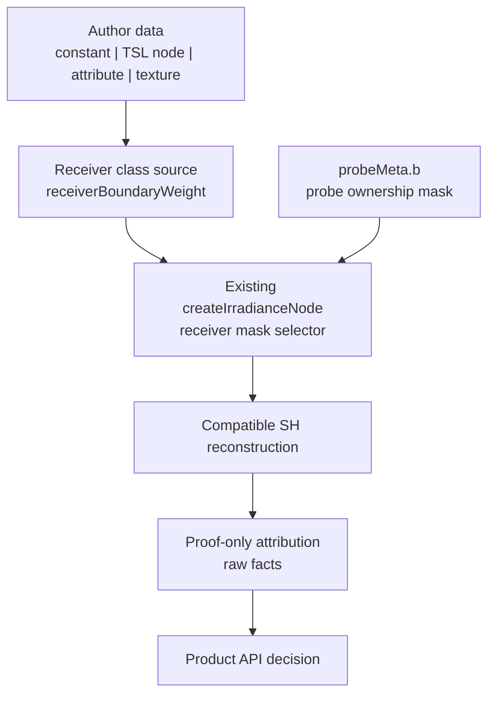

# LightProbeGridGPU Authored Boundary Source SDD

Verified: 2026-06-04.

## Status

Reframed.

The authored receiver-boundary source seam is proven as a GPU-resident input
path, but it is rejected as the residual fix. Support-set attribution now shows
the receiver-side candidates still reuse the same probe identities and collapse
under normalization. Setup-side classification is archived as left-only, and
classification-only probe-side support is rejected after mixed L0 results. The
current architecture step is a proof-only search for a non-oracle relocation /
placement rule that can approximate the positive L0 oracle without CPU readback.

## Current Truth

- Proof package: `OPEN`, 15 supported gates / 1 open gate.
- Open gate: `sealedWall.preToneMaskedWrongSideResidualLeakRatio = 0.9377`.
- Physical oracle: sealed-wall wrong-side transfer is `0`.
- Current candidate improves the leaky comparator, but does not close the zero
  oracle.
- Authored receiver sources now work technically, but render residual stayed
  unchanged in the tested variants.

The learning is narrow and useful:

```text
receiver source plumbing works
receiver-side compatibility changes either hit zero-base neighbors,
overprune, or scale a coefficient set that normalization cancels
```

## Architecture Decision

Keep the runtime reconstruction path compact. Do not introduce a new solver,
automatic classifier, broad mode system, or public multi-class ownership API.

Split the work into three seams:



Seam ownership:

| Seam | Owns | Does not own |
| --- | --- | --- |
| Receiver class source | GPU-resident authored class signal and default equivalence | leak claims, residual tuning, Cornell geometry |
| Probe ownership metadata | setup-time mask assignment into `probeMeta.b` | runtime buffers, public helper promotion before proof |
| Proof attribution | compact facts explaining support, weights, coefficients, residual | product API, verdict prose, row dumps |

## Runtime Contract

The existing selector remains the contract:

```text
effectiveReceiverLayerMask =
  receiverBoundaryWeight >= 0.5
    ? receiverBoundaryLayerMask
    : receiverLayerMask
```

Inputs:

- `receiverLayerMask`: default receiver ownership mask.
- `receiverBoundaryLayerMask`: mask selected for authored boundary samples.
- `receiverBoundaryWeight`: saturated class selector, not irradiance
  attenuation.

Default behavior:

- absent `receiverBoundaryWeight` means `0`;
- absent `receiverBoundaryLayerMask` means `receiverLayerMask`;
- no authored metadata means current sampling behavior remains equivalent.

Continuous values are classifier inputs only. They must not become a hidden
dimming knob.

## What To Borrow

Borrow the principle, not the machinery.

| Source area | Borrow | Do not implement now |
| --- | --- | --- |
| DDGI / RTXGI | moment visibility and explicit probe state | relocation/classification state machines |
| Unity APV | authored layer semantics | engine-scale adjustment-volume tooling |
| Mask decomposition | compatible-class interpolation | multi-volume decomposition |
| WENO / edge-aware filtering | choose compatible support before reconstruction | shock/image-filter machinery |
| Barrier interpolation | nearby-across-wall can be incompatible | barrier-distance systems |

## Evidence Summary

| Candidate family | Result | Architectural learning |
| --- | --- | --- |
| TSL uniform receiver source | smoke passed, residual unchanged | source seam works, not a fix |
| UV-band receiver source | smoke passed, residual unchanged | proof-band source should not be productized |
| geometry-attribute source | smoke passed, residual unchanged | authored per-surface data is usable |
| near-edge mass attribution | mass ratios stayed `1` | selected masks did not change contributing mass |
| per-neighbor attribution | changed slots had `base = 0` | receiver source hit non-contributing neighbors |
| normal-bias sweeps | neutral | sample offset tuning is not enough |
| exclusive side ownership | neutral | removing default overlap alone does not align support |
| hard/swapped masks | changed contributing slots, worsened leak or bounce | binary mask swaps are too coarse |
| blend compatibility | mass dropped, final irradiance unchanged | normalization cancels uniform scaling |
| coefficient-side contrast | cross-side changed irradiance differed `4.4402x` | represented signal exists, but current support selection cannot expose it |
| support-set attribution | `normalization-cancelled-coefficient-loss`, final ratio `1` | receiver-side candidates attenuate/reweight the same probe identities |
| strict multi-class ownership | overpruned to zero irradiance | stricter masks collapse support |
| overlapping/soft boundary ownership | neutral or cancelled | overlap alone does not survive normalization |
| coefficient-side weighting | accumulator ratios collapsed to `0`, final irradiance stayed `1` | post-support weighting is attenuation before normalization, not routing |
| relocation feasibility | boundary/default probe identity changes = `0` | receiver-side paths reweight the same probes; bake-time relocation or probe-side classification is required |
| receiver-side support routing | archived by aggregate identity proof | all tested candidates keep the same probe identities |
| setup-side identity classification | left candidate changes `4/8` support probe identities, reduces wrong-side L0 ratio from `0.8599` to `0.2763`, and survives render-only bounce guard; final-irradiance debug ratios remain `1`; setup-mask delta recovers boundary final irradiance to default, not beyond it | setup-side classification has a measured coefficient win on one side, but normalized final irradiance still does not show an improvement over the default descriptor |

## Product Decision

Do not promote `LightProbeGridGPUProbeOwnership.js` yet.

Keep `test/e2e/lightprobegridgpu/LightProbeGridGPUProbeOwnership.js`
proof-scoped until a product seam proves all of this:

- authored input is not Cornell-specific;
- default behavior is unchanged;
- compact facts show a meaningful represented support change;
- residual or a narrower accepted metric improves without darkening or bounce
  loss;
- the API can be explained without the proof harness.

The current Cornell import from `test/e2e` remains product-shape debt, not a
promotion precedent.

## Completed Slice: Support-Set Attribution

Architectural goal:

```text
prove where represented coefficient contrast is lost
without adding product API
```

Implemented proof-only attribution before any new runtime mode:

- per-neighbor coefficient contribution by effective receiver mask;
- compatibility, base weight, visibility weight, and normalized contribution
  for boundary fragments;
- whether changed neighbors are zero-base, overpruned, or normalization-cancelled;
- compact comparison between default support and candidate support;
- accumulator evidence showing whether candidate weighting moves represented
  coefficients or only attenuates support before normalization;
- probe identity comparison showing whether boundary support can change the
  normalized probe set without bake-time relocation;
- no residual-derived mask tuning.

Acceptance:

- facts stay aggregate and compact;
- no public option is added;
- no probe ownership helper is promoted;
- if boundary/default support uses the same probe identities, receiver-side
  ownership is archived as a residual fix candidate;
- if all tested receiver-side support candidates keep the same probe identity,
  the next lane is bake-time relocation or probe-side classification only;
- source invariants reject proof pixels, CPU readback, scalar/WebGL truth, and
  Cornell divider coordinates in runtime leak control;
- if attribution shows no support path can improve without overprune, archive
  this lane instead of adding modes.

Runtime result:

- active values `0.25` and `0.5` both classify as
  `normalization-cancelled-coefficient-loss`;
- `finalIrradianceBoundaryToDefaultRatio = 1`;
- coefficient accumulator ratios collapse to `0`;
- left/right changed probe identity slots remain `0`;
- relocation feasibility reports
  `candidate-needs-bake-time-probe-identity-change`.

## Current Slice: Setup-Side Identity Classification

Architectural goal:

```text
prove whether setup-classified support can change probe identity
without adding runtime modes
```

The setup-side attribution is now in place:

- setup-side probe side/class assignment independent of Cornell receiver pixels;
- default-equivalence facts when no classification is provided;
- default setup reports `validProbeCount = 52`, `invalidProbeCount = 12`,
  `relocatedProbeCount = 0`, and `probeIdentityChangeCount = 0`;
- boundary/default probe identity comparison after classification or relocation;
- left setup-classified support changes `4/8` probe identities
  (`identityChangeRatio = 0.5`);
- isolated packed-atlas L0 readback shows the left wrong-side ratio drops from
  `0.8599` to `0.2763` (`wrongToCorrectRatioDelta = -0.5836`);
- lightweight render-only guard reports `renderGuardVerdict =
  candidate-survives-render-guard`, `maskedWrongSideColorRatio = 0.7286`,
  `preToneMaskedWrongSideColorRatio = 0.8089`,
  `preToneMaskedCorrectBounceRatio = 1.2363`, and
  `correctBounceRatio = 1.3163`;
- separate final-irradiance/debug attribution reports scalar, visibility,
  irradiance, and final-irradiance boundary/default ratios of `1`, with
  `finalIrradianceDebugVerdict =
  candidate-neutralized-by-final-irradiance-debug-node`;
- descriptor compatibility attribution reports `8/8` classified support probes
  compatible with both default and boundary masks on both sides
  (`defaultAndBoundaryCompatibilityRatio = 1`), explaining the neutral
  boundary/default debug ratio;
- debug/render descriptor parity is proven for the setup-classified descriptor
  on both sides, and the descriptor verdict is
  `archive-setup-side-coefficient-lead-after-reconstruction-neutralization`;
- setup-mask final-irradiance delta reports `unclassifiedBoundary = 0`,
  `classifiedBoundary = unclassifiedDefault`, and
  `classifiedToUnclassifiedDefault.combinedRatio = 1`; classification recovers
  boundary final irradiance to default, but does not improve the normalized
  pre-material signal over default;
- right setup-classified support changes `0/8` probe identities and is rejected
  for no identity change;
- represented cross-side coefficient contrast remains available at `4.4402x`;
- receiver-side support remains archived.

The current coefficient comparison uses compact packed-atlas probe readback,
not a full coefficient-target readback. The render-only guard stays compact and
does not add final-irradiance debug-node ratios. Final-irradiance/debug ratios
are now captured as a separate compact slice with neighbor attribution disabled.

A combined render guard plus final-irradiance debug pass was too heavy for the
focused smoke path. The separate slice is cheap enough, but it shows the debug
path still compares to a neutralized boundary/default descriptor. The next proof
must attribute why the L0 wrong-side reduction does not survive normalized final
irradiance beyond the default descriptor.

## SDD Plan: Setup-Side Candidate Triage

This is not a solver plan. It is a representation triage plan: prove where the
setup-classified probe identity change is represented, where it is lost, and
whether that representation belongs in product code.

### Gate 1: Descriptor Parity

Question:

```text
is the final-irradiance debug node comparing the same setup-classified probe
metadata that the render guard samples?
```

Tasks:

- emit compact descriptor facts for default and setup-classified debug paths;
- report probe mask source, receiver mask, boundary mask, and selected support
  identity hashes;
- compare those descriptor facts against the render guard candidate facts;
- keep this proof read-only: no new runtime option, no new public helper.

Accept if:

- the debug path comparison is shown to collapse because default and boundary
  descriptors share classified support, explaining the neutral `1` ratios as a
  descriptor-comparison mismatch.

Reject if:

- both paths reference identical classified descriptors and final irradiance
  still neutralizes; then the coefficient win is not surviving reconstruction.

Result:

- accepted as descriptor-comparison mismatch: classified support keeps the
  default bit for default equivalence, so boundary/default descriptors share the
  same `8/8` classified support probes on both sides. The setup-classified
  debug descriptor and render guard descriptor have matching support hashes.

### Gate 2: Reconstruction Attribution

Question:

```text
does the L0 coefficient improvement survive normalized SH reconstruction at the
receiver sample before material/tone mapping?
```

Tasks:

- add one compact pre-material irradiance comparison for the left setup-side
  winner;
- keep neighbor dumps disabled unless Gate 1 proves descriptor parity;
- report wrong-side, correct-side, and bounce-preservation ratios;
- preserve the existing render-only guard as the independent visible check.

Accept if:

- pre-material irradiance moves in the same direction as the packed-atlas L0
  comparison without broad darkening.

Reject if:

- normalized reconstruction collapses the win back to `1`, or bounce loss is
  the source of the visible change.

Result:

- rejected for improvement over default: setup classification recovers boundary
  final irradiance from `0` to the default signal, but
  `classifiedToUnclassifiedDefault.combinedRatio = 1`. This archives the current
  setup-side coefficient lead after reconstruction neutralization unless Gate 3
  finds a generic setup-side rule that changes both sides' probe identity.

### Gate 3: Side Symmetry

Question:

```text
is the left-only success a real side rule, or an artifact of the current probe
layout?
```

Tasks:

- explain why right setup-classified support changes `0/8` probe identities;
- test only setup-side alternatives that can change right-side probe identity;
- prefer classification/placement facts over render sweeps;
- do not tune Cornell divider coordinates.

Accept if:

- both sides can produce a meaningful identity change through a generic setup
  rule.

Reject if:

- right-side identity remains fixed; move the next lane to probe-side
  classification or relocation.

Current evidence:

- left setup-classified descriptor changes support hash from
  `fnv1a32:ad207d19` to `fnv1a32:a5fd8df1`;
- right setup-classified descriptor keeps support hash
  `fnv1a32:8ea10831` for both default and setup-classified descriptors;
- right identity change remains `0/8`.

Implementation slice:

- add `sideSymmetryAttribution` as proof-only CPU support-rank facts;
- compare overlap and strict default-compatible boundary-sublayer setup rules;
- report left/right support identity hashes, layer-mask hashes, candidate-pool
  overlap, default-support boundary compatibility, occupied support counts, and
  distance summaries;
- classify the right-side blocker without row dumps or render sweeps.

Pending proof result:

- focused Cornell proof reports `gate3Verdict =
  archive-setup-side-classification-left-only`;
- overlap/default-compatible boundary sublayers change left identity (`4/8`) but
  right remains fixed because default support is already boundary-compatible
  (`defaultSupportBoundaryCompatibilityRatio = 1`);
- strict/default-compatible boundary sublayers change right identity (`4/8`) but
  leave left with `classifiedCandidateCount = 0`, so the apparent left identity
  delta is rejected as incomplete support;
- setup-side classification is archived as a product candidate for this slice;
  the next lane is probe-side classification or relocation.

### Gate 4: Product Seam Test

Question:

```text
can the accepted rule be explained as authored setup metadata without Cornell
fixture knowledge?
```

Tasks:

- describe the rule in terms of authored regions, layers, and receiver classes;
- keep output as existing `probeLayerMasks` unless a second concrete product
  adapter proves a new seam is needed;
- add default-equivalence facts for absent metadata;
- write non-claims before any demo or docs claim leak control.

Accept if:

- the rule has a small interface, default behavior is unchanged, and proof facts
  show non-collapsing represented support change.

Reject if:

- the rule requires proof pixels, Cornell-specific coordinates, CPU readback, or
  a broad mode system.

### Setup-Side Promotion Decision

Promote nothing from the setup-side lane. Gate 1 explains the neutral
descriptor comparison, Gate 2 rejects improvement over default after normalized
reconstruction, and Gate 3 archives setup-side classification as left-only. Gate
4 remains a product-seam test only for a future accepted rule.

## Lane Status

- Setup-time ownership reshaping remains proof-scoped.
- Probe-side classification is tested and rejected as classification-only after
  mixed L0 results.
- Probe-side relocation / placement is the active proof-only lane.
- Visibility constants are already named as policy facts for drift control.

None of these are part of the authored receiver-source seam until a rule passes
Gate 5 and then survives a product-seam review.

## Previous Lane: Probe-Side Classification

After Gate 3 archived setup-side classification, the first probe-side candidate
is proof-only default-overlap exclusion:

```text
exclude default-support probes from the boundary-class candidate set
```

Focused Cornell proof reports:

- `probeSideClassificationVerdict =
  candidate-has-bilateral-probe-identity-change`;
- left identity changes `8/8`, support hash
  `fnv1a32:ad207d19 -> fnv1a32:9a6b4e7d`;
- right identity changes `8/8`, support hash
  `fnv1a32:8ea10831 -> fnv1a32:fbbf6111`;
- left classified support is farther (`meanDistanceSq = 11.174`) but has
  `classifiedOccupiedSupportCount = 0`;
- right classified support is farther (`meanDistanceSq = 6.6154`) and still has
  `classifiedOccupiedSupportCount = 4`.
- packed-atlas L0 readback is mixed: left wrong/correct drops from `0.8599` to
  `0.6683` (`delta = -0.1916`), but right wrong/correct rises from `0.5818` to
  `0.7359` (`delta = 0.1541`);
- `probeSideCoefficientVerdict =
  candidate-has-mixed-probe-side-l0-result`.
- occupied-support exclusion removes right occupied support (`4 -> 0`) and
  changes the right support hash to `fnv1a32:f8c29295`, but the right
  wrong/correct ratio still does not improve enough (`0.5818 -> 0.5907`,
  `delta = 0.0089`);
- probe-side lane verdict is
  `candidate-needs-relocation-after-probe-side-classification`.
- a proof-only L0 relocation oracle over non-occupied boundary probes finds a
  bilateral coefficient win:
  - left wrong/correct `0.8599 -> 0.664`, `delta = -0.1959`;
  - right wrong/correct `0.5818 -> 0.2158`, `delta = -0.366`;
  - both classified supports have `classifiedOccupiedSupportCount = 0`;
  - selected supports are far from the receiver samples
    (`left classifiedMeanDistanceSq = 13.189`, `right = 13.6172`);
  - `relocationOracleVerdict =
    oracle-finds-bilateral-l0-relocation-candidate`.

This proves the next lane can change probe identity bilaterally without receiver
mask reweighting. It does not prove product viability. The coefficient gate
rejects classification-only candidates because the right side does not produce a
wrong-side L0 win even after occupied-support exclusion. The next candidate must
model a non-oracle relocation/placement rule before any render gate. The oracle
proves the atlas contains useful support; it must not become runtime logic.

## Current Lane: Non-Oracle Probe Placement Proxy

The first non-oracle proxy uses only support geometry/state:

```text
rank non-occupied boundary probes by farthest distance from the receiver edge
```

Focused Cornell proof reports:

- `relocationProxyVerdict =
  proxy-fails-bilateral-l0-relocation-candidate`;
- left support changes `8/8`, keeps occupied support at `0`, and improves
  wrong/correct L0 from `0.8599` to `0.751` (`delta = -0.1089`);
- right support changes `8/8`, keeps occupied support at `0`, but worsens
  wrong/correct L0 from `0.5818` to `0.6881` (`delta = 0.1063`);
- proxy supports are farther than the oracle supports
  (`left classifiedMeanDistanceSq = 19.0068`, `right = 21.4541`).

This rejects distance alone as the non-oracle placement rule. The next proxy
uses only support geometry/state near the wall transition:

```text
rank non-occupied boundary probes by closest distance to the divider, then by
nearest distance to the receiver edge
```

Focused Cornell proof reports:

- `relocationProxyVerdict =
  proxy-fails-bilateral-l0-relocation-candidate`;
- left support changes `8/8`, keeps occupied support at `0`, and improves
  wrong/correct L0 from `0.8599` to `0.6683` (`delta = -0.1916`);
- right support changes `8/8`, keeps occupied support at `0`, but worsens
  wrong/correct L0 from `0.5818` to `0.7493` (`delta = 0.1675`);
- divider-ranked supports are closer than the oracle supports
  (`left classifiedMeanDistanceSq = 11.174`, `right = 12.4049`).

This rejects both distance magnitude and divider proximity as sufficient
non-oracle placement rules. A third proxy uses moment visibility toward the
receiver:

```text
rank non-occupied boundary probes by highest moment visibility to the receiver
edge, then by nearest distance to the receiver edge
```

Focused Cornell proof reports:

- `relocationProxyVerdict =
  proxy-fails-bilateral-l0-relocation-candidate`;
- left support changes `8/8`, keeps occupied support at `0`, reports
  `classifiedMeanVisibilityEstimate = 1`, and improves wrong/correct L0 from
  `0.8599` to `0.6682` (`delta = -0.1917`);
- right support changes `8/8`, keeps occupied support at `0`, also reports
  `classifiedMeanVisibilityEstimate = 1`, but worsens wrong/correct L0 from
  `0.5818` to `0.8182` (`delta = 0.2364`).

This rejects direct receiver visibility as the missing selector. The moment
field says the candidate probes can see the receiver; it does not identify
whether their captured radiance belongs to the correct side. The next proxy must
explain why the L0 oracle picks useful non-occupied boundary probes without
ranking by packed-atlas L0.

A fourth proxy uses compact topology metadata:

```text
rank non-occupied boundary probes by the interior side shell on the side axis,
then by nearest distance to the receiver edge
```

Focused Cornell proof reports:

- `relocationProxyVerdict =
  proxy-finds-bilateral-l0-relocation-candidate`;
- left support changes `8/8`, keeps occupied support at `0`, selects the
  `x = 0` shell, and improves wrong/correct L0 from `0.8599` to `0.6683`
  (`delta = -0.1916`);
- right support changes `8/8`, keeps occupied support at `0`, selects the
  `x = 2` shell, and improves wrong/correct L0 from `0.5818` to `0.3045`
  (`delta = -0.2773`);
- the proxy uses setup/grid topology only; L0 remains proof attribution.

This is the first non-oracle placement proxy that passes the bilateral L0 gate.
It does not prove product readiness. The next gate must test whether this
side-shell support survives reconstruction/final-irradiance debug before any
render claim.

Focused Cornell reconstruction proof reports:

- `sideShellIrradianceDeltaVerdict =
  side-shell-support-not-reached-by-final-irradiance-debug-node`;
- unclassified default final-irradiance debug means are
  `leftMean = 0.0008`, `rightMean = 0.0205`, `combinedMean = 0.0107`;
- side-shell boundary debug means are all `0`;
- `sideShellToUnclassifiedDefault.combinedRatio = 0`.

This archives side-shell as a support-selection-only win. The chosen probes have
better L0, but the current final-irradiance path cannot reach them through the
receiver's trilinear cell. The next gate is true relocation / placement: either
move/author useful side-shell probes into the local reconstruction cell, or add
a product seam that can explain nonlocal support without becoming receiver-side
magic.

Focused Cornell local-cell reachability proof reports:

- `localCellReachabilityVerdict =
  side-shell-support-needs-true-local-cell-relocation`;
- left receiver local cell base coord is `(0, 0, 2)` and overlaps side-shell
  support `0/8`;
- right receiver local cell base coord is `(1, 0, 2)` and overlaps side-shell
  support `0/8`;
- local cell summaries sit near `meanY = 0.5`, `meanZ = 2.5`, while side-shell
  support sits near `meanY = 2`, `meanZ = 1.75`.

This proves the bottleneck is not the selector alone. The support that carries
better side-owned L0 is outside the receiver's current reconstruction cell. A
product candidate must now model local-cell placement/relocation, not another
global support ranking.

Focused Cornell local-cell candidate proof reports:

- `localCellCandidateVerdict =
  local-cell-support-needs-physical-placement-relocation`;
- left local cell base coord `(0, 0, 2)` keeps `4` occupied probes, has
  `coefficientComparisonVerdict = blocked-no-probe-identity-change`, and keeps
  wrong/correct L0 at `0.8599`;
- right local cell base coord `(1, 0, 2)` keeps `4` occupied probes, has
  `coefficientComparisonVerdict = blocked-no-probe-identity-change`, and keeps
  wrong/correct L0 at `0.5818`.

This rejects local-cell remasking as relocation. The current reachable cell is
the same default support family and still contains occupied probes. The next
candidate must physically author or relocate non-occupied side-owned probes into
the reachable cell, or explicitly introduce a nonlocal support seam.

Focused Cornell physical placement requirement proof reports:

- `physicalPlacementRequirementVerdict =
  physical-local-cell-placement-required-and-l0-supported`;
- left target local cell overlaps side-shell source `0/8`, requires replacing
  `8/8` slots including `4` occupied slots, and would move wrong/correct L0
  from `0.8599` to the side-owned source ratio `0.6683`;
- right target local cell overlaps side-shell source `0/8`, requires replacing
  `8/8` slots including `4` occupied slots, and would move wrong/correct L0
  from `0.5818` to the side-owned source ratio `0.3045`;
- source support has `0` occupied probes on both sides.

This is the current product shape: the useful support must be physically
authored or relocated into the receiver's reachable reconstruction cell. A
future implementation should not describe this as mask routing. The interface
must expose placement/relocation semantics, occupancy rejection, and side-owned
support selection as setup-time responsibilities.

## Product API Shape: Local-Cell Placement

The current runtime API already accepts the two setup products that matter:

```text
probeValidity    -> per-probe validity / occupancy rejection
probeLayerMasks  -> per-probe ownership / receiver compatibility
```

The next product seam should therefore be a setup helper that produces those
arrays from authored placement rules. It should not add another receiver-source
mode and should not let the shader pull arbitrary nonlocal probes.

Promotion decision:

- use `test/e2e/lightprobegrid-gpu-placement-promotion-decision.md` as the
  authoritative promotion record;
- use `test/e2e/lightprobegrid-gpu-product-authoring-module-contract.md` as the
  product-shaped module contract;
- keep the current helper proof-scoped;
- promote only a setup-owned authoring module, not a new receiver runtime mode;
- require a second sealed-wall-like fixture before moving the seam out of
  `test/e2e`;
- implement that fixture from
  `test/e2e/lightprobegrid-gpu-second-sealed-fixture-design.md`;
- `sealed-offset-wall` now exists as an activatable family and emits
  fixture-family activation facts, leak rows, and residual attribution;
  it also emits placement-helper facts for the same setup-owned local-cell
  policy shape;
- keep Sponza as visual/runtime coverage, not sealed-wall leak proof.

Proposed module shape:

```text
createLightProbeGridGPUPlacementAuthoring( {
  min,
  max,
  resolution,
  defaultLayerMask,
  receiverRegions,
  layerRules,
  occupancyPolicy,
  placementPolicy,
  sourceSelectionPolicy
} ) -> {
  probeValidity,
  probeLayerMasks,
  placementFacts
}
```

Required interface semantics:

- `receiverRegions` identify reconstruction cells that need protected support;
- `layerRules` map authored sides/classes to 24-bit masks;
- `occupancyPolicy` rejects occupied local-cell slots before layer assignment;
- `sourceSelectionPolicy` chooses side-owned source support without CPU L0,
  proof pixels, residual ratios, or scalar/WebGL truth;
- `placementPolicy` places or reserves non-occupied side-owned probes inside the
  reachable local cell;
- `placementPolicyFacts` name the acceptance thresholds instead of hiding them
  as proof magic numbers;
- `placementFacts` expose compact hashes, replacement counts, occupied-slot
  counts, and local-cell overlap for proof and review.

Required invariants:

- generated arrays must be length `resolution^3`;
- masks remain integer bitfields compatible with `probeLayerMasks`;
- invalid/relocated probes are represented through `probeValidity`;
- no Cornell divider coordinates, proof pixels, scalar/WebGL truth, or CPU L0
  readback may drive runtime placement;
- final promotion requires reconstruction/debug and render/leak gates after the
  placement helper, not only L0 support attribution.

Rejected shortcuts:

- setting receiver boundary masks at runtime while leaving local cells
  unchanged;
- remasking occupied local-cell probes as if that were relocation;
- ranking nonlocal support and hoping the trilinear cell reaches it;
- adding shader-side nonlocal support without a product-explainable seam.

The proof harness now includes a proof-scoped implementation of that seam in
`test/e2e/lightprobegridgpu/LightProbeGridGPULocalCellPlacement.js`.

Focused Cornell helper proof reports:

- `placementHelperVerdict = helper-emits-local-cell-placement-arrays`;
- `placementPolicyFacts.policyId = local-cell-placement-policy`;
- policy thresholds are target support `8`, source support `8`, minimum
  replacement slots `1`, minimum occupied replacement slots `1`, and maximum
  source occupied support `0`;
- `acceptedSideCount = 2`;
- `probeValidityLength = 64` and `probeLayerMasksLength = 64`;
- total replacement slots `16`, including `8` occupied replacement slots;
- each side replaces `8/8` target local-cell slots, has `0` source/target
  overlap, uses source support with `0` occupied probes, and reports
  `side-passes-local-cell-placement-policy`.

Focused Cornell final-irradiance helper proof reports:

- `placementIrradianceDeltaVerdict =
  placement-helper-arrays-improve-final-irradiance-over-default`;
- unclassified default final-irradiance debug means are
  `leftMean = 0.0008`, `rightMean = 0.0205`, `combinedMean = 0.0107`;
- local-cell placement debug means are
  `leftMean = 0.0008`, `rightMean = 0.0277`, `combinedMean = 0.0142`;
- `placementToUnclassifiedDefault.combinedRatio = 1.3271`, with left ratio
  `1` and right ratio `1.3512`.

This helper is still proof-scoped, and it does not move baked coefficients or
probe positions. It only proves that the emitted setup arrays survive the
final-irradiance debug path.

Focused Cornell render/leak helper proof reports:

- `placementRenderLeakVerdict =
  placement-helper-arrays-improve-bilateral-render-leak-over-default`;
- unclassified boundary render has `maskedWrongSideColorRatio = 0.7288`,
  left wrong-side ratio `0.5918`, right wrong-side ratio `0.7288`,
  `preToneMaskedWrongSideColorRatio = 0.8446`, and
  `correctBounceRatio = 1.2654`;
- local-cell placement render has `maskedWrongSideColorRatio = 0.7246`,
  left wrong-side ratio `0.5465`, right wrong-side ratio `0.7246`,
  `preToneMaskedWrongSideColorRatio = 0.8204`, and
  `correctBounceRatio = 1.2754`;
- placement/default ratios are `0.9942` combined wrong-side, `0.9235` left,
  `0.9942` right, `0.9713` pre-tone wrong-side, and `1.0079` correct bounce.

This is the first product-visible proof-positive result in the placement lane.
It is still narrow: the right-side render improvement is small, the helper is
proof-scoped, and it does not yet define how production authoring moves or
reserves baked probe coefficients. The next hardening step is to turn this into
a policy-backed placement module with stable thresholds and non-Cornell
coverage. The policy thresholds are now explicit proof facts, so the remaining
work is coverage and promotion design, not threshold discovery.

The first non-Cornell coverage targets are `webgpu_lightprobes_sponza` and
`webgpu_lightprobes_sponza_ours`. They should be treated as visual/runtime
controls, not sealed-wall leak proof, because the current eval harness exposes
sealed-wall proof ratios only for Cornell.

Second sealed-fixture coverage now exists inside the Cornell harness as
`sealed-offset-wall`. It uses divider axis `z`, divider offset `0.52`, distinct
logical receiver positions, its own fixture family activation facts, and an
offset proof camera that can see both sides of the divider. Focused Cornell
proof reports:

- validity-weighted offset row: `maskedWrongSideColorRatio = 0.8784`,
  `correctBounceRatio = 1.4238`,
  `preToneMaskedWrongSideColorRatio = 0.8452`, and
  `preToneMaskedCorrectBounceRatio = 1.1832`;
- visibility-moments offset row: `maskedWrongSideColorRatio = 0.8737`,
  `correctBounceRatio = 1.4056`,
  `preToneMaskedWrongSideColorRatio = 0.8325`, and
  `preToneMaskedCorrectBounceRatio = 1.2012`;
- residual attribution: `maskedVisibleResidualRatio = 0.9946`,
  `preToneMaskedResidualRatio = 0.985`, `correctBounceRatio = 0.9872`, and
  `preToneCorrectBounceRatio = 1.0152`;
- bilateral receiver-mask facts: left/right masked pixels `248/28`, and
  pre-tone left/right masked pixels `196/433`;
- verdict:
  `sealed-offset-wall-visibility-lowers-masked-wrong-side-ratio`.

This advances the non-Cornell-shaped fixture gate, but it does not promote the
placement helper. The offset rows now have finite bilateral pre-tone
correct-bounce evidence, but the visible leak improvement is narrow and
right-side masked coverage is smaller than left-side coverage. The next
offset placement helper attribution reports:

- `acceptedSideCount = 2`;
- `probeValidityLength = 64` and `probeLayerMasksLength = 64`;
- total replacement slots `16`, including `8` occupied replacement slots;
- both sides replace `8/8` local-cell slots, with `0` source overlap and `0`
  source occupied support;
- both sides report `side-passes-local-cell-placement-policy`.

This proves the setup-owned helper policy shape survives the second fixture. It
also now has offset placement render/leak attribution:

- unclassified offset boundary render has `maskedWrongSideColorRatio = 0.8278`,
  left `0.8278`, right `0.2141`,
  `preToneMaskedWrongSideColorRatio = 0.7464`, and
  `correctBounceRatio = 1.3058`;
- placement offset boundary render has `maskedWrongSideColorRatio = 0.6576`,
  left `0.6576`, right `0.2195`,
  `preToneMaskedWrongSideColorRatio = 0.6118`, and
  `correctBounceRatio = 1.5587`;
- placement/default ratios are `0.7944` combined wrong-side, `0.7944` left,
  `1.0252` right, `0.8197` pre-tone wrong-side, and `1.1937` correct bounce;
- verdict:
  `placement-helper-arrays-improve-combined-render-leak-over-default`.
- right-side regression attribution verdict:
  `right-side-small-baseline-regression-with-combined-placement-win`;
- `lowBaselineSideRegressionPolicy.policyId =
  low-baseline-side-regression-policy`;
- `lowBaselineSideRegressionPolicy.maxBaselineWrongSideColorRatio = 0.25`;
- right masked visible pixels stay stable at `28 -> 28`;
- right pre-tone masked visible pixels stay stable at `433 -> 433`;
- right masked wrong-side starts low at `0.2141` and moves to `0.2195`.

This proves the placement arrays are render-visible on the second fixture and
improve combined leakage without darkening away correct bounce. It still does
not prove bilateral render generalization: the right offset masked wrong-side
ratio worsens by `1.0252x`. The regression is now classified as a stable
footprint, low-baseline side effect rather than a mask-region failure. The
named `low-baseline-side-regression-policy` is machine-checked. The next
hardening task is to prove the setup-owned authoring adapter stays fact-identical
to the helper across sealed-wall-like fixtures while keeping the helper in
`test/e2e`.

The setup authoring module now exists as
`examples/jsm/lighting/lightprobegridgpu/LightProbeGridGPUPlacementAuthoring.js`.
It accepts product-shaped receiver regions, layer rules, occupancy policy,
placement policy, and source-selection policy without delegating to the
proof-scoped local-cell placement helper. Focused Cornell now emits:

- `placementAuthoringVerdict =
  placement-authoring-product-module-emits-arrays`;
- `acceptedSideCount = 2`;
- total replacement slots `16`, including `8` occupied replacement slots;
- `receiverRegionCount = 2` and `layerRuleCount = 2`;
- `occupancyPolicyId = solid-occupancy-validity`;
- `sourceSelectionPolicyFacts.policyId =
  side-shell-local-cell-source-policy`;
- product source-selection facts do not expose proof-only forbidden-input
  fields;
- sealed-wall and sealed-offset-wall both emit
  `placement-authoring-matches-helper-facts`;
- sealed-offset-wall parity reports `placementPolicyFactsMatch = true`,
  `summaryCountsMatch = true`, and `sideFactsMatch = true`;
- sealed-offset-wall left target/source hashes are `fnv1a32:f7b1180d` /
  `fnv1a32:1eb3d3a1`; right target/source hashes are `fnv1a32:e50b2bcd` /
  `fnv1a32:519a6495`.
- `lightprobegrid-gpu-placement-authoring-invariants.js` proves one positive
  product contract case and rejects thirteen invalid source/schema cases:
  CPU/readback source policy drift, proof-pixel ranking drift, unsupported
  policy fields and policy ids, invalid base validity values, invalid base
  layer masks, unmatched layer rules, out-of-grid support probes, missing
  occupancy state, and malformed layer rule sides.
- `test/e2e/lightprobegrid-gpu-placement-authoring-migration-guard.md` defines
  the product module path and forbids importing or copying the
  proof-scoped helper into `examples/jsm`.
- The placement authoring invariant runner scans current/future `examples/jsm`
  LightProbeGridGPU authoring sources for proof helper imports, proof-boundary
  strings, and proof-only source tokens.
- `examples/jsm/lighting/lightprobegridgpu/LightProbeGridGPUPlacementAuthoring.js`
  now provides an initial product module without importing the proof helper and
  without exposing proof-boundary fields or proof-only source tokens.
- The placement authoring invariant runner validates the product module without
  a legacy e2e wrapper.
- Focused Cornell now compares product module facts against proof helper facts
  for the minimal contract input.
- Product-facing integration checks verify base arrays are copied, target slots
  use `defaultLayerMask | boundaryLayerMask`, source-only slots are invalidated,
  and untouched slots preserve caller-provided base data.
- Focused Cornell product authoring reports `productHasProofOnlyFacts = false`,
  `placement-authoring-product-module-emits-arrays`, and helper-fact parity via
  `placement-authoring-matches-helper-facts`.
- `webgpu_lightprobes_sponza_ours` now exposes bounded product-facing usage
  with `sponza-product-placement-authoring-usage-ready`, `totalProbes = 343`,
  replacement slots `16`, occupied replacement slots `8`,
  `productHasProofOnlyFacts = false`, and `leakMetricStatus = not-applicable`.

The product module is wired directly; the proof helper remains test-scoped and
there is no legacy e2e wrapper in the product path.
The closure audit is recorded in
`test/e2e/lightprobegrid-gpu-phases-1-5-closure-audit.md`. Future hardening
must keep Sponza explicitly outside sealed-wall leak proof.

Focused Sponza coverage reports:

- `webgpu_lightprobes_sponza` passes visual/runtime smoke with `probeCount =
  147`, runtime/rebake status `ready`, and screenshot diff `0.0%`;
- `webgpu_lightprobes_sponza_ours` passes visual/runtime smoke with
  `probeCount = 343`, runtime/rebake status `ready`, and screenshot diff `0.0%`;
- the Sponza control rebake path now refreshes material `lightsNode` after atlas
  resources are recreated, removing the WebGPU destroyed-texture validation
  error;
- the Sponza ours harness now reports vector resolution consistently with the
  canonical `LightProbeGridGPU.resolution` shape;
- the Sponza ours harness now reports bounded product placement authoring usage
  with `leakMetricStatus = not-applicable`;
- both Sponza rows remain `leakMetricStatus = not-applicable` because they are
  not sealed-wall Cornell fixtures.

### Gate 5: Non-Oracle Probe Placement Proxy

Question:

```text
can setup-time placement metadata pick oracle-like non-occupied boundary probes
without reading lighting?
```

Tasks:

- compare the oracle-selected support against proxy-selected support with
  compact identity hashes, distance bands, occupancy counts, and L0 facts;
- add one new non-oracle ranking policy at a time;
- require complete support and `classifiedOccupiedSupportCount = 0` on both
  sides;
- keep L0 readback as proof attribution only, never as candidate selection;
- reject proxies that improve only one side or win by broad darkening.

Accept if:

- both sides change probe identity, keep complete non-occupied support, and
  reduce wrong/correct L0 versus default.

Reject if:

- either side worsens, support is incomplete, occupied support reappears, or the
  rule requires proof pixels, Cornell coordinates, CPU readback, or scalar/WebGL
  truth.

## Policy Guards

The proof harness now exposes `proofPolicyFacts` for semantic epsilon values:

- ratio denominator floor;
- geometry thin-axis/range floors;
- compute projection candidate/parity tolerances;
- layer-compatibility and debug-ratio delta epsilons.

The smoke harness also runs source invariants over runtime leak-control sources
and placement authoring invariants over the setup-owned product module. Runtime
source invariants forbid Cornell divider coordinates, proof pixel regions,
scalar/WebGL truth claims, and CPU readback in runtime leak control. Placement
authoring invariants reject proof-only source policy drift and malformed
receiver/layer/support schema before the product module can emit arrays.
They also guard future `examples/jsm` migration by rejecting proof helper imports
and proof-only authoring tokens in product LightProbeGridGPU sources. The same
runner now checks the initial product placement authoring module directly,
including helper-fact parity and base-array integration behavior.

Public-facing non-claims are written in
`test/e2e/lightprobegrid-gpu-public-non-claims.md` and must precede any product,
demo, or release-note claim.

## Rejection Gates

Reject a candidate if:

- residual improvement comes from broad darkening;
- correct bounce drops below current preservation gates;
- default scenes change without authored metadata;
- runtime uses CPU readback, proof-only pixels, Cornell divider coordinates, or
  scalar/WebGL truth;
- proof payloads grow with row dumps or verdict prose;
- supported gates regress: no-wrong-side escape, directional suppression,
  receiver-surface agreement, SH-risk, runtime readiness, projection parity,
  moment readback, or correct bounce.

## Verification

Docs only:

```text
git diff --check
```

Runtime or harness changes:

```text
node --check <touched js files>
node test/e2e/lightprobegrid-gpu-source-invariants.js
node test/e2e/puppeteer.js --webgpu webgpu_lightprobes_cornell --port 1235 --user-data-dir ./.puppeteer_profile_codex_1235
git diff --check
```

Run the focused Cornell WebGPU proof only after runtime or harness behavior
changes. If the shared default server/profile is already active, use an
isolated port and profile instead of stopping another developer process.
