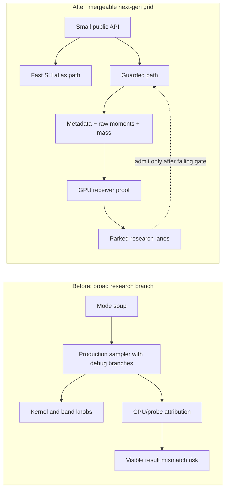
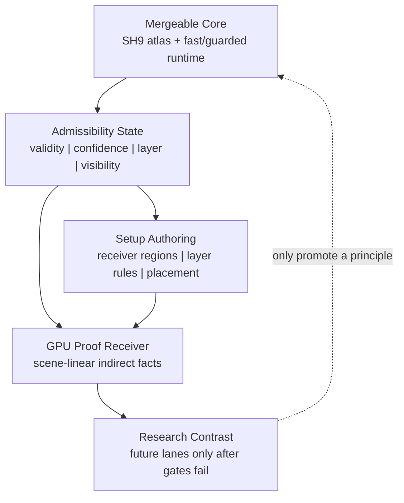

# LightProbeGridGPU Contrast Research Ultraplan

Verified: 2026-06-05.

## Purpose

This note turns the contrast research into an SDD execution plan.

The goal is not to prove that every adjacent paper belongs in Three.js. The
goal is sharper:

```text
extract the smallest useful principle from each research family,
map it to a LightProbeGridGPU seam,
then reject every larger system that would make this unmergeable.
```

The next-gen plan says what `LightProbeGridGPU` should become. This ultraplan
says how the broader contrast research should influence that work without
turning the branch into a research platform.

Primary local inputs:

- `test/e2e/lightprobegrid-gpu-residual-research.md`
- `test/e2e/lightprobegrid-gpu-math-whiteboard.md`
- `test/e2e/lightprobegrid-gpu-product-roadmap.md`
- `test/e2e/lightprobegrid-gpu-nextgen-sdd-plan.md`
- `test/e2e/lightprobegrid-gpu-phases-1-5-closure-audit.md`

## Core Thesis

The repeated lesson across GI, interpolation, filtering, and graph methods is:

```text
smooth reconstruction is not wrong;
unclassified support across a discontinuity is wrong.
```

For `LightProbeGridGPU`, that means:

```text
keep SH9 + trilinear as the cheap core,
but make support admissibility explicit before normalization.
```

Do not replace the core with a new GI system. Correct the support contract.

## Peer Review Verdict

The proposal is directionally strong, but it still needs one hard constraint:

```text
research contrast may explain a change,
but it cannot become a runtime feature unless it deletes ambiguity.
```

P0 findings:

- Coefficient contrast is evidence, not a production weight, until GPU receiver
  proof shows a final scene-linear improvement without correct-bounce loss.
- No research lane enters the runtime before the fast/guarded/debug paths are
  separated and the production guarded path is small.
- A row, screenshot, or report must not claim `visibility-moments` unless the
  derived visibility truth proves allocation, moment mode, bytes, and guarded
  runtime use.

P1 findings:

- SDD discipline must force every borrowed idea through a
  `borrow / do-not-import / seam / gate` record.
- The current plan must explicitly delete bloat:
  `compatibleKernel`, public band surgery, public intermediate visibility
  blends, debug neighbor arrays in production sampling, and mode soup.
- Proof strictness must be stronger than runtime softness. In proof, invalid
  probes need to contribute exactly zero.

P2 findings:

- The architecture needs a stable metaprompt so another pass does not widen the
  scope by accident.
- Task order matters. This is not a parallel research sprint; runtime
  simplification has to land before proof claims become meaningful.

## Whole-Plan Goal

Goal:

```text
convert LightProbeGridGPU from an ambitious research-shaped branch into a
mergeable next-gen Three.js light-probe grid by shrinking the public API,
making support admissibility explicit, and proving guarded sampling with
same-estimator GPU receiver facts.
```

Success means:

```text
fast mode remains classic SH atlas sampling;
guarded mode adds only metadata, raw moments, layer/validity rejection,
normal support, and visibility mass;
research stays outside production unless a failing proof gate admits it.
```

Non-goal:

```text
do not build DDGI, APV, Brixelizer GI, Neural Light Grid, screen probes,
sparse residual GI, specular GI, or a general research playground.
```

## Core Semantic / Domain / Math Research

The plan should be driven by semantics first, domain constraints second, and
math third. That order matters. If the meaning of a value is vague, the math
will turn into tweakable shader folklore.

### Research Anchors

Primary anchors checked on 2026-06-05:

| Anchor | Local Meaning |
| --- | --- |
| Three.js `LightProbe` docs: https://threejs.org/docs/pages/LightProbe.html | Baseline is diffuse SH lighting, functionally environment-map-like rather than a spatial volume. |
| Three.js `LightProbeGenerator`: https://raw.githubusercontent.com/mrdoob/three.js/dev/examples/jsm/lights/LightProbeGenerator.js | Current generator projects cubemap radiance into 9 SH coefficients and reads render target pixels. |
| Ramamoorthi/Hanrahan irradiance environment maps: https://graphics.stanford.edu/papers/envmap/envmap.pdf | SH9 is a principled low-frequency diffuse irradiance representation, not an arbitrary compression trick. |
| RTXGI DDGI algorithms: https://raw.githubusercontent.com/NVIDIAGameWorks/RTXGI-DDGI/main/docs/Algorithms.md | Classic probe leaking is a visibility/occlusion failure; distance data plus statistical occlusion is the core fix. |
| NVIDIA Light Field Probes: https://research.nvidia.com/publication/2017-02_real-time-global-illumination-using-precomputed-light-field-probes | Visibility belongs inside the probe representation when sampling across space. |
| Unity APV leak guidance: https://docs.unity.cn/6000.2/Documentation/Manual/urp/probevolumes-troubleshoot-light-leaks.html | Layers, invalidation, normal/view bias, and probe adjustment are real production semantics, but too large to clone. |
| Activision Neural Light Grid: https://research.activision.com/publications/2024/08/Neural_Light_Grid | Probe contribution domains are a serious future primitive; learned support fields are not v1 Three.js material. |
| AMD Brixelizer GI docs: https://gpuopen.com/manuals/fidelityfx_sdk/techniques/brixelizer-gi/ | Compute-side SH projection/reduction is the right GPU shape, but full dynamic GI is out of scope. |

### Semantic Core

The object is not "a light" in the punctual-light sense.

```text
Probe:
  a sample of low-frequency incoming diffuse radiance/irradiance context
  at a spatial position.

SH coefficients C_i:
  value payload.
  They say what lighting the probe represents.

Metadata:
  admissibility payload.
  It says whether this probe is allowed to participate for a receiver.

Visibility moments:
  receiver-relative support payload.
  They estimate whether the receiver can see the probe support along the
  queried direction/distance.

Visibility mass:
  energy honesty payload.
  It says how much support was lost after visibility rejection.
```

The core semantic correction is:

```text
do not encode room ownership, invalidation, or visibility by mutating SH color.
Encode them as support rules before SH normalization.
```

That is the important distinction. `C_i` is the signal. Validity, layer,
normal support, and moments are the admissible domain of that signal.

### Domain Core

The domain is not "maximum GI quality." The domain is:

```text
browser-friendly WebGPU baked diffuse GI for Three.js examples/addons,
with a small public API and material-consumable runtime data.
```

This imposes hard constraints:

- Low-frequency diffuse only.
- Static or baked probe data first.
- GPU-first bake path, but no runtime ray tracing requirement.
- Small public API.
- Predictable memory.
- No engine-scale editor tooling.
- No user-facing research knobs.
- Proof lives in `test/e2e` or debug modules, not product runtime.

This means the plan should reject high-end system imports even when their
principles are correct. DDGI, APV, Neural Light Grid, and Brixelizer all contain
useful truths, but their full domain is larger than Three.js should absorb in
one mergeable feature.

### Math Core

Diffuse irradiance starts from the rendering-domain quantity:

```text
E(p, n) = integral_over_hemisphere( L(p, wi) * max(dot(n, wi), 0) dwi )
```

SH9 is valid here because diffuse irradiance is low frequency. The SH
coefficients are not the whole solution, though. They only approximate the
directional irradiance function once a compatible spatial support has been
chosen.

For a receiver `x` and normal `n`, define:

```text
C_i = SH9 coefficient payload at probe i

T_i = trilinear cell weight
M_i = probe validity/confidence term
L_i = layer/topology compatibility
N_i = normal/support preference
V_i = raw moment visibility
```

Then separate base support from visible support:

```text
base_i = T_i * M_i * L_i * N_i
visible_i = base_i * V_i
```

Reconstruct only from admissible visible support:

```text
C_hat = sum_i( visible_i * C_i ) / max( sum_i( visible_i ), epsilon )
```

Preserve lost support as mass:

```text
Mass = clamp(
  sum_i( visible_i ) / max( sum_i( base_i ), epsilon ),
  0,
  1
)
```

Evaluate:

```text
indirect(x, n) = max( EvalSH9( C_hat, n ), 0 ) * Mass
```

The pre-change math shape was:

```text
blend SH values first,
try to reduce leaks later,
then normalize whatever survived back toward full energy.
```

The revised math shape is:

```text
classify support first,
normalize only compatible visible support,
then multiply by visibility mass so rejected support stays rejected.
```

This is why the feature is "next-gen" in the specific Three.js sense. It does
not add a bigger light transport solver. It gives classic probes an explicit
semantic domain of validity.

### Revised Plan Implication

The next implementation slice must not start with a new visual trick. It starts
with semantic separation:

```text
value payload:
  SH9 atlas

support payload:
  trilinear, validity, layer, normal

visibility payload:
  raw distance moments

energy payload:
  visibility mass

proof payload:
  GPU receiver facts
```

Any candidate change that cannot name which payload it owns is not ready for
code.

## SDD Skill Contrast

The SDD skills are useful as discipline, not as product truth. Their job is to
make the plan executable, gated, and falsifiable. The LightProbeGridGPU docs and
source remain the project truth.

| Input | Borrow | Do Not Import | Use In This Plan |
| --- | --- | --- | --- |
| General SDD discipline | goal, constraints, before/after, tasks, acceptance | vague "inspired by" implementation | every phase has an exit gate |
| `maquette-ultraplan` style | strict sequencing and promotion gates | Maquette corpus, pilot, retrieval, or app-specific concepts | research lanes stay parked until admitted |
| `maquette-sdd-roadmap` style | roadmap blocks tied to proof and risk | Maquette roadmap semantics | runtime/proof/API phases stay separated |
| Code-refactoring discipline | small behavior-preserving slices | broad cleanup while adding features | split paths first, then add proof |
| Existing LightProbeGridGPU SDD docs | current risks, invariants, proof lessons | stale labels or unverified claims | local source of architectural truth |
| Contrast research notes | outside pressure on support, visibility, and topology | full external systems | candidate ideas must answer the admission gate |

The review standard is simple:

```text
if a skill pattern does not make this Three.js change smaller, clearer,
or easier to reject, it does not belong in the implementation plan.
```

## Before / After

| Area | Before | After |
| --- | --- | --- |
| Public surface | many public-ish leak, band, kernel, and weighting switches | `quality: 'fast' | 'guarded'`, `visibility`, bias, resolution |
| Runtime shape | fast, guarded, debug, proof, and research paths interleaved | separate fast, guarded, and debug/proof builders |
| Visibility | depth allocation and mode labels can imply more than runtime uses | one derived active truth controls labels and reports |
| Moment math | visibility probability can be blended before and after sampling | `momentVisibilityRaw()` returns pure visibility once |
| Invalid probes | runtime floor can hide strict invalidation failures | proof strict mode allows exactly zero contribution |
| Coefficient contrast | tempting scalar attenuation knob | proof evidence only until receiver facts admit a seam |
| Kernel support | compatible ellipsoid kernel changes support before proof | 8-probe cell support first |
| Research use | adjacent systems can inspire feature growth | each idea must delete ambiguity or stay parked |
| Proof | CPU mirrors and attribution can drift from visible output | GPU receiver uses the same estimator as guarded sampling |

## Before And After Diagram



## Whiteboard

The core whiteboard model:

```text
receiver x
  |
  | gather 8 local probes
  v
for each probe i:
  base_i =
    trilinear_i
    * validity_i
    * layerCompatible_i
    * normalSupport_i

  visible_i =
    base_i
    * momentVisibilityRaw_i

support first:
  shSum      = sum( SH_i * visible_i )
  baseSum    = sum( base_i )
  visibleSum = sum( visible_i )

normalize second:
  SH = shSum / max( visibleSum, epsilon )

energy honesty:
  Mass = clamp( visibleSum / max( baseSum, epsilon ), 0, 1 )

final:
  indirect = max( EvalSH9( SH, normal ), 0 ) * Mass
```

The support rule:

```text
do not darken a bad probe after normalization;
reject bad support before normalization and preserve the lost mass.
```

## Contrast Map

| Research Family | Borrow | Do Not Import | LightProbeGridGPU Seam |
| --- | --- | --- | --- |
| DDGI / RTXGI | Distance moments, raw visibility probability, explicit probe state | Dynamic ray-traced update system, full relocation state machine | `VisibilityMoments`, `ProbeMetadata`, guarded path |
| Unity APV | Rendering-layer rejection, invalid/dilated probe semantics, authorable regions | Engine-scale adjustment volumes, density tooling, editor UI | `probeLayerMasks`, `probeValidity`, setup authoring |
| Light Field Probes | Visibility belongs inside the representation | Full per-texel visibility/radiance field | moment texture + future richer visibility lane |
| Mask Decomposition | Class-separated interpolation before reconstruction | Multi-volume mask decomposition in v1 | layer/topology compatibility before SH normalization |
| Local Reconstruction From Sparse Radiance Probes | Mutual visibility changes reconstruction weights | Heavy local solver | guarded support weighting and proof receiver |
| Neural Light Grid | Probe contribution domain is as important as probe irradiance | Learned runtime support fields | future `ProbeContributionDomain`, not v1 |
| Brixelizer GI | Parallel SH projection/reduction shape | Sparse brick GI / screen radiance cache | future compute workgroup projection |
| Kernel Regression | Separate value from kernel/support weights | Infinite-tail heuristic soup | `C_i` separate from `K/T/O/V` weights |
| Compact RBF / Wendland | Finite support should be explicit | New public kernel menu | keep 8-probe cell support first |
| XFEM / Interface Methods | Smooth bases need discontinuity metadata | Enrichment functions / PDE jump solvers | receiver/probe class metadata |
| ENO/WENO | Pick compatible support near discontinuities | Shock smoothness indicators | proof-only support attribution |
| Barrier Kriging / GIS | Nearby across a wall may be incompatible | Barrier-distance field system | layer/topology rejection |
| Bilateral / Guided / Anisotropic Filters | Edge signals stop smoothing | Image-filter pipeline | receiver boundary class and visibility mass |
| Graph / Manifold Methods | Energy propagates along compatible edges | Runtime graph construction/propagation | setup-owned adjacency facts only if needed |
| Multi-Fidelity Monte Carlo | Cheap estimator first, expensive proof/correction only where needed | Residual GI before proof receiver | fast path + guarded path + GPU receiver proof |

## Architecture Layers



Layer ownership:

| Layer | Owns | Forbidden |
| --- | --- | --- |
| Core runtime | fast atlas path, guarded moment path, visibility mass | debug dumps, public research knobs |
| Metadata | validity, confidence, layer mask, moment texture | Cornell coordinates, proof pixels, CPU truth |
| Authoring | setup-owned probe/receiver classes and placement arrays | runtime nonlocal magic |
| Proof | scene-linear receiver facts, raw metrics, compact verdict inputs | product API, source-of-truth shortcuts |
| Research | future candidate families and rejection records | direct feature import without a failing gate |

## Ultraplan Phases

### Phase 0: Freeze The Contrast Vocabulary

Goal:

```text
make every borrowed idea name its boundary
```

Tasks:

- Add `borrow / do-not-import / seam` records for each research family.
- Keep source links in research docs, not runtime comments.
- Require every future research-backed candidate to state which local gate it
  addresses.

Exit gate:

- No PR description can say "DDGI-inspired", "APV-inspired", or
  "neural-light-grid-inspired" without naming the exact borrowed principle.

### Phase 1: Core Runtime Simplification

Goal:

```text
make the runtime small enough that research cannot hide inside it
```

Tasks:

- Split fast, guarded, and debug shader/node builders.
- Remove compatible kernel from the v1 guarded path.
- Demote `band1Intensity`, `band2Intensity`, and intermediate visibility blends
  to debug/proof only.
- Replace mode soup with `quality: 'fast' | 'guarded'` as the target API.

Exit gate:

- Fast path contains only atlas sampling and SH eval.
- Guarded path contains only gather, metadata, raw moments, visibility mass, and
  SH eval.

### Phase 2: Admissibility Before Normalization

Goal:

```text
make support classification happen before coefficient normalization
```

Tasks:

- Treat `ProbeMeta` as the v1 admissibility carrier:
  - validity
  - confidence
  - layer mask
- Keep layer rejection binary in production.
- Keep boundary blending proof/debug-only.
- Add proof strict validity where invalid probes can contribute exactly zero.

Exit gate:

- Receiver/probe incompatibility changes support before SH normalization.
- Invalid probe contribution can be proven zero in strict proof.

### Phase 3: Visibility As A Classifier

Goal:

```text
visibility moments classify support and control energy mass
```

Tasks:

- Keep `momentVisibilityRaw()` pure.
- Use visibility depth weighting only in debug/proof blends if it survives at
  all.
- Surface `visibilityRuntimeActive` from the derived truth:

```text
enableVisibility
&& depthTarget exists
&& depthMode === 'moments'
&& quality/guarded mode is active
&& weighted/manual sampling is active
```

- Expand visibility info with moment-backed availability and proof stats.

Exit gate:

- No row label can claim `visibility-moments` from allocation flags alone.
- Visibility mass remains part of guarded energy output.

### Phase 4: Coefficient Contrast Lane

Goal:

```text
use represented SH contrast only if support routing exposes it safely
```

Current evidence:

```text
cross-side coefficient contrast exists: 4.4402x
current receiver-side support selection cannot expose it safely
normalization cancels coefficient-side attenuation
```

Tasks:

- Keep coefficient contrast as proof evidence, not a runtime weighting knob.
- Attribute every contrast candidate into one of:
  - zero-base;
  - overpruned;
  - normalization-cancelled;
  - support-identity-changed;
  - render-visible without bounce loss.
- Only promote contrast if it changes reachable support identity or feeds a
  setup-owned placement/metadata seam.

Exit gate:

- No coefficient-side scalar weighting enters production runtime.
- Any contrast win must survive final-irradiance debug and render/leak gates.

### Phase 5: Placement / Contribution Domain Lane

Goal:

```text
turn useful nonlocal support into reachable local-cell support without shader magic
```

Tasks:

- Keep `createLightProbeGridGPUPlacementAuthoring(...)` as setup-owned
  authoring.
- Preserve source invariants: no proof helper import, proof pixels, CPU L0,
  scalar/WebGL truth, or residual-ratio policy.
- Treat Neural Light Grid and Mask Decomposition as future contribution-domain
  pressure, not implementation targets.
- Only add a richer contribution domain if local-cell placement cannot satisfy
  the receiver proof gates.

Exit gate:

- Placement arrays improve guarded receiver facts without claiming physical
  probe relocation or zero leak.

### Phase 6: GPU Receiver Proof

Goal:

```text
replace CPU mirror confidence with same-estimator GPU facts
```

Tasks:

- Add receiver buffers or a proof material pass that evaluates fast and guarded
  paths for controlled receiver samples.
- Reuse guarded sampling math where possible.
- Emit:
  - fast indirect;
  - guarded indirect;
  - visibility mass;
  - leak score;
  - correct-bounce score;
  - invalid contribution;
  - layer-rejected contribution;
  - moment-vs-scalar delta.

Exit gate:

- Final-color closure claims require scene-linear indirect receiver facts.
- CPU readback remains measurement/proof I/O, not runtime truth.

### Phase 7: Future-Only Research Lanes

These stay parked until earlier gates prove they are needed.

| Lane | Trigger | First Safe Slice |
| --- | --- | --- |
| Workgroup SH projection | compute projection is verified but slow | one workgroup per probe, parity first |
| Backface/inside-probe classification | invalid/stuck probes remain a proof blocker | add one scalar backface/inside confidence |
| Mask decomposition | layer masks cannot express a repeated discontinuity | second compatible atlas or mask class proof only |
| Contribution-domain data | local-cell placement cannot expose safe support | compact per-probe domain facts, no learned runtime |
| Sparse residuals | GPU receiver proves stable localized residual after guarded path | proof-only residual buffer, no public API |
| Log moments / richer visibility | standard moments fail with over-occlusion proof | isolated moment format comparison |
| Surface caches | volume probes cannot satisfy receiver proof without nonlocal support | separate proposal, not this PR |

## Research Admission Gate

Before any research-backed candidate enters code, it must answer:

```text
1. Which current proof gate does it address?
2. Which support/admissibility concept does it own?
3. What exact production file seam would receive it?
4. What existing knob or debug branch can it delete?
5. What default behavior remains identical?
6. What over-occlusion/correct-bounce gate can reject it?
7. Why is this smaller than the full source system?
```

If it cannot answer those seven questions, it is reading material, not
implementation work. This is where good engineers accidentally build a museum
of clever ideas instead of a product.

## Required Changes

Runtime API:

- Collapse public mode choices toward `quality: 'fast' | 'guarded'`.
- Keep `visibility` as a boolean request, not a tuning panel.
- Demote `band1Intensity`, `band2Intensity`, `visibilityDepthWeighting`,
  `leakReductionMode`, `receiverBoundaryMode: 'blend'`, and probe kernel data
  out of the product surface.

Runtime implementation:

- Split fast, guarded, and debug/proof sampling builders.
- Remove the compatible ellipsoid kernel from v1 guarded sampling.
- Keep guarded weighting to:
  `trilinear * validity * layer * normal * rawMomentVisibility`.
- Keep visibility mass in the guarded final energy path.
- Ensure `momentVisibilityRaw()` has no quality blend or depth-weight blend.

Metadata and reporting:

- Derive one visibility-active truth from runtime state and depth facts.
- Expand depth info with active state, texture, resolution, byte count,
  finite/hit sample counts, mean-distance range, and variance range.
- Prevent `visibility-moments` labels unless the richer info proves the path.

Proof:

- Add strict proof invalidation where `validity = 0` means zero contribution.
- Add GPU receiver proof that evaluates fast and guarded paths with the same
  estimator used by production sampling.
- Move coefficient contrast and placement claims behind GPU receiver facts.

Documentation:

- Keep source citations in research/SDD docs, not production comments.
- Add before/after, acceptance criteria, and metaprompt blocks before asking for
  wider review.
- State non-goals in every upstream-facing proposal.

## Acceptance Criteria

Whole-plan acceptance:

- The default fast path is visually and structurally equivalent to cheap SH
  atlas sampling.
- The guarded path has no public research knobs and no debug arrays in the
  production estimator.
- Runtime labels and reports cannot claim moment visibility unless moment data
  is allocated, populated, active, and consumed by guarded sampling.
- Invalid probes can contribute exactly zero in strict proof.
- Visibility mass prevents rejected support from being normalized back to full
  energy.
- Correct-bounce preservation is measured beside leak reduction.
- Sponza is treated as runtime/scale pressure, not sealed-wall leak proof.
- Every research lane has an admission record or remains parked.

Task-level acceptance:

| Task Area | Acceptance |
| --- | --- |
| API shrink | user-facing construction can be explained in one short code block |
| Fast path | no moment, metadata, debug, or proof dependencies |
| Guarded path | gather 8, load metadata/moments, apply raw support, normalize, apply mass |
| Visibility facts | `active`, `available`, `mode`, `bytes`, stats, and texture presence agree |
| Strict proof | a zero-validity probe produces zero measured contribution |
| GPU receiver | emits fast/guarded indirect, mass, leak, correct-bounce, invalid, layer, and moment delta |
| Coefficient contrast | cannot enter production as a scalar attenuation knob |
| Placement | improves receiver facts without claiming physical probe relocation |
| Docs | no upstream-facing claim depends on a CPU mirror alone |

## Spec Task List

### T0: Plan Freeze

- [x] Write contrast research ultraplan.
- [x] Add peer review verdict.
- [x] Add SDD skill contrast.
- [x] Add before/after, diagrams, and whiteboard.
- [x] Add metaprompt and acceptance gates.
- [x] Add semantic/domain/math research core.
- [x] Add boring production math SDD.
- [x] Cross-link from the next-gen SDD plan after the doc wording settles.

### T1: Runtime Simplification

- [x] Introduce target `quality: 'fast' | 'guarded'` API shim.
- [x] Split fast atlas sampling from guarded sampling.
- [x] Split debug attribution into a debug-only builder.
- [x] Remove compatible ellipsoid kernel from production guarded sampling.
- [ ] Demote band and intermediate visibility knobs to debug/proof only.
- [x] Gate A: freeze production SH evaluation with fixed band multipliers.
- [x] Gate C: demote receiver boundary blend out of production sampling.

### T2: Visibility Truth And Metadata

- [x] Centralize `_isVisibilityRuntimeActive()` or equivalent derived truth.
- [x] Expand depth/visibility info with active state and compact texture facts.
- [x] Gate visibility-moments report labels on the derived truth.
- [ ] Keep `ProbeMeta` v1 to validity, confidence, and layer mask.
- [ ] Keep layer compatibility binary for v1.
- [x] Gate B: name runtime-soft vs proof-strict validity policy.
- [x] Gate D: report visibility facts from active runtime state.

### T3: Raw Moment Guarded Path

- [ ] Ensure moment visibility returns raw probability only.
- [ ] Apply visibility once in guarded support.
- [ ] Preserve visibility mass after normalization.
- [x] Split production guarded math from debug attribution.
- [x] Remove `scalarSamples` and final `visibilityDepthWeighting` blend from
  production guarded output.
- [x] Add strict proof path for zero-validity probes.
- [x] Add source invariants for no double depth weighting.

### T4: GPU Receiver Proof

- [x] Define receiver and result scaffold structs.
- [x] Allocate receiver and result storage-buffer attributes.
- [ ] Implement proof compute/material pass using guarded estimator logic.
- [ ] Emit fast indirect, guarded indirect, mass, leak, bounce, invalid, layer,
  and moment-delta metrics.
- [ ] Add readback/report plumbing.
- [ ] Add proof scenes for wall, corner, wrong-side, correct-bounce, invalid,
  and layer rejection samples.
- [ ] Gate E: keep proof receiver in `test/e2e` and require same-estimator
  guarded facts before leak/correct-bounce claims.

### T5: Coefficient Contrast And Placement

- [ ] Keep coefficient contrast as proof metadata only.
- [ ] Classify contrast candidates as zero-base, overpruned,
  normalization-cancelled, support-identity-changed, or render-visible.
- [ ] Re-test placement authoring only after GPU receiver facts exist.
- [ ] Promote placement only if it improves receiver facts without widening the
  runtime estimator.

### T6: Upstream Proposal Readiness

- [ ] Reduce production LOC by moving debug/proof code out of core modules.
- [ ] Write concise proposal title and non-goals.
- [ ] Verify fast and guarded examples.
- [ ] Verify source invariants and WebGPU proof harness.
- [ ] Prepare PR notes around small API, private moments, metadata, and proof.
- [ ] Gate F: trim public API and production files into Three.js-reviewable
  shape.

## Metaprompt

Use this prompt for the next full implementation/review pass:

```text
You are working in G:\Antonio Bonet\three.js on LightProbeGridGPU.

Goal:
Turn the current branch into a mergeable next-gen Three.js light-probe grid:
fast SH atlas by default, optional guarded visibility moments, small public API,
strict metadata semantics, and same-estimator GPU receiver proof.

Read first:
- test/e2e/lightprobegrid-gpu-nextgen-sdd-plan.md
- test/e2e/lightprobegrid-gpu-contrast-research-ultraplan.md
- test/e2e/lightprobegrid-gpu-math-whiteboard.md
- test/e2e/lightprobegrid-gpu-residual-research.md
- examples/jsm/lighting/LightProbeGridGPU.js
- examples/jsm/lighting/lightprobegridgpu/LightProbeGridGPUVisibility.js

Current architectural truth:
- Fast mode is classic SH atlas sampling.
- Guarded mode gathers 8 probes and weights SH by validity, layer,
  normal support, raw moment visibility, and visibility mass.
- SH coefficients are value payload. Metadata and visibility are support
  payload. Visibility mass is energy honesty payload.
- Research contrast is evidence only. It cannot add public knobs by default.
- Proof claims require GPU receiver facts, not CPU mirror confidence.

Change next:
1. Shrink runtime modes toward quality: 'fast' | 'guarded'.
2. Split fast, guarded, and debug/proof sampling paths.
3. Remove compatible kernel from production guarded sampling.
4. Keep momentVisibilityRaw pure and apply visibility once.
5. Make strict proof invalidation possible.
6. Expand visibility/depth info and gate all labels on active truth.
7. Add GPU receiver proof scaffold.

Do not:
- Add DDGI/APV/Brixelizer/neural-grid features by name.
- Add public Chebyshev, band, kernel, residual, or contrast knobs.
- Treat Sponza as sealed-wall proof.
- Promote coefficient contrast without receiver facts.
- Revert unrelated dirty files.

Acceptance:
- Source invariants pass.
- Fast path has no visibility/proof/debug dependency.
- Guarded path uses raw moments, metadata, and visibility mass.
- Invalid probes can contribute exactly zero in strict proof.
- Reports cannot over-label visibility-moments.
- GPU receiver emits leak and correct-bounce facts from the same estimator.

Verification commands:
node --check examples/jsm/lighting/LightProbeGridGPU.js
node --check examples/jsm/lighting/lightprobegridgpu/LightProbeGridGPUVisibility.js
npx eslint examples/jsm/lighting/LightProbeGridGPU.js examples/jsm/lighting/lightprobegridgpu/LightProbeGridGPUVisibility.js
node test/e2e/lightprobegrid-gpu-source-invariants.js
node test/e2e/lightprobegrid-gpu-placement-authoring-invariants.js
git diff --check
```

## Implementation Order

Do these in order. Do not parallelize phases across runtime/proof/API.

1. Add/maintain source invariants for raw moment visibility and derived active
   visibility truth.
2. Split runtime builders: fast, guarded, debug.
3. Remove compatible kernel from production guarded sampling.
4. Add strict validity proof mode.
5. Expand visibility representation facts.
6. Add GPU receiver proof scaffold.
7. Move coefficient-contrast facts behind receiver proof.
8. Re-evaluate placement authoring with receiver facts.
9. Only then consider future research lanes.

## Verification Contract

Docs-only:

```text
git diff --check
```

Runtime/harness changes:

```text
node --check <touched js files>
npx eslint <touched js files>
node test/e2e/lightprobegrid-gpu-source-invariants.js
node test/e2e/lightprobegrid-gpu-placement-authoring-invariants.js
node test/e2e/puppeteer.js --webgpu webgpu_lightprobes_cornell --port 1235 --user-data-dir ./.puppeteer_profile_codex_1235
git diff --check
```

Sponza:

```text
runtime/scale pressure only
not sealed-wall leak proof
```

## Final Decision

The contrast research points to one product architecture:

```text
classic probe speed
+ admissibility state
+ raw moment visibility
+ visibility mass
+ setup-owned placement/class metadata
+ GPU receiver proof
```

Everything else is a parked lane.

The branch becomes "proper next-gen" only if it learns from the other systems
without becoming any of them.
