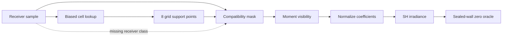
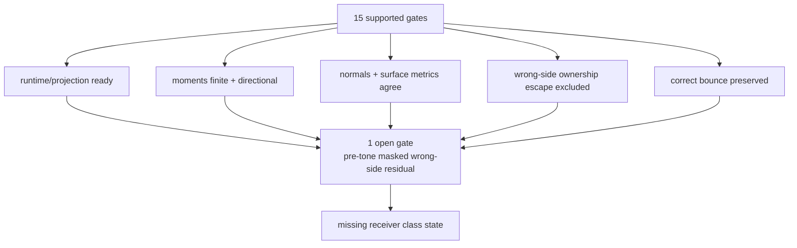
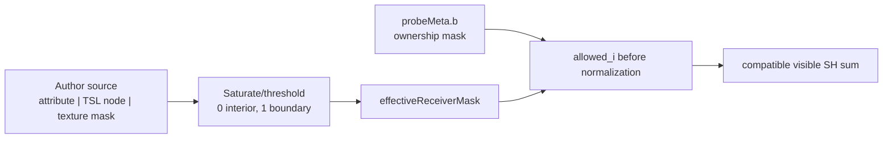

# LightProbeGridGPU Math Whiteboard

Verified: 2026-06-04.

This note keeps only the math and reconstruction lessons needed for the next
LightProbeGridGPU residual-leak candidate. Read "probe" as a sampled field
support point, not as a lighting-specific concept.

## Problem

Current proof state:

- Proof package: `OPEN`, with 15 supported gates and 1 open gate.
- Open gate: `sealedWall.preToneMaskedWrongSideResidualLeakRatio = 0.9377`.
- Physical oracle: sealed-wall wrong-side transfer is `0`.
- Comparator: scalar/WebGL-style validity weighting is leaky, not truth.
- Candidate: pre-tone masked wrong-side leak improves from `0.8626` to
  `0.8089`, while correct bounce remains preserved.

The core problem is discontinuity-aware interpolation:

```text
F(x, n) = visible low-frequency incoming energy at receiver x with normal n

sealed wall constraint:
V(receiver, sourceSideAcrossWall) = 0
```

The current runtime reconstructs `F` with smooth pieces:

```text
low-frequency angular basis  // L2 SH irradiance
smooth spatial basis         // trilinear grid reconstruction
probabilistic visibility     // distance moments + Chebyshev bound
```

Those pieces are valid, but none is a hard visibility boundary. That is why the
runtime can pass many engineering gates and still fail the physical zero oracle.



## Reconstruction

Each grid support point stores 9 RGB L2 SH coefficients plus metadata:

```text
sample_i = {
  coeff[9],
  validity,
  confidence,
  ownershipMask,
  visibilityMoments
}
```

Bake projection:

```text
coeff_k = (4*pi / sum_j solidAngle_j)
        * sum_j radiance_j * solidAngle_j * SH_k(direction_j)

solidAngle ~= 4 / (sqrt(lengthSq) * lengthSq)
```

Packed atlas:

```text
9 coefficients * 3 channels = 27 scalars
ceil(27 / 4) = 7 RGBA records

paddedSlices = nz + 2 * padding
atlasDepth = 7 * paddedSlices
baseLayer(textureIndex) = textureIndex * paddedSlices + padding
sampleZ(textureIndex, gridZ) = (baseLayer + gridZ) / atlasDepth
```

Runtime cell lookup uses a biased sample point:

```text
samplePosition = positionWorld
  + normalWorld * probeSpacing * normalBias
  + viewDirection * probeSpacing * viewBias
```

The manual path reconstructs from the 8 trilinear neighbors:

```text
base_i =
  trilinear_i
  * normalWeight_i
  * validity_i
  * confidence_i
  * layerCompatibility_i
  * compatibleKernel_i

normalWeight_i = 0.5 * (0.5 * (dot(normal, directionToSample_i) + 1) + 1)
validity_i = max(meta.validity, PROBE_VALIDITY_FLOOR)
confidence_i = clamp(meta.confidence, 0, 1)
layerCompatibility_i = intersects(sampleOwnershipMask_i, receiverMask)
compatibleKernel_i = exp2(-dot(kernelOffset_i, kernelOffset_i))
```

Moment visibility:

```text
variance = max(E[d^2] - E[d]^2, minVariance)
delta = max(receiverDistance - E[d] - visibilityBias, 0)
chebyshev = variance / (variance + delta^2)
momentVisibility = (1 - hitConfidence) + chebyshev * hitConfidence
visibility_i = mix(1, momentVisibility, visibilityDepthWeighting)
```

Final reconstruction:

```text
weight_i = base_i * visibility_i
visibilityMass = sum_i(weight_i) / max(sum_i(base_i), epsilon)

E_scalar = SH(sum_i(base_i * coeff_i) / sum_i(base_i))
E_visible = SH(sum_i(weight_i * coeff_i) / sum_i(weight_i)) * visibilityMass
E_final = mix(E_scalar, E_visible, visibilityDepthWeighting)
```

The necessary constraint belongs before coefficient normalization:

```text
allowed_i = compatible(receiverClass, sampleClass)
weight_i = trilinear_i * ... * allowed_i * visibility_i
```

If `allowed_i` is missing or late, incompatible support can still shape the
normalized field.

## Gate Evidence

The supported gates localize the remaining failure. They do not prove product
readiness.



| Gate family | What it rules out |
| --- | --- |
| Runtime readiness | Bake/runtime not producing a usable grid |
| Projection parity | Compute-vs-fragment SH or atlas convention mismatch |
| Visibility moment readback | Visibility moments missing or non-finite |
| Receiver normal agreement | Flipped receiver normal or front-face convention error |
| Directional suppression | Chebyshev visibility suppressing correct side more than wrong side |
| No wrong-side escape | Broad wrong-side probe ownership escape |
| Receiver surface agreement | CPU/render measurement artifact |
| No baked SH mixed-color risk | Packed SH coefficient pollution as the main cause |
| Correct-bounce preservation | Leak reduction by broad darkening |
| Pre-tone masked improvement | Tone-mapped storytelling instead of linear improvement |

Remaining open gate:

```text
sealedWall.preToneMaskedWrongSideResidualLeakRatio == 0
```

The residual is concentrated near the divider-facing receiver boundary. The
evidence points to missing receiver class state, not another global scalar.

## Receiver Boundary Source

The runtime selector already has the right shape:

```text
effectiveReceiverMask =
  receiverBoundaryWeight >= 0.5
    ? receiverBoundaryLayerMask
    : receiverLayerMask
```

`receiverBoundaryWeight` is a class selector, not an irradiance multiplier.
Continuous coverage must be classified before mask selection.

Minimal GPU-resident source contract:

```text
receiverLayerMask          // default receiver class
receiverBoundaryLayerMask  // class used at an authored discontinuity
receiverBoundaryWeight     // saturated selector, usually 0 or 1
```

Best first source:

```text
receiverBoundaryWeight = attribute("boundaryClass") or TSL/material node
receiverBoundaryLayerMask = authored mask constant or material node
```

Rejected sources:

- proof pixels;
- CPU readback;
- scalar/WebGL comparison as truth;
- Cornell divider coordinates in runtime code;
- brightness/residual-derived heuristics;
- post-irradiance dimming.

Default behavior must remain equivalent when boundary data is absent.



## Pullback Review

Verdict: keep the existing reconstruction path. Add the smallest class signal
needed to stop incompatible interpolation.

| Review pressure | Required answer |
| --- | --- |
| Is this over-engineered? | It becomes over-engineered if it introduces a new subsystem, automatic classifier, or barrier field |
| What is correct? | Classify receiver samples before compatibility and normalization |
| What should we borrow? | The stencil/support-selection principle from other fields |
| What should we not borrow? | Full XFEM/WENO/graph/barrier machinery |
| What should we implement now? | Proof-only support attribution; the authored source seam is already proven |
| Does it preserve defaults? | Must be equivalent when no boundary source is supplied |
| Is it Cornell-specific? | Must reject divider coordinates, proof pixels, and CPU readback |
| Can it cheat by darkening? | Correct-bounce and Lambert/pre-tone gates must stay supported |
| Does it solve all leaks? | No. It only handles discontinuities the user or material can represent |

Blocking concern: an attribute/TSL source only helps when users can author
meaningful classes. If the API cannot explain those classes without the proof
harness, promote nothing.

## Borrowing Map

The useful lesson across fields is consistent, but the implementation should stay
small: borrow support selection, not full external machinery.

| Field | Borrow | Do not import |
| --- | --- | --- |
| DDGI / RTXGI | Moment visibility and explicit probe state | Relocation/classification state machines in this slice |
| Unity APV | Authored layers and adjustment semantics | Engine-scale volume tooling |
| Mask decomposition | Class-separated interpolation | Multi-volume mask decomposition now |
| XFEM | Smooth bases need discontinuity metadata | Enrichment functions |
| ENO/WENO | Choose compatible support before reconstruction | Shock smoothness indicators |
| Ghost-fluid / immersed interface | Keep a grid, attach side metadata | PDE jump-condition machinery |
| Barrier kriging / GIS | Nearby across a wall is not necessarily compatible | Barrier-distance systems |
| Bilateral/guided/anisotropic/TV filters | Edge signals stop smoothing | Image-filter pipelines |
| Graph label propagation | Energy moves along compatible edges | Graph construction/runtime propagation |

## Next Slice

Do proof-only support attribution before tuning visibility policy or adding
runtime options:

```text
effective receiver mask
  -> per-neighbor compatibility/base/visibility facts
  -> coefficient contribution before and after normalization
  -> classify changes as zero-base, overpruned, or normalization-cancelled
```

Acceptance rules:

- no public option is added;
- proof facts stay aggregate and compact;
- default behavior stays unchanged;
- probe ownership helper remains proof-scoped;
- no residual-derived mask tuning;
- if no non-collapsing support change exists, archive this lane instead of
  growing modes.

## Sources

- DDGI, JCGT 2019: https://jcgt.org/published/0008/02/01/
- DDGI production scaling / RTXGI: https://arxiv.org/abs/2009.10796
- NVIDIA RTXGI 1.1: https://developer.nvidia.com/blog/nvidia-rtxgi-1-1-with-unreal-engine-4-support/
- Unity APV leak troubleshooting: https://docs.unity.cn/Components/urp/probevolumes-troubleshoot-light-leaks.html
- Light Field Probes: https://research.nvidia.com/publication/2017-02_real-time-global-illumination-using-precomputed-light-field-probes
- Mask Decomposition: https://www.cad.zju.edu.cn/home/jin/papers/ProbeLeakingElimination.pdf
- Local reconstruction from sparse radiance probes: https://research.aalto.fi/en/publications/real-time-global-illumination-by-precomputed-local-reconstruction/
- XFEM discontinuity enrichment: https://www.sciencedirect.com/science/article/pii/S0168874X00000354
- WENO shock reconstruction: https://www.sciencedirect.com/science/article/pii/S0021999184711879/pdf
- Ghost-fluid / sharp interface methods: https://www.sciencedirect.com/science/article/pii/S2210983815001297
- Diffusion interpolation with barriers: https://pro.arcgis.com/en/pro-app/3.6/help/analysis/geostatistical-analyst/how-diffusion-interpolation-with-barriers-works.htm
- Coastal/barrier kriging: https://pmc.ncbi.nlm.nih.gov/articles/PMC6093467/
- Bilateral edge-preserving filtering: https://docs.nvidia.com/vpi/algo_bilat_filter.html
- Anisotropic diffusion: https://people.eecs.berkeley.edu/~malik/papers/MP-aniso.pdf
- Guided image filtering: https://mmlab.ie.cuhk.edu.hk/2010/eccv10_Guided.pdf
- Total variation denoising: https://en.wikipedia.org/wiki/Total_variation_denoising
- Graph/manifold regularization: https://www.ornl.gov/publication/error-bounded-graph-construction-semi-supervised-manifold-learning
