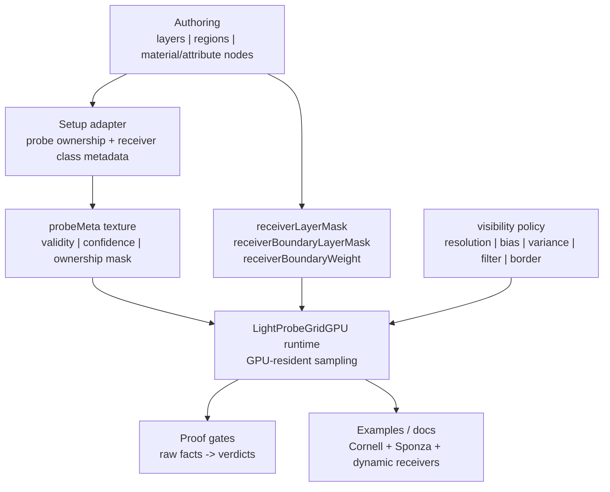
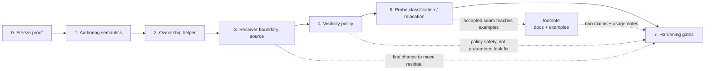

# LightProbeGridGPU Product Hardening Roadmap

Verified: 2026-06-05.

## Peer Review Verdict

The current branch is good research infrastructure, but not yet a hardened product API.

Findings:

- [P0] The open gate is real product risk, not proof noise. `sealedWall.preToneMaskedWrongSideResidualLeakRatio = 0.9377` means the current candidate improves a leaky baseline but still fails the physical zero-leak oracle.
- [P0] The runtime has a receiver-boundary selector, but no generic product source for boundary classification. The harness passes `receiverBoundaryWeight = 1`; that proves the selector, not automatic leak control.
- [P1] Probe ownership is in the right shape but the wrong layer. `LightProbeGridGPUProbeOwnership.js` is setup-only and useful, but it lives under e2e. Product code needs a stable authoring contract before this can move.
- [P1] Visibility math is scattered as constants. `8`, `0.02`, `0.0004`, the 9-tap moment filter, and the `0.5` boundary selector all encode policy. In product code, policy must be named, documented, and guarded.
- [P1] The proof gates are stronger than the API. That is backwards for shipping: users need a small, comprehensible way to author receiver/probe classes without reading the proof harness.
- [P2] SixteenStudio is useful product pressure for compact atlas/node/demo shape, but it is not a leak-control target. It lacks visibility moments, receiver ownership, relocation/classification, and residual proof gates.

## Contrast

| Path | Strength | Fails For This Gate | Product Lesson |
| --- | --- | --- | --- |
| Current LightProbeGridGPU branch | GPU-resident proof path, compact gates, receiver mask seam, visibility moments | Boundary classification is proof-authored; residual masked receiver energy remains high | Keep the proof contract, add real represented state before interpolation |
| SixteenStudio control | Simple packed SH atlas, node integration, Sponza pressure | No visibility moments, ownership, relocation, or zero-leak gates | Borrow product simplicity, not leak math |
| DDGI / RTXGI | Distance moments, probe relocation, classification, production visibility model | Larger bake/runtime system than this branch | Convert visibility knobs into a policy; add classification before bigger relocation work |
| Unity APV | Rendering-layer masks, dilation, virtual offset, adjustment volumes, density controls | Engine-integrated authoring model, not a drop-in three.js API | Product must expose authoring semantics, not only shader options |
| Light Field Probes / Mask Decomposition | Visibility-aware reconstruction and class-separated interpolation | Heavier memory and representation cost | Future high-power lane: keep trilinear speed inside compatible visibility classes |

## Product Shape



North star: keep runtime sampling compact, but make ownership and visibility policy explicit enough that users can author leak boundaries without fixture hacks.

## Hardening Roadmap

### Phase 0: Freeze The Proof Contract

Goal: prevent proof drift while product API work starts.

Tasks:

- Keep `sealedWall.preToneMaskedWrongSideResidualLeakRatio` open until a candidate lowers it below `0.9377`.
- Preserve current supported gates: runtime readiness, projection parity, visibility moment readback, no-wrong-side escape, directional suppression, receiver-surface agreement, SH-risk, and correct bounce.
- Keep scalar/WebGL and SixteenStudio as comparators only.
- Add a source-invariant guard that product docs cannot claim zero leak while the residual gate is open.

Exit gate:

- Focused Cornell proof still reports the same 15 supported / 1 open baseline before product changes.

### Phase 1: Define Product Authoring Semantics

Goal: decide what users are authoring, not just what shader inputs exist.

Tasks:

- Define `probeOwnership` as setup-time metadata: layer rules, region rules, default mask, compatibility policy.
- Define receiver classification sources: constant/node mask, material node, geometry/vertex attribute, setup-authored receiver metadata.
- Define boundary weight semantics: binary/saturated class signal by default; continuous coverage must pass through a named classifier before mask selection.
- Decide whether the setup helper belongs in `examples/jsm/lighting/lightprobegridgpu/` or stays test-only until the API is proven.

Exit gate:

- A user can describe "interior, exterior, and boundary-safe receiver samples" without knowing Cornell fixture coordinates or proof artifact fields.

### Phase 2: Promote A Minimal Ownership Helper

Goal: move from proof-only side masks to reusable setup metadata.

Tasks:

- Promote or mirror `createLightProbeGridGPUProbeOwnershipAssignment()` only after naming the public rule schema.
- Keep output as `probeLayerMasks`; do not add a new runtime buffer yet.
- Preserve validation: finite non-empty boxes, unique rule names, 24-bit masks, resolution-sized output.
- Add compact assignment facts for diagnostics, not verdicts.
- Add example usage that builds ownership from authored regions/layers.

Exit gate:

- Default scenes are unchanged when no ownership metadata is supplied.
- Region/layer ownership can reproduce the Cornell side mask policy without Cornell-specific runtime logic.

### Phase 3: Wire Receiver Boundary Sources

Goal: turn the existing runtime selector into product behavior.

Tasks:

- Add examples for `receiverBoundaryLayerMask` and `receiverBoundaryWeight` from TSL nodes or material/attribute inputs.
- Keep `createIrradianceNode()` options small; avoid a broad class hierarchy until a second concrete source needs it.
- Add proof facts for boundary-selected sample ratio, same-side preservation, cross-side exclusion, masked linear irradiance, Lambert response, correct bounce, and residual.
- Reject any candidate that reduces leak by broad darkening or correct-bounce loss.

Exit gate:

- Residual moves below `0.9377` with all currently supported gates still supported, or the candidate is explicitly rejected.

### Phase 4: Convert Visibility Constants Into Policy

Goal: remove magic-number drift without pretending policy naming fixes the residual.

Tasks:

- Create a named visibility representation policy covering depth resolution, moment filter taps, min variance, distance bias, border/gutter behavior, and depth weighting.
- Replace `hitSum / 9` with a named tap set and tap count.
- Split semantic epsilons: normalize epsilon, spacing floor, weight floor.
- Keep the current default values until a full policy candidate passes over-occlusion gates.
- Emit policy facts through `getSamplingInfo()` or compact diagnostics.

Exit gate:

- The current 8px/default path remains equivalent, but future 10/12/16px sweeps are policy changes with guard facts, not drive-by constants.

### Phase 5: Add Probe Classification / Relocation As A Later Lane

Goal: address bad probe locations without bloating the first product API.

Tasks:

- Define setup-time probe states: active, inactive, default-compatible, boundary-owned, possibly relocated.
- Do not implement relocation until the classification path proves useful or blocked.
- Measure memory and update cost through `getMemoryInfo()`.
- Add over-occlusion gates before claiming relocation wins.

Exit gate:

- Probe classification can disable or reclassify bad probes without changing default sampling or hiding residual evidence.

### Footnote: Product Examples And Docs

Goal: make the accepted API teachable after phases 1-5 prove the product seam.

Tasks:

- Cornell remains the proof fixture, not marketing proof.
- Sponza remains visual scale pressure, not sealed-wall truth.
- Add one small authored-boundary example with receiver metadata and ownership rules.
- Document non-claims: not perfect GI, not zero leak, not scalar/WebGL truth, not full DDGI.
- Document memory costs for visibility depth and ownership metadata.

Exit gate:

- A three.js user can copy a minimal authored-boundary setup without needing the e2e harness.

### Phase 7: Product Hardening Gates

Goal: make this hard to regress.

Tasks:

- Syntax checks for touched runtime/test files.
- Source invariants for GPU residency, raw-fact proof shape, no rejected-path payloads, and no Cornell divider runtime logic.
- Focused Cornell WebGPU proof after any runtime/shader change.
- Sponza smoke only for scale/product integration changes.
- `git diff --check` before packaging.

Exit gate:

- Product branch ships with a known residual state, clear non-claims, and proof gates that can fail loudly.

## Phase 1-5 Status Audit

Current rating: `9.1/10`.

| Phase | Status | Evidence | Remaining gap |
| --- | --- | --- | --- |
| Phase 1 authoring semantics | mostly proven | receiver source shapes, boundary weight semantics, public non-claims, local-cell placement semantics, product-shaped placement authoring contract, and second-fixture activation/row/placement-helper/render-delta facts are documented | placement semantics still need bilateral second-fixture render improvement, not just combined improvement |
| Phase 2 ownership helper | proof-scoped | `probeLayerMasks`, `probeValidity`, compact assignment/placement facts, product module facts, helper/product parity, validation policies, placement authoring invariants, migration guard, and bounded Sponza product usage exist | do not promote the proof helper; closure audit must keep non-claims explicit |
| Phase 3 receiver boundary sources | archived for residual fix | TSL uniform, UV-band, and geometry attribute sources proved GPU-resident inputs but did not reduce residual | keep as product source seam only, not leak-control claim |
| Phase 4 visibility policy | named, not residual-solving | semantic constants and `proofPolicyFacts` replace magic-number drift | future visibility sweeps need policy facts and over-occlusion gates |
| Phase 5 probe placement / relocation | closed as guarded product candidate | side-shell proxy, local-cell reachability, physical placement requirement, policy-backed helper, product-shaped authoring module, helper/product parity on sealed-wall and sealed-offset-wall, placement authoring invariants, explicit examples/jsm migration guard, bounded Sponza product usage, Cornell render/leak proof, Sponza visual/runtime coverage, sealed-offset-wall leak rows, combined-positive offset placement render delta, machine-checked low-baseline right-side policy, and closure audit | broader hardening only; no stronger leak claim yet |

## Roadmap Diagram



## Immediate Task List

- [x] Add a continuation metaprompt for the product-hardening work.
- [x] Add a product API note for `receiverBoundaryWeight` semantics: binary class signal, not irradiance attenuation.
- [x] Decide whether `LightProbeGridGPUProbeOwnership.js` is promoted to examples/jsm or kept as proof-only for one more candidate.
- [x] Add a minimal authored-boundary source using TSL nodes, then prove default equivalence when absent.
- [x] Add compact boundary-source facts to the proof harness.
- [x] Run focused Cornell proof and compare residual against `0.9377`.
- [x] Add proof-only support-set attribution for coefficient contribution loss.
- [x] Run support-set attribution proof on isolated port/profile.
- [x] Add proof-only bake/setup-side default-equivalence probe identity classification facts.
- [x] Model compact bake/setup-side classification candidate facts for probe identity change.
- [x] Run focused Cornell proof for setup-side probe identity classification.
- [x] Isolate coefficient comparison for identity-changed setup-side support.
- [x] Connect setup-side coefficient win to a lightweight render/residual guard.
- [x] Add separate final-irradiance/debug ratio attribution for the setup-side candidate.
- [x] Gate 1: attribute why final-irradiance/debug boundary/default ratios stay neutral.
- [x] Gate 2: compare setup default vs setup-classified final-irradiance debug signal.
- [x] Gate 3: add compact side-symmetry support-rank attribution and matrix contract.
- [x] Gate 3: resolve side symmetry and archive setup-side classification as a product candidate.
- [x] Start probe-side classification / relocation lane after setup-side archive.
- [x] Add coefficient attribution for the probe-side bilateral identity candidate.
- [x] Add occupied-support exclusion candidate after mixed probe-side L0 result.
- [x] Add proof-only relocation / placement oracle after classification-only probe-side failure.
- [x] Test first non-oracle distance-ranked relocation / placement proxy.
- [x] Test second non-oracle divider-ranked relocation / placement proxy.
- [x] Test receiver-visibility-ranked relocation / placement proxy.
- [x] Derive side-shell topology relocation proxy after geometry and receiver-visibility failures.
- [x] Add reconstruction/final-irradiance attribution for the side-shell proxy.
- [x] Add local-cell reachability attribution for the side-shell proxy.
- [x] Model local-cell support candidate after zero side-shell overlap.
- [x] Model physical local-cell placement / relocation requirement after local-cell support stays default/occupied.
- [x] Shape product API for setup-time local-cell placement / relocation.
- [x] Implement proof-scoped local-cell placement helper that emits `probeValidity` and `probeLayerMasks`.
- [x] Add explicit local-cell placement policy facts and acceptance thresholds.
- [x] Add reconstruction/final-irradiance attribution using local-cell placement helper arrays.
- [x] Add render/leak attribution using local-cell placement helper arrays.
- [x] Implement product module for `createLightProbeGridGPUPlacementAuthoring(...)`.
- [x] Gate placement authoring product facts in the runner matrix.
- [x] Gate helper/adapter parity for sealed-wall and sealed-offset-wall.
- [x] Add placement authoring schema/source invariants to the smoke path.
- [x] Add migration guard for future `examples/jsm` placement authoring module.
- [x] Add initial guarded `examples/jsm` placement authoring module.
- [x] Add helper/product integration parity checks for the guarded module.
- [x] Gate focused product module usage facts in the Cornell matrix.
- [x] Add bounded Sponza product-facing usage hook without leak-proof claim.
- [x] Add phases 1-5 closure audit.
- [x] Name receiver-boundary selector threshold, visibility moment tap count, and octahedral normalization epsilon.
- [x] Split remaining proof/harness epsilons into semantic constants or policy facts.
- [x] Add source invariants forbidding Cornell divider coordinates, proof pixels, scalar/WebGL truth, and CPU readback in runtime leak control.
- [x] Write public-facing non-claims before any product/demo claim.

## Continuation Metaprompt

Use `test/e2e/lightprobegrid-gpu-product-metaprompt.md` when handing this work to another run or reviewer. It captures the active proof state, rejected shortcut families, next valid product direction, expected code seams, and verification boundaries.

Use `test/e2e/lightprobegrid-gpu-placement-promotion-decision.md` for the
current promotion decision. It keeps the placement helper proof-scoped and
requires a second sealed-wall-like fixture before moving the seam out of
`test/e2e`.

Use `test/e2e/lightprobegrid-gpu-product-authoring-module-contract.md` for the
setup-owned product module shape. It names
`createLightProbeGridGPUPlacementAuthoring(...)` as the product-shaped
interface and keeps the current helper as proof-scoped implementation evidence.

Use `test/e2e/lightprobegrid-gpu-placement-authoring-migration-guard.md` before
any move toward `examples/jsm`. It forbids importing/copying the proof helper
and requires the promoted module to keep compact facts and placement authoring
invariants as its interface test surface.

Use `test/e2e/lightprobegrid-gpu-phases-1-5-closure-audit.md` as the closure
record for this SDD slice.

Use `test/e2e/lightprobegrid-gpu-second-sealed-fixture-design.md` for the
second fixture contract. The fixture is designed as `sealed-offset-wall` and is
implemented as an activatable family with proof-captured activation facts, leak
rows, and residual attribution.

Focused Cornell proof can run beside an existing local server with:

```text
node test/e2e/puppeteer.js --webgpu webgpu_lightprobes_cornell --port 1235 --user-data-dir ./.puppeteer_profile_codex_1235
```

## Active SDD Plan

Use `test/e2e/lightprobegrid-gpu-authored-boundary-sdd.md` for the active architecture state. It now separates the proven receiver-source seam from the still-open residual work.

Current decision:

- Keep `LightProbeGridGPUProbeOwnership.js` proof-scoped.
- Do not add another receiver-source mode.
- Do not promote authored-boundary examples as leak-control product proof.
- Next work is modeling true local-cell relocation / placement. The
  L0 oracle proves useful support exists, but it is CPU/readback proof evidence,
  not product logic. The first distance-only proxy failed on the right side,
  the divider-proximity proxy also failed on the right side, and the
  receiver-visibility proxy reports full visibility while still failing on the
  right side. The side-shell proxy is the first non-oracle rule to pass the
  bilateral L0 gate, but final-irradiance debug cannot reach that nonlocal
  support through the current trilinear reconstruction path. Local-cell
  reachability proves `0/8` overlap on both sides, and the current local-cell
  support candidate keeps default identity and occupied probes. Physical
  placement requirement now proves the useful source support is non-occupied but
  must replace all reachable local-cell slots on both sides. The product API
  shape is now implemented proof-side as a setup helper that emits
  `probeValidity`, `probeLayerMasks`, and compact `placementFacts`.
  The helper now exposes explicit placement policy facts instead of implicit
  thresholds. Reconstruction/final-irradiance debug proves the emitted arrays
  are consumed. Render/leak attribution also proves a narrow bilateral visible
  improvement in Cornell, but the right-side delta is small and the helper is
  still proof-scoped rather than a production placement module.

Why:

- TSL uniform, UV-band, and geometry-attribute receiver sources all proved the GPU-resident source seam, but residual stayed unchanged.
- Per-neighbor attribution showed many receiver-side changes hit zero-base neighbors.
- Hard receiver-mask swaps changed contributing slots but worsened leakage or correct bounce.
- Blend/soft receiver compatibility changed mass but normalized final irradiance back to `1`.
- Coefficient-side accumulator weighting collapsed accumulator ratios to `0` while final irradiance stayed `1`, so it is attenuation before normalization.
- Support-set relocation feasibility reports `leftChangedProbeIndexSlotCount = 0` and `rightChangedProbeIndexSlotCount = 0`, so receiver-side boundary paths still sample the same probe identities.
- Aggregate relocation requirement reports `allCandidatesSameProbeIdentity = true` and `receiverSideSupportVerdict = archive-receiver-side-support-routing`.
- Support-set attribution now classifies both tested active values as `normalization-cancelled-coefficient-loss`; final irradiance ratio remains `1`.
- Setup-side classification facts compare default support against setup-classified boundary support using receiver world-bounds edge points, not proof pixels.
- Focused Cornell proof writes the setup-side candidate artifact: left support changes `4/8` probe identities, while right support changes `0/8`.
- Isolated packed-atlas L0 comparison for the left setup-side candidate reduces wrong-side ratio from `0.8599` to `0.2763` (`delta = -0.5836`).
- Lightweight render-only guard survives with `maskedWrongSideColorRatio = 0.7286`, `preToneMaskedWrongSideColorRatio = 0.8089`, `preToneMaskedCorrectBounceRatio = 1.2363`, and `correctBounceRatio = 1.3163`.
- Separate final-irradiance/debug attribution is now compact enough for focused proof, but scalar, visibility, irradiance, and final-irradiance boundary/default ratios all stay `1`; verdict is `candidate-neutralized-by-final-irradiance-debug-node`.
- Descriptor compatibility attribution explains that neutral ratio: classified support keeps the default bit, so both default and boundary descriptors share all `8/8` classified support probes on both sides.
- Setup-mask final-irradiance delta shows classification recovers boundary final irradiance from `0` to default, but `classifiedToUnclassifiedDefault.combinedRatio = 1`; no normalized pre-material improvement over default is proven.
- Debug/render descriptor parity is proven for the setup-classified descriptor, so the current setup-side coefficient lead is archived after reconstruction neutralization unless Gate 3 finds a generic symmetric rule.
- Side evidence is asymmetric: left support hash changes from `fnv1a32:ad207d19` to `fnv1a32:a5fd8df1`; right support hash stays `fnv1a32:8ea10831`, matching the `0/8` right identity-change result.
- Gate 3 support-rank attribution rejects both tested setup-side variants: overlap changes left but right stays fixed; strict changes right but leaves left with `classifiedCandidateCount = 0`. Verdict: `archive-setup-side-classification-left-only`.
- Probe-side default-overlap exclusion produces bilateral identity change: left `8/8`, right `8/8`. It is still only proof-positive for identity, not product-positive: left mean distance rises to `11.174`, right mean distance rises to `6.6154`, and right classified support still has `4` occupied probes.
- Probe-side L0 attribution is mixed: left wrong/correct improves `0.8599 -> 0.6683`, but right worsens `0.5818 -> 0.7359`; verdict is `candidate-has-mixed-probe-side-l0-result`.
- Occupied-support exclusion removes right occupied support (`4 -> 0`) but still misses the L0 gate: right wrong/correct is `0.5818 -> 0.5907`, delta `+0.0089`; lane verdict is `candidate-needs-relocation-after-probe-side-classification`.
- Proof-only relocation oracle finds a bilateral L0 win over non-occupied boundary probes: left `0.8599 -> 0.664`, right `0.5818 -> 0.2158`, both occupied counts `0`. It pays high distance (`13.189` left, `13.6172` right), so it proves existence, not product readiness.
- Distance-ranked non-oracle proxy changes identity and keeps occupied support at `0`, but fails the right L0 gate: left `0.8599 -> 0.751`, right `0.5818 -> 0.6881`. Distance alone is rejected as the placement rule.
- Divider-ranked non-oracle proxy changes identity and keeps occupied support at `0`, but also fails the right L0 gate: left `0.8599 -> 0.6683`, right `0.5818 -> 0.7493`. Divider proximity alone is rejected as the placement rule.
- Receiver-visibility-ranked non-oracle proxy changes identity and keeps occupied support at `0`, but reports `classifiedMeanVisibilityEstimate = 1` on both sides while right worsens to `0.8182`. Direct visibility to the receiver is rejected as the missing placement selector.
- Side-shell topology proxy changes identity, keeps occupied support at `0`, and passes the bilateral L0 gate: left `0.8599 -> 0.6683`, right `0.5818 -> 0.3045`. It ranks by setup/grid topology, not packed-atlas L0.
- Side-shell final-irradiance attribution preserves the same support hashes but reports `sideShellBoundary.combinedMean = 0` and `sideShellToUnclassifiedDefault.combinedRatio = 0`. The support-selection win is not reachable by the current trilinear reconstruction cell.
- Local-cell reachability attribution confirms the miss: left local cell base coord `(0, 0, 2)` overlaps side-shell support `0/8`, and right local cell base coord `(1, 0, 2)` overlaps side-shell support `0/8`. The next candidate must move/author useful support into the reachable cell or define an explicit nonlocal support seam.
- Local-cell support candidate rejects remasking as relocation: left keeps wrong/correct L0 at `0.8599`, right keeps `0.5818`, both report `blocked-no-probe-identity-change`, and both retain `4` occupied probes.
- Physical placement requirement is now explicit: both sides require replacing `8/8` reachable local-cell slots, including `4` occupied slots, with non-occupied side-owned source support. Expected source-side wrong/correct L0 is `0.6683` left and `0.3045` right.
- Product API shape is setup-owned: `createLightProbeGridGPUPlacementAuthoring(...)` should accept authored receiver regions, layer rules, occupancy policy, placement policy, and source-selection policy, then produce `probeValidity`, `probeLayerMasks`, and `placementFacts`. It must not add another receiver-source mode or shader-side nonlocal support without an explainable product seam.
- Proof-scoped local-cell placement helper now emits arrays with length `64/64`, total replacement slots `16`, occupied replacement slots `8`, `acceptedSideCount = 2`, and policy facts: target support `8`, source support `8`, minimum replacement slots `1`, minimum occupied replacement slots `1`, and maximum source occupied support `0`.
- Product `createLightProbeGridGPUPlacementAuthoring(...)` now accepts product-shaped receiver regions, layer rules, occupancy policy, placement policy, and source-selection policy while emitting compact authoring facts without a legacy e2e wrapper. Focused Cornell reports `placement-authoring-product-module-emits-arrays`, `acceptedSideCount = 2`, replacement slots `16`, occupied replacement slots `8`, and `productHasProofOnlyFacts = false`. Sealed-wall and sealed-offset-wall both report `placement-authoring-matches-helper-facts`; offset side hashes match left target/source `fnv1a32:f7b1180d` / `fnv1a32:1eb3d3a1` and right target/source `fnv1a32:e50b2bcd` / `fnv1a32:519a6495`. The smoke path now also runs `lightprobegrid-gpu-placement-authoring-invariants.js`, which validates the product module, proves one positive contract, rejects thirteen source/schema violations, scans current/future `examples/jsm` LightProbeGridGPU authoring sources for proof-helper imports and proof-only tokens, and verifies base-array integration behavior.
- Local-cell placement final-irradiance attribution proves the helper arrays are consumed by the debug path: `placementIrradianceDeltaVerdict = placement-helper-arrays-improve-final-irradiance-over-default`, `combinedRatio = 1.3271`, left ratio `1`, and right ratio `1.3512`. This is proof-positive for the setup array seam, but not yet product-positive because the helper does not move baked coefficients or probe positions, the improvement is right-heavy, and it still needs a render/leak gate.
- Local-cell placement render/leak attribution is now proof-positive in focused Cornell: `placementRenderLeakVerdict = placement-helper-arrays-improve-bilateral-render-leak-over-default`, combined masked wrong-side ratio improves `0.7288 -> 0.7246`, left improves `0.5918 -> 0.5465`, right improves `0.7288 -> 0.7246`, pre-tone wrong-side improves `0.8446 -> 0.8204`, and correct bounce improves `1.2654 -> 1.2754`. This is a narrow visible win, not yet a hardened product claim.
- Non-Cornell coverage is now green for Sponza visual/runtime controls. `webgpu_lightprobes_sponza` passes with `probeCount = 147`, ready initial/rebake metrics, and screenshot diff `0.0%`; its rebake path now refreshes material `lightsNode` after atlas resources are recreated. `webgpu_lightprobes_sponza_ours` passes with `probeCount = 343`, ready initial/rebake metrics, screenshot diff `0.0%`, and bounded product placement authoring usage: `sponza-product-placement-authoring-usage-ready`, `totalProbes = 343`, replacement slots `16`, occupied replacement slots `8`, `productHasProofOnlyFacts = false`, and `leakMetricStatus = not-applicable`. Both Sponza rows remain non-leak-proof controls.
- Cross-side coefficient contrast exists (`4.4402x`), but current receiver-side support selection does not expose it safely.
- Source invariants now run with the smoke harness and forbid Cornell divider coordinates, proof pixel regions, scalar/WebGL truth claims, and CPU readback in runtime leak-control sources.
- Remaining proof/harness epsilon values are named as semantic constants and surfaced as `proofPolicyFacts`.
- Public-facing non-claims live in `test/e2e/lightprobegrid-gpu-public-non-claims.md` and must precede any product/demo claim.

Next concrete task:

- Move to broader hardening only after this closure record. The second fixture
  still proves only a combined render/leak win: combined offset render leakage
  improves from `0.8278` to `0.6576` and pre-tone wrong-side improves from
  `0.7464` to `0.6118`, while the right masked wrong-side ratio worsens
  `1.0252x` under the machine-checked low-baseline policy. Do not use Sponza as
  sealed-wall leak proof; the eval harness explicitly limits those ratios to
  Cornell.

Promotion gate:

- Promote nothing until the setup-owned placement module passes the acceptance
  gates in `test/e2e/lightprobegrid-gpu-placement-promotion-decision.md`.
- Receiver-side support routing is archived for this gate; the next promoted
  experiment must change probe identity at bake/setup time or through
  probe-side classification.

## Final Review Pressure

Do not harden the current branch by making it bigger. Harden it by making each idea own exactly one boundary:

- runtime samples;
- setup authors ownership;
- receiver nodes classify samples;
- visibility policy owns distance/moment decisions;
- proof gates own verdicts;
- examples teach valid usage without implying zero leak.

That is the path from impressive research branch to a product that can survive review.
