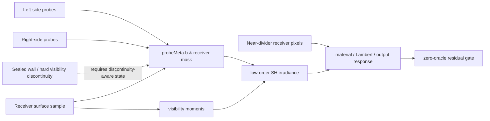
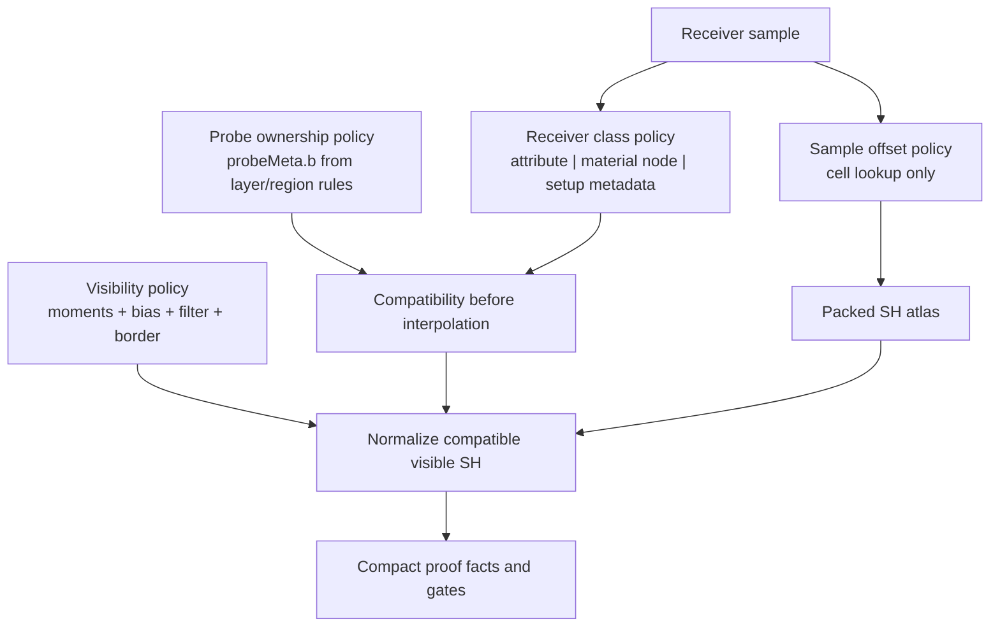

# LightProbeGridGPU Residual Research

Verified: 2026-06-04.

## Current Shape

The current proof package is a bounded proof, not a zero-leak product claim.

- Proof status: `OPEN`, with 15 supported gates and 1 open gate.
- Open gate: `sealedWall.preToneMaskedWrongSideResidualLeakRatio = 0.9377`.
- Ground truth: sealed-wall wrong-side leak must be `0`.
- Baseline: scalar/WebGL validity sampling is a leaky comparator, not truth.
- Candidate result: pre-tone masked wrong-side leak improves from `0.8626` to `0.8089`, while correct bounce remains preserved.

Candid rating:

- As a bounded research-proof branch: 7/10. The gates are honest, compact, and correctly separate comparator improvement from physical truth.
- As a product-ready leak solution: 4/10. The runtime has useful seams, but the remaining residual needs represented receiver/geometry state before interpolation. More tuning would be busywork.

## Current Runtime Math

The manual runtime sampling path in `examples/jsm/lighting/LightProbeGridGPU.js` currently does this:

```text
samplePosition = positionWorld
  + normalWorld * probeSpacing * normalBias
  + viewDirection * probeSpacing * viewBias

base_i =
  trilinear_i *
  normalWeight_i *
  validity_i *
  confidence_i *
  layerCompatibility_i *
  compatibleKernel_i

variance_i = max(E[d^2]_i - E[d]_i^2, VISIBILITY_MIN_VARIANCE)
delta_i = max(receiverDistance_i - E[d]_i - visibilityBias, 0)
chebyshev_i = variance_i / (variance_i + delta_i^2)
visibility_i = mix(1, chebyshev_i, hitConfidence_i)

weight_i = base_i * visibility_i
visibilityMass = sum(weight_i) / max(sum(base_i), epsilon)

E_scalar = SH(sum(base_i * coeff_i) / sum(base_i))
E_visible = SH(sum(weight_i * coeff_i) / sum(weight_i)) * visibilityMass
E_final = mix(E_scalar, E_visible, visibilityDepthWeighting)
```

The important split is intentional: the biased sample point selects the probe cell, while the actual surface position owns probe direction, compatibility kernel, and visibility distance. A coherent biased-query prototype was rejected because it worsened the proof.

## Leak Diagram



The leak is not one bad knob. It is the classic mismatch between smooth interpolation and a discontinuous visibility boundary. The current compatibility path can exclude wrong-side probe ownership, but the residual is still visible in masked receiver energy near the divider-facing surface.

## What The Evidence Rejects

These are no longer good explanations:

- Wrong-side probe escape as the current blocker. Receiver-scoped ownership supports `visibilityWeighting.noWrongSideEscape`.
- Center linear irradiance contamination. Current center linear irradiance is clean.
- Albedo-only amplification. Material albedo is not the primary source.
- Receiver normal convention. The normal diagnostic is supported.
- Broad visible-mask mismatch. The residual is concentrated around the near-divider receiver edge.
- Raw visibility resolution bump. 12px/16px improved residual but opened directional suppression.
- Adjacent-bin visibility fallback. It added cost and did not close the escape class.
- Global coherent biased query. It made the candidate worse than the leaky baseline.

## Research Lens

The literature matches the proof shape:

- DDGI adds per-probe distance and distance-squared visibility with Chebyshev-style occlusion tests instead of relying on plain irradiance interpolation. It uses separate octahedral irradiance and distance resolutions, plus gutters for filtering stability. See JCGT 2019, "Dynamic Diffuse Global Illumination with Ray-Traced Irradiance Fields": https://jcgt.org/published/0008/02/01/
- The production DDGI follow-up turns multiple bias knobs into a single self-shadow bias vector and adds probe handling for backfaces/stuck probes. See JCGT 2021: https://jcgt.org/published/0010/02/01/
- RTXGI treats relocation and classification as first-class probe controls. Relocation moves probes out of bad locations; classification disables probes that do not contribute. See NVIDIA RTXGI 1.1: https://developer.nvidia.com/blog/nvidia-rtxgi-1-1-with-unreal-engine-4-support/
- Unity APV fixes leaks with rendering-layer masks, virtual offset, dilation, probe density, and adjustment volumes. Runtime renderers sample only matching probe masks. See Unity APV leak docs: https://docs.unity.cn/Components/urp/probevolumes-troubleshoot-light-leaks.html
- Light Field Probes extend irradiance/radiance probes with per-texel visibility, which is the richer representation version of the same problem. See NVIDIA Research: https://research.nvidia.com/publication/2017-02_real-time-global-illumination-using-precomputed-light-field-probes
- Mask Decomposition states the core math directly: leaks appear when geometric occlusion creates a light-field discontinuity that cannot be reconstructed by linear interpolation between probes. It decomposes visibility into mask groups so trilinear sampling stays fast inside compatible classes. See Zhejiang/Tencent paper PDF: https://www.cad.zju.edu.cn/home/jin/papers/ProbeLeakingElimination.pdf
- Local reconstruction from sparse radiance probes incorporates mutual visibility into the reconstruction filter, again putting visibility/classification before interpolation. See Aalto/SIGGRAPH Asia 2017: https://research.aalto.fi/en/publications/real-time-global-illumination-by-precomputed-local-reconstruction/
- On-surface radiance caches are a newer adjacent direction: cache radiance on actual visible surfaces rather than in a free-space volume. That is heavier than this PR, but it explains why surface/discontinuity ownership matters. See HPG 2024: https://graz.elsevierpure.com/en/publications/radiance-caching-with-onsurface-caches-for-realtime-global-illumination%28fabc6701-7b95-401d-827d-1463f69cb165%29.html

## Bottlenecks And Leaks

1. Interpolation crosses a discontinuity.

   Trilinear weights are smooth. A sealed wall is not. Any candidate that leaves classification until after interpolation is mathematically late.

2. Receiver boundary state is proof-shaped, not product-shaped.

   Runtime accepts `receiverLayerMask`, `receiverBoundaryLayerMask`, and `receiverBoundaryWeight`, but the live non-proof source is still caller-provided raw values. The harness proves the selector, not a generic boundary classifier.

3. Probe ownership is a setup helper, not yet a public product seam.

   `test/e2e/lightprobegridgpu/LightProbeGridGPUProbeOwnership.js` can build `probeLayerMasks` from layer/region rules. That is the right shape, but it is still e2e/proof-side.

4. Visibility representation is compact but under-specified as policy.

   `VISIBILITY_DEPTH_RESOLUTION = 8`, `VISIBILITY_MIN_VARIANCE = 0.0004`, `VISIBILITY_DISTANCE_BIAS = 0.02`, and the 9-tap cardinal moment filter are real representation decisions. They should be named and coupled as a policy, not scattered as loose constants.

5. SH is low-frequency by design.

   Low-order SH is good for compact diffuse irradiance, but it cannot represent a hard wall by itself. The wall must be represented by visibility, receiver class, probe class, or surface cache state.

## Magic Numbers To Retire

Do not just rename numbers. Tie each to a policy owner:

- `normalBias = 0.5`: keep as sample-cell offset only; document that it does not own visibility distance.
- `viewBias = 0`: keep default zero unless a visibility-query policy proves otherwise.
- `visibilityBias = 0.02`: derive from `minProbeSpacing`, depth resolution, and a named self-shadow/visibility policy.
- `VISIBILITY_MIN_VARIANCE = 0.0004`: derive or document from distance encoding precision and moment filter footprint.
- `VISIBILITY_DEPTH_RESOLUTION = 8`: keep as compact validation default, but move into a representation policy with guard facts for resolution, bias, filter, and border behavior.
- `receiverBoundaryWeight >= 0.5`: valid only if the weight is a binary/saturated class signal. If it is continuous coverage, it needs an explicit classifier step before the mask select.
- `hitSum / 9`: replace with a named tap list and tap count.
- repeated `0.0001`: use named epsilon constants for normalize, weight floors, and probe spacing floors. They are not the same semantic epsilon.

## Lean Target Shape



The punchy version: keep SH atlas sampling small, but make classification explicit before interpolation. That is the shortest path that stays GPU-resident and avoids a full GI rewrite.

## Candidate Order

1. Receiver boundary-class source.

   Add a generic GPU-resident source for `receiverBoundaryWeight`: material/node input, vertex/geometry attribute, or setup-authored receiver metadata. The source must not use proof pixels, CPU readback, scalar/WebGL comparison, or Cornell divider coordinates.

2. Promote setup ownership into a product-safe helper only if it has real semantics.

   The existing layer/region ownership helper is valuable. Move/adapt it only if the API can say "these probes belong to these authored regions/layers" without being Cornell-specific.

3. Convert visibility constants into a representation policy.

   Group depth resolution, moment filter taps, border/gutter behavior, min variance, and bias. Then gate the policy with over-occlusion checks, not visual preference.

4. Add probe relocation/classification later.

   This is source-backed by RTXGI, but it is a bigger setup/bake-time feature. It should not be the first residual candidate unless the receiver boundary source cannot move the gate.

5. Treat Mask Decomposition as the high-power future.

   It is a serious answer for "lean but strong": multiple compatible volumes or masks retain trilinear sampling speed while preventing cross-class interpolation. It is larger than the next slice, but mathematically aligned.

## Next Code Slice

The next valid implementation is not another scalar tweak. It is:

1. Define a `receiverBoundaryWeight` source from authored GPU data.
2. Feed it into the existing `receiverBoundaryLayerMask` selector.
3. Keep default behavior identical when the source is absent.
4. Emit compact facts:
   - boundary-selected receiver sample ratio;
   - same-side contribution preservation;
   - cross-side compatible contribution exclusion;
   - candidate/baseline pre-tone masked wrong-side ratios;
   - correct-bounce preservation;
   - zero-oracle residual ratio.
5. Reject the candidate if residual only improves by darkening, suppressing correct bounce, or moving truth back to the baseline.

## Review Verdict

Most peer comments that say "tune bias", "increase resolution", or "sample adjacent moments" are not valid anymore unless they come with over-occlusion proof. We already tested that family.

The valid comments are the ones asking for represented state:

- classify receiver surfaces before interpolation;
- classify or relocate probes during setup/bake;
- encode visibility at higher fidelity if classification cannot express the wall;
- replace raw constants with named policies and guard facts.

That is the lane. The branch is not weak because the gate is open; it is weak only if we pretend the current constants can close a discontinuity they do not represent.

## Product Roadmap

See `test/e2e/lightprobegrid-gpu-product-roadmap.md` for the peer-review contrast, product architecture diagram, hardening phases, and concrete task list.
